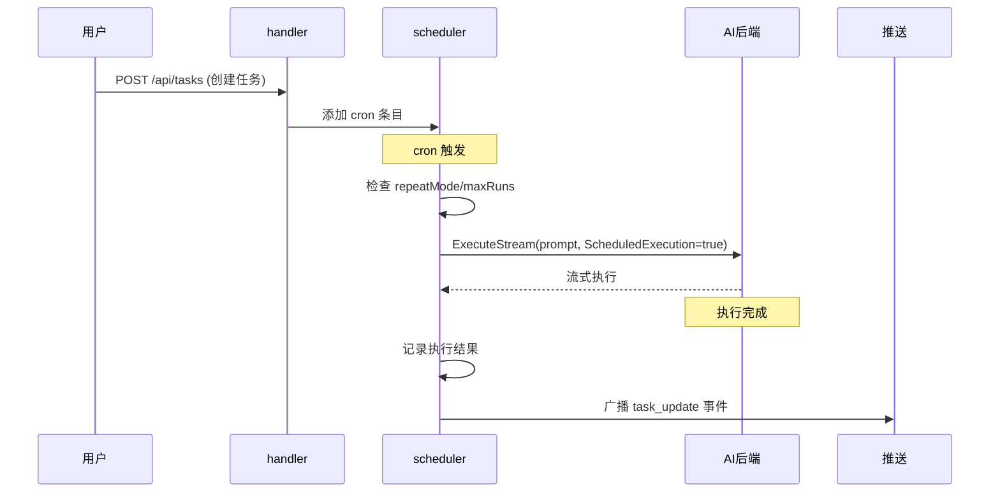
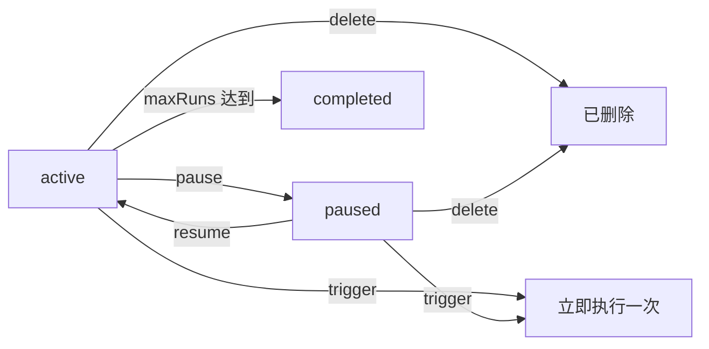
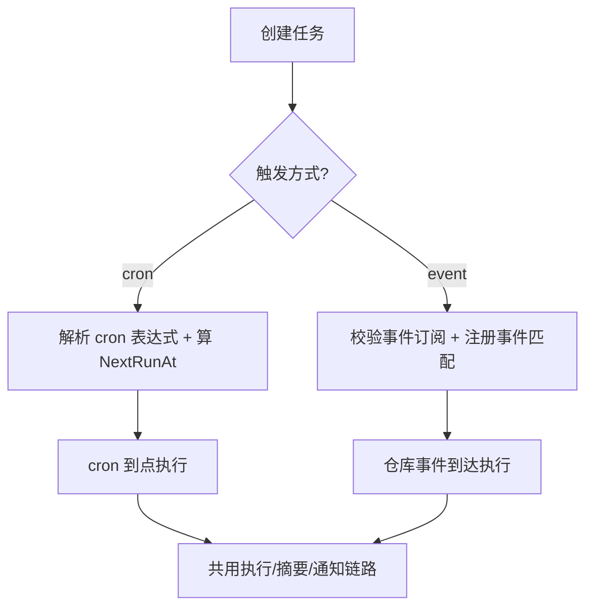
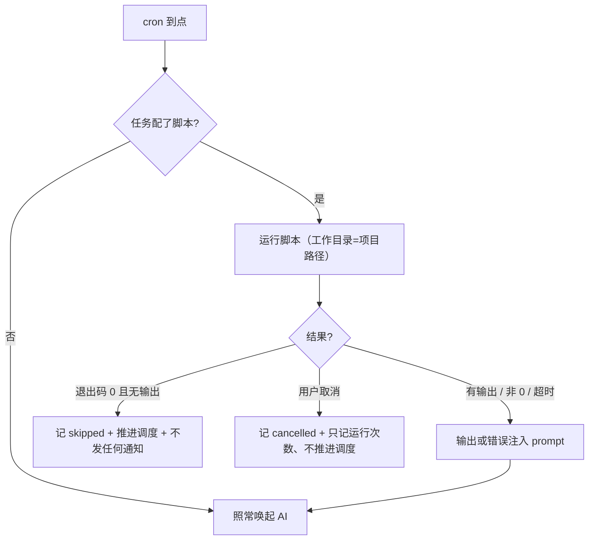

# 任务

任务让 AI 按计划自动执行——每天凌晨跑代码审查、每周一生成文档、每小时检查 GitHub Issues。任务由 cron 调度器驱动，到点后启动 AI 后端执行，完成后推送摘要通知。执行结果可以续接为交互式对话，让用户从 AI 的自动执行结果直接进入追问模式。这套机制让 AI 从"被动应答"变为"主动执行"，是 ClawBench 区别于普通聊天界面的核心能力。

任务有两种触发方式（`triggerMode`）：**cron**（默认，按表达式定时）与 **event**（由 GitHub/GitLab 事件唤起，见 [Forge 集成](forge-integration.md)）。两者共用同一套执行、摘要、通知与续接链路，只在"何时触发"和"prompt 是否注入事件上下文"上分叉。

cron 任务还可选配一段**前置脚本**（pre-AI script）：在唤起 AI 之前先跑一条 shell 命令，用它判断"这次到底有没有活要干"。脚本静默成功（退出码 0 且无任何输出）时整次运行跳过 AI、也不发任何通知——这让「有变化才干活」这类轮询式任务从"每次都烧一轮 token"变成"没事就安静收工"。

## 流程图

### 任务从创建到执行

```mermaid
sequenceDiagram
    participant 用户
    participant handler
    participant scheduler
    participant AI后端
    participant 推送

    用户->>handler: POST /api/tasks (创建任务)
    handler->>scheduler: 添加 cron 条目
    Note over scheduler: cron 触发
    scheduler->>scheduler: 检查 repeatMode/maxRuns
    scheduler->>AI后端: ExecuteStream(prompt, ScheduledExecution=true)
    AI后端-->>scheduler: 流式执行
    Note over AI后端: 执行完成
    scheduler->>scheduler: 记录执行结果
    scheduler->>推送: 广播 task_update 事件
```

### 任务状态流转

```mermaid
flowchart LR
    A[active] -->|pause| B[paused]
    B -->|resume| A
    A -->|maxRuns 达到| C[completed]
    A -->|delete| D[已删除]
    B -->|delete| D
    A -->|trigger| E[立即执行一次]
    B -->|trigger| E
```

### 两种触发方式

```mermaid
flowchart TD
    A[创建任务] --> B{触发方式?}
    B -->|cron| C[解析 cron 表达式 + 算 NextRunAt]
    B -->|event| D[校验事件订阅 + 注册事件匹配]
    C --> E[cron 到点执行]
    D --> F[仓库事件到达执行]
    E --> G[共用执行/摘要/通知链路]
    F --> G
```

### 前置脚本的运行分叉

仅 cron 任务会走这一层；脚本在 AI 之前执行，按结果决定"跳过"还是"带着输出继续"。

```mermaid
flowchart TD
    A[cron 到点] --> B{任务配了脚本?}
    B -->|否| F[照常唤起 AI]
    B -->|是| C[运行脚本（工作目录=项目路径）]
    C --> D{结果?}
    D -->|退出码 0 且无输出| E[记 skipped + 推进调度 + 不发任何通知]
    D -->|用户取消| G[记 cancelled + 只记运行次数、不推进调度]
    D -->|有输出 / 非 0 / 超时| H[输出或错误注入 prompt]
    H --> F
```

跳过与取消都只留下一条没有会话的执行记录（`sessionId` 为空）：跳过是「无事可做」的完成决策，照常推进计划；取消是中止一次尚未产生结果的运行，只记账（运行次数 + 最后运行时间），不推进计划、也不改任务状态。有输出（或脚本失败/超时）时，输出会作为定界块注入到 prompt 的事件上下文之后、任务提示词之前，会话历史里因此能看到脚本产出的原文。

## 功能与设计要点

### 功能清单

- **前置自定义脚本（仅 cron）**：任务可选配一段 shell 脚本，在唤起 AI 之前先执行。退出码 0 且无任何输出时，本次运行被记为 `skipped` 并**不发任何通知**（跳过是"无事可做"的结论，不是失败）；有输出、非 0 或超时时，输出与错误信息注入 prompt 后照常调用 AI。脚本是任务的**前置条件**而非任务本身，因此脚本阶段**不计入任务列表的「运行中」**——但它会出现在执行历史里（标注「准备中（脚本）」），并且可以取消。脚本超时每任务可配，默认 300 秒。这让「有变化才干活」的轮询式任务能廉价地空跑，而不必每次烧掉一轮 AI
- **cron 调度**：支持标准 cron 表达式定义执行计划（如 `0 10 * * 1` 每周一 10:00）。这是最灵活的调度方式，覆盖了从"每小时"到"每月"的各种需求
- **事件触发**：任务可选「触发方式：事件」，订阅 GitHub/GitLab 事件（`issue.opened`、`pr.merged`、`pipeline_done` 等，按 kind 分域，merged 仅 PR；CI 完成是仓库级事件故用裸键）。事件到达即执行，prompt 前置只读的事件上下文块（按事件类型条件渲染适用变量）。**未选任何事件时整块隐藏**（含标题与提示，不留空壳），总览卡的示例卡片一并隐藏——没选事件就没有触发器，后端不会注入任何上下文，展示变量列表等于描述一个永远不会到达的载荷。该规则实现在共享注册表（`eventVarVisible`）里，表单与总览卡两个消费点都从它派生，不可能各判一套。让任务从"按时间跑"扩展到"仓库有事就跑"，是 [Forge 集成](forge-integration.md) 的自动化出口
- **手动触发**：`trigger` 命令立即执行一次任务，不影响 cron 计划。适合"我想现在跑一次看看效果"的场景。仅适用于 cron 任务——事件触发任务的 prompt 依赖触发时注入的事件上下文（`{{TITLE}}` / `{{URL}}` 等），手动执行没有事件可注入，后端对这类任务返回 409 `TaskEventTriggerUnsupported`，前端也不展示执行按钮
- **暂停与恢复**：暂停任务不删除 cron 条目，恢复后继续按计划执行。用户临时不需要某个任务时可以暂停而非删除
- **执行限制**：`maxRuns` 限制任务最大执行次数，`repeatMode` 控制重复模式。避免任务无限执行消耗资源
- **执行历史**：每次执行的结果、摘要、耗时都有记录，支持分页查询。用户可以回溯任务执行情况。执行详情页的**摘要/原文 tab 固定在顶部**（header 与滚动区之间的 flex 兄弟节点，不用 `position:sticky`——滚动容器首元素是全宽事件卡片，sticky 条初始位置在卡片之下，永远到不了 header），正文紧贴其下；助手气泡底部**隐藏分叉/回溯按钮**（这两个动作需要活跃会话才能操作，而已完成的执行记录没有会话可操作），其余按钮（摘要切换、朗读、复制、详情）保留
- **执行级已读**：未读按**执行记录逐条**计数（`task_executions.read_at`），不再用"任务级水位线"——水位线无法表达"第 3 次执行看过了、第 5 次没看"。单条执行可标记已读，也有「全部标为已读」一键清空；任务 tab 的未读**不会因为切到该 tab 自动清零**（曾有此行为，但它会在任务列表加载失败时把徽标错误归零），只有真正打开执行详情或点「全部标为已读」才清
- **摘要推送**：任务完成后生成结果摘要，通过 WebSocket 推送通知。通知包含 `Done:` 前缀和响应预览文本，用户一眼可知任务是否成功
- **续接对话**：执行完成后用户可从任务执行详情中点击"继续对话"，将执行结果续接为新的交互式聊天会话。新会话继承源会话的消息、摘要和 `external_session_id`（支持 `--resume`），标题前缀为执行时间戳 `⏰ [MM-DD HH:MM] <任务名>`。该标题是 `placeholder`——**续接后的第一条用户消息会整体替换它**（含时间前缀），与分叉行为一致，用户手动改名则不再覆盖；见[会话生命周期](../core/session-lifecycle.md)的标题锁定条目。任务不再是"执行完就结束"，用户可以基于 AI 的自动执行结果继续深入探讨。按钮按**会话是否存在**门控——`skipped` 与脚本阶段 `cancelled` 都没有会话，续接必然服务端报"源会话不存在"，因此不显示；AI 阶段取消（有会话）仍可续接
- **运行中流式状态**：查看正在执行的任务详情时，消息始终标记为流式状态（streaming），前端展示"生成中"指示器而非已完成答案——DB 中的内容仅为部分结果，不应呈现为最终回复。运行期间摘要标签页不可用，避免展示不完整的摘要
- **执行历史改为事件驱动，不再 3s 轮询**：历史页签此前每 3s 拉一次接口，现改为订阅已有的 `task_update` 广播（执行开始时调度器就会发 `running`），并用 200ms debounce 合并紧邻的 running→completed 连发。挂载时仍做一次同步、断线重连后重新同步——`running` 事件不写前日志，重连可能漏掉"开始运行"，只靠事件会让运行态永久停在旧快照。**配了脚本的任务额外开一个 5s 轮询兜底**：脚本阶段刻意不发事件，而一个快速跳过（`git diff --quiet`）可能在两次轮询之间就起止完成，纯事件驱动会让它的 `skipped` 行永不出现、取消按钮也无从触达。兜底只在任务确实配了脚本时启动，且以 `runCount` 变化为触发（比「运行中数量」更精确），页面隐藏时跳过一拍
- **事件任务的列表行展示订阅事件**：列表行展示该任务**订阅的事件类型**（如「议题 · 新建 · 合并请求 · 合并」），而不是项目绑定的仓库——仓库是项目属性，同一项目下每个事件任务看到的都一样，对"这个任务"零信息量；订阅为空时回落到「未配置监听事件」。因此列表页不再查询 forge binding（这是逐任务视图，不需要项目级数据，也省掉一次请求），仓库仍只在表单与详情页展示
- **聊天中的任务预览卡按触发方式分叉渲染**：任务创建后会在聊天里落一张预览卡（点击进入任务详情）。这张卡此前只认 cron 字段，于是事件任务渲染出**空白频率行、伪造的「不限次数」、无意义的「下次执行: 无」**，而真正决定触发的订阅事件一个字都不显示，头部图标还恒为时钟、暗示它有计划。现在卡片按触发方式分叉：定时任务展示频率与下次执行，事件任务改为渲染**订阅事件芯片**（与任务列表/详情卡同源同配色，单一标签来源），头部改用闪电图标并加事件强调色变体；未配置订阅事件时给出提示文案而非渲染空行。整卡即点击目标，因此移除了底部重复的"查看详情"行
- **ACP 自动审批**：ACP 传输的任务自动启用工具调用审批，避免因无人在场审批工具调用而无限阻塞。任务无人值守，权限审批必须自动通过
- **异常终止自动重试**：任务执行因进程崩溃、零产出或后端报错而中断时自动发「继续」重试，聊天与任务两条路径共用同一分类器与消息构造（见[聊天流程](../core/chat-flow.md)）。手动终止不重试；重试次数受 `chat.auto_continue_max_retries` 约束

### 设计要点

- **防递归靠提示词层**：任务管理指令只在用户显式使用 `/cb-task` 时注入（`internal/handler/clawbench_command.go`），因此定时执行期间 AI 的上下文中不含创建任务的用法说明。历史上还依赖过 `CLAWBENCH_SCHEDULED=1` 环境变量与 CLI 内的守卫，二者随 `clawbench task` 子命令移除而失效；`ScheduledExecution` 标志仍传给后端，但仅用于 pi 的 `--no-session`，**不承担防递归职责**（`scheduler.go` 中声称它在 handler 层防递归的注释已过时）。事件触发任务另有身份级防递归——抑制 AI 自身账号产生的写操作事件（见 [Forge 集成](forge-integration.md)）
- **触发方式在调度器入口分叉**：`triggerMode` 为 `event` 的任务跳过 cron 解析与 `NextRunAt` 计算，改为注册到事件匹配表；加载时排除出 cron 注册、恢复时重新加入事件监听。两种任务共用同一套执行实现（与交互式聊天共用），差异仅在于 prompt 是否注入事件上下文
- **触发方式的差异要一路贯穿到展示层**：同一个"任务"在定时与事件两种模式下，可展示的字段并不相同——事件任务没有 cron 表达式、`repeatMode` 被后端忽略，因此任何只读 cron 字段的展示面都会为事件任务渲染出空白或伪造值。修法不是在各处补 `if`，而是让预览卡成为**一个组件、一处分叉**：数据由调用方传入，事件/定时的渲染差异只写一次，避免同一张卡在聊天的多个渲染路径（摘要模式/block 模式）里各分叉一遍而漂移
- **列表数据必须整体比较**：任务列表 store 的"无变化则跳过写入"优化曾只比对 5 个字段（id/status/runCount/unreadCount/runningCount），而详情页是按 id 从 store 取对象渲染的——编辑 name/cronExpr/prompt/agentId/repeatMode/triggerMode/eventTypes 时这些字段都不在比对范围内，新数据被判为"未变化"，详情页一直显示编辑前的内容，必须刷新页面才恢复。改为整条记录的值比较（嵌套字段也按值比，避免以后加数组/对象字段再踩引用比较的盲区）；列表由事件驱动、无高频轮询，加严比对不带来额外渲染抖动
- **running 事件必须在执行真正开始后发出**：任务状态机是 started → running → completed，而 running 事件一度在阻塞的执行调用返回之后才发，实际顺序成了 started → 整个任务跑完 → running → completed——钉钉/飞书推送与 Android 离线事件都按此顺序回放，等于 running 通知完全失效。修复方式是给 turn 一个 `OnStarted` 回调，在 executor 建好、占位符存在、`stream_start` 已广播、但事件循环尚未开始这个确切时刻触发；同时保住"启动即失败的任务不得先发 running"的既有约束
- **执行摘要由 AI 生成**：任务执行完成后，系统调用 summarizer 将 AI 回复压缩为摘要，用于推送通知和历史记录。摘要保留 Markdown 格式（与 TTS 摘要不同），约 30% 原文长度
- **续接对话继承会话身份**：续接的新会话继承源会话的 Agent、模型、思考深度和 `external_session_id`，保证对话上下文和 CLI 会话连续性。已存在的续接会话会被复用（已归档的自动恢复），避免重复创建
- **硬删除而非归档**：与聊天会话不同，任务使用硬删除。任务定义是用户主动管理的配置项，删除意味着"我不再需要这个任务"
- **调度器使用 robfig/cron**：标准库级调度器，可靠且久经考验。运行时执行记录存储在内存中，重启后从数据库恢复
- **调度执行与聊天共用同一 turn 实现**：任务和交互式聊天共用同一套执行编排，通过 `RunConfig.Mode = ModeScheduled` 控制差异化行为（i18n 错误、是否 drain 事件通道等）。消除了 handler 和 scheduler 中的重复执行逻辑。调度侧需要自己持有取消/失败/崩溃分支，因此采用 start/finalize 两阶段 API 而非单入口
- **异常终止的任务执行自动重试**：任务无人值守，一次因崩溃或后端报错而中断就永久失败代价很高，因此 scheduler 的 `executeTask` 是一个**重试循环**，而不是单次调用——执行行跨轮保持 `running`，重试经 `BuildChatRequest` 重建请求以 resume 同一上下文（不重建会话，保住已产出的上下文）。分类与续接消息构造复用 `internal/service/auto_continue.go`，与聊天路径同源；重试预算按用户消息独立计。手动取消（含「打断并重发」）永不重试，与聊天路径一致
- **脚本阶段刻意不发 `running` 事件**：`running` 的 `task_update` 是**用户可见通知**（浏览器通知、钉钉/飞书的「任务已启动」），而本功能存在的意义正是消除「启动了却无结果」的噪音。因此脚本阶段只在运行态表里登记一个可取消的条目（合成 id，保留取消能力与执行历史可见性），不广播任何事件；该行通过 `GET /api/tasks/{id}` 的运行态返回给 UI 标注。跳过与取消由此天然静默，无需改动四条通知通道中的任何一条
- **「运行中」只数 AI 阶段**：运行态条目带 `phase`（`script` | `ai`），`GetRunningCounts` 与列表接口的 `runningCount` 都只统计 `ai`。前端「运行中数量 1→0」的启发式是四条通知通道里唯一按计数判断的，脚本阶段不计入即可让它对跳过完全无感；而 `GetRunningExecutions` 返回全部阶段，执行历史因此仍能看到脚本行并可取消
- **脚本是前置条件，语义上不是一次 AI 执行**：脚本静默成功是「无事可做」的**完成决策**，照常推进计划（对 `once` 任务结算为 `completed` 是合理的）；取消则是**中止**一次尚未产生结果的运行，只记运行次数、不推进计划也不改状态——否则在脚本阶段取消一个 `once` 任务会直接烧掉用户唯一的一次运行。这一区分与 AI 阶段取消路径（ISS-013）保持一致
- **输出捕获必须在写入时封顶**：脚本输出会在进程运行期间持续进入内存，若只在进程结束后才截断，一个 GB 级输出的脚本（`yes`、`find /`）会在 300 秒超时触发前就把服务端堆撑爆。捕获缓冲在写入时即按上限丢弃多余部分并记录「已截断」，同时仍向脚本报告完整的写入长度——短写会被脚本读成 broken pipe，从而改变退出码与本次运行的结论
