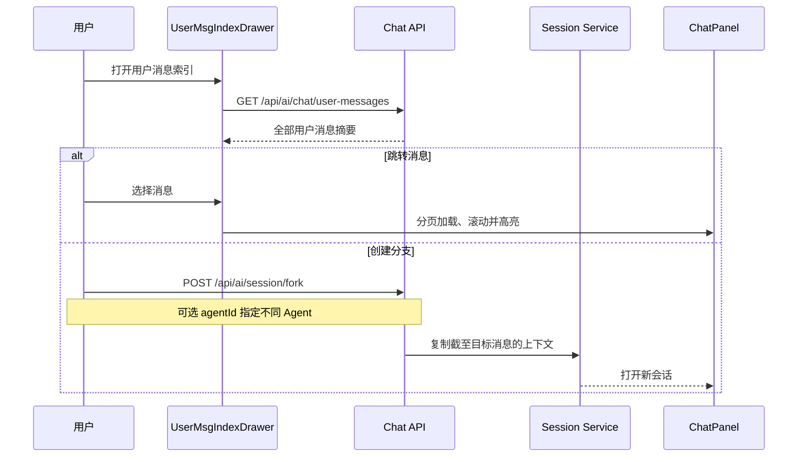

# 会话导航与分叉

会话导航帮助用户在长对话中快速定位自己的问题，并从任意用户消息创建新的对话分支。它解决移动端滚动成本高、历史消息分页加载以及“保留原会话同时尝试另一方向”的需求。

## 流程图

### 从消息索引定位或分叉

索引由服务端返回，不受前端当前只加载部分消息的限制。跳转时前端最多循环加载历史分页；分叉则生成独立会话，原会话保持不变。

## 功能与设计要点

### 功能清单

- **用户消息索引**：按时间列出会话中的全部用户消息，并生成适合移动端浏览的截断摘要。用户可以把自己的提问当作长对话目录
- **跨分页定位**：目标消息尚未加载时自动继续加载历史，找到后平滑滚动并短暂高亮。用户不需要手工多次触发“加载更多”
- **从消息分叉**：以指定用户消息为边界创建新会话，继承此前上下文但不影响原分支。支持 `beforeMessageId` 参数指定分叉点（包括 assistant 消息，标题取前一条 user 消息内容）。分叉标题由源会话标题 + emoji 前缀派生，空内容时回退到源会话标题。分叉时可选 Agent——用户选择不同 Agent 后，新会话使用该 Agent 的后端和配置，模型清空让前端回退到全局偏好。正在流式输出的消息不能作为分叉点。适合尝试替代实现、回到早期决策点或保留两种方案
- **附件摘要**：只有附件的用户消息也会在索引中显示可识别占位，避免目录出现空白项

### 设计要点

- **索引查询独立于聊天分页**：目录必须覆盖完整会话，不能依赖当前 DOM 中的消息集合
- **分叉复制语义上下文**：新会话继承目标点之前的有效历史，不共享后续消息，保证两个分支可独立演进
- **原会话不可变**：分叉是创建操作，不修改来源会话的消息或执行状态
- **定位设置加载上限**：自动分页有最大轮次和等待超时，避免异常响应导致无限循环
- **索引和分叉共用入口**：用户先找到决策点，再选择跳转或分叉，减少长对话中的操作层级
