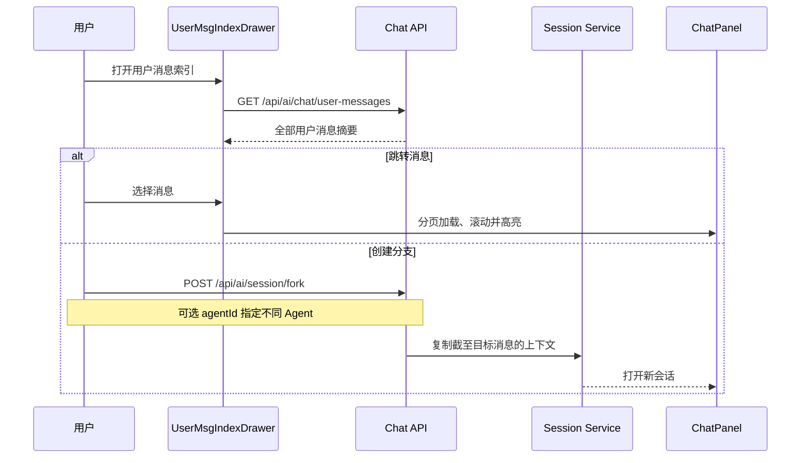

# 会话导航与分叉

会话导航帮助用户在长对话中快速定位自己的问题，并从任意用户消息创建新的对话分支。它解决移动端滚动成本高、历史消息分页加载以及“保留原会话同时尝试另一方向”的需求。

## 流程图

### 从消息索引定位或分叉

索引由服务端返回，不受前端当前只加载部分消息的限制。跳转时前端最多循环加载历史分页；分叉则生成独立会话，原会话保持不变。

## 功能与设计要点

### 功能清单

- **用户消息索引**：按时间列出会话中的全部用户消息，并生成适合移动端浏览的截断摘要。用户可以把自己的提问当作长对话目录
- **索引搜索过滤**：索引抽屉顶部带搜索框，对已全量加载的消息列表做纯客户端即时过滤——大小写不敏感地匹配消息正文纯文本与附件 path/basename（兼容字符串与 `{path}` 两种形态，Windows 反斜杠归一，附件可见标签也参与匹配），命中字符以 `<mark>` 高亮、计数徽章显示「命中/总数」、无匹配时显示空态。过滤后保留原始会话序号（msgOrdinal 按对象身份映射），键盘导航/高亮/滚动都指向过滤后列表；切换会话与重开抽屉自动重置查询，打开 300ms 后自动聚焦。长会话目录条目多时，搜索把“找某条提问”从滚动变成打字
- **跨分页定位**：目标消息尚未加载时自动继续加载历史，找到后平滑滚动并短暂高亮。用户不需要手工多次触发“加载更多”
- **从消息分叉**：以指定用户消息为边界创建新会话，继承此前上下文但不影响原分支。支持 `beforeMessageId` 参数指定分叉点（包括 assistant 消息，标题取前一条 user 消息内容）。分叉标题由源会话标题 + emoji 前缀派生，空内容时回退到源会话标题。分叉时可选 Agent——用户选择不同 Agent 后，新会话使用该 Agent 的后端和配置，模型清空让前端回退到全局偏好。正在流式输出的消息不能作为分叉点。适合尝试替代实现、回到早期决策点或保留两种方案
- **附件摘要**：只有附件的用户消息也会在索引中显示可识别占位，避免目录出现空白项
- **Ctrl+Up/Down 跳转消息**：在聊天消息列表中，Ctrl+Up/Down 可快速跳转到上/下一条用户消息，无需打开索引抽屉。配合消息高亮动画，帮助用户在长对话中快速定位

### 设计要点

- **索引查询独立于聊天分页**：目录必须覆盖完整会话，不能依赖当前 DOM 中的消息集合
- **分叉复制语义上下文**：新会话继承目标点之前的有效历史，不共享后续消息，保证两个分支可独立演进。历史注入有**字符预算**（`chat.fork_context_budget`，默认 100000），超预算时按**优先级**挑选而非简单尾部窗口：先做结构裁剪——把 tool input 里 `content`/`old_string`/`new_string`/`code`/`body` 等大字段替换为占位符，保留定位字段；再**先保留全部用户消息**（从最新往回，放不下时截断而非丢弃——一条残缺的指令仍然约束模型，缺失的则不然；每条按剩余份额均分上限，避免单条超长消息吃掉预算把更早的指令全部挤出），助手条目随后填充剩余空间、放不下即跳过（它们的正文是工具载荷，截取片段很少有用）。实测用户消息平均约 51 字符、助手条目平均约 12 KB，因此"保留全部用户消息"几乎不占预算。分叉的价值在于"接着那个决策点往下走"，而用户的每条指令都是这个骨架的关节——把整段会话原样灌进去既超上下文上限也稀释重点
- **原会话不可变**：分叉是创建操作，不修改来源会话的消息或执行状态
- **定位设置加载上限**：自动分页有最大轮次和等待超时，避免异常响应导致无限循环
- **索引和分叉共用入口**：用户先找到决策点，再选择跳转或分叉，减少长对话中的操作层级
- **快捷键跳转是索引抽屉的轻量补充**：索引抽屉提供全局视图，Ctrl+Up/Down 提供逐条快速导航，两者互补
- **索引搜索纯客户端**：过滤发生在已全量加载的消息数组上，不需要服务端搜索端点——索引本就一次性拉全量摘要，内存过滤毫秒级完成；搜索只缩小可见集合、不改变消息身份（序号按对象映射保留），让跳转/分叉逻辑对"过滤后视图"无感复用
