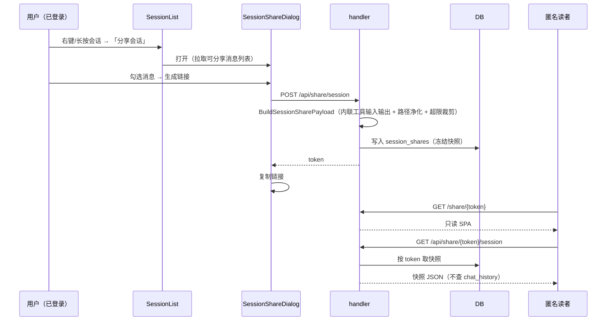
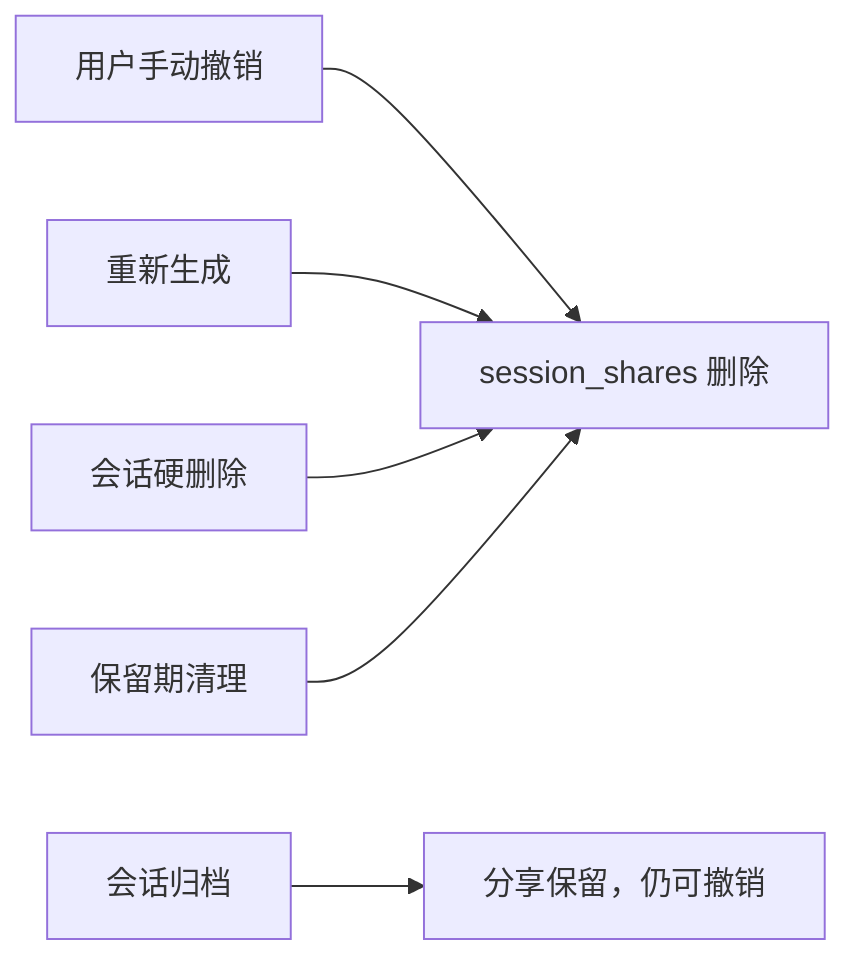

# 会话分享

会话分享把一段 AI 对话的快照发布为**公开只读链接**：任何人拿到链接即可免登录查看，语义与既有的[文件分享](file-management.md)对齐。

文件分享只覆盖文件，而会话里最有价值的产出——推理过程、工具调用、多轮结论——反而无法对外分享，想给别人看只能截图或复制粘贴。会话分享补上这一环。

与文件分享的两处**有意分歧**：

- **列表按项目隔离**。文件分享的「已分享文件」抽屉是全局的，会话分享的管理列表只看当前项目——会话标题本身是私有内容，跨项目罗列会把它泄露给不该看到的人。
- **归档不撤销分享**。文件被归档没有对应概念；会话归档后分享**保留**且仍可撤销（只是不能再"打开会话"），理由见下。

## 流程图

### 创建分享与匿名查看

### 撤销的触发点

## 功能与设计要点

### 功能清单

- **创建分享**：会话列表右键（桌面端）或长按（移动端）选「分享会话」，打开对话框勾选要公开的消息，生成公开链接。已分享的会话在菜单项上**高亮并改称「分享会话（已分享）」**——状态指示放在操作入口上，而不是行内的装饰性角标（见设计要点）
- **重新生成**：为已分享会话再点一次，旋转 token 使**旧链接立即失效**并签发新链接。用于"链接发错人了"的场景
- **撤销分享**：菜单项与「已分享会话」抽屉都能撤销，撤销后链接立即 404
- **已分享会话抽屉**：列出**当前项目**的全部分享（会话标题、消息数、创建时间），支持打开会话、在新标签页打开链接、复制链接、逐个撤销、一键清空
- **归档会话的分享保留**：会话归档后其分享仍留在抽屉里（标注「会话已归档」），可撤销但不能再打开会话。链接本身依然有效——归档不等于删除
- **公开只读页**：`/share/{token}` 是独立 SPA（`share.html` 入口），按快照渲染完整对话：思考过程、工具调用（输入/输出可展开）、**原始内容**。**无任何动作按钮**（朗读/复制/分叉/回溯/详情/引用全部抑制）
- **入口按需出现**：管理入口按钮仅在**本项目存在分享时**显示，避免常驻一个多数时候点开是空的入口

### 设计要点

- **快照是冻结的，不是实时视图**：创建时把选中消息序列化成一份 JSON 存进 `session_shares.payload`，之后对话继续演进、消息被编辑或删除都不改变已发出的链接。这换来两个性质：链接内容是稳定的（读者看到的就是分享那一刻的对话），撤销成为纯粹的服务端删除（不需要追踪"哪些读者看过什么"）。**代价是快照必须自包含**——一旦写入，查看时不再读数据库的任何其他表
- **快照必须内联工具输入输出与思考文本**：`chat_history.content` 里 tool_use 块的 `input`/`output` 是**被剥掉的**（`model.ContentBlock.MarshalJSON` 有意为之），thinking 块只存 `think_id`，真实内容分别在 `chat_tool_calls` / `chat_thinking`。因此快照构建工作在 `map[string]any` 上、**绝不经过 `ContentBlock` 往返**——否则会静默产出满屏空工具卡片。这是最容易写错的一处：直接 re-marshal `ContentBlock` 编译能过、单测若不覆盖内容也会过
- **快照同时带上摘要与原文，但分享页只渲染原文**：快照里两者都在，使分享页**不必二次请求**就能拿到完整内容。**但分享页不提供摘要/原文切换**——摘要是应用侧的阅读偏好，只读读者无法判断哪个视图"对"，而快照本就带着完整 blocks。唯一的例外是"有摘要但无 blocks"的消息（罕见：agent 只吐了元信息），此时回退显示摘要，避免渲染成空白
- **执行计划有意不含**：`chat_sessions.context_state` / ACP 缓存态是瞬时的、不按消息持久化、在 `ContentBlock` 里也没有表示，放进快照既无来源也无消费方
- **路径必须相对化，且要覆盖所有槽位**：快照里出现的绝对路径会暴露创建者的目录结构。净化递归遍历整个 payload，把 `projectRoot` 前缀替换为 `./`、`homeDir` 前缀替换为 `~/`。**容易漏的是块的顶层 `file_path`**——结构化路径字段（`input`/`output`/`summary`/`text`）都被处理了，但 `SlimBlock.FilePath` 填的是另一个槽位，漏掉它会让 `Read` 之类的工具调用直接印出绝对路径。不在任何已知根下的路径原样保留（没有可相对化的基准，强行处理反而会破坏内容）
- **超限时裁剪而不是拒绝**：单份快照上限 16 MiB（工具输出是体积主因）。超限时**先裁剪最长的工具输出**（下限 4 KiB，低于此不再裁）并打上 `truncated` 标记，而不是让请求失败——分享一份降级的长会话，好过完全无法分享。**裁剪实现有个必须记住的约束**：消息体是 JSON **字符串**，裁剪发生在解码后的 wrapper map 上，改动只有写回 `payload.Messages[i].Content` 再重新序列化才会生效；漏掉写回会让整个函数变成 no-op（重新序列化的是原始字符串，返回超限快照，`truncated` 标记也随改动一起丢弃）
- **token 即唯一凭证，无状态公开访问**：公开端点不加登录——"发给任何人即开即用"的零摩擦是分享功能的核心。防线是 token 不可猜测：**无分享记录一律 404**（功能不被使用时零暴露），重新生成即旋转 token 使旧链接立即失效，因此不需要令牌黑名单
- **管理端点鉴权 + 归属校验**：创建/查询/撤销都走 `middleware.Auth`，并校验会话属于请求携带的项目 cookie 所指的项目。**归档会话的归属解析必须走不排除归档的查询**——归档会话在常规查询里被过滤掉，沿用它会得到空项目路径，导致分享被记到"无项目"下而从管理列表消失（链接却仍然有效，等于造出一个撤不掉的分享）
- **归档保留分享**：归档只是移出主列表，消息本身还在。若归档时撤销分享，用户会意外失去一个仍然有效的链接；若归档后从管理列表隐藏，链接有效却再也撤不掉。两者都不可接受，因此选择"保留 + 可撤销 + 不能再打开会话"
- **硬删除与保留期清理要同步撤销**：这两条路径下消息真的没了，冻结快照就成了已删内容的副本——留着会让"删除"失效。会话删除的**批量路径**与**单条路径**都要清理（`IN (...)` 与 `= ?` 两处），只做一处会留下漏网的分享
- **只读渲染复用现有聊天管线**：分享页把快照喂进既有的渲染管线，靠 `readOnly` 抑制动作按钮，而不是另写一套渲染。这保证分享页与聊天区渲染天然一致，不必长期维护第二套实现（与[导出用共享管线而非 DOM 克隆](file-management.md)同一条理由）。**`readOnly` 必须覆盖每一个动作按钮**——「引用消息」按钮是最容易漏的一个（它和其他按钮不在同一段模板里），漏掉会让分享页出现一个"引用到对话"按钮，而匿名读者根本没有可引用的聊天区。注意 `readOnly` 机制本身是本功能引入的，不是上游既有设施；守卫遗漏不会有编译错误，只能靠测试覆盖
- **状态指示放在操作入口上**：会话行内的分享角标是装饰性的（不可点击），状态在一处、操作在另一处，用户看到"已分享"却不知道去哪操作。改为在右键菜单的「分享会话」项上体现（已分享时高亮 + 改文案），与文件侧 `FileHeader` 的「分享链接」项同构——同一个概念在两个功能里长得一样
- **管理列表按项目过滤，与文件分享有意不同**：会话标题是私有内容，全局罗列会把"某个项目里在做什么"泄露给任何打开抽屉的人。文件分享列表是全局的，因为文件名通常不敏感——这是按内容性质做的区别对待，不是疏漏
- **分享页的路径 chip 不跳转**：分享页的路径 chip 与相对链接是两条不同的链路。链接由 `shareLinks.ts` 改写为 `/share/{token}?path=` 深链、原地切换（见[文件管理](file-management.md)的「分享页内文件跳转」）；而**路径 chip 的点击必须被拦截**——它经 `openFilePath` 走鉴权端点（`/api/file/`、`/api/dir`，匿名访问一律 401），读者点不动，且路径解析会落在空的项目根上。拦截点在 `openFilePath` 入口，**不能只靠 `MarkdownPreview` 的链接拦截**：后者对 Ctrl/Cmd/Shift+点击有意放行（让浏览器开新标签），点击链会继续走到 `handleAnchorClick`，而它把**任何**相对链接都路由到 `openFilePath`——修饰键点击因此是一条真实的绕过路径
- **chip 的存在性探测也必须拦，且要拦在 `verifyFilePaths`**：`openFilePath` 拦的是"点了之后"，而 `verifyFilePaths` 拦的是"渲染时"。分享页渲染路径 chip 后，`ContentBlocks` 会调 `verifyFilePaths` 探测这些路径是否存在，而该探测走鉴权端点，匿名读者拿 401（`fetchPathTypes` 对非 OK 响应返回 `null`，chip 因此停在未验证态）。因此 `verifyFilePaths` 入口同样需要 `isShareMode()` 短路。**这个守卫看起来像冗余，实则不然**——分享页经 `ChatMessageItem` 渲染，走的是**聊天管线**（`renderMarkdown` → `useChatRender` → `ContentBlocks.reverifyAnnotations`），而带 share 分支的是**文件预览管线**（`buildMarkdownPreviewDom`）；两条管线不同，"文件预览管线在分享模式不产出 `data-file-path`"这一事实**不能**用来推断聊天管线也不需要守卫。测试必须直接驱动 `verifyFilePaths`，针对 `buildMarkdownPreviewDom` 写的测试无法覆盖这条路径

## 数据模型

| 表 | 用途 |
|---|------|
| `session_shares` | 分享记录：`token`（主键）、`session_id`、`title`、`backend`、`message_count`、`payload`（冻结快照 JSON）、`created_at` |

`session_id` 上建索引（`idx_session_shares_session`），供"这个会话是否已分享"与撤销查询使用。

一个会话至多一条分享记录：再次分享是**旋转**（先删旧行再写新行），因此旧 token 立即失效。`title` / `backend` / `message_count` 是快照的冗余副本，供管理列表展示，避免为列一个列表而解析每份 payload。

## API 端点

管理端点经 `middleware.Auth`，并按项目 cookie 做归属校验：

- `POST /api/share/session` — 创建或重新生成分享（请求体含 `sessionId` 与选中的 `messageIds`）
- `GET /api/share/session` — 查询某个会话的分享状态
- `DELETE /api/share/session` — 撤销某个会话的分享
- `GET /api/share/session/list` — 列出**当前项目**的全部分享
- `DELETE /api/share/session/list` — 撤销本项目全部分享（一键清空）

公开端点无鉴权，token 即凭证；无记录一律 404：

- `GET /api/share/{token}/meta` — 分享元信息（`kind` = file/session、标题、消息数），供分享页在拉取正文前渲染骨架。**与文件分享共用**：先按会话 token 查，未命中再按文件 token 查，两者都无则 404
- `GET /api/share/{token}/session` — 快照正文。**按原样流式返回**存储的 JSON，不做反序列化再序列化——重新编码会让匿名请求的内存峰值翻倍，且对内容毫无收益
