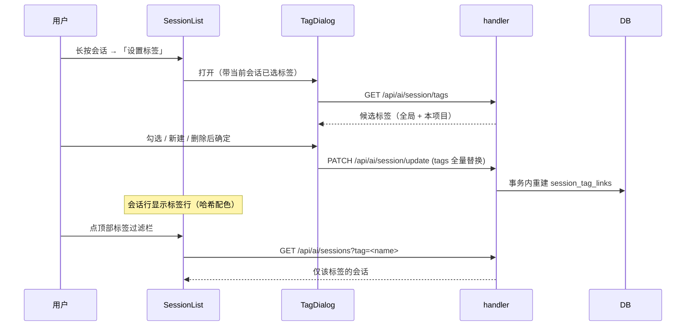
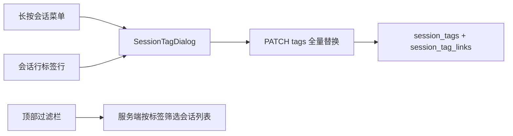

# 会话标签

会话标签让用户给聊天会话打上自定义标签（「bug 修复」「重构」「调研」……），并在会话列表顶部按标签过滤。会话数量一多，仅靠标题和时间很难找回"上周那几条在处理登录问题的对话"——标签把用户心里的分类显式化，让"按主题找会话"从翻列表变成点一下。

标签**按项目隔离**：同一个名字在不同项目里是两条独立记录，各自管理、各自计数。这符合直觉——两个项目里的"重构"本来就无关，共享一份定义只会让一个项目的删除操作影响另一个。

## 流程图

### 打标签与按标签过滤

### 标签的三个入口

## 功能与设计要点

### 功能清单

- **打标签**：长按会话行（桌面端右键）在菜单里选「设置标签」，打开多选对话框——勾选已有标签、就地新建、逐个删除。会话行下方显示标签行，一眼看出这条会话属于哪些主题
- **新建标签可选作用域**：新建时可选「本项目」或「全局」。全局标签在所有项目里可见（存储为 `project_path=''`），适合"待跟进""重要"这类跨项目语义；项目标签只在本项目可见
- **顶部过滤栏**：会话列表上方按"本项目正在使用的标签"显示 chip 行，点选即服务端筛选（`GET /api/ai/sessions?tag=`），再点取消。**只列出真正被用过的标签**——候选标签可能很多，过滤栏里出现零会话的标签只会让人点了发现是空的
- **哈希配色**：标签没有配色配置，颜色由标签名哈希决定（FNV-1a 32 位取模映射到固定色板），同名同色、跨项目一致、重启不变。用户不必为每个新标签挑颜色，而视觉上仍能靠颜色区分标签
- **删除标签**：对话框内可删除标签定义，同时清理所有会话关联。删除需要区分作用域——同名标签可能同时存在项目版与全局版，删哪个由用户所在上下文决定

### 设计要点

- **项目隔离靠 `UNIQUE(name, project_path)` 而非仅 name**：两个项目各有一个"bug"是正常状态。把唯一键收窄到 name 会强迫全局唯一，用户就得发明"项目A-bug"这种名字；而删除一个项目的标签会连带影响另一个项目。全局标签用空 `project_path` 表示，天然不与任何项目行冲突
- **标签更新是全量替换而非增量指令**：`PATCH /api/ai/session/update` 的 `tags` 字段是"这个会话现在的标签集合"，后端在一个事务里重建关联。全量替换让并发编辑的最终状态可预期（后写者胜），而增量 add/remove 在两端各自计算 diff 时容易产生"双方都以为自己删过了"的错乱
- **字段缺省与空数组语义必须区分**：`tags` 是可选指针——**不传 = 不改动**，`[]` = 清空全部。若用零值判断，任何不关心标签的 PATCH（改模型、改模式）都会顺手把标签清光
- **归属校验覆盖所有入参通道**：会话 ID 可以来自 body 也可以来自 query，两条路径都必须做项目归属校验。只校验一条会让"带 `?session_id=` 的请求"绕过归属检查去改别的项目的会话标签
- **归档会话也要能解析归属**：归档会话在常规查询里被过滤掉，若沿用该查询解析项目路径会得到空值，标签就被记到"无项目"下、从过滤栏消失。归属解析必须走不排除归档的查询
- **颜色由名字派生，不存储**：存储配色意味着每次新建标签都要一次选择，且跨设备同步/迁移时多一份需要保持一致的状态。哈希配色把"稳定可区分"这件事变成纯函数，没有存储就没有漂移

## 数据模型

| 表 | 用途 |
|---|------|
| `session_tags` | 标签定义（`name`、`scope` = project/global、`project_path`，`UNIQUE(name, project_path)`） |
| `session_tag_links` | 会话 ↔ 标签关联（`session_id` + `tag_id`，`ON DELETE CASCADE`，`UNIQUE(session_id, tag_id)`） |

标签名在写入前做小写归一——数据库排序规则是 BINARY，不归一会让 "Bug" 和 "bug" 变成两个标签。

## API 端点

全部经 `middleware.Auth`：

- `GET /api/ai/session/tags` — 标签候选列表；带 `inUse=1` 时只返回本项目实际在用的标签（供过滤栏）
- `DELETE /api/ai/session/tags` — 删除标签定义及其全部关联（`name` + `scope` 定位）
- `PATCH /api/ai/session/update` — 更新会话，`tags` 字段全量替换标签集合（不传则不改）
- `GET /api/ai/sessions` — 会话列表，支持 `tag=<name>` 服务端筛选
