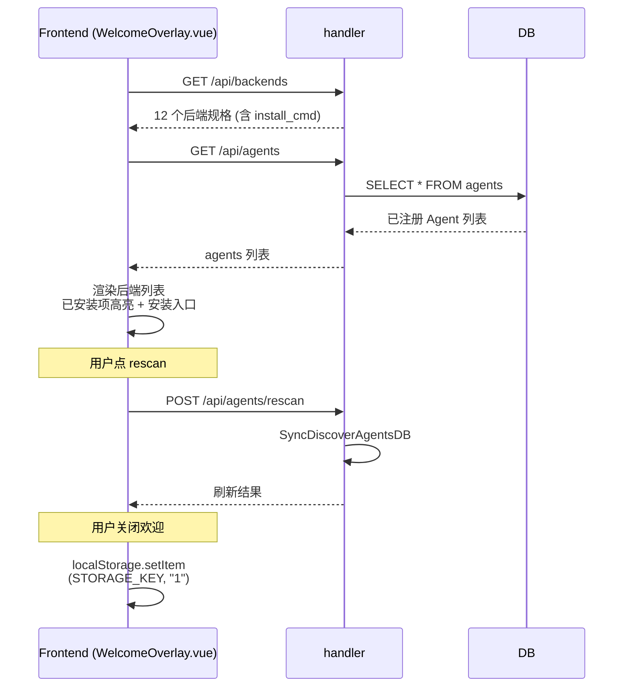
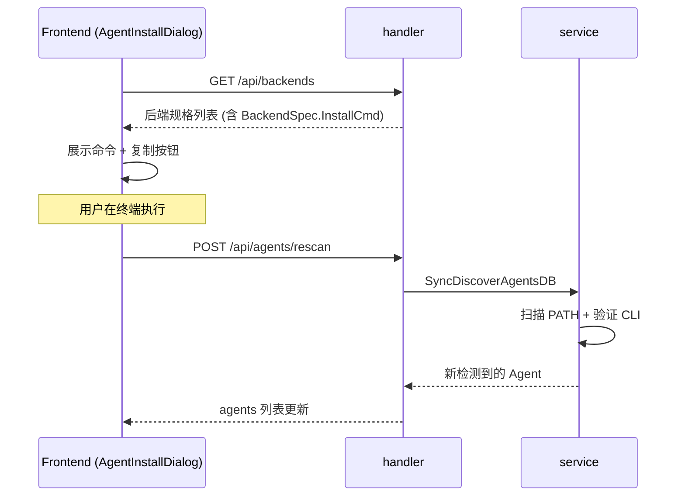

# 首次访问欢迎面板（WelcomeOverlay）

当前首次访问界面是 `WelcomeOverlay`：它展示已安装后端及安装入口，不是分步设置向导。Agent 通过自动发现、安装对话框或手动定义写入数据库 `agents` 表。

## 概述

`WelcomeOverlay` 是首次访问 ClawBench 时显示的欢迎遮罩，提供后端安装状态总览和安装入口：

- **触发条件**：用户首次访问（`localStorage 'clawbench_welcome_dismissed'` 未设置）或通过 `clawbench-show-welcome` 自定义事件触发（`web/src/components/settings/SettingsCategory.vue`）
- **关闭机制**：用户点击关闭后写入 `STORAGE_KEY`，之后不再显示
- **数据源**：实时拉取 `GET /api/backends`（12 个后端规格）和 `GET /api/agents`（已注册 Agent）

## 流程图

### WelcomeOverlay 数据流

### AgentInstallDialog 安装流程

## 功能与设计要点

### 功能清单

- **后端检测面板**：显示所有 12 个注册后端（`internal/model/BackendRegistry`），每项标注：
  - 后端名称 + 描述
  - 是否已检测到 CLI（来自 `agents` 表）
  - 安装命令（`BackendSpec.InstallCmd`，如 `"npm install -g @anthropic-ai/claude-code"`）
  - ACP 能力（是否支持 `Transport: "acp-stdio"`）
- **手动刷新**：`POST /api/agents/rescan` 触发 `SyncDiscoverAgentsDB`（`cmd/server/main.go`）重新扫描 PATH 中的 CLI
- **安装对话框**：`AgentInstallDialog` 组件打开后显示安装命令和复制按钮，引导用户在终端执行
- **持久化关闭状态**：用户关闭后写入 `localStorage['clawbench_welcome_dismissed']`，下次不再自动显示
- **事件触发重显**：`clawbench-show-welcome` 自定义事件允许设置页主动重新打开欢迎面板

### 设计要点

- **WelcomeOverlay 不是向导**：当前没有"分步创建 Agent"流程——Agent 创建走 `WelcomeOverlay`（检测/安装）→ `AgentInstallDialog`（执行 install_cmd）→ 自动发现的链路
- **接口边界**：安装命令直接包含在 `GET /api/backends` 的返回值中，不存在单独的 `/api/agents/:id/install-cmd` 路由。以下 setup 端点也不存在：
  - `GET /api/setup/status`
  - `POST /api/setup/models`
  - `POST /api/setup/verify`
  - `POST /api/setup/complete`
- **不存在的文件澄清**：以下概念在当前代码中**不存在**：
  - `PiConfig` 类型（Agent 配置走 SQL `agents` 表）
  - `auth.json` / `models.json` 文件
  - 内嵌 Pi 二进制检测
- **Agent 创建时机**：当前 Agent 创建有两种路径：
  1. 自动发现：`SyncDiscoverAgentsDB` 扫描 PATH 中的 CLI（启动时 + `rescan` 时）
  2. 手动安装：用户通过 `AgentInstallDialog` 在终端执行 `InstallCmd`，然后 `rescan` 触发发现
