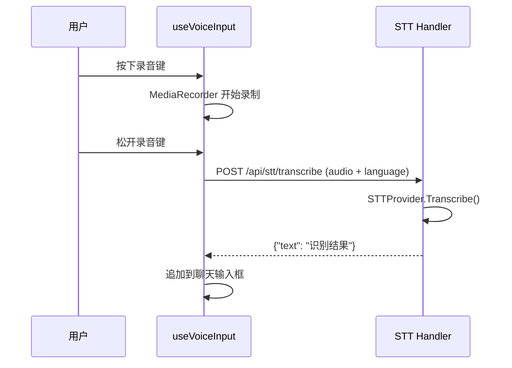
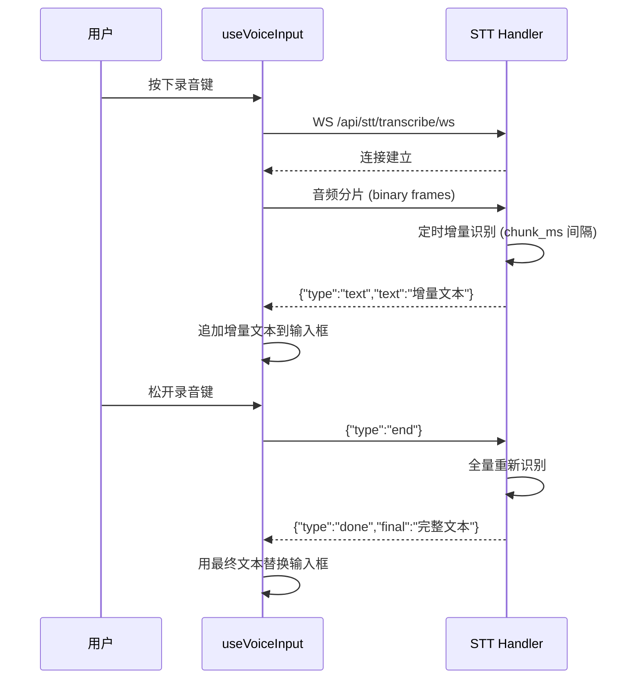

# 语音输入（STT）

ClawBench 的语音输入功能让用户通过麦克风录制语音，由后端 ASR 引擎实时转录为文字并填入聊天输入框。支持流式和非流式两种模式：流式模式下音频分片通过 WebSocket 持续发送，增量识别结果实时显示；非流式模式下录音完成后一次性提交，等待完整识别结果。语音输入降低了移动端打字的交互成本，是移动优先场景下的核心输入方式。

## 流程图

### 非流式语音识别

非流式模式适合短语音，录音结束后一次性识别。用户按住录音键说话，松开后提交音频，识别结果填入输入框。

### 流式语音识别

流式模式下，前端按 `chunk_ms` 间隔将音频分片通过 WebSocket 发送，后端每收到新分片就增量识别新增部分并发送增量文本。用户停止录音后发送 `end` 控制帧，后端对完整音频做一次全量识别，返回最终结果替换之前累积的增量文本。

## 功能清单

- **语音输入（非流式）**：录音完成后通过 POST 提交音频文件，后端识别后返回完整文本。适合短语音，实现简单，延迟可控
- **语音输入（流式）**：通过 WebSocket 实时发送音频分片，后端按 `chunk_ms` 间隔增量识别，前端实时显示部分结果。用户停止后后端对全量音频重新识别，最终结果替换增量文本。适合长语音，用户可以边说边看到识别进展
- **安全上下文检测**：语音输入需要 HTTPS 或 localhost 环境才能访问麦克风（`navigator.mediaDevices` API 要求安全上下文）。非安全上下文时弹出提示，用户知道为什么无法使用
- **快捷键触发**：可配置快捷键（默认 F9）切换录音状态，无需点击按钮
- **多语言支持**：通过 `language` 参数指定识别语言（如 `zh`、`en`），传给后端 STT 引擎

## 设计要点

- **双模式分离**：流式和非流式使用独立的 HTTP/WS 端点，非流式走 `POST /api/stt/transcribe`，流式走 `WS /api/stt/transcribe/ws`。前端根据 `stt.streaming` 配置选择模式，无需同时处理两种协议
- **流式增量 + 最终全量**：流式模式分两阶段——增量阶段只识别新增音频片段（低延迟、可累积误差），最终阶段对完整音频重做一次识别（高精度、替换增量结果）。兼顾了实时反馈和最终准确性
- **STTProvider 可替换**：后端通过 `STTProvider` 接口抽象识别引擎，当前实现为 vLLM Whisper（OpenAI 兼容端点），可替换为其他 ASR 引擎。接口只做"给定音频段→返回文本"，不关心流式/非流式——流式控制由 handler 层处理
- **音频大小限制**：非流式请求 10MB 上限，流式连接 20MB 上限，防止内存溢出
