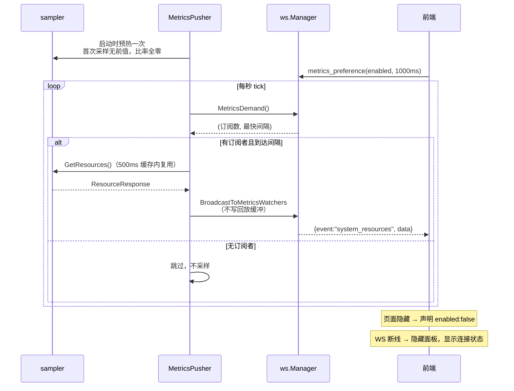

# 系统资源监控

系统资源监控让用户实时了解服务器状态——CPU 使用率、内存占用、磁盘空间、网络吞吐和负载。移动端场景下用户无法登录服务器执行 `top` 或 `htop`，Web 面板提供了等价的可视化体验。WS 断线时资源面板自动隐藏，改为显示连接状态提示，避免用户误以为数据不刷新是服务端问题。

## 流程图

### 系统资源数据流

## 功能与设计要点

### 功能清单

- **实时资源面板**：`SystemResourcesPanel` 在 AppHeader 的 Gauge 图标弹出菜单中展示 CPU、内存、磁盘、网络和负载指标。用户无需离开聊天界面即可了解服务端负载
- **压力指示图标**：AppHeader 的 Server 图标在系统资源压力异常时（CPU/内存超过阈值）切换为压力指示图标，即使资源面板未打开也能提醒用户关注资源状态
- **6 类指标**：CPU 使用率+核心数、内存使用率（排除 buffers/cache）、磁盘使用率（数据目录所在分区）、磁盘 I/O 速率、网络上下行速率、1/5/15 分钟负载均值。覆盖了运维关注的核心指标
- **WS 断线状态提示**：WebSocket 断开或重连时，资源面板自动隐藏并改为显示连接状态指示器（"disconnected" / "reconnecting"）。避免展示过时数据误导用户
- **页面可见性感知**：`useSystemResources` 在页面隐藏时向服务端声明关闭推送，回到可见时恢复。移动端切到后台时停止采样，回到前台时恢复
- **前台/后台双速推送**：`startPolling`（前台，声明 1000ms）和 `startBackgroundPolling`（后台，声明 5000ms）双模式。前台消费者（如资源面板）激活时用快速速率，仅后台消费者（如压力指示器）时用慢速速率，按需切换节省采样
- **启动预热消除零值首帧**：`MetricsPusher` 启动时先采样一次，使第一帧推送就带真实速率。前端不再需要旧版的"间隔 200ms 发两次请求"

### 设计要点

- **按需采样而非定时推送**：服务端只在存在已声明订阅者时才采样，无订阅者时完全不触碰采样器。这把旧版"每个打开的标签页永远每 5s 请求一次"（全站请求量第一的端点）压到与实际观看人数成正比
- **遥测不走回放缓冲**：`system_resources` 走独立的非缓冲投递路径。1Hz 遥测若进入 50 条的重连回放缓冲会挤掉聊天/任务事件；且发送队列满时丢弃而非断连，避免为丢一帧指标中断正在进行的聊天流式输出
- **采样缓存而非实时采集**：`GetResources()` 使用 500ms 缓存，同一窗口内的多个请求共享同一份采样结果——gopsutil 的 CPU/网络采集需要间隔计算，每次请求都重新采集会产生零值或不准确数据
- **认证端点**：`GET /api/system/resources` 需认证，保留供程序化访问；UI 已改用 WS 推送。当前面向单用户场景可接受；多租户场景下应限制为管理员
