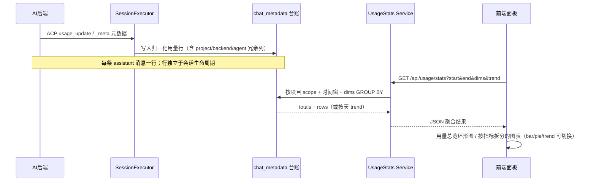
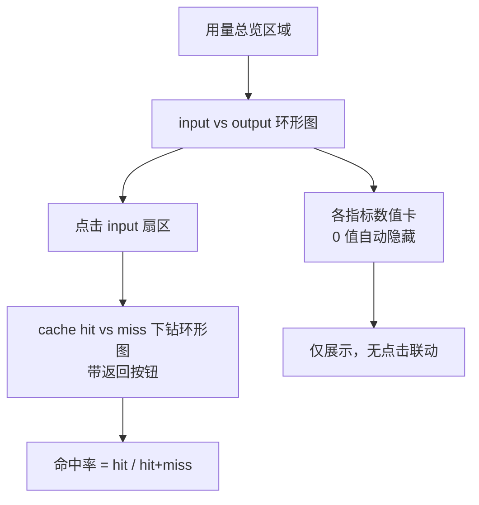

# 智能体用量统计

数据统计（Usage Stats）让用户按项目查看所有 Agent 会话的 token/成本消耗：哪些模型占用了多少输入/输出 token、缓存命中率如何、趋势是升是降。它解决"用量散落在各会话上下文面板里、无法全局把握"的问题——把 ACP `_meta` 归一化后写入 `chat_metadata` 的逐条用量行，在服务端按维度聚合，前端用饼图/趋势/直方图呈现。入口是宽屏 Dock 的「数据统计」页签，该页签下再分三个子页：**用量统计**（本文件）、**代码存量**与**代码增量**（见[Git 管理](git-management.md)的代码量统计）。

## 流程图

### 用量行到统计面板的链路

用量数据在每条 assistant 消息完成时由后端归一化后落库，统计端点只是对既有行的只读聚合——展示的价值在于把分散的逐条数据变成可读的全局视图。用量行是**独立台账**：写入时冗余 `project_path`/`backend`/`agent_id`/`clawbench_session_id`，不再依赖外键回连会话表，因此会话被删除、消息被回溯截断或 ACP 重放都不会销毁已消耗的真实用量。

### 用量总览的下钻交互

## 功能与设计要点

### 功能清单

- **用量总览**：面板顶部展示时间范围内的总量——input vs output 环形图直观反映读写比例，点击 input 扇区下钻为该输入量的缓存命中 vs 未命中构成；旁边的数值卡列出 input/output/total/cacheHit/credit/cost 六项总量（0 值自动隐藏，避免空卡占位），附缓存命中率。让用户一眼看到"这个项目这段时间烧了多少 token、缓存命中高不高"
- **按指标拆分的图表**：为每个选中指标（metric，默认 `total`）各渲染一张图，类目是所选维度的组合（多个维度用 ` × ` 拼成单一标签，如 `glm-5.1 × codebuddy`），横向比较各实体在该指标下的消耗。图表类型可切换 **bar（直方图）/ pie（饼图）/ trend（时间趋势）** 三种——bar/pie 基于明细行，trend 基于按天聚合（默认保留 top-10 组合，避免组合爆炸）。帮助定位"哪个模型/后端/Agent 是消耗大户"，并观察"升级模型后用量是否回落"
- **时间范围与维度筛选**：24h / 7d / 30d / 自定义（≤370 天，UTC 时基、按天分桶）；维度可选 model/backend/agent 的组合（1-3 个），配合 sort/order 排序与 top/limit 截断。筛选卡独立于总览区，体现"总览不随维度筛选改变"的设计
- **明细表排序**：筛选后的明细行可点击表头按各指标排序，快速找出 top 消耗者；`limit` 上限 200 行防止超大结果集拖垮渲染
- **费用两位小数统一**：所有费用展示（用量统计、上下文面板、消息详情弹窗）统一保留两位小数、大额带千分位，sub-cent 归零显示 `$0.00`。pi/opencode 等后端单次成本常在 0.0001 以下，此前各界面精度不一（6 位 / 4 位 / 特殊显示 `$0.0001`）会让界面出现一长串小数；原始精度仍保留在 DB 与 API 中未截断
- **移动端适配**：窄容器（<460px）下总览区由并排改为纵向堆叠（donut 在上、数值卡在下），chip 组自动换行、窄屏隐藏图表数值轴刻度。保证小屏设备也能完成"看总量 → 钻取 → 筛选"的主流程

### 设计要点

- **用量行是独立台账而非会话的从属数据**：`chat_metadata` 的 `message_id` 外键曾级联删除，删会话/回溯/ACP 重放时把真实消耗一并销毁，导致统计长期少计。改为去掉级联外键、写入时冗余项目与维度列、统计查询不回连会话表——"花掉的 token 是既成事实，不该随对话被清理而消失"。代价是 fork/续接/重放需刻意**不**复制用量行（否则双计），backfill 也要排除复制来源会话
- **聚合发生在服务端而非前端**：前端只请求自己需要的窗口和维度，`GROUP BY` 在 SQLite 完成。原因一是聊天消息可能未全部加载到前端，二是避免把数千条原始行拉到浏览器再算——统计是读多写少的分析场景，服务端聚合是天然的分层
- **用量行必须内部自洽才能 SUM**：`chat_metadata` 的 input/output/total 采用「最新完整快照」整体写入——早期曾逐字段拼接多次 usage_update 通知，把不同请求的累计型 counter 缝进同一行，导致 total 达 input 十倍、SUM 聚合失去意义。先保证单行自洽，聚合才有意义
- **以 assistant 消息完成时的写入时间为准**：时间基准是 `chat_metadata.created_at`（≈最终写入时间，非用户消息时间），配合 `h.project_path` 归属校验做项目作用域，保证数据只在用户自己的项目内可见
- **范围与维度解耦**：总览展示的是窗口内全部数据（不随维度筛选变化），维度只作用于明细表与图表——"总览是快照、明细是切片"，避免用户困惑"为什么选了 agent 后总览数字也变了"
- **渲染层与数据层分离**：`useUsageStats` 单例 composable 管理请求状态（300ms 防抖 + AbortController + 项目切换时重置），图表构建（`statsChart.ts`）与 ECharts 封装（`UsageChart`）解耦，使响应式窗口变化和主题切换只影响渲染层，不触发重新取数
