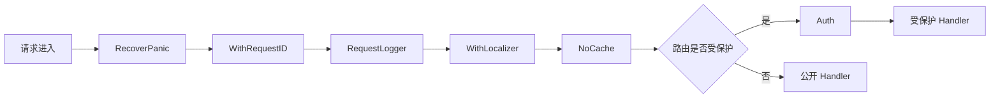
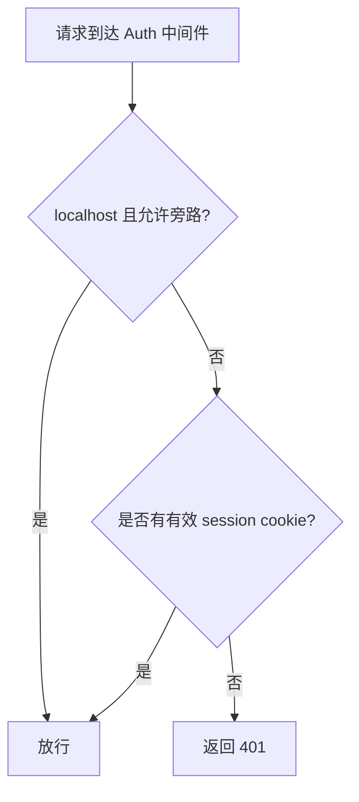

# 认证与中间件

ClawBench 的认证设计围绕一个核心矛盾：本地 CLI 需要低摩擦访问，而远程浏览器和手机需要密码保护。密码以 SHA-256 加盐哈希存储，修改密码时自动轮换 API 密钥加密密钥。全局中间件链负责 panic 恢复、请求 ID、日志和 i18n；需要保护的路由在注册时单独包裹 `Auth`，公开状态接口不经过认证中间件。

## 流程图

### 请求中间件链

### 认证决策流程

## 功能与设计要点

### 功能清单

- **密码认证**：远程访问需要密码，密码存储为 SHA-256 加盐哈希（带前缀标识），使用常量时间比较防止时序攻击。密码可配置，未配置时自动生成 32 位 hex（16 字节 / 128 bit 熵；ISS-269 后从 4 字节升级） 并持久化到 `.clawbench/auto-password`
- **可配置 localhost 旁路**：默认 `localhost_auth_exempt=true`，来自 127.0.0.1、::1 或 localhost 的请求无需密码，方便 `clawbench task`、`clawbench rag` 等本地 CLI 调用。关闭该配置后，本地请求与远程请求一样必须携带有效认证
- **Panic 恢复**：中间件链最外层捕获 panic，返回 500 而不是让进程崩溃。任何 handler 的未处理异常都被优雅地降级为错误响应
- **请求 ID**：每个请求分配唯一 ID（`X-Request-ID` header），贯穿日志和错误响应。追踪问题时的关键线索
- **请求日志**：记录方法、路径、状态码、耗时、请求 ID。这是生产环境排查问题的第一入口
- **i18n 本地化**：从 `Accept-Language` header 提取语言偏好，错误响应使用用户语言显示。AGENTS.md 中所有 handler 的 `writeLocalizedError` 都基于此
- **NoCache 响应头**：全局中间件为所有 API 响应设置 `Cache-Control: no-store`，确保浏览器刷新时总是获取最新数据，而非使用缓存的旧状态
- **按路由认证**：`Auth` 不在全局 `Chain` 中；路由注册时明确决定是否包裹认证。健康检查、最小状态等公开接口可以保持可达，包含配置、项目或用户数据的 API 必须受保护
- **密码修改与密钥轮换**：`POST /api/settings/password` 验证当前密码后写入新的 SHA-256 哈希，同时轮换所有 API 密钥的加密密钥（[配置与自动发现](config-and-discovery.md)），并即时更新内存中的认证状态——修改密码不需要重启服务

### 设计要点

- **localhost 旁路默认开启但可收紧**：默认值优先保证本地 CLI 零配置可用；高安全环境可以关闭 `localhost_auth_exempt`，接受 CLI 需要认证的代价
- **常量时间比较防时序攻击**：密码比较使用常量时间算法，不泄露密码长度和内容信息。即使攻击者能测量响应时间也无法推断密码
- **自动密码降低部署门槛**：首次启动自动生成密码，用户不改也能安全使用。这是"零配置启动"理念的体现
- **API 密钥加密与密码联动**：LLM 供应商的 API 密钥使用 AES-256-GCM 加密存储，加密密钥由登录密码经 HKDF-SHA256 派生。密码变更触发全量密钥轮换——修改密码不会导致已保存的 API 密钥失效
- **全局链与路由认证分层**：`Chain(A, B, C)` 的执行顺序是 A→B→C→handler→C→B→A；RecoverPanic 位于最外层，NoCache 在全局链最内层（WithLocalizer 之后）。Auth 不在全局链中，由具体路由单独包裹——避免为了少数公开接口在 Auth 内维护例外清单
