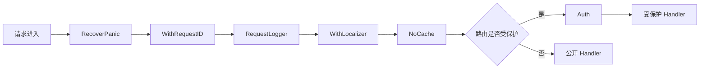
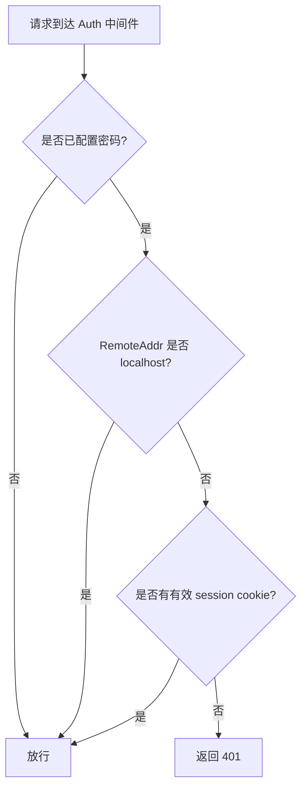

# 认证与中间件

ClawBench 的认证设计围绕一个核心矛盾：本地 CLI 与 AI 智能体需要低摩擦访问，而远程浏览器和手机需要密码保护。密码以 SHA-256 加盐哈希存储。全局中间件链负责 panic 恢复、请求 ID、日志和 i18n；需要保护的路由在注册时单独包裹 `Auth`，公开状态接口不经过认证中间件。

## 流程图

### 请求中间件链

### 认证决策流程

## 功能与设计要点

### 功能清单

- **密码认证**：远程访问需要密码，密码存储为 SHA-256 加盐哈希（带前缀标识），使用常量时间比较防止时序攻击。密码可配置，未配置时自动生成 32 位 hex（16 字节 / 128 bit 熵；ISS-269 后从 4 字节升级） 并持久化到 `.clawbench/auto-password`
- **无条件 localhost 旁路**：来自 127.0.0.1、::1 或 localhost 的请求无需密码。该旁路**不可关闭**——`localhost_auth_exempt` 配置项已移除。本地 CLI（`clawbench task`、`clawbench rag`）和 AI 智能体的斜杠命令依赖它做零配置调用
- **Panic 恢复**：中间件链最外层捕获 panic，返回 500 而不是让进程崩溃。任何 handler 的未处理异常都被优雅地降级为错误响应
- **请求 ID**：每个请求分配唯一 ID（`X-Request-ID` header），贯穿日志和错误响应。追踪问题时的关键线索
- **请求日志**：记录方法、路径、状态码、耗时、请求 ID。这是生产环境排查问题的第一入口
- **i18n 本地化**：从 `X-Locale` header → `clawbench-locale` Cookie → `Accept-Language` header 优先级链解析语言偏好，错误响应使用用户语言显示。推送通知场景使用 `LocalizerForLocale()` 独立解析语言。详见[国际化](i18n.md)
- **NoCache 响应头**：全局中间件为所有 API 响应设置 `Cache-Control: no-store`，确保浏览器刷新时总是获取最新数据，而非使用缓存的旧状态
- **按路由认证**：`Auth` 不在全局 `Chain` 中；路由注册时明确决定是否包裹认证。健康检查、最小状态等公开接口可以保持可达，包含配置、项目或用户数据的 API 必须受保护
- **密码修改**：`POST /api/settings/password` 验证当前密码后写入新的 SHA-256 哈希，并即时更新内存中的认证状态——修改密码不需要重启服务。密码修改不再触发 API Key 加密轮换

### 设计要点

- **localhost 旁路不可配置**：早期版本提供 `localhost_auth_exempt` 开关，默认开启但允许关闭。该开关已移除并永久生效，原因是：(1) 本地 CLI 与 AI 斜杠命令完全依赖它；(2) 能连上回环的进程本就能直接读数据库与 `cookie-token` 文件，追加一道 API 鉴权不增加实际安全性。代价是隧道场景下的信任边界问题，见下方"已知限制"
- **常量时间比较防时序攻击**：密码比较使用常量时间算法，不泄露密码长度和内容信息。即使攻击者能测量响应时间也无法推断密码
- **自动密码降低部署门槛**：首次启动自动生成密码，用户不改也能安全使用。这是"零配置启动"理念的体现
- **API 密钥加密与密码联动**：LLM 供应商的 API 密钥使用 AES-256-GCM 加密存储，加密密钥由登录密码经 HKDF-SHA256 派生。`agent_api_keys` 表和 `crypto.go` 已移除，Pi 后端不再运行时注入 API 密钥，模型刷新不再按 provider 过滤
- **全局链与路由认证分层**：`Chain(A, B, C)` 的执行顺序是 A→B→C→handler→C→B→A；RecoverPanic 位于最外层，NoCache 在全局链最内层（WithLocalizer 之后）。Auth 不在全局链中，由具体路由单独包裹——避免为了少数公开接口在 Auth 内维护例外清单

### 已知限制：隧道场景下的信任边界

`IsLocalhost` 仅依据 `r.RemoteAddr` 判定，不检查任何代理头（代码中无 `X-Forwarded-For` 处理）。这带来两类需要知悉的行为：

- **FRP 隧道**：frpc 以 TCP 代理方式从 `127.0.0.1` 回拨主端口（`internal/frp`，`tcpCfg.LocalIP = "127.0.0.1"`），因此**经 FRP 进入的公网请求会被判定为 localhost 并免密放行**。FRP 的 `Token` 只认证 frpc↔frps 的注册关系，与终端访客身份无关。由于 localhost 旁路现已不可关闭，开启 FRP 即等于将全部 API 无鉴权发布到公网，**没有逃生开关**。FRP 默认关闭（`frp.enabled: false`），仅在用户主动部署 frps 并启用时受影响
- **SSH 隧道**：SSH 客户端必须先用密码（即 Web 认证密码）登录，因此经 SSH 转发到 ClawBench 自身 API 的流量来自已认证主体，判定为 localhost 在安全上可接受
- **同机其他用户**：同一台机器上的其他系统用户直接连 `127.0.0.1` 亦被放行，但他们读不到 0600 权限的 `cookie-token` 文件——即当前旁路比 token 认证更宽松

需要收紧上述边界时，方向是让隧道流量走独立监听器并在监听器级标记为不可信（而非在请求级识别，因为 frpc 与本机进程在 TCP 层无法区分），或改为统一使用 `cookie-token`。
