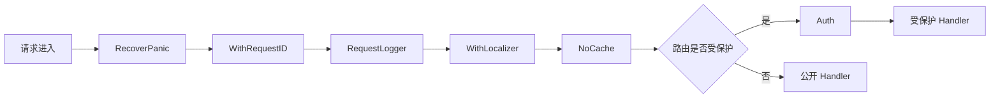
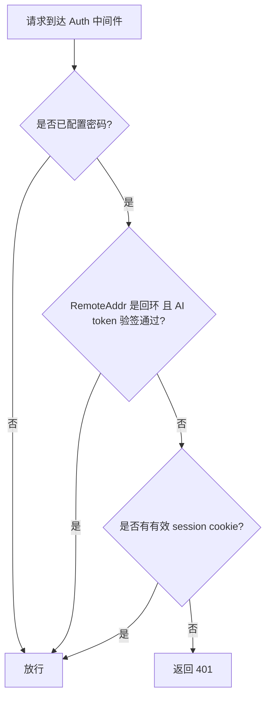

# 认证与中间件

ClawBench 的认证设计围绕一个核心矛盾：本机 AI 智能体的内置斜杠命令需要低摩擦访问，而远程浏览器和手机需要密码保护。解法不是「信任回环地址」（FRP 隧道的 frpc 同样从 `127.0.0.1` 回拨，会使该判据失效），而是给本机 AI 子进程签发一个**短时签名令牌**。密码以 SHA-256 加盐哈希存储。全局中间件链负责 panic 恢复、请求 ID、日志和 i18n；需要保护的路由在注册时单独包裹 `Auth`，公开状态接口不经过认证中间件。

## 流程图

### 请求中间件链

### 认证决策流程

`IsAITokenRequest` 的两个条件必须**同时**成立：地址限定令牌不被远程重放，签名限定地址不被冒充。地址单独不再放行。

## 功能与设计要点

### 功能清单

- **密码认证**：远程访问需要密码，密码存储为 SHA-256 加盐哈希（带前缀标识），使用常量时间比较防止时序攻击。密码可配置，未配置时自动生成 32 位 hex（16 字节 / 128 bit 熵；ISS-269 后从 4 字节升级） 并持久化到 `.clawbench/auto-password`
- **AI 短时令牌**：内置斜杠命令在注入提示词时签发一个 30 分钟有效的 HMAC 令牌，AI 子进程以 `X-ClawBench-AI-Token` 请求头发回。令牌无状态（`exp` + 签名），不落库、无清理 goroutine。签名密钥复用 `CookieToken`，因此改密码轮换它时所有在途令牌自动失效。回环地址单独**不再**放行
- **Panic 恢复**：中间件链最外层捕获 panic，返回 500 而不是让进程崩溃。任何 handler 的未处理异常都被优雅地降级为错误响应
- **请求 ID**：每个请求分配唯一 ID（`X-Request-ID` header），贯穿日志和错误响应。追踪问题时的关键线索
- **请求日志**：记录方法、路径、状态码、耗时、请求 ID。这是生产环境排查问题的第一入口
- **i18n 本地化**：从 `X-Locale` header → `clawbench-locale` Cookie → `Accept-Language` header 优先级链解析语言偏好，错误响应使用用户语言显示。推送通知场景使用 `LocalizerForLocale()` 独立解析语言。详见[国际化](i18n.md)
- **NoCache 响应头**：全局中间件为所有 API 响应设置 `Cache-Control: no-store`，确保浏览器刷新时总是获取最新数据，而非使用缓存的旧状态
- **按路由认证**：`Auth` 不在全局 `Chain` 中；路由注册时明确决定是否包裹认证。健康检查、最小状态等公开接口可以保持可达，包含配置、项目或用户数据的 API 必须受保护
- **密码修改**：`POST /api/settings/password` 验证当前密码后写入新的 SHA-256 哈希，并即时更新内存中的认证状态——修改密码不需要重启服务。密码修改不再触发 API Key 加密轮换

### 设计要点

- **以令牌而非地址作为信任判据**：早期版本信任任何来自回环的请求（`localhost_auth_exempt` 开关随后被移除、旁路变为无条件）。该模型有两个缺陷：(1) FRP 隧道的 frpc 是本机进程，从 `127.0.0.1` 回拨，因此公网流量被判定为 localhost 并免密放行；(2) 本机浏览器与任何本地进程同样被放行，比 `cookie-token` 认证更宽松。改为签发令牌后，地址只用于限定令牌不被远程重放，签名才是授权依据。FRP 流量不携带令牌，故自动被拒
- **令牌 TTL 固定 30 分钟、不做成配置项**：令牌只需覆盖「提示词注入 → AI 发出第一个 curl」这段（秒级）。30 分钟与 `defaultACPStallTimeout` / `defaultStreamIdleTimeout` 一致，确保长任务中途不会失效。固定常量避免了配置面、设置面板与 i18n 的连带改动
- **令牌不绑定会话**：签名只覆盖 `exp`，不含 sessionID。绑定会带来按会话吊销的能力，但也引入会话状态；当前选择是无状态最简形态。若要按会话吊销，把 sessionID 加入 MAC 输入即可，无需其他改动
- **常量时间比较防时序攻击**：密码比较使用常量时间算法，不泄露密码长度和内容信息。即使攻击者能测量响应时间也无法推断密码
- **自动密码降低部署门槛**：首次启动自动生成密码，用户不改也能安全使用。这是"零配置启动"理念的体现
- **API 密钥加密与密码联动**：LLM 供应商的 API 密钥使用 AES-256-GCM 加密存储，加密密钥由登录密码经 HKDF-SHA256 派生。`agent_api_keys` 表和 `crypto.go` 已移除，Pi 后端不再运行时注入 API 密钥，模型刷新不再按 provider 过滤
- **全局链与路由认证分层**：`Chain(A, B, C)` 的执行顺序是 A→B→C→handler→C→B→A；RecoverPanic 位于最外层，NoCache 在全局链最内层（WithLocalizer 之后）。Auth 不在全局链中，由具体路由单独包裹——避免为了少数公开接口在 Auth 内维护例外清单

### 已知限制：隧道场景下的信任边界

`IsLocalhost` 仅依据 `r.RemoteAddr` 判定，不检查任何代理头（代码中无 `X-Forwarded-For` 处理）。引入 AI 令牌后，剩余风险如下：

- **FRP 隧道**：frpc 以 TCP 代理方式从 `127.0.0.1` 回拨主端口（`internal/frp`，`tcpCfg.LocalIP = "127.0.0.1"`），故经 FRP 进入的请求在服务端看来**仍是回环**。但请求不携带 AI 令牌，签名校验失败，因此被拒。FRP 的 `Token` 只认证 frpc↔frps 的注册关系，与终端访客身份无关。**残余风险**：若令牌经日志、AI 回显或 agent 落盘泄露，攻击者可在 30 分钟 TTL 内经 FRP 复用该令牌——因为地址判据无法区分 frpc。FRP 默认关闭（`frp.enabled: false`），仅在用户主动部署 frps 并启用时受影响
- **SSH 隧道**：经 `ssh -L` 转发到 ClawBench 自身 API 的流量在服务端看来同样是回环，但不携带 AI 令牌，故不再自动放行。浏览器需先通过隧道登录取得会话 Cookie，之后请求照常携带该 Cookie 通行。SSH 自身的登录密码与 Web 会话 Cookie 是两套凭证，前者不构成后者的替代
- **同机其他用户**：令牌经提示词以 header 明文传递给 AI 子进程，会出现在其命令行与日志中。同机其他系统用户若能读取该子进程的进程信息，可在 TTL 内复用。`cookie-token` 的 0600 保护**不适用于** header 方案。若需收紧，应改用 `curl -K` 配置文件或独立监听器
- **同机同用户的其他进程**：应用层无法区分。这类进程本就能读数据库与 `cookie-token`，需 OS 级隔离（专用 UID / namespace），超出当前范围

进一步收紧的方向：(1) 让 AI 走独立回环监听器并在监听器级标记来源可信，主监听器永不接受 AI 令牌——这样「仅本机」由构造保证而非由地址推断；(2) 或改用 unix socket + 0600，可同时消除「同机其他用户」一条。
