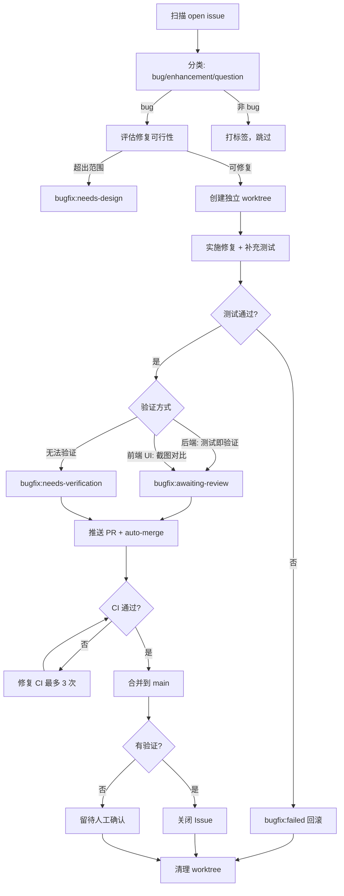

# Bugfix 工作流（GitHub Issues）

ClawBench 的自动化 bugfix 工作流通过任务扫描 GitHub Issues，自动分类、修复、验证并提交 PR。AI 修复在独立 worktree 中隔离进行，每次只修一个 bug，修复必须附带测试用例并通过 CI 覆盖率门禁。这个工作流是项目质量保障体系的关键一环，与人工 review 互补。

## 流程图

### Bugfix 生命周期

## 功能与设计要点

### 功能清单

- **自动分类**：扫描 open issue，AI 判断 bug / enhancement / question 类型并打标签。已有 `bugfix:*` 标签的跳过，避免重复处理
- **可行性评估**：按创建时间排序（先入先出），AI 评估修复范围。超出简单修复标准的打 `bugfix:needs-design` 并评论说明原因
- **Worktree 隔离修复**：在 `.worktrees/bugfix-{number}` 独立 worktree 的 `fix/issue-{number}` 分支上修复，不影响主工作区
- **测试强制**：每个 bug fix 必须附带针对性测试用例（Go `*_test.go` 或前端 `.test.ts`），CI 覆盖率门禁强制执行
- **分级验证**：后端 bug 以测试通过为验证；前端 UI bug 使用浏览器自动化截图对比；无法验证的打 `bugfix:needs-verification` 留给人工
- **PR + CI 流程**：修复通过 `gh pr create` 提交，打 `auto-merge` 标签。轮询 CI 状态，失败时在同一 worktree 修复（最多 3 次）。CI 通过后自动 squash 合并
- **Issue 状态联动**：验证通过的 bug 在 PR 合并后自动关闭；无法验证的保留 open 等人工确认

### 标签体系

| 标签 | 含义 | 打标签者 |
|------|------|---------|
| `bug` | bug 类型问题 | AI 分类 / 人工 |
| `bugfix:in-progress` | AI 已认领，正在修复 | AI |
| `bugfix:awaiting-review` | 已修复，待验收 | AI |
| `bugfix:needs-design` | 需架构设计，超出自动修复范围 | AI |
| `bugfix:failed` | 自动修复失败 | AI |
| `bugfix:needs-verification` | 已修复但 AI 无法验证 | AI |

### 设计要点

- **每次只修一个 bug**：降低风险，避免多修复互相干扰。修复失败的 issue 留给下一轮或人工处理
- **Worktree 保证隔离**：修复在独立 worktree 中进行，主工作区不受影响。无论修复成功或失败，worktree 必须清理
- **最小化修复原则**：只改必要代码，不做无关重构、不修改文档。减少引入新问题的风险
- **放弃标准显式化**：改动 >5 文件、涉及跨层架构、涉及核心流程重构、方案不确定——这些信号表明需要人工介入而非自动修复
- **CI 是硬门槛**：修复必须通过 CI 的覆盖率门禁和全部检查。CI 失败时允许最多 3 次修复尝试，超过则标记 `bugfix:failed`
