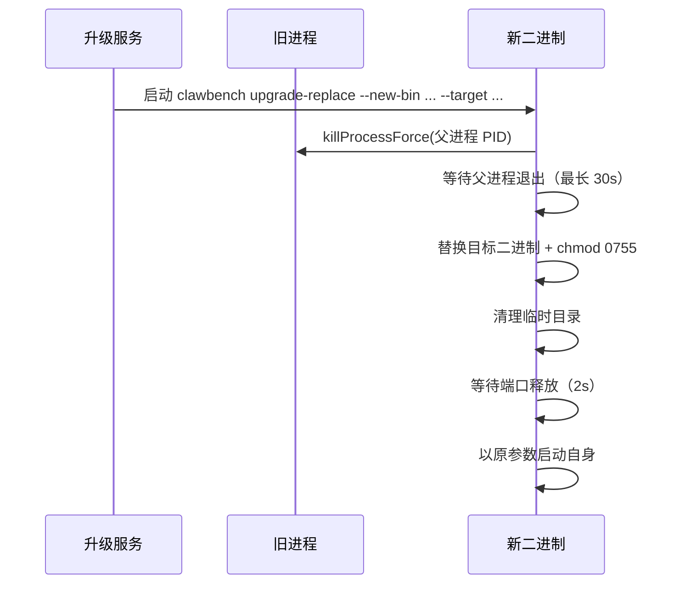

# CLI 子命令

ClawBench 二进制兼具双重角色：无子命令时启动 Web 服务器；带子命令时作为独立工具运行。

目前**只剩一个子命令 `upgrade-replace`**，它是应用自升级的内部机制，由升级服务作为子进程启动，用户不应直接调用。

> **历史**：曾提供 `clawbench task` 与 `clawbench rag` 两个业务子命令，供 AI 智能体自助管理定时任务、检索历史对话。它们本质是 REST 端点的 HTTP 薄封装（业务逻辑全在服务端 handler）。现已移除——内置斜杠命令改为让 AI 直接调用本地 HTTP API，接口说明由嵌入的 OpenAPI 规格渲染（见 [API 文档](../api/README.md)）。这样消除了「提示词描述接口」与「CLI 定义接口」两处手写描述必然脱节的根因。

## 流程图

### upgrade-replace 执行链路

## 功能与设计要点

### 功能清单

- **二进制替换（upgrade-replace）**：杀旧进程 → 替换二进制 → 清理临时文件 → 启动新二进制。参数：`--new-bin`、`--target`、`--tmp-dir`，以及透传的服务器参数（`--data-dir`/`--port`/`--host`）

### 设计要点

- **upgrade-replace 平台差异**：Unix 使用 SIGKILL 和进程组；Windows 使用 taskkill 和 OpenProcess。升级服务的跨平台复杂性隔离在子命令内部
- **进程内 FRP 与 SSH**：不需要独立子命令，均以 Go 库形式运行在主进程内

## 配置路径查找

`FindConfigPath` 位于 `internal/platform/config_path.go`（此前在 `internal/cli`）。它并非 CLI 专用——`cmd/server/main.go` 在启动时用它定位 `config.yaml`，只是历史上恰好被业务 CLI 复用。按优先级查找：

1. `<DataDir>/config/config.yaml`（数据目录）
2. `config/config.yaml`（相对 CWD 的标准布局）
