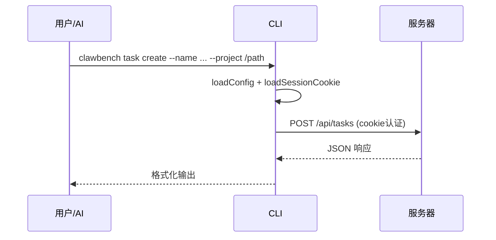
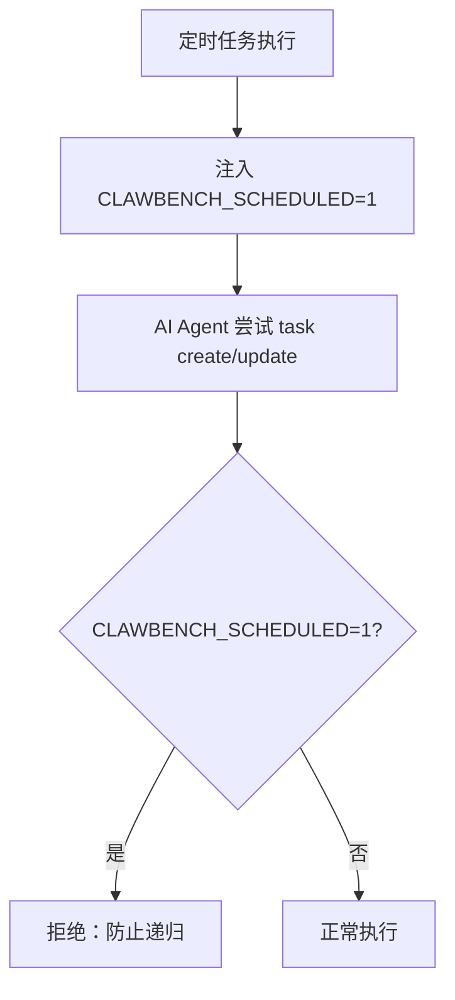

# CLI 子命令

ClawBench 二进制兼具双重角色：无子命令时启动 Web 服务器；带子命令时作为 HTTP 客户端与运行中的服务器通信。所有 CLI 操作都通过 localhost HTTP API 路由，而非直接访问数据库——避免 SQLite 并发冲突，业务逻辑和校验统一在服务端。AI Agent 通过 `clawbench task` 和 `clawbench rag` 子命令自助管理定时任务和搜索历史对话。

## 流程图

### CLI 请求链路

### 防递归守卫

## 功能与设计要点

### 功能清单

- **定时任务管理（task）**：11 个子命令覆盖完整生命周期——create、list、get、update、delete、pause、resume、trigger、list-exec、delete-exec、list-agents。所有操作需要 `--project` 限定项目范围
- **RAG 搜索（rag）**：3 个子命令——search（语义/全文混合搜索历史对话）、message（按 ID 获取完整消息）、session（获取会话全部消息）。搜索排除 thinking 和 tool_use 块，message 和 session 返回完整内容
- **二进制替换（upgrade-replace）**：内部子命令，由升级服务作为子进程启动。杀旧进程→替换二进制→清理临时文件→启动新二进制。用户不应直接调用
- **@path 文件读取**：`--prompt` 参数支持 `@path` 语法，读取文件内容作为 prompt 值。避免 shell 转义和参数长度限制
- **防递归守卫**：定时任务执行时注入 `CLAWBENCH_SCHEDULED=1` 环境变量，CLI 检测到后拒绝 task create/update——防止 AI Agent 无限创建任务（ISS-031）
- **JSON 输出**：所有 CLI 输出为 JSON 格式，成功返回 `{"ok": true, ...}`，失败返回 `{"ok": false, "error": "..."}`，便于脚本解析
- **结构化帮助**：自定义帮助系统提供一致的格式化输出，含用法、参数说明（必填/默认值标注）、示例

### 设计要点

- **HTTP 路由而非直接 DB 访问**：CLI 是纯 HTTP 客户端，不直接操作 SQLite。业务逻辑集中在服务端，CLI 只负责参数解析和结果展示——避免多进程并发写入数据库
- **Cookie Token 认证**：CLI 从 `<DataDir>/cookie-token` 读取服务端生成的随机令牌，设置为作用域 Cookie（含端口号以支持多实例）。令牌与密码哈希解耦，修改密码不影响 CLI 认证
- **localhost 旁路 + 自签名 TLS**：CLI 连接 localhost，自动信任自签名证书。CLI 会主动携带 Cookie Token，因此不依赖 localhost 旁路也能工作
- **参数重排绕过 Go flag 限制**：Go 标准库 `flag` 在首个位置参数后停止解析。CLI 自动将标志参数重排到位置参数前，使 `clawbench task update 1 --prompt "hello"` 正常工作
- **@path 项目范围约束**：指定 `--project` 时，`@path` 只能读取项目目录内的文件，经过 symlink 解析后校验——防止 AI Agent 读取系统任意文件
- **upgrade-replace 平台差异**：Unix 使用 SIGKILL 和进程组；Windows 使用 taskkill 和 OpenProcess。升级服务的跨平台复杂性隔离在子命令内部
