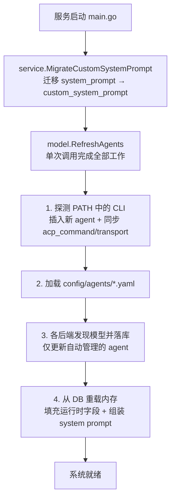
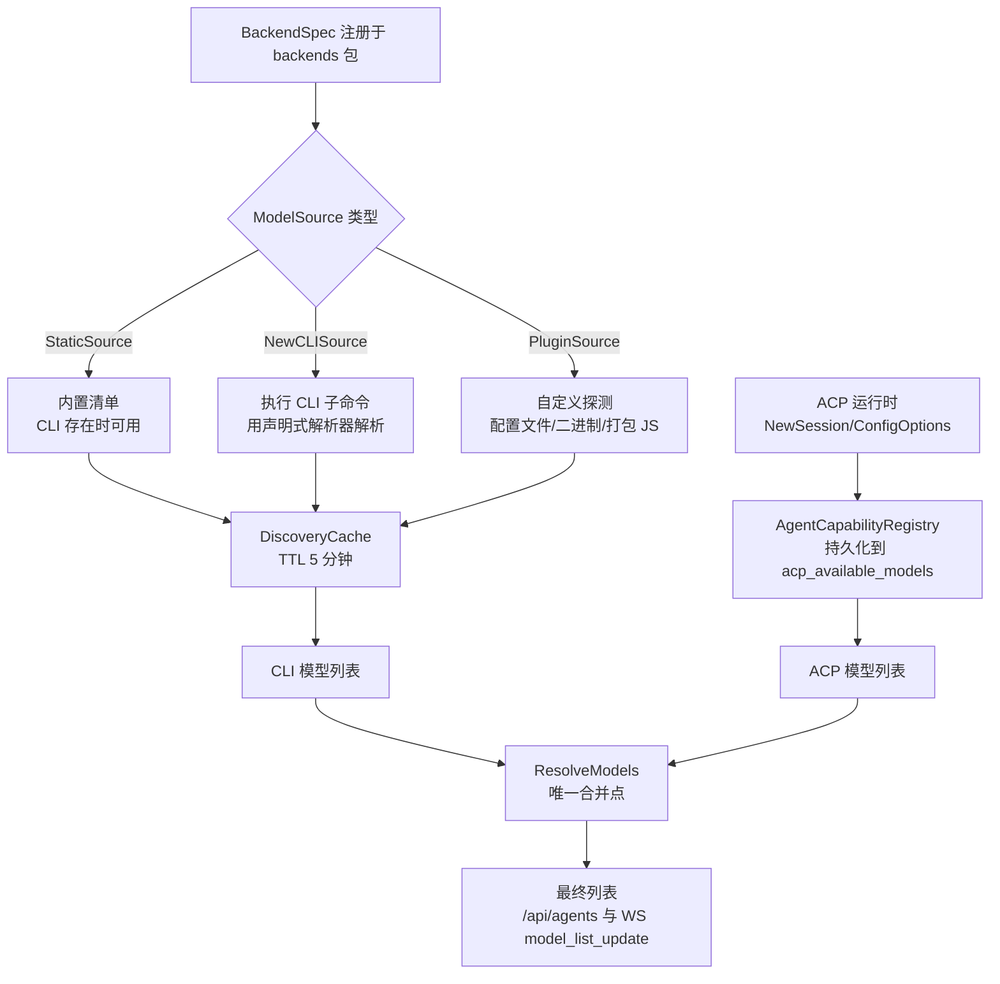

# 配置与自动发现

ClawBench 支持零配置启动：安装 CLI 工具后直接运行 `./clawbench`，系统自动发现可用的 AI 后端和模型并应用默认配置。首次访问时[欢迎面板](../features/setup-wizard.md)展示检测结果和安装入口。手动配置是可选增强；Agent 以数据库存储为主，YAML 用于手动定义的特殊 Agent。

## 流程图

### 启动时自动发现流程

`RefreshAgents`（`internal/model/refresh.go`）是**唯一**的发现入口，启动与
`POST /api/agents/rescan` 都调用它。它取代了原先的五步串行流程
（`SyncDiscoverAgentsDB` → `LoadYamlAgents` → `SyncDiscoverModels` →
`MigrateCustomSystemPrompt` → `MergeDiscoveredDataDB` → `AsyncRefreshModelCache`）：
那套流程每一步都各自查库、各自重载内存，同一批发现探测在一次启动中跑两遍，
且"加载 agent 到内存并组装 prompt"有两份独立实现。

### 模型来源与解析

## 功能与设计要点

### 功能清单

- **零配置启动**：没有 `config.yaml` 也能运行，系统自动填充所有默认值（端口、密码、TTS 引擎等）。`config.yaml` 是可选的增强，不是必须的前置步骤
- **首次访问欢迎面板**：用户首次访问时显示 `WelcomeOverlay`（不是分步向导）。[WelcomeOverlay 详情](../features/setup-wizard.md)。Agent 创建通过自动发现或 `AgentInstallDialog` 完成，不存在 `/api/setup/*` 端点
- **Agent 自动发现**：启动时检测 PATH 中是否存在 AI CLI 工具，为新发现的工具自动在数据库中创建 Agent（含 ACP 命令检测，即检查后端规格中的 `AcpCommand` 字段）。用户安装新 CLI 后重启即自动识别
- **双传输支持**：Agent 的 `Transport` 字段（"cli" / "acp-stdio"）决定使用哪种传输模式。ACP 支持的 Agent 自动设置 `acp_command`，用户可以在会话中切换传输方式
- **Model 自动发现**：每个后端在自己的包内注册一个 `model.ModelSource`（`RegisterModelSource`），共三种形态：
  - `StaticSource` —— 内置清单，仅在该 CLI 存在时可用（copilot / kimi / mimo）
  - `NewCLISource` —— 执行 CLI 子命令并用共享解析器解析（antigravity / deepseek / grok / opencode / pi）
  - `PluginSource` —— 自定义探测，应对单一命令无法覆盖的布局（codebuddy 读 product JSON 与运行时缓存、codex 读缓存并扫描二进制字符串、claude 扫描二进制 + 读取 settings.json 覆盖、vecli 扫描打包 JS、qoder 读本地缓存）

  发现结果由 `DiscoveryCache` 按后端缓存 5 分钟；显式刷新（`refresh-models` / `rescan`）会先失效缓存再重新探测。内置清单集中在 `internal/model/catalogs.go`，更新清单是单文件改动
- **模型列表由服务端合并**：`ResolveModels`（`internal/model/modelcatalog.go`）是唯一的合并点。规则：
  - **具体 ACP 列表在存在时对成员资格有权威性** —— agent 最清楚自己能跑哪些模型；CLI 列表可能过时（端点被重定向、模型在服务端下线），ACP 未上报的 CLI 模型会被剔除
  - **档位别名（tier alias）不参与成员资格判定**。claude 经 ACP 上报的是 `opus`/`sonnet`/`haiku` 这类**档位** ID，其显示名携带被重定向后的真实模型；CLI 发现的是 `claude-sonnet-4-6` 这类具体 ID，两者 ID 永不相等。若把别名列表也当作成员资格依据，会剔掉全部 CLI 模型、只留若干条显示同名真实模型的别名条目（这正是历史上 Issue #404 的问题）。因此别名改为**对齐到对应的 CLI 骨架条目**：保留具体 ID（CLI 仍能识别），仅取其显示名。CLI 骨架无法代表的别名仍会追加，避免用户可选档位静默丢失；元档位 `default` 是回退标记而非模型，始终跳过
  - **CLI 列表提供顺序与名称**；同名 ID 时 ACP 的显示名优先
  - ACP 独有的具体模型按 ACP 顺序追加
  - 恰好一个模型是默认：会话当前模型 > CLI 默认标记 > 列表首项

  前端不再做任何合并，只渲染后端给出的 `resolvedModels`。未经合并的纯 CLI 列表通过 `cliModels` 一并下发，供切换到 CLI 传输时直接渲染。

  **两条下发通道同构**（`internal/ai/acp_events.go` 的 `EnrichModelList` 是唯一实现）：
  - `GET /api/agents` → `agents[].models` / `agents[].cliModels`，以及 `acpStates[].modelListState.{resolvedModels,cliModels}`
  - `GET /api/ai/chat` → `modelListState.{models,resolvedModels,cliModels}`（新建会话从不与 ACP 通信，其模型列表只能来自这里，由 agent 级能力注册表解析；CLI 会话不返回该字段）
  - WS `model_list_update` → 同一组字段

  三者形状必须一致：此前 `/api/ai/chat` 只返回原始 ACP 列表，任何只消费 `models` 的客户端都会丢掉全部 CLI 模型。当 agent 没有 CLI 列表可合并时，`resolvedModels` 为空但 `models` 仍返回——整条列表丢失比未合并且更糟。
- **ACP 模型持久化**：ACP 上报的模型列表写入 `agents.acp_available_models`，因此重启后仍然可见。此前它只存在于内存，导致同一 agent 的模型列表在重启前后跳变（首个 ACP 会话前是 CLI 列表，之后是 ACP 列表）
- **后台模型刷新**：`AsyncRefreshModelCache` 已移除；模型列表随启动时的 `RefreshAgents` 一次性发现并落库，之后由 `POST /api/agents/rescan` 或单个 agent 的 `refresh-models` 显式刷新
- **用户配置优先**：用户手动定义的模型列表不会被自动发现覆盖（`models_auto_detected = 0` 且列表非空即受保护）；自动管理的 agent 保持其自动管理状态，该标记不是单向闩锁
- **运行时连通性与升级**：前端 `useConnectivityTest` 检查服务连通性；`useUpgrade` 调用 `/api/upgrade/check`、`/api/upgrade/start` 和 `/api/upgrade/status` 完成版本检查、启动升级和进度查询，三个端点均要求认证；`useSystemResources` 轮询 `GET /api/system/resources` 获取 CPU、内存、磁盘、网络和负载指标，用于设置页资源监控（详见[系统资源监控](../features/system-resources.md)）
- **供应商注册表**：内置 27 个 LLM 供应商规格（含 minimax / minimax-cn）。供应商规格 `ProviderSpec` 只描述 Chat/Models 端点与 API 格式，不含模型清单；Agent 的模型列表由后端通过 `RegisterModelSource()` 动态发现，或由用户手动定义。运行时可通过 `POST /api/agents/rescan` 重新扫描 PATH
- **API 密钥加密存储**：LLM 供应商的 API 密钥使用 AES-256-GCM 加密后存储，加密密钥由登录密码经 HKDF-SHA256 派生。`agent_api_keys` 表和 `crypto.go` 已移除，API Key 加密功能保留用于自定义 Agent 的密钥管理
- **绿色便携部署**：所有运行时数据在 `.clawbench/` 目录下，删除即干净卸载，拷贝二进制目录即可多实例部署。不需要系统级安装
- **TLS 证书自动发现**：HTTPS 启用方式从手动配置 `enabled`/`cert_file`/`key_file` 改为自动发现证书目录（`tls.cert_dir`，默认 `<DataDir>/config/tls`）。`ResolveTLSCerts` 扫描目录中的证书文件，按优先级匹配：Let's Encrypt 风格（`fullchain.pem` + `privkey.pem`）→ 通用（`cert.pem` + `key.pem`）→ 合并文件（`combined.pem`）。找到有效证书对即启用 HTTPS，否则回退 HTTP。旧配置 `tls.enabled`/`tls.cert_file`/`tls.key_file` 仍可读取并自动迁移到 `cert_dir`
- **配置连通性测试**：`POST /api/config/test` 端点对设置表单中的各服务做即时连通性验证。支持 8 个类别：FRP、文本摘要、语音摘要、RAG、钉钉、飞书、端口映射、TTS。测试使用表单当前值（可能未保存），无需先保存配置即可验证连接性——降低配置试错成本
- **多实例 Cookie 隔离**：`ScopedCookieName()`（`internal/model/config.go`）为非默认端口实例的 Cookie 名添加前缀——端口 20300 的 `clawbench_session` 变为 `cb20300_clawbench_session`。默认端口 20000 保持原名称（向后兼容）。前端 `scopedCookieKey()`（`web/src/i18n/index.ts`）镜像相同逻辑。不同端口实例可安全共存于同一浏览器
- **版本化 Schema 迁移**：数据库迁移采用列检测模式（`internal/service/database.go`）——每条迁移通过 `pragma_table_info('table')` 查询列是否已存在，不存在才执行 `ALTER TABLE`。此方式天然幂等，无需 `schema_migrations` 版本表或 dirty flag。`InitDB()` 先用 `CREATE TABLE IF NOT EXISTS` 创建最新表结构，再依次运行增量迁移（如 `summary` 列、`transport` 列、`custom_system_prompt` 列、ACP 相关列含 `acp_available_models`、`indexed` 列用于 RAG 索引进度跟踪等）。数据迁移由独立函数处理（`MigrateMetadataFromContent`、`MigrateTaskExecutionSummaries`、`MigrateToolCallsFromContent`）
- **覆盖率门禁**：两层强制执行，每次 PR/push 到 main 分支触发（`scripts/check-go-coverage.sh`、`scripts/check-frontend-coverage.sh`、`scripts/check-android-coverage.sh`）：
  - **Tier 1 项目门禁**：当前包覆盖率 `>= 基线% - 1.5%`（`TIER1_TOLERANCE = 1.5`）
  - **Tier 2 Diff 覆盖率**：变更行覆盖率 `>= 80%`（`DIFF_THRESHOLD = 80.0`）
  - 基线从 CI artifact 下载；`--update` 标志自动更新基线文件。豁免文件列表排除无法单元测试的文件。本地 pre-push 检查集成（`scripts/pre-push-checks.sh`）

### 设计要点

- **Agent 存储以 DB 为主**：Agent 配置存储在数据库（`agents` 表），YAML 用于手动定义的特殊 Agent（如 E2E 测试使用的 acp-mock）。DB 优先；自动发现只更新基础设施字段（`acp_command`、`transport`），用户自定义的 `name`、`command` 不被覆盖
- **单一发现入口**：`RefreshAgents` 是唯一的发现与重载路径。它按固定顺序执行探测 CLI → 加载 YAML → 发现模型 → 重载内存，顺序本身承载语义（例如必须先探测才能给新装的后端发现模型）。`service.LoadAgentsIntoMemory` 委托给 `model.LoadAgentsIntoMemoryFromDB`，因此"加载并组装 prompt"只有一份实现
- **默认项目持久化**：`recent_projects.is_default` 标记服务端默认项目。读取时依次回退到显式默认项目、最近访问项目、用户主目录和首个可用根路径，确保首次启动和旧数据均可用
- **ACP 能力持久化**：Agent 的 ACP 相关属性（`transport`、`acp_command`、可用模式、思考深度、命令、模型等）持久化在 `agents` 表中，重启后无需重新发现——这些信息在首次连接时从 ACP Initialize 握手中提取并缓存
- **供应商模型注册**：模型列表通过各后端的 `RegisterModelSource()` 在 `init()` 注册，`model.DiscoverModels` 只走这张注册表（没有静态声明的已知模型字段）。运行时可通过 `POST /api/agents/rescan` 重新触发 PATH 扫描；模型数据不依赖 `<dataDir>/provider_models.json` 或生成脚本
- **API 密钥与密码联动**：加密密钥由登录密码派生。`agent_api_keys` 表和 `crypto.go` 已移除，密码修改不再触发 API Key 加密轮换
- **发现结果缓存**：`DiscoveryCache` 按后端缓存探测结果（含失败结果）5 分钟。探测要执行 CLI 或读取数 MB 的二进制，缓存让启动路径与手动刷新共用同一次工作。显式刷新会先失效缓存
- **ACP 运行时模型验证**：设置 preferred_model 时，验证范围包含 CLI 发现的模型和 ACP 运行时返回的模型（`GetModelListState`），ACP-only 模型（如 Kimi kimi-k3）不再因 CLI 模型列表中不存在而报 `InvalidModelForAgent`
- **部分后端无 CLI 模型列表**：VeCLI、Qoder 等后端没有 `--list-models` 类命令，其发现函数只能返回内置默认清单或读取本地缓存，也可由用户手动提供模型。ACP 后端优先使用 ACP 提供的模型列表（覆盖 CLI 发现结果）——ACP 模型列表更准确
- **发现失败的原因随返回值传递**：`ModelSource.Discover` 返回 `(models, detail)`，detail 说明探测了哪些位置。此前 codebuddy 用进程级全局变量记录失败原因，并发刷新会互相串台；现在原因随调用返回，不会误归因
- **Codex 的多级发现**：Codex 无列模型命令且发布的是 stripped Rust 二进制，因此按可信度依次尝试——先读 CLI 缓存的完整模型目录（`~/.codex/models_cache.json`，含账号可用清单），再扫描二进制字符串，最后落到 `internal/model/catalogs.go` 中的内置清单。原先的 state SQLite 分支是死代码（定位到文件后无条件 `return nil`），已删除
