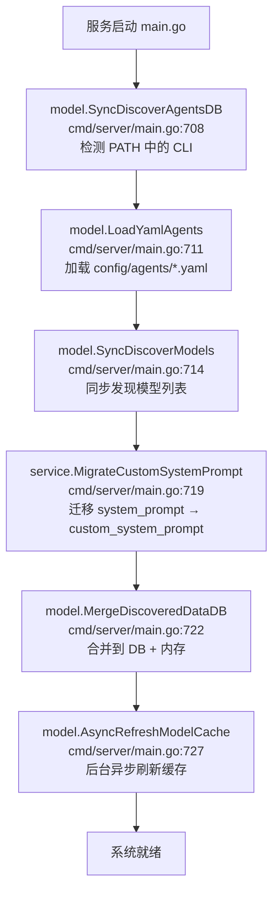
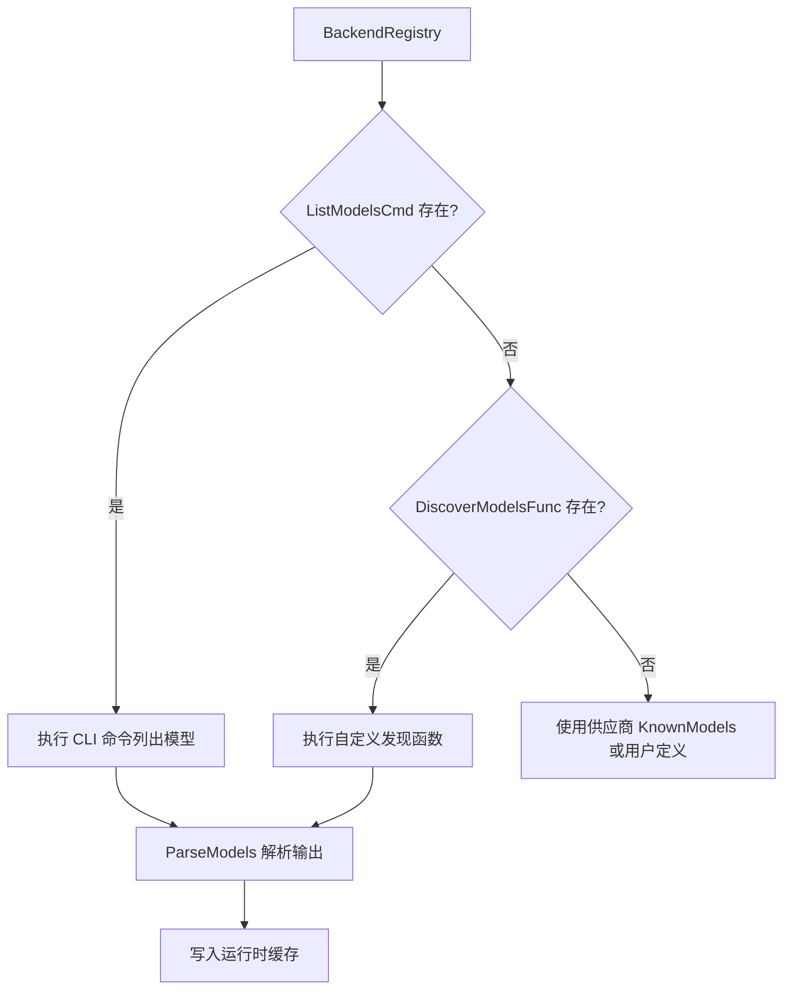

# 配置与自动发现

ClawBench 的核心理念之一是"零配置启动"——安装 CLI 工具后直接运行 `./clawbench`，系统自动发现可用的 AI 后端和模型，生成最小配置，用户即可开始使用。首次启动时[设置向导](../features/setup-wizard.md)引导用户快速创建 Agent。手动配置是可选的增强，不是必须的前置步骤。Agent 存储完全由数据库驱动，YAML 仅用于手动定义的特殊 Agent。这套自动发现机制让系统的使用门槛降到了最低。

## 流程图

### 启动时自动发现流程

### Agent/Model 发现策略

## 功能与设计要点

### 功能清单

- **零配置启动**：没有 `config.yaml` 也能运行，系统自动填充所有默认值（端口、密码、TTS 引擎等）。`config.yaml` 是可选的增强，不是必须的前置步骤
- **首次访问欢迎面板**：用户首次访问时显示 `WelcomeOverlay`（不是分步向导）。[WelcomeOverlay 详情](../features/setup-wizard.md)。Agent 创建通过自动发现或 `AgentInstallDialog` 完成，不存在 `/api/setup/*` 端点
- **Agent 自动发现**：启动时检测 PATH 中是否存在 AI CLI 工具，为新发现的工具自动在数据库中创建 Agent（含 ACP 命令检测，即检查后端规格中的 `AcpCommand` 字段）。用户安装新 CLI 后重启即自动识别
- **双传输支持**：Agent 的 `Transport` 字段（"cli" / "acp-stdio"）决定使用哪种传输模式。ACP 支持的 Agent 自动设置 `acp_command`，用户可以在会话中切换传输方式
- **Model 自动发现**：通过 CLI 命令（如 `deepseek models`）或 `BackendSpec.RegisterDiscoverModelsFunc` 注册的自定义发现函数发现可用模型。当 `ListModelsCmd` 为空时使用 `KnownModels` 或用户手动定义；ACP 后端优先用 ACP 返回的模型列表（覆盖 CLI 发现结果）。结果缓存到 SQLite 与内存
- **后台模型刷新**：启动后后台定期刷新模型缓存，更新自动发现的 Agent 的模型列表。新增模型无需重启
- **用户配置优先**：用户手动定义的模型列表不会被自动发现覆盖，标志区分用户定义和自动发现。用户对配置有最终控制权
- **供应商注册表**：内置 27 个 LLM 供应商规格（含 minimax / minimax-cn），已知模型从 `BackendSpec.KnownModels` 静态声明或后端 `RegisterDiscoverModelsFunc()` 在 `init()` 动态注册（`internal/model/`），运行时可通过 `POST /api/agents/rescan` 触发 `SyncDiscoverAgentsDB` 重新扫描 PATH 注：早期版本曾尝试从 `models.dev API` 生成模型文件，**当前代码不依赖**该机制。向导根据供应商规格提供模型列表、API 格式和验证端点
- **API 密钥加密存储**：LLM 供应商的 API 密钥使用 AES-256-GCM 加密后存入 `agent_api_keys` 表，加密密钥由登录密码经 HKDF-SHA256 派生。密码变更时自动轮换
- **绿色便携部署**：所有运行时数据在 `.clawbench/` 目录下，删除即干净卸载，拷贝二进制目录即可多实例部署。不需要系统级安装
- **多实例 Cookie 隔离**：`ScopedCookieName()`（`internal/model/config.go:215-224`）为非默认端口实例的 Cookie 名添加前缀——端口 20300 的 `clawbench_session` 变为 `cb20300_clawbench_session`。默认端口 20000 保持原名称（向后兼容）。前端 `scopedCookieKey()`（`web/src/i18n/index.ts:8-14`）镜像相同逻辑。不同端口实例可安全共存于同一浏览器
- **版本化 Schema 迁移**：数据库迁移采用列检测模式（`internal/service/database.go:125-692`）——每条迁移通过 `pragma_table_info('table')` 查询列是否已存在，不存在才执行 `ALTER TABLE`。此方式天然幂等，无需 `schema_migrations` 版本表或 dirty flag。`InitDB()` 先用 `CREATE TABLE IF NOT EXISTS` 创建最新表结构，再依次运行增量迁移（如 line 398 `summary` 列、line 419 `transport` 列、line 460 `custom_system_prompt` 列、line 606-649 ACP 相关列等）。数据迁移由独立函数处理（`MigrateMetadataFromContent` line 697、`MigrateTaskExecutionSummaries` line 825、`MigrateToolCallsFromContent` line 904）
- **覆盖率门禁**：两层强制执行，每次 PR/push 到 main 分支触发（`scripts/check-go-coverage.sh`、`scripts/check-frontend-coverage.sh`、`scripts/check-android-coverage.sh`）：
  - **Tier 1 项目门禁**：当前包覆盖率 `>= 基线% - 1.5%`（`TIER1_TOLERANCE = 1.5`，`check-go-coverage.sh:88`）
  - **Tier 2 Diff 覆盖率**：变更行覆盖率 `>= 80%`（`DIFF_THRESHOLD = 80.0`，`check-go-coverage.sh:89`）
  - 基线从 CI artifact 下载；`--update` 标志自动更新基线文件。豁免文件列表（line 91-129）排除无法单元测试的文件。本地 pre-push 检查集成（`scripts/pre-push-checks.sh:101,110,131`）

### 设计要点

- **Agent 存储以 DB 为主**：Agent 配置存储在数据库（`agents` 表，由向导创建或自动发现），YAML 仅用于手动定义的特殊 Agent（如 E2E 测试用的 acp-mock）。DB 优先，`source` 字段区分 "auto"（自动发现）和 "setup"（向导创建）
- **ACP 能力持久化**：Agent 的 ACP 相关属性（`transport`、`acp_command`、可用模式、思考深度、命令等）持久化在 `agents` 表中，重启后无需重新发现——这些信息在首次连接时从 ACP Initialize 握手中提取并缓存
- **供应商模型注册**：已知模型列表通过各后端的 `RegisterDiscoverModelsFunc()` 在 `init()` 注册（`internal/model/`），或通过 `BackendSpec.KnownModels` 静态声明。运行时可通过 `POST /api/agents/rescan` 重新触发 `SyncDiscoverAgentsDB` 扫描 PATH。注：`<dataDir>/provider_models.json` 与 `scripts/fetch-provider-models.sh` 在当前代码中**不存在**，如在历史文档中遇到视为过期
- **API 密钥与密码联动**：加密密钥由登录密码派生，密码变更触发全量密钥轮换——修改密码不会导致 API 密钥失效
- **模型缓存避免重复发现**：首次发现结果写入本地缓存，后续启动直接读取缓存。同步发现只在首次运行，之后由后台异步刷新
- **部分后端无 CLI 模型列表**：Codex、VeCLI、Qoder 等后端不支持 `--list-models` 类命令，模型由供应商注册表的 `KnownModels` 或用户手动提供。ACP 后端优先使用 ACP 提供的模型列表（覆盖 CLI 发现结果）——ACP 模型列表更准确
