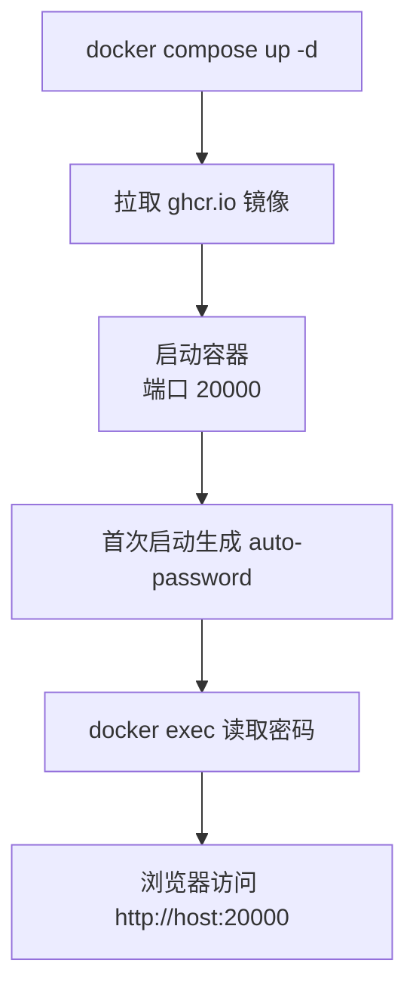
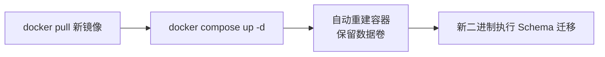

# Docker 部署

ClawBench 提供单二进制 + 嵌入前端的 Docker 镜像，一条 `docker compose up` 即可运行。所有运行时状态写入 Docker 卷，容器销毁后数据不丢失。容器内自升级可用但**不推荐**：升级界面会提示优先拉取新镜像，因为镜像才是版本的权威来源——这与[应用自升级](self-upgrade.md)的二进制替换策略形成互补。

## 流程图

### Docker 部署流程

### 容器升级流程

## 功能与设计要点

### 功能清单

- **一键部署**：`docker compose up -d` 拉取镜像并启动服务，默认端口 20000。首次启动自动生成密码，通过 `docker exec` 读取
- **数据持久化**：命名卷 `clawbench-data` 挂载到 `/data`，SQLite 数据库、配置、日志、RAG 向量索引、TTS 缓存全部保存在卷中。容器重建后数据不丢失
- **GHCR 镜像发布**：每个版本标签自动推送 `ghcr.io/clawbench-dev/clawbench:latest` 和版本标签镜像到 GitHub Container Registry，支持 amd64 和 arm64 双架构
- **构建镜像**：`Dockerfile.build` 提供可复现的 Linux 静态编译环境，供无 Go 工具链的开发者或 CI 使用
- **容器升级**：拉取新镜像后 `docker compose up -d` 自动重建容器，数据卷保留。新二进制启动时自动执行 Schema 迁移
- **文件配置**：配置文件放在 `/data/.clawbench/config/config.yaml`（卷内），支持全部配置项。不依赖环境变量

### 设计要点

- **单阶段运行时镜像**：运行时镜像基于 Ubuntu 24.04，包含 Node.js（11/12 个 AI Agent 通过 npm 安装）、git（AI Agent 常用）、ca-certificates（HTTPS 通信）和 curl。前端已嵌入 Go 二进制，无需额外前端层
- **容器内自升级（不推荐）**：检测到 Docker/Podman 环境（`/.dockerenv`、`/run/.containerenv` 或 `container` 环境变量）时，升级界面显示提示，建议改用 `docker pull` + `docker compose up -d` 更新镜像。就地升级本身仍可执行（替换容器可写层的二进制并触发重启），但用未更新的镜像重建容器会回退到旧版本，因此镜像拉取才是权威升级路径。`/api/upgrade/check` 返回 `is_docker` 供前端展示该提示
- **容器内强制走就地替换 + 重启策略**：容器（含 Kubernetes）一律按"受托管"处理，跳过自重启子进程路径。该路径在容器里必然失败——PID 1 退出时运行时拆除命名空间，会杀掉等待替换的 `upgrade-replace` 子进程。检测统一由 `platform.IsContainer` / `platform.IsDockerLike` 提供
- **密码通过卷持久化**：auto-password 写入 `/data/.clawbench/auto-password`（卷内），容器重启后密码不变
- **重启策略必须是 always / unless-stopped**：主机重启或 Docker daemon 重启后容器自动恢复（`docker compose stop` 后不自动启动）。该策略同时是**应用内升级的前提**：升级会替换容器可写层中的二进制并以退出码 0 优雅退出，依赖重启策略拉起新版本。`--restart on-failure` 不满足——退出码为 0 不会触发重启，容器会停在停止状态
- **docker-build.sh 一键构建**：本地开发时自动编译二进制、构建镜像、启动容器并显示密码。`--clean` 选项可清除数据卷做干净重置
