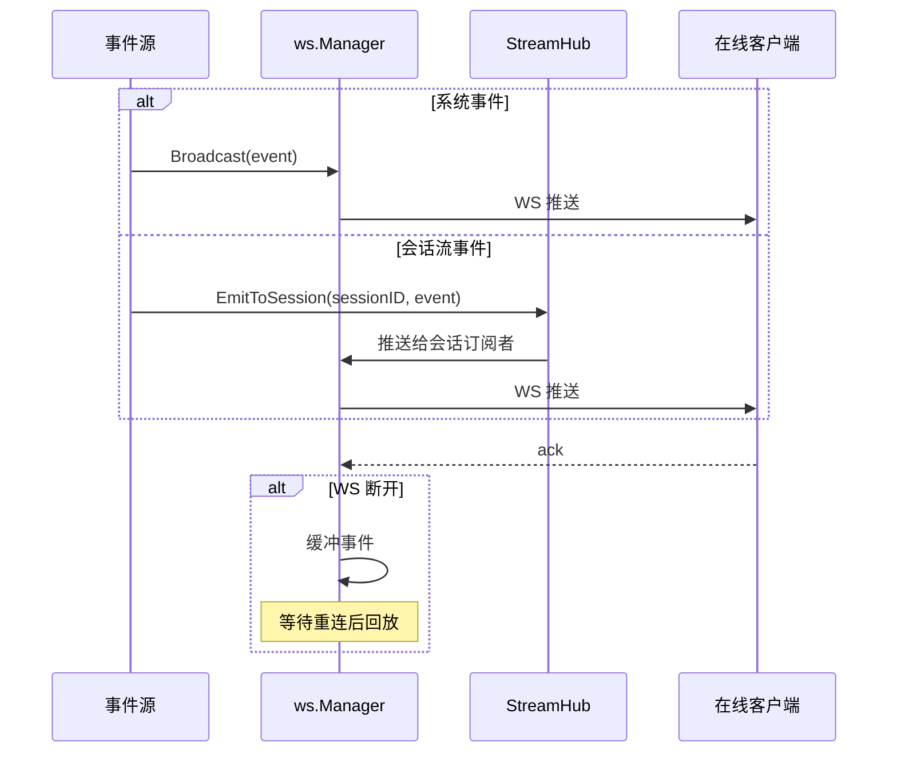
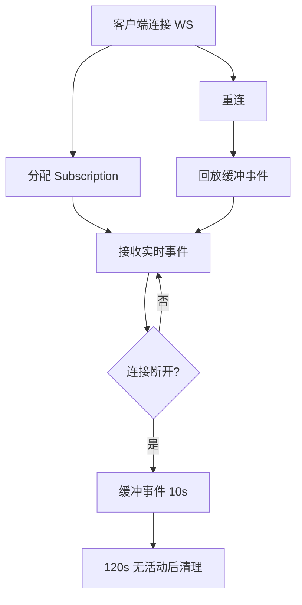

# 事件体系

ClawBench 的事件体系是系统实时性的基础设施——会话状态变更、聊天流、任务更新、权限待审等事件从后端产生，经 WebSocket Manager / StreamHub 推送给在线客户端。聊天流（`ChatStreamData`）由 `StreamHub.EmitToSession` 做会话级扇出；系统事件（`session_update`/`task_update`/`summary_update`）由 `ws.Manager` 广播。客户端通过 `subscribe`/`unsubscribe`/`cancel`/`permission_respond`/`ack`/`pong` 消息与后端交互。

## 流程图

### 事件从产生到推送

### 客户端生命周期

## 功能与设计要点

### 功能清单

- **WebSocket 事件通道**：`/api/ai/events/ws` 统一推送聊天流和系统事件。聊天流事件（`content`/`thinking`/`tool_use` 等 `ChatStreamData`）由 `StreamHub.EmitToSession` 推送；系统事件（`session_update`/`task_update`/`summary_update`/`permission_pending`）由 `ws.Manager` 广播。信号事件（`replay_done`/`thinking_done`/`done`）使用空 payload。`session_update` 的 status 字段区分 running、completed、cancelled、permission_pending、permission_resolved 等状态
- **断线缓冲与回放**：WS 断线后缓冲 10s 内的事件（最多 50 条），重连后自动回放。确保不丢失关键通知
- **摘要推送**：`summary_update` 事件在聊天或任务摘要生成后实时推送，前端 `SummaryToggle` 组件可立即切换显示摘要，无需轮询
- **心跳保活**：服务端每 30 秒发送 ping；连续 10 分钟未收到客户端消息时关闭读取循环，防止半开连接长期占用资源
- **客户端容量限制**：最多 20 个 WS 订阅，防止单个服务端过载

### 设计要点

- **WS 统一通道**：系统事件和聊天流均通过 `/api/ai/events/ws` 发送。WS 的双向通信能力支持 ack、subscribe、cancel 和 permission_respond，并减少客户端需要维护的连接数
- **断线清理超时**：客户端 120s 无活动后清理（可能只是网络抖动）
- **ack 机制用于确认而非可靠投递**：客户端发送 ack 表示已收到事件，但不触发重发。事件缓冲是时间窗口而非确认驱动——简化了服务端逻辑
