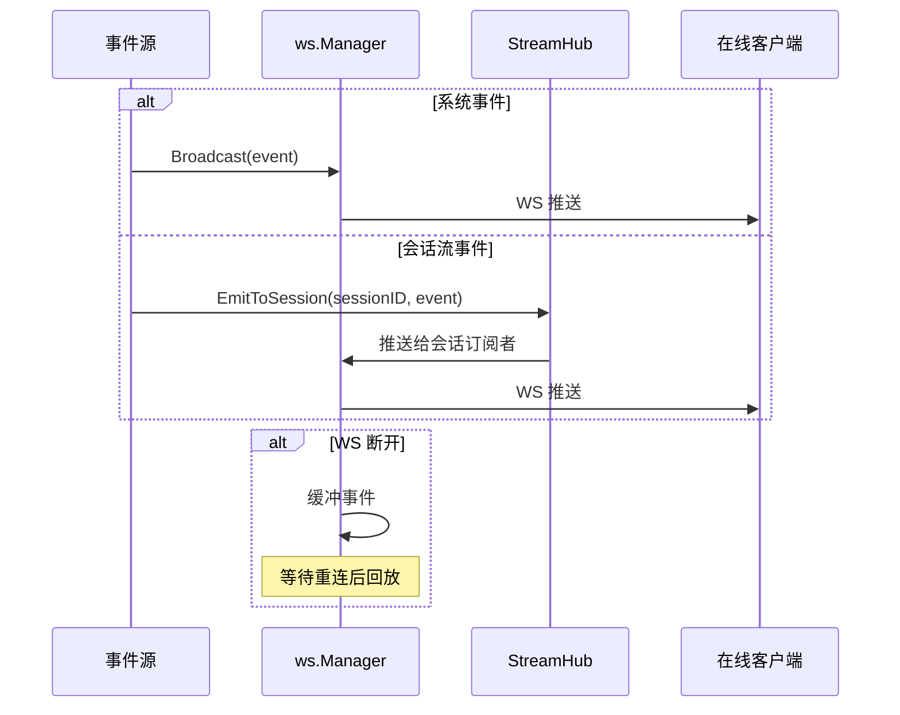
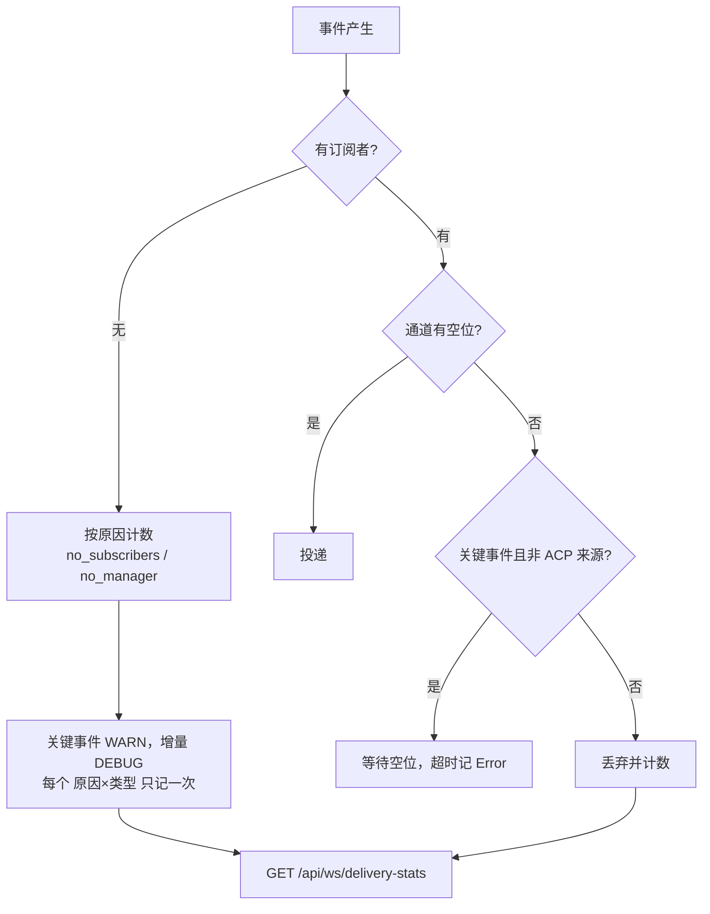
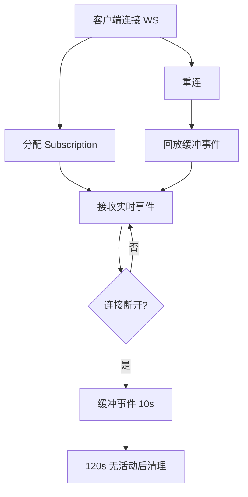

# 事件体系

ClawBench 的事件体系是系统实时性的基础设施——会话状态变更、聊天流、任务更新、权限待审等事件从后端产生，经 WebSocket Manager / StreamHub 推送给在线客户端。聊天流（`ChatStreamData`）由 `StreamHub.EmitToSession` 做会话级扇出；系统事件（`session_update`/`task_update`/`summary_update`）由 `ws.Manager` 广播。客户端通过 `subscribe`/`unsubscribe`/`cancel`/`permission_respond`/`pong`/`metrics_preference` 消息与后端交互。

## 流程图

### 事件从产生到推送

### 投递失败不再是静默的

丢弃计数按原因原子累加，落在热路径上但无锁；日志按 `(原因, 类型)` 去重——09-11 事故中 20 秒内丢了约 9000 条事件，逐条记录会淹没其余日志，因此**计数承载量级、日志承载事实**。在此之前，"UI 卡在缺少终态事件"与"后端根本没发"在日志上完全无法区分。

### 客户端生命周期

## 功能与设计要点

### 功能清单

- **WebSocket 事件通道**：`/api/ai/events/ws` 统一推送聊天流和系统事件。聊天流事件（`content`/`thinking`/`tool_use` 等 `ChatStreamData`）由 `StreamHub.EmitToSession` 推送；系统事件（`session_update`/`task_update`/`summary_update`/`permission_pending`）由 `ws.Manager` 广播。信号事件（`replay_done`/`thinking_done`/`done`）使用空 payload。`session_update` 的 status 字段区分 running、completed、cancelled、permission_pending、permission_resolved 等状态
- **聚类进度推送**：`cluster_progress` 事件通过 `ws.Manager` 广播消息聚类计算的实时进度（阶段、百分比），前端 `MessageClustersDrawer` 展示进度条
- **系统资源推送**：`system_resources` 事件由 `service.MetricsPusher` 按订阅需求推送。客户端用 `metrics_preference` 声明速率（前台 1000ms / 后台 5000ms / 关闭），服务端仅在存在订阅者时采样、按最快请求速率推送，无订阅者即停止。该事件**不走回放缓冲**（1Hz 遥测会挤掉聊天/任务事件），且发送队列满时丢弃而非断连
- **断线缓冲与回放**：WS 断线后缓冲 10s 内的事件（最多 50 条），重连后自动回放。确保不丢失关键通知
- **投递可观测**：`GET /api/ws/delivery-stats` 暴露按原因的丢弃计数（`no_subscribers` / `no_manager`），供排障时区分"事件没发"与"发了但没人收"
- **摘要推送**：`summary_update` 事件在聊天或任务摘要生成后实时推送，前端 `SummaryToggle` 组件可立即切换显示摘要，无需轮询
- **心跳保活**：服务端每 30 秒发送 ping；连续 10 分钟未收到客户端消息时关闭读取循环，防止半开连接长期占用资源
- **客户端容量限制**：最多 20 个 WS 订阅，防止单个服务端过载

### 设计要点

- **WS 统一通道**：系统事件和聊天流均通过 `/api/ai/events/ws` 发送。WS 的双向通信能力支持 subscribe、cancel、permission_respond 和 metrics_preference，并减少客户端需要维护的连接数
- **断线清理超时**：客户端 120s 无活动后清理（可能只是网络抖动）
- **事件缓冲是时间窗口而非确认驱动**：断线期间的事件在服务端按条数缓冲，重连后回放。不依赖客户端逐条确认——简化了服务端逻辑
- **可靠投递按事件语义与来源双层分级**：关键事件（承载状态机终态）在通道满时值得等待，高频增量不值得——丢一条 thinking 用户无感，丢一条 `done` 会让 UI 永久停在 loading。但等待本身也可能致命：ACP 通知由 SDK 单条共享 goroutine 处理、队列有界且溢出会直接关掉连接，因此在该来源上禁止阻塞，否则"丢一个增量"会升级成"连接死亡"。缺任一层判断都会引入更严重的故障
- **可观测性先于可靠性**：先让丢弃变得可计数、可分级记录，再谈如何不丢——否则无法判断一个"UI 卡住"是投递问题还是生产问题
