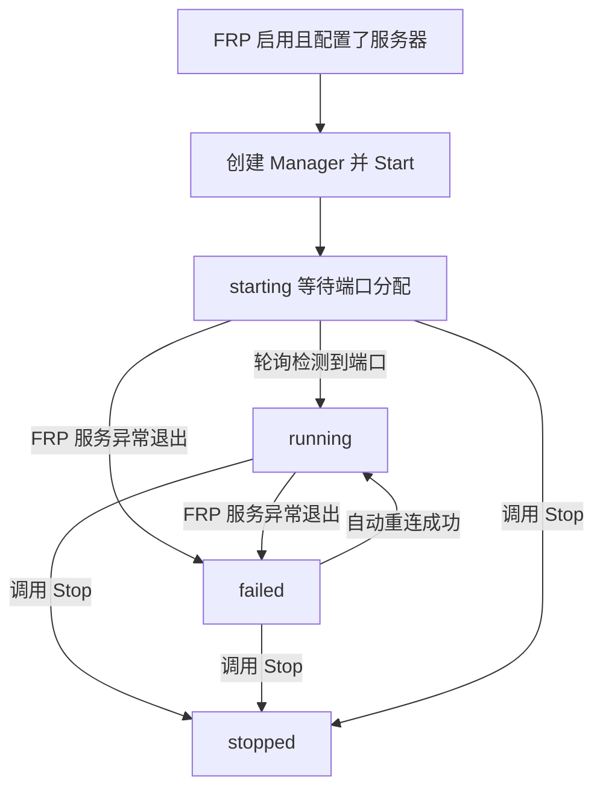
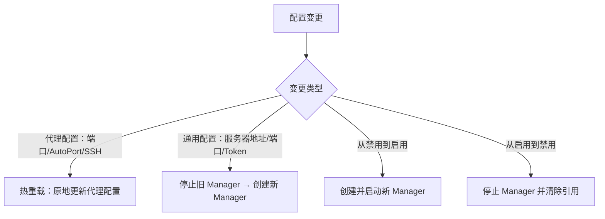

# FRP 隧道

FRP 模块为 ClawBench 提供公网远程访问能力。它运行一个进程内 FRP 客户端，连接用户自建的 FRP 服务器（frps），将本地 Web 界面和可选的 SSH 服务暴露到公网端口。主要场景是让 Android 手机在非局域网环境下也能访问 ClawBench，无需 VPN、路由器端口映射或公网 IP。

## 流程图

### FRP 隧道生命周期

### 配置变更处理

## 功能与设计要点

### 功能清单

- **公网隧道**：通过 FRP 将本地 ClawBench 实例暴露到公网，支持 HTTP Web 界面和可选的 SSH 端口映射。手机不在同一局域网也能正常使用
- **进程内客户端**：FRP 客户端以 Go 库形式运行在 ClawBench 进程内，用户无需单独安装 `frpc` 二进制
- **自动端口分配（AutoPort）**：启用时由 FRP 服务器自动分配可用端口；禁用时用户指定固定端口。实际分配的端口由轮询发现
- **热重载**：代理层配置变更（端口、AutoPort、SSH 开关）无需重启隧道，原地更新代理配置；通用配置变更（服务器地址、端口、Token）需要停止并重建 Manager
- **状态广播**：隧道状态变化时通过 WS `frp_status` 事件推送，前端实时更新 UI，无需轮询
- **双认证级别 API**：`GET /api/frp/info` 返回完整状态（含公网地址），需要认证；`GET /api/frp/status` 仅返回 enabled/running 最小状态，无需认证，供 Android 原生状态栏等场景使用
- **自动重连**：FRP 客户端配置为登录失败不退出，服务器暂时不可达时持续重试，恢复后自动回到 running 状态

### 设计要点

- **Manager 是一次性对象**：Stop 后的 Manager 不可重启，需要创建新实例。这避免了复杂的状态重置逻辑，使生命周期可预测
- **30 秒启动超时 + 优雅降级**：服务启动时最多等待 30 秒隧道就绪，超时仅记录警告，Manager 继续在后台运行——隧道可能稍后成功建立
- **轮询检测而非事件回调**：Manager 每 2 秒轮询 FRP 服务的状态导出器，而非接入 FRP 库的内部事件系统。解耦更简单，代价是最多 2 秒的状态检测延迟
- **TCP 代理 + 压缩**：HTTP 和 SSH 隧道都使用 FRP 的 TCP 代理类型（而非 HTTP 类型），并启用压缩。TCP 类型同时适用于 HTTP 和 SSH 流量，压缩减少移动端带宽消耗
- **SSH 代理按需创建**：仅当 SSH 服务实际运行时才创建 SSH 隧道代理，SSH 未启用则只代理 HTTP
