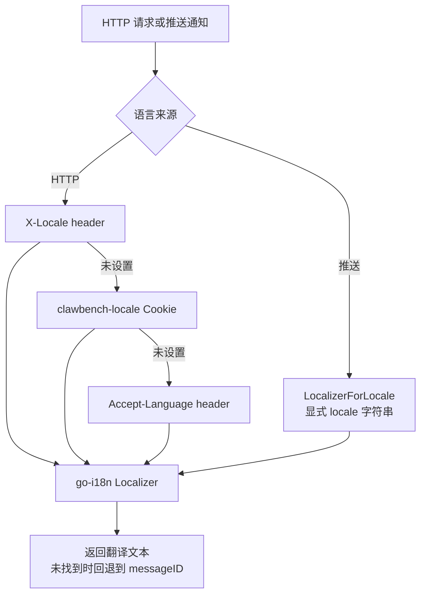

# 国际化（i18n）

ClawBench 的后端 i18n 系统将错误消息和通知文本翻译为用户语言，贯穿 HTTP 错误响应和推送通知两个场景。前端通过 `clawbench-locale` Cookie 传递语言偏好，后端按优先级链解析语言，保证 CLI、Web 和推送通知各自获得正确的本地化文本。

## 流程图

### 语言解析优先级

## 功能与设计要点

### 功能清单

- **HTTP 错误响应本地化**：所有 handler 的 `writeLocalizedErrorf()` 使用 `Localizer(r)` 解析用户语言，返回对应语言的错误消息。CLI 和 Web 客户端都能看到母语错误提示
- **推送通知本地化**：钉钉和飞书推送使用 `LocalizerForLocale(locale)` 创建 Localizer，不受 HTTP 请求上下文限制——推送发生在 IM 回调线程而非 HTTP handler 中，需要独立的语言解析路径
- **双语支持**：嵌入 `active.en.yaml` 和 `active.zh.yaml`（40+ 翻译消息），覆盖常见错误场景（认证失败、会话冲突、配置错误等）
- **Cookie 语言持久化**：前端 `useLocale` composable 将语言偏好写入 `clawbench-locale` Cookie（端口作用域），下次请求自动带上——切换语言不需要每次设置 header
- **回退到 messageID**：翻译缺失时返回 messageID（通常是英文原文），不会产生空白文本或乱码

### 设计要点

- **go-i18n 嵌入式 bundle**：YAML 翻译文件通过 `go:embed` 编译进二进制，不依赖外部文件——部署时无需附带 locale 目录
- **Cookie 使用端口作用域**：`ScopedCookieName("clawbench-locale")` 为非默认端口实例添加前缀，与认证 Cookie 共享隔离逻辑，多实例共存时语言偏好不会混淆
- **推送场景是 i18n 的关键需求**：钉钉/飞书推送面向中国用户，默认使用中文；但服务器可能配置英文 locale。`LocalizerForLocale` 让推送系统独立选择语言，不受 HTTP 请求上下文约束
