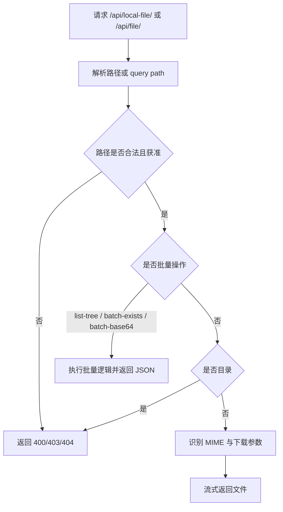

# 本地文件服务

本地文件服务把受控文件路径转换为浏览器可访问的 `/api/local-file/` URL，供文件预览、Markdown 图片、Lightbox、下载和生成媒体展示使用。它必须同时处理路径编码、项目外文件授权、目录拒绝和响应类型，避免把通用文件服务器变成任意路径读取入口。

## 流程图

### 本地路径到浏览器响应

项目内文件可由编码后的 URL 路径访问；需要显式路径参数的场景仍经过服务端路径校验。`download=1` 改变响应处置方式，但不会绕过鉴权或访问边界。批量操作端点（list-tree、batch-exists、batch-base64）返回结构化 JSON，不直接服务文件内容。

## 功能与设计要点

### 功能清单

- **预览文件响应**：为图片、音频、视频、PDF 和 Markdown 内资源返回正确内容类型，使浏览器原生或前端预览器能够直接加载
- **下载模式**：通过 `download=1` 返回附件响应，用户可以保存无法在线预览或需要原始副本的文件
- **路径编码**：逐段编码空格、中文和特殊字符，避免浏览器 URL 解析改变实际文件名
- **生成媒体展示**：AI 生成结果可以使用本地文件 URL 嵌入聊天，不需要把大文件转换为 base64 放进消息正文
- **安全拒绝**：拒绝目录、不存在路径、非法相对路径和未授权的项目外访问
- **目录树列表**：`GET /api/file/list-tree?path=<rel>` 递归列出指定目录下所有文件（含相对路径和大小），用于目录树下载功能
- **批量文件存在检查**：`POST /api/file/batch-exists` 批量检查文件是否存在，返回每个路径的状态（file/dir/none）。支持 glob 字符快捷跳过、`~` 展开、绝对路径
- **批量图片 Base64**：`POST /api/file/batch-base64` 批量读取图片文件并返回 base64 编码，单文件限制 2MB，总响应限制 20MB
- **绝对路径查询**：`?path=` 查询参数支持绝对路径，用于项目外文件访问
- **强制下载**：`?download=1` 参数强制返回附件响应，使用 `http.ServeContent` 避免 index.html 301 重定向问题
- **Office MIME 类型**：新增 .docx/.xlsx/.pptx/.doc/.xls/.ppt 和 .m3u8 流媒体 MIME 类型

### 设计要点

- **鉴权先于文件读取**：本地文件可能包含源代码和密钥，端点必须沿用 API 认证规则
- **URL 路径与查询路径统一校验**：两种输入形式只影响调用便利性，不能形成不同安全边界
- **不提供目录列表**：目录浏览由受控文件 API 完成，本端点只服务明确文件
- **响应流式传输**：媒体和大文件不整体读入内存，避免移动端和服务端内存峰值
- **内容类型由文件与探测共同决定**：未知扩展名使用安全的通用二进制类型，避免浏览器错误执行内容
- **批量操作有大小限制**：batch-base64 单文件 2MB、总响应 20MB，防止内存溢出
- **绝对路径查询与 URL 路径共享校验**：两种输入形式只影响调用便利性，安全边界一致
