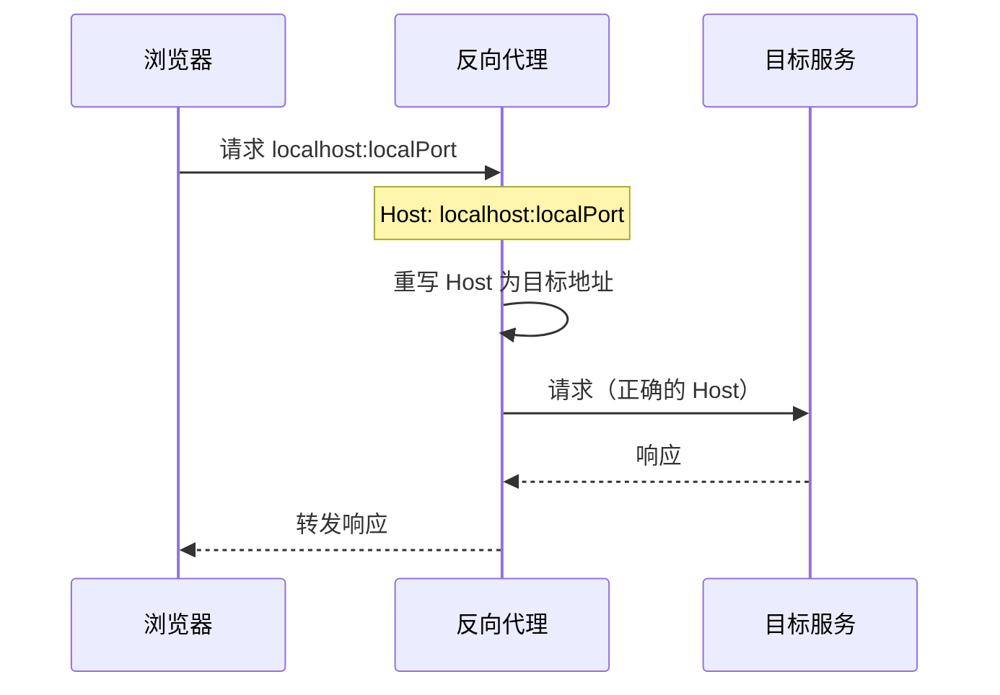
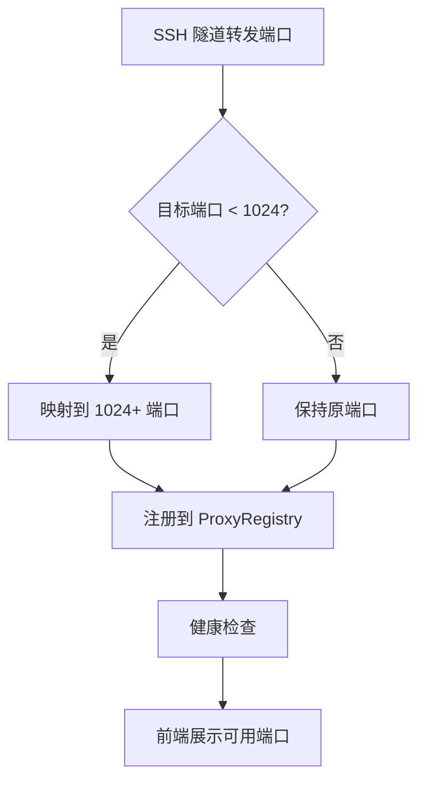

# 代理注册表

代理注册表（ProxyRegistry）管理端口转发端口的注册、健康检查和自动检测。它是**两种传输共用的白名单 / 保留端口 / `SetReverseBound` 面**：SSH 通道（`internal/ssh/server.go`）与 HTTP/2 流隧道（`POST /api/tunnel/stream` 与 `/api/tunnel/control`，见 [SSH 隧道](ssh-tunnel.md) 的「h2 流隧道」）都经它判定端口是否允许、是否保留，以及反向映射的 `Active` 状态。它解决了一个关键问题：隧道在 TCP 层面转发，但后端 Web 服务（如数据库管理界面、API 文档）依赖 HTTP Host 头做虚拟主机路由，TCP 转发后 Host 仍是 `localhost`，导致虚拟主机后端无法正确响应。反向代理通过重写 Host 头解决了这个问题。

## 流程图

### 反向代理请求流程

### 端口映射流程

## 功能与设计要点

### 功能清单

- **反向代理与 Host 重写**：将浏览器请求的 `Host: localhost:port` 重写为目标服务的原始 Host，解决虚拟主机后端在 SSH 隧道场景下的路由问题。**仅用于正向映射（ssh -L）的非 localhost 目标**
- **端口注册与生命周期管理**：转发的端口注册到 ProxyRegistry，统一管理创建、销毁和查询。前端可以获取所有可用端口的列表
- **方向感知（forward / reverse）**：每条映射带 `direction` 字段。`forward`（默认，ssh -L）由客户端监听、服务器拨号目标；`reverse`（ssh -R）由服务器绑定 loopback、回连客户端拨号本机目标。`port`/`localPort`/`host` 的含义随方向翻转，详见 `ssh-tunnel.md` 的方向语义表
- **特权端口自动映射**：目标端口 < 1024 时自动映射到 1024+ 范围，兼容 Android 和非 root 环境——这些环境无法绑定特权端口
- **注册表恒创建**：创建条件由 `cmd/server/proxy_registry_gate.go` 的 `shouldCreateProxyRegistry` 决定，现为 `return true`（原先的 `Enabled || transport != "ssh"` 比较已删除——`transport` 被 `ApplyDefaults` 无条件钉死为 `both`，比较恒真）。**注意 `port_forward.transport` 已不是可配置项**：服务端在 `ApplyDefaults` 与 PATCH 路径都归一为 `both`，`ssh` / `h2` 不可达；它仅剩 web 端健康检查门控一个消费者，两个原生客户端都不消费（Electron 在 IPC 边界写死 `ssh`，Android 用本地 SharedPreferences 开关 `tunnel_transport_h2_enabled`，默认关）。**不存在让 h2 端点返回 503 的配置组合**（详见 [SSH 隧道](ssh-tunnel.md) 的「传输方式」）。旧的「仅 `PortForward.Enabled`」门控会让 `port_forward.enabled=false` 给 h2 隧道请求一个 nil 注册表和 503。创建是**无副作用**的：只起一个 5s 健康检查 goroutine 并从 DB 恢复端口行，不绑任何端口（监听仍是 SSH server 的职责，仍受 `Enabled` 门控）
- **反向映射的服务器端口分配**：`allocateServerPort` 在 registry 分配阶段 bind-then-close 探测 OS 并跳过保留端口（ClawBench 自身 HTTP 端口与 SSH 端口，经 `SetReservedPorts` 登记）。**改选只能发生在此阶段**——SSH bind 阶段改绑会破坏客户端按请求端口匹配 `forwarded-tcpip` 通道的约定
- **健康检查**：定期检查转发端口的可用性，不可用的端口自动标记。前端只展示可用的端口，避免用户点击后才发现服务不可达。**反向条目完全跳过拨号探测**：目标在客户端，且拨服务器自身监听端口恒为真，其 `active` 由 `SetReverseBound` 在 `tcpip-forward` 成功/释放时驱动
- **端口自动检测**：`/api/proxy/detect` 端点扫描常用端口，发现可用的开发服务。用户不需要记住端口号
- **CORS 代理**：`/api/openapi-proxy` 端点为 Swagger UI 的"Try it out"功能转发 API 请求，绕过浏览器 CORS 限制。仅转发 HTTP/HTTPS 请求，过滤 hop-by-hop 头部。生产环境可设置 `AllowLocalProxy=false` 阻止对私有 IP 的请求（防 SSRF），DNS 重绑定攻击在 TCP dial 阶段二次校验
- **FRP 状态接口**：FRP 客户端由独立的 `internal/frp` 模块管理。`GET /api/frp/info` 返回包含公网地址的完整状态并要求认证；`GET /api/frp/status` 仅返回 enabled/running 等最小状态，供无需认证的本地或原生状态检查使用

### 设计要点

- **Host 重写是核心价值**：没有 Host 重写，通过 SSH 隧道访问虚拟主机后端（如 `admin.example.com`）会得到 404——浏览器发送的 Host 是 `localhost:port`，后端不认识这个 Host。反向代理将 Host 改回目标地址，问题迎刃而解
- **白名单必须按方向取字段**：`SetAllowedPorts` 裁剪时，正向比的是 `port`（服务器暴露的目标端口），反向比的是 `localPort`（服务器绑定的端口）。统一用 `port` 会让反向条目的越界判断测到客户端侧端口——看着生效，实则判错了对象
- **保留端口里主 HTTP 端口恒在、SSH 端口按需加入**：`reservedPortsFor(mainPort, sshPort)` 恒含 `mainPort`（反向绑定 20000 会让客户端拆掉隧道赖以运行的服务器本身），SSH 端口仅在 SSH 启用时加入。`sshPort == 0` 表示「无 SSH 端口需保护」，**不**展开为 `mainPort+1`——h2 隧道的守卫（`internal/handler/tunnel_control.go` 的 `tunnelGuard`）已硬拒 `mainPort+1`，此处再展开会与「SSH 未启用」的事实矛盾
- **`reallocateLocalPort` 只对正向生效**：正向的 `localPort` 是客户端监听端口，目标端口变化时可以跟着改；反向的 `localPort` 是服务器绑定端口，客户端目标变化时移动它等于静默改绑另一个服务器端口
- **特权端口映射对 Android 必要**：Android 没有 root 权限，无法绑定 1024 以下端口。自动映射到高端口号后，SSH 隧道在 Android 上也能转发 80/443 端口的服务
- **默认端口剥离**：重写 Host 时按 HTTP 规范剥离默认端口号（80 for HTTP, 443 for HTTPS），避免 `backend:80` 这样的非规范 Host 导致后端匹配失败
- **支持自签名证书**：HTTPS 目标跳过证书验证——开发环境常用自签名证书，严格验证会阻断转发
- **CORS 代理是开发便利工具**：Swagger UI 的"Try it out"从浏览器直接请求后端 API，但本地开发服务通常没有 CORS 头。CORS 代理在服务端转发请求，让用户在预览界面内直接测试 API。默认允许本地地址（`AllowLocalProxy=true`），生产环境应关闭
