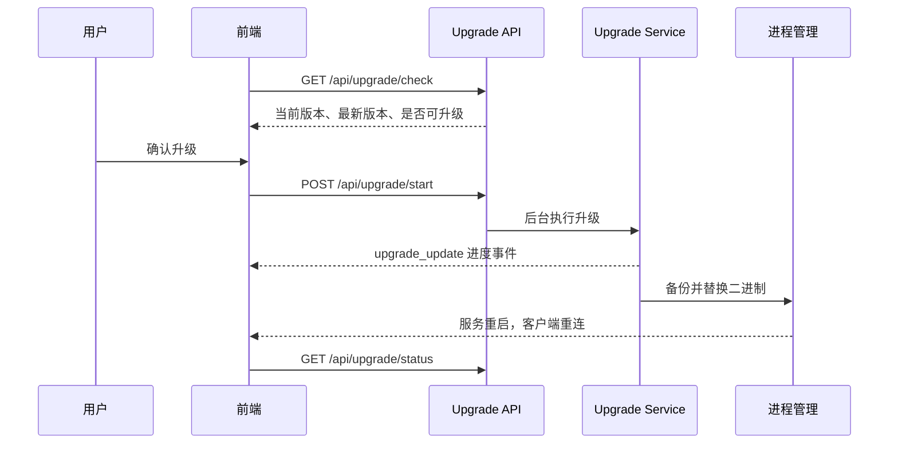

# 应用自升级

应用自升级让已部署的 ClawBench 在 Web 界面内完成版本检查、二进制替换和服务恢复，不需要用户登录服务器手工下载。升级期间服务会短暂断开，因此流程同时处理备份、进度通知、断线轮询和升级后的版本确认。Android 客户端还提供版本不匹配检测——WebView 启动时对比 APK 内嵌版本与服务端 /api/upgrade/check 返回的服务器版本，不匹配时展示 VersionMismatchOverlay 提示用户下载新版 APK。服务端升级后客户端版本可能落后，检测确保前后端版本一致性。

## 流程图

### 从版本检查到服务恢复

正常情况下进度通过统一 WebSocket 推送。服务替换导致连接中断时，前端每 2 秒查询状态，最多持续 5 分钟；新服务恢复后以版本和空状态确认升级完成。

## 功能与设计要点

### 功能清单

- **版本检查**：比较当前版本与发布渠道中的最新版本，并将开发构建视为可升级。用户能够在进入设置或启动提示时判断是否需要更新
- **后台升级**：启动请求立即返回，下载、校验、备份和替换在后台执行。长耗时操作不会占用 HTTP 请求，也不会因浏览器超时而中断
- **实时进度**：升级阶段、百分比、消息、备份路径和错误通过 `upgrade_update` 推送。用户可以区分下载、替换、重启和失败，而不是面对无反馈的断线
- **断线恢复**：升级导致 WebSocket 断开后自动切换为状态轮询，服务恢复后重新同步状态。升级本身造成的重启不会被误判为普通网络故障
- **版本跳过**：启动提示允许按版本记录"暂不提醒"，只跳过指定版本；出现更新版本后重新提示
- **Android 版本不匹配检测**：Android WebView 启动时对比 APK 版本与服务器版本，不匹配时展示 `VersionMismatchOverlay` 提示用户下载新版 APK。服务端升级后客户端可能落后，检测确保版本一致性
- **桌面端升级检查**：`GET /api/desktop/latest` 查询 npm registry 获取 ClawBench 桌面端（Electron）的最新版本和各平台下载链接（linux-x64/arm64、darwin-x64/arm64、win32-x64）。桌面端通过 `@xulongzhe/clawbench-desktop-*` 平台包分发，与服务器自升级和 Android APK 检测是三个独立的升级通道

### 设计要点

- **单实例升级**：同一时间只允许一个升级任务，重复启动返回冲突，防止多个任务同时替换二进制
- **检查与执行分离**：检查端点只提供版本决策，执行阶段重新完成必要校验，避免检查与替换之间的状态变化
- **备份优先于替换**：升级状态暴露备份路径，使失败恢复和人工排障有明确落点
- **WS 优先、轮询兜底**：正常阶段使用低延迟事件，进程重启阶段使用无状态 HTTP 查询，两种通道覆盖升级的完整生命周期
- **所有升级端点均鉴权**：二进制替换是高权限操作，不能使用公开状态接口
