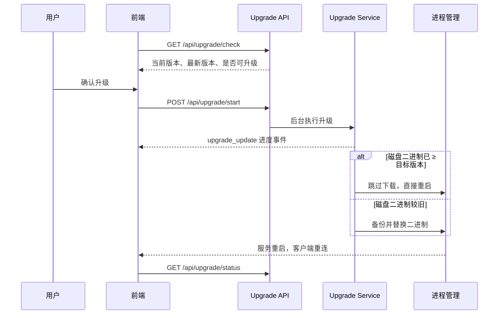

# 应用自升级

应用自升级让已部署的 ClawBench 在 Web 界面内完成版本检查、二进制替换和服务恢复，不需要用户登录服务器手工下载。升级期间服务会短暂断开，因此流程同时处理备份、进度通知、断线轮询和升级后的版本确认。Android 客户端还提供版本不匹配检测——原生层在加载 WebView **之前**对比 APK 版本与 `/api/health` 返回的服务器版本，APK 落后时弹出阻塞式 web 风格卡片提示版本可能不兼容，并引导下载新版 APK（用户可强制跳过）。服务端升级后客户端版本可能落后，检测确保前后端版本一致性。

## 流程图

### 从版本检查到服务恢复

正常情况下进度通过统一 WebSocket 推送。服务替换导致连接中断时，前端每 2 秒查询状态，最多持续 5 分钟；新服务恢复后以版本和空状态确认升级完成。若重启未能触发（版本短路分支没有下载兜底），升级以 `restart_failed` 结束并提示手动重启，而不是无限停留在重启中。

## 功能与设计要点

### 功能清单

- **版本检查**：比较当前版本与发布渠道中的最新版本，并将开发构建视为可升级。用户能够在进入设置或启动提示时判断是否需要更新
- **后台升级**：启动请求立即返回，下载、校验、备份和替换在后台执行。长耗时操作不会占用 HTTP 请求，也不会因浏览器超时而中断
- **实时进度**：升级阶段、百分比、消息、备份路径和错误通过 `upgrade_update` 推送。用户可以区分下载、替换、重启和失败，而不是面对无反馈的断线
- **断线恢复**：升级导致 WebSocket 断开后自动切换为状态轮询，服务恢复后重新同步状态。升级本身造成的重启不会被误判为普通网络故障
- **版本跳过**：启动提示允许按版本记录"暂不提醒"，只跳过指定版本；出现更新版本后重新提示
- **安装目录可写预检**：升级前先探测二进制所在目录是否可写（实际创建并删除临时文件，以反映 ACL、只读挂载和 MAC 而不只是 mode 位）——不可写时立即以 `install_dir_not_writable` 错误码给出可操作的提示，而非下载完约 40MB 压缩包后才在备份步骤报 `permission denied`。`/api/upgrade/check` 同时返回 `install_writable` 与 `install_dir`，让界面在用户开始升级前就能预警。约束在**目录**而非二进制：备份要新建 `.bak` 文件、`rename(2)` 也是目录操作
- **自身路径固化**：启动时把 `os.Executable()` 的绝对路径写入 `{data-dir}/self-path`。升级与重启都以该记录解析「正在运行的二进制」，而非实时调用 `os.Executable()`——后者解析 `/proc/self/exe`，在包管理器（npm 覆盖安装走 retire：旧目录改名成 `.clawbench-<sha1 前 8 位>` 后删除）替换过运行中的包之后，会返回一个**已被删除的路径**且 `err == nil`，拿去 `os.Open` 就在备份步骤 ENOENT 失败。数据目录是包管理器不会触碰的位置，故记录在包被替换后仍然有效。记录失效（手动迁移过安装目录）时回退 `os.Executable()`，两者皆不可用才以 `self_path_unresolved` 报错
- **版本短路**：升级前探测磁盘上二进制的版本，若已 ≥ 目标版本（典型场景：用户已通过 `npm install/update` 更新了包，只是进程还在跑旧版），跳过下载直接重启加载。避免为同一版本重复下载约 42MB。探测失败或重启函数未接线时**回退**正常下载流程，不做乐观假设；开发版（`dev` / git 短哈希）不参与比较
- **Android 版本不匹配检测**：原生层在健康检查（`GET /api/health`）通过后、加载 WebView 之前对比 APK 版本与服务器版本（`VersionCompare.shouldShowMismatch`）。APK 落后时展示阻塞式 web 风格原生卡片（`MainActivity.showVersionMismatchDialog` → `WebStyleDialog`，样式对齐 web 的 `DialogOverlay.vue`，配色跟随持久化主题调色板），提示新旧版本可能不兼容，提供「下载 APK」与「强制跳过」两个动作；点下载会启动 DownloadManager 下载并退回原生登录页，完成后经 `getUriForDownloadedFile` 的 content URI 拉起系统安装器（scoped storage 下不能用 File API 定位下载文件），失败路径均有 toast 提示。该弹窗**不记忆跳过**（每次冷启动都会重新提示）。任一侧版本不可解析（`dev`、短哈希、缺 `version` 字段）时一律 fail-open，不阻塞登录。服务端升级后客户端可能落后，检测确保版本一致性
- **下载校验**：升级包从 registry 拉取，落地前做两层校验——npm 的 `dist.integrity`（SRI，缺省时回退旧式 `dist.shasum`）与 npm 的 registry 签名（对 `<包名>@<版本>:<integrity>` 的 ECDSA P-256 签名，公钥固定取自 `registry.npmjs.org`，不跟随用户配置的镜像）。`/api/upgrade/check` 返回 `verification_warning`，列出本次升级中**无法完成**的校验原因

### 校验策略：能校验就校验，校验不了由用户决定

校验分三种结果，处理方式不同（**这不是「全部放行」，唯一会中止升级的是最后一条**）：

| 结果 | 处理 | 覆盖情况 |
|---|---|---|
| 校验通过 | 静默继续 | 签名有效且哈希存在 |
| **无法校验** | 如实告知，**用户确认后**继续 | registry 未提供签名、签名验证失败（含镜像重打包）、签名公钥不可达、registry 未提供完整性哈希 |
| **校验了但不通过** | **中止升级** | 下载内容与已知哈希不符 |

区分第二、三类的理由：第二类是「不知道对不对」，第三类是「明确不对」——把一份已知与预期不符的文件覆盖到正在运行的程序上属于功能损坏，而非安全强度打折。

「无法校验」的确认在**下载之前**完成：这些原因都来自 registry 元数据，无需先下载即可判定。因此 `/api/upgrade/check` 必须能报出全部三类原因（含缺失哈希），否则前端闸门不会触发，安装会在无人确认的情况下静默进行。前端闸门位于 `useUpgrade.startUpgrade()`，两个入口（升级对话框与启动提示）共用，取消则不发起任何请求。

确认在服务端会被**校验**，而非仅靠前端自律：`POST /api/upgrade/start` 的请求体携带客户端展示并取得同意的**原因码指纹**，服务端与**本次** registry 查询算出的指纹比对，不一致则以 `unverified_not_confirmed` 拒绝。比对用的是同一次查询的结果，所以注册表中途变化时比对会失败——这是期望行为：用户同意的风险描述已不适用，应重新确认。`startUpgrade` 每次尝试前都重新检查，重试不会复用上一次残留的警告。

**比对的是原因码，不是展示文本。** 这一点经过两轮返工才定下来：最初比对人类可读的警告字符串，随后依次发现两个会使它非确定的字段——先是内嵌的 transport 错误文本（timeout / refused / DNS 各不相同），再是内嵌的 registry 地址（候选源顺序与瞬时可达性会让两次请求命中不同源，渲染出不同文案）。这类问题的根源是「拿展示文本当身份」，逐个字段打补丁只会等来第三个。现在 `verification_issues` 是排序去重后的原因码集合（如 `signature_missing,no_integrity_hash`），与措辞、路由、失败模式全都无关；`verification_warning` 降级为纯展示。原因码定义见 `upgrade_signature.go` 顶部的 `VerifyIssue*` 常量，新增检查时必须确认新码在两次请求间稳定。

需要明确它的**强度边界**：这是一致性校验，不是访问控制。任何调用方都可以先 `GET /api/upgrade/check` 取到警告、再原样 `POST` 回去，安装随即进行——门槛从「一个请求」变成「两个请求」。在既定威胁模型下（本机单用户可信、恶意方是 registry）这足够：registry 无法让警告为空却又产生 `unverified=true`，因为二者出自同一分支。它保证的是「安装的元数据与用户确认过的一致」，不是「一定有人确认过」。若要真正的访问控制，需要服务端签发一次性的确认令牌，当前未实现。

**签名校验在此策略下是尽力而为，不是闸门。** 省略 `dist.signatures` 字段与「本就没有签名可提供」在本实现中无法区分，因此有意提供篡改内容的镜像只要不签名即可通过——用户会在确认框中看到「未能验证」并自行决定。该检查仍能捕获的是：带签名响应的篡改（如透传 npm 签名的代理），以及镜像未能剥离的失效签名。

**解压设上限**（`maxBinarySize` / `maxArchiveSize`）。哈希可缺省后，「哈希保证大小」不再是成立的前提，故对解压体积单独设限，避免高压缩比归档撑爆磁盘。

### 设计要点

- **单实例升级**：同一时间只允许一个升级任务，重复启动返回冲突，防止多个任务同时替换二进制
- **检查与执行分离**：检查端点只提供版本决策，执行阶段重新完成必要校验，避免检查与替换之间的状态变化
- **重启与升级共用同一路径解析**：哨兵重启（非托管部署下等待进程退出后重新拉起）与升级路径都经 `ResolveSelfBinary()` 取二进制路径。若哨兵用 `os.Executable()`，在包被替换后它会 re-exec 已删除的路径，5 次重试全部失败导致服务永久下线——即"修好升级反而触发假死"。容器与 systemd 走各自的重启策略，不经过哨兵
- **失败必须可操作，不留无反馈的中间态**：升级失败以稳定的 `error_code` 结束，前端映射为本地化、可操作的文案，而非裸 ENOENT。已知码：`install_dir_not_writable`（安装目录不可写）、`self_path_unresolved`（找不到运行中的二进制，重启后自愈）、`restart_failed`（新版本已落盘但重启未能触发，需手动重启）。`restart_failed` 专门覆盖版本短路：该分支没有下载兜底，静默失败会让界面永远停在 "restarting" 转圈
- **镜像 tarball URL 需归一化**：Nexus 等 npm 镜像在 `dist.tarball` 的包名段里保留 dist-tag（`.../@scope/pkg@latest/-/pkg-0.91.0.tgz`），而标准 npm 格式省略该 tag（`.../@scope/pkg/-/pkg-0.91.0.tgz`）。直接用镜像返回的 URL 会 404、下载步骤失败，因此下载前先归一化路径
- **备份优先于替换**：升级状态暴露备份路径，使失败恢复和人工排障有明确落点
- **替换前不销毁旧二进制（跨盘升级的硬约束）**：替换统一走 `platform.ReplaceBinary`——先 `rename(src, dst)`，失败则把 `src` 复制到 **dst 同目录**的临时文件再 rename 覆盖。两条路径都不先把 `dst` 改名或删除，因此 `dst` 在替换成功前始终是一个可运行的二进制。这条不变量是升级助手唯一能依赖的兜底：助手本身是被替换的目标进程的子进程，一旦安装目录里没有二进制，就再没有任何进程能把它拉起来，用户也无法从界面重试（前端连不上服务）。约束来自 Windows：`os.Rename` 映射到 `MoveFileEx` 带 `MOVEFILE_REPLACE_EXISTING` 但不带 `MOVEFILE_COPY_ALLOWED`，因此跨卷（`%TEMP%` 在 C:，安装目录在 D:/E:/F:）必然失败。历史上 Windows 分支采用「先把旧 exe 改名成 `.old`，再 rename 新 exe」的顺序，跨盘时前一步成功、后一步失败，安装目录只剩 `.old`/`.bak`——服务永久下线，只能手工把备份复制回去
- **替换失败仍要拉起服务**：`upgrade-replace` 的替换失败路径不停在"报错退出"，而是照常启动 `target`（此时仍是旧版本）并以非零码退出。这样一次失败的升级表现为"服务还在跑旧版本、升级未完成"，而不是"服务消失"。旧实现失败时直接 `return 1`，跳过了清理与启动两步，同时泄漏下载目录（约 90MB）
- **替换原语只有一份**：升级助手（`internal/cli`）与受托管就地替换（`internal/service`）共用 `platform.ReplaceBinary`。此前两处各有一份实现，受托管那份有跨盘回退、助手那份没有，于是同一个跨盘场景在 systemd 下成功、在非托管 Windows 下丢文件——重复实现是这条 bug 能长期存在的直接原因
- **WS 优先、轮询兜底**：正常阶段使用低延迟事件，进程重启阶段使用无状态 HTTP 查询，两种通道覆盖升级的完整生命周期
- **容器内强制走就地替换路径**：容器（Docker / Podman / Kubernetes，经 `platform.IsContainer` 判定）一律视为"受托管"，走就地替换 + 退出，由容器重启策略拉起新版本。该判定优先于 supervisor 探测——k8s / runit / supervisord 探测不到时会错误地指向自重启子进程路径，而该路径在容器中必然失败：PID 1 退出时运行时会拆除命名空间并杀掉 `upgrade-replace` 子进程，替换永远执行不到，服务静默回到旧二进制。同样的强制也适用于 `IsRunningUnderSupervisor()`，从而覆盖配置面板重启（哨兵进程同样会被容器拆除杀掉）
- **容器类型区分提示与决策**：`platform.IsDockerLike`（Docker/Podman）用于 UI 提示，`platform.IsContainer`（含 k8s）用于路径决策。k8s Pod 是容器（自重启不可行）但 Docker CLI 建议不适用，故 `/api/upgrade/check` 的 `is_docker` 只对 Docker/Podman 为真
- **Docker 环境提示而非拒绝**：`/api/upgrade/check` 返回 `is_docker` 时，升级界面提示改用 `docker pull` + `docker compose up -d`。就地升级仍可执行，但镜像重建会回退版本，因此镜像拉取才是权威路径。就地升级依赖容器重启策略拉起新版本，且必须为 `always` / `unless-stopped`——优雅退出码为 0，`on-failure` 不会触发（详见 [Docker 部署](docker-deployment.md)）
- **所有升级端点均鉴权**：二进制替换是高权限操作，不能使用公开状态接口
