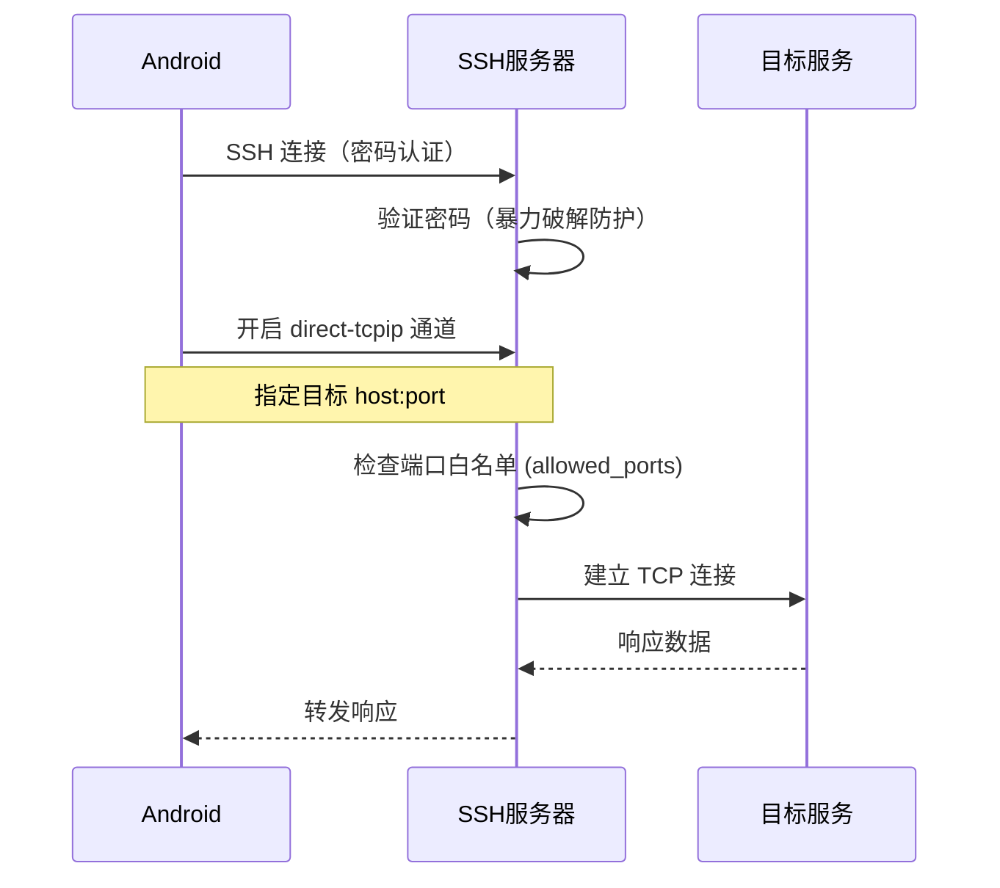
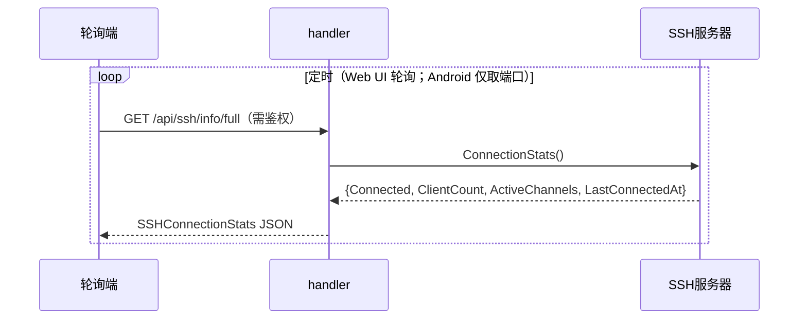

# SSH 隧道

SSH 隧道让移动端的 ClawBench App 通过加密隧道访问局域网内的开发服务（数据库管理界面、API 文档、内部工具等）。隧道使用 SSH direct-tcpip 通道转发端口，配合密码认证和自动 host key，用户只需输入密码即可建立隧道，不需要预配置 SSH 密钥。

> **状态说明**：当前实现中 SSH 服务器**不发布任何 WebSocket 事件**。前端通过 `GET /api/ssh/info/full` 端点轮询获取连接状态，而非订阅推送。

## 流程图

### SSH 隧道端口映射流程

### SSH 状态查询（非事件推送）

## 功能与设计要点

### 功能清单

- **SSH 端口映射（正向 / ssh -L）**：通过 direct-tcpip 通道将远程端口映射到本地，Android App 通过 `localhost:localPort` 访问局域网内的服务。移动端访问内网服务最通用的方式
- **反向端口映射（ssh -R）**：客户端请求服务器绑定一个 loopback 端口（`tcpip-forward` 全局请求），服务器每收到一个连接就用 `forwarded-tcpip` 通道回传给客户端，由客户端拨号自己机器上的目标。用途是让**服务器上的进程**访问客户端本地服务
- **密码认证**：使用 `clawbench` 用户名 + 服务端配置的密码，与 Web 认证共享密码。用户不需要额外记忆 SSH 密码
- **自动 host key**：启动时自动生成 ECDSA P-256 host key（`internal/ssh/server.go::loadOrGenerateHostKey`），首次连接无需确认指纹。降低移动端 SSH 连接的配置门槛
- **暴力破解防护**：IP 级别的指数退避封锁（`maxAuthFails=5` → `initialBlockDur=5*time.Minute` 翻倍至 `maxBlockDur=1*time.Hour`，`internal/ssh/server.go`）。SSH 面向公网，必须防暴力破解
- **端口白名单**：支持配置允许转发的端口范围（`port_forward.allowed_ports`）。**默认仅允许 `1024-65535` 非特权端口**（`internal/service/proxy.go`，ISS-186 修复收紧）；如需允许特权端口（如 80、443）需显式配置 `1-65535`
- **反向映射的保留端口**：反向映射在服务器上真实 `net.Listen`，因此除白名单外还禁止绑定 ClawBench 自身 HTTP 端口与 SSH 端口（`ProxyRegistry.SetReservedPorts` + `Server.isReservedPort` 双重守卫）。这两个守卫在协议层执行，手写 `ssh -R` 同样受限

### 方向语义

`ForwardedPort` 的 `port` / `localPort` / `host` 三个字段在两个方向上含义不同：

| 字段 | `forward`（ssh -L） | `reverse`（ssh -R） |
|---|---|---|
| `port` | 服务器侧目标端口 | 客户端本地待暴露端口 |
| `localPort` | 客户端监听端口（DB 主键） | 服务器侧绑定端口（DB 主键） |
| `host` | 服务器侧目标主机 | 客户端侧目标主机（默认 127.0.0.1） |

两个方向共享 `local_port` 主键空间，因此同号端口不会重复注册。

**`active` 的语义随方向不同**：正向由服务器每 5s 拨号目标端口得出；反向表示服务器侧 `127.0.0.1:{localPort}` 是否已被某个客户端会话绑定，由 `ProxyRegistry.SetReverseBound` 在 `tcpip-forward` 成功/释放时更新。健康检查循环对反向条目**完全跳过**——从服务器拨自己的监听端口没有意义。

**反向映射不启动 HTTP 反向代理**：正向的非 localhost 目标需要代理改写 Host 头；反向的目标在客户端，服务器侧没有该端口的 HTTP 流量。

### 端口被占用时的处理

反向映射的服务器端口**只在 registry 分配阶段**自动改选（`allocateServerPort` 先 bind-then-close 探测 OS，跳过保留端口与已注册端口），SSH server 拿到的是已确认可用的端口。

**绝不能在 SSH bind 阶段改绑**：`forwarded-tcpip` 回连通道由客户端按**请求的端口**匹配（JSch / ssh2 / x/crypto 三者一致），若服务器改绑却回复成功，三端都会拒绝该通道，映射静默失效。因此 bind 仍失败时只能 `Reply(false)`，由前端提示。

同理，**Android 必须请求显式端口**：JSch 的 `setPortForwardingR(int,String,int)` 返回 void，请求 0 时拿不到服务器实际分配的端口，会导致 UI 显示的端口与真实绑定不一致。

### 端点按受众拆分

`/api/ssh/info` 与 `/api/ssh/info/full` 是同一份数据按调用方切分，参照 `/api/frp/status` 与 `/api/frp/info` 的既有做法：

| 端点 | 鉴权 | 返回 | 调用方 |
|---|---|---|---|
| `GET /api/ssh/info` | 公开 | `{enabled, port}` | Android `BackgroundService.fetchSSHPort()`（原生 Java，无 Cookie，需在连接前发现端口） |
| `GET /api/ssh/info/full` | 需鉴权 | `host, port, username, fingerprint, command, connectionStats` | Web UI（`usePortForward` 轮询状态、`ProxyPanelContent` 展示命令与指纹） |

公开端点在鉴权前可达，因此只暴露 Android 真正需要的最小字段。`command` 会枚举全部转发端口及其内网目标主机（形如 `-L 5173:internal-db:5432`），等同于内网拓扑；`fingerprint` 可用于中间人识别——两者都只应由已认证的 Web UI 获取。

### 设计要点

- **密码与 Web 认证共享**：SSH 密码就是 Web 认证密码，不需要单独管理。密码变更同时影响 Web 和 SSH——减少认证配置的复杂度
- **自动 host key 是安全权衡**：生产环境应该使用固定 host key 并验证指纹，但 ClawBench 的场景是个人开发工具，自动生成降低了配置门槛——用户首次连接时无法验证 host key 真实性，但对于个人使用场景可接受
- **指数退避封锁是 IP 级别**：同一 IP 连续失败 5 次后封锁，不是全局封锁——不会因为一个攻击者而影响合法用户
- **状态查询走 HTTP 而非事件**：SSH 服务器是常驻 goroutine，自身**不发布 WS 事件**。Web UI 通过 `GET /api/ssh/info/full`（需鉴权）定时轮询 `SSHConnectionStats{Connected, ClientCount, ActiveChannels, LastConnectedAt}`。这种轮询模型比事件推送更简单，且 SSH 状态变更频率低，轮询足够

