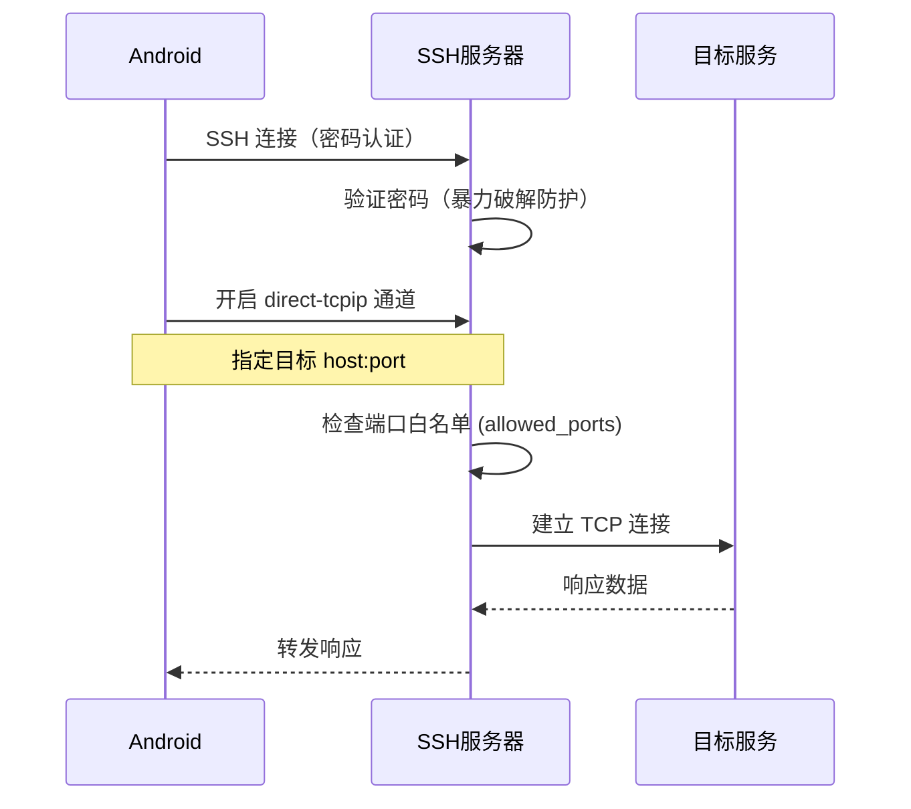
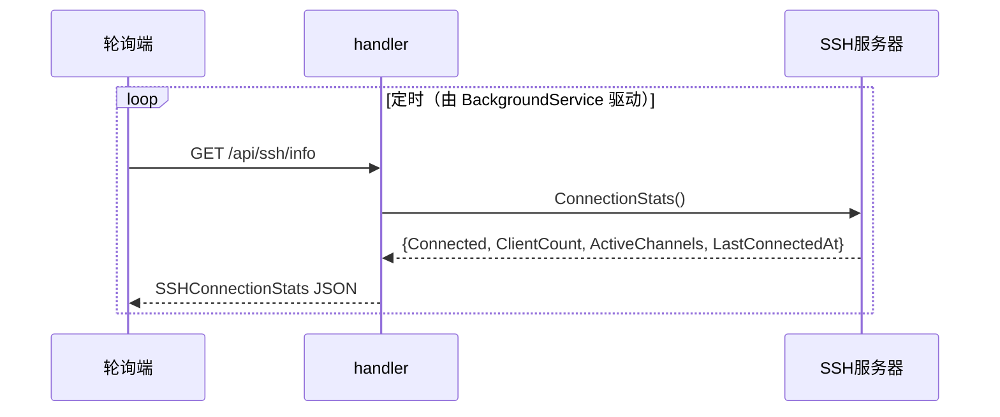

# SSH 隧道

SSH 隧道让移动端的 ClawBench App 通过加密隧道访问局域网内的开发服务（数据库管理界面、API 文档、内部工具等）。隧道使用 SSH direct-tcpip 通道转发端口，配合密码认证和自动 host key，用户只需输入密码即可建立隧道，不需要预配置 SSH 密钥。

> **状态说明**：当前实现中 SSH 服务器**不发布任何 WebSocket 事件**。前端通过 `GET /api/ssh/info` 端点轮询获取连接状态，而非订阅推送。

## 流程图

### SSH 隧道端口映射流程

### SSH 状态查询（非事件推送）

## 功能与设计要点

### 功能清单

- **SSH 端口映射**：通过 direct-tcpip 通道将远程端口映射到本地，Android App 通过 `localhost:localPort` 访问局域网内的服务。移动端访问内网服务最通用的方式
- **密码认证**：使用 `clawbench` 用户名 + 服务端配置的密码，与 Web 认证共享密码。用户不需要额外记忆 SSH 密码
- **自动 host key**：启动时自动生成 ECDSA P-256 host key（`internal/ssh/server.go::loadOrGenerateHostKey`），首次连接无需确认指纹。降低移动端 SSH 连接的配置门槛
- **暴力破解防护**：IP 级别的指数退避封锁（`maxAuthFails=5` → `initialBlockDur=5*time.Minute` 翻倍至 `maxBlockDur=1*time.Hour`，`internal/ssh/server.go`）。SSH 面向公网，必须防暴力破解
- **端口白名单**：支持配置允许转发的端口范围（`port_forward.allowed_ports`）。**默认仅允许 `1024-65535` 非特权端口**（`internal/service/proxy.go`，ISS-186 修复收紧）；如需允许特权端口（如 80、443）需显式配置 `1-65535`

### 设计要点

- **密码与 Web 认证共享**：SSH 密码就是 Web 认证密码，不需要单独管理。密码变更同时影响 Web 和 SSH——减少认证配置的复杂度
- **自动 host key 是安全权衡**：生产环境应该使用固定 host key 并验证指纹，但 ClawBench 的场景是个人开发工具，自动生成降低了配置门槛——用户首次连接时无法验证 host key 真实性，但对于个人使用场景可接受
- **指数退避封锁是 IP 级别**：同一 IP 连续失败 5 次后封锁，不是全局封锁——不会因为一个攻击者而影响合法用户
- **状态查询走 HTTP 而非事件**：SSH 服务器是常驻 goroutine，自身**不发布 WS 事件**。Android BackgroundService 通过 `GET /api/ssh/info`（无需鉴权）定时轮询 `SSHConnectionStats{Connected, ClientCount, ActiveChannels, LastConnectedAt}`。这种轮询模型比事件推送更简单，且 SSH 状态变更频率低，轮询足够

