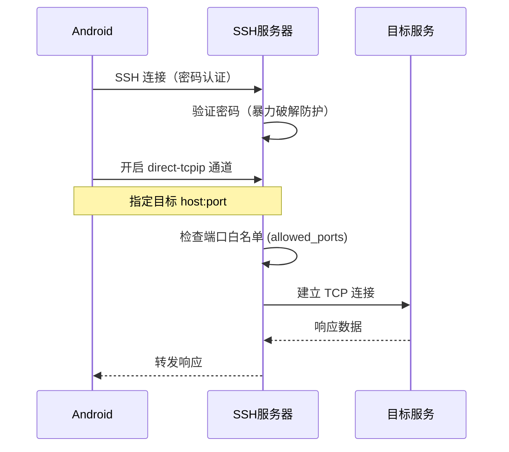
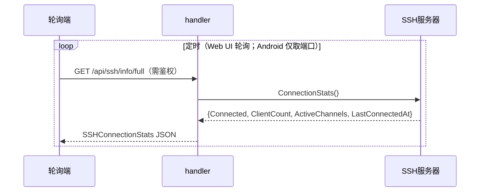
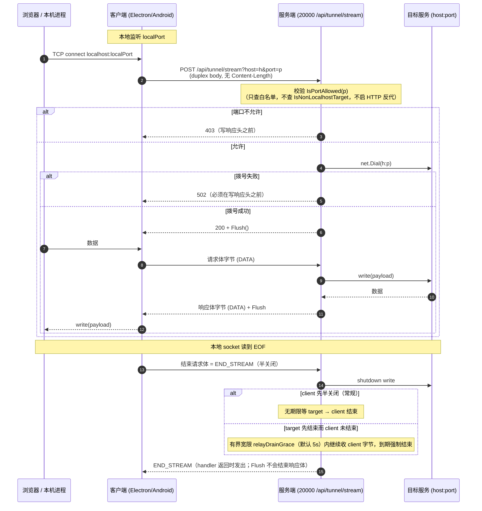
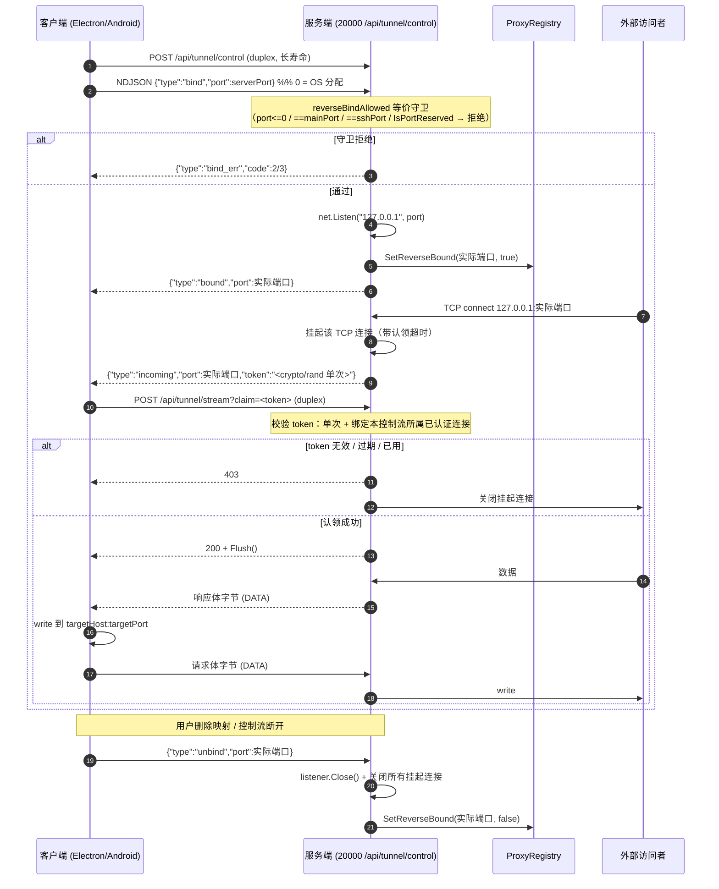

# SSH 隧道

ClawBench 的端口转发有**两种传输方式**：传统的 **SSH 通道**，以及新增的 **HTTP/2 流隧道**（h2）。两者承载**同一份** `ForwardedPort` 模型、同一套端口白名单与保留端口守卫，前端与端口列表无感知差异；差别只在底层线缆。本文件先讲 SSH（历史实现），再讲 h2 传输与其与 SSH 的语义边界。

SSH 隧道让移动端的 ClawBench App 通过加密隧道访问局域网内的开发服务（数据库管理界面、API 文档、内部工具等）。隧道使用 SSH direct-tcpip 通道转发端口，配合密码认证和自动 host key，用户只需输入密码即可建立隧道，不需要预配置 SSH 密钥。

> **状态说明**：SSH 服务器与 h2 隧道**都不发布任何 WebSocket 事件**（`internal/tunnel/` 与 `internal/handler/tunnel_*.go` 均不引用 `ws.Manager` / `StreamHub`）。前端通过 `GET /api/ssh/info/full` 端点轮询获取连接状态，而非订阅推送。h2 传输只是把同样的转发流量改走 20000 主端口上的 HTTP/2 流，不改变「状态靠轮询」这一模型。

## 流程图

### SSH 隧道端口映射流程

```mermaid
sequenceDiagram
    participant Android
    participant SSH服务器
    participant 目标服务

    Android->>SSH服务器: SSH 连接（密码认证）
    SSH服务器->>SSH服务器: 验证密码（暴力破解防护）
    Android->>SSH服务器: 开启 direct-tcpip 通道
    Note over Android,SSH服务器: 指定目标 host:port
    SSH服务器->>SSH服务器: 检查端口白名单 (allowed_ports)
    SSH服务器->>目标服务: 建立 TCP 连接
    目标服务-->>SSH服务器: 响应数据
    SSH服务器-->>Android: 转发响应
```

### SSH 状态查询（非事件推送）

```mermaid
sequenceDiagram
    participant 轮询端
    participant handler
    participant SSH服务器

    loop 定时（Web UI 轮询；Android 仅取端口）
        轮询端->>handler: GET /api/ssh/info/full（需鉴权）
        handler->>SSH服务器: ConnectionStats()
        SSH服务器-->>handler: {Connected, ClientCount, ActiveChannels, LastConnectedAt}
        handler-->>轮询端: SSHConnectionStats JSON
    end
```

## 功能与设计要点

### 功能清单

- **SSH 端口映射（正向 / ssh -L）**：通过 direct-tcpip 通道将远程端口映射到本地，Android App 通过 `localhost:localPort` 访问局域网内的服务。移动端访问内网服务最通用的方式
- **反向端口映射（ssh -R）**：客户端请求服务器绑定一个 loopback 端口（`tcpip-forward` 全局请求），服务器每收到一个连接就用 `forwarded-tcpip` 通道回传给客户端，由客户端拨号自己机器上的目标。用途是让**服务器上的进程**访问客户端本地服务
- **密码认证**：使用 `clawbench` 用户名 + 服务端配置的密码，与 Web 认证共享密码。用户不需要额外记忆 SSH 密码
- **自动 host key**：启动时自动生成 ECDSA P-256 host key（`internal/ssh/server.go::loadOrGenerateHostKey`），首次连接无需确认指纹。降低移动端 SSH 连接的配置门槛
- **暴力破解防护**：IP 级别的指数退避封锁（`maxAuthFails=5` → `initialBlockDur=5*time.Minute` 翻倍至 `maxBlockDur=1*time.Hour`，`internal/ssh/server.go`）。SSH 面向公网，必须防暴力破解
- **端口白名单**：支持配置允许转发的端口范围（`port_forward.allowed_ports`）。**默认仅允许 `1024-65535` 非特权端口**（`internal/service/proxy.go`，ISS-186 修复收紧）；如需允许特权端口（如 80、443）需显式配置 `1-65535`
- **反向映射的保留端口**：反向映射在服务器上真实 `net.Listen`，因此除白名单外还禁止绑定 ClawBench 自身 HTTP 端口与 SSH 端口（`ProxyRegistry.SetReservedPorts` + `Server.isReservedPort` 双重守卫）。这两个守卫在协议层执行，手写 `ssh -R` 同样受限

### 方向语义

`ForwardedPort` 的 `port` / `localPort` / `host` 三个字段在两个方向上含义不同：

| 字段 | `forward`（ssh -L） | `reverse`（ssh -R） |
|---|---|---|
| `port` | 服务器侧目标端口 | 客户端本地待暴露端口 |
| `localPort` | 客户端监听端口（DB 主键） | 服务器侧绑定端口（DB 主键） |
| `host` | 服务器侧目标主机 | 客户端侧目标主机（默认 127.0.0.1） |

两个方向共享 `local_port` 主键空间，因此同号端口不会重复注册。

**`active` 的语义随方向不同**：正向由服务器每 5s 拨号目标端口得出；反向表示服务器侧 `127.0.0.1:{localPort}` 是否已被某个客户端会话绑定，由 `ProxyRegistry.SetReverseBound` 在 `tcpip-forward` 成功/释放时更新。健康检查循环对反向条目**完全跳过**——从服务器拨自己的监听端口没有意义。

**反向映射不启动 HTTP 反向代理**：正向的非 localhost 目标需要代理改写 Host 头；反向的目标在客户端，服务器侧没有该端口的 HTTP 流量。

### 端口被占用时的处理

反向映射的服务器端口**只在 registry 分配阶段**自动改选（`allocateServerPort` 先 bind-then-close 探测 OS，跳过保留端口与已注册端口），SSH server 拿到的是已确认可用的端口。

**绝不能在 SSH bind 阶段改绑**：`forwarded-tcpip` 回连通道由客户端按**请求的端口**匹配（JSch / ssh2 / x/crypto 三者一致），若服务器改绑却回复成功，三端都会拒绝该通道，映射静默失效。因此 bind 仍失败时只能 `Reply(false)`，由前端提示。

同理，**Android 必须请求显式端口**：JSch 的 `setPortForwardingR(int,String,int)` 返回 void，请求 0 时拿不到服务器实际分配的端口，会导致 UI 显示的端口与真实绑定不一致。

### 端点按受众拆分

`/api/ssh/info` 与 `/api/ssh/info/full` 是同一份数据按调用方切分，参照 `/api/frp/status` 与 `/api/frp/info` 的既有做法：

| 端点 | 鉴权 | 返回 | 调用方 |
|---|---|---|---|
| `GET /api/ssh/info` | 公开 | `{enabled, port}` | Android `BackgroundService.fetchSSHPort()`（原生 Java，无 Cookie，需在连接前发现端口） |
| `GET /api/ssh/info/full` | 需鉴权 | `host, port, username, fingerprint, command, connectionStats` | Web UI（`usePortForward` 轮询状态、`ProxyPanelContent` 展示命令与指纹） |

公开端点在鉴权前可达，因此只暴露 Android 真正需要的最小字段。`command` 会枚举全部转发端口及其内网目标主机（形如 `-L 5173:internal-db:5432`），等同于内网拓扑；`fingerprint` 可用于中间人识别——两者都只应由已认证的 Web UI 获取。

### 设计要点

- **密码与 Web 认证共享**：SSH 密码就是 Web 认证密码，不需要单独管理。密码变更同时影响 Web 和 SSH——减少认证配置的复杂度
- **自动 host key 是安全权衡**：生产环境应该使用固定 host key 并验证指纹，但 ClawBench 的场景是个人开发工具，自动生成降低了配置门槛——用户首次连接时无法验证 host key 真实性，但对于个人使用场景可接受
- **指数退避封锁是 IP 级别**：同一 IP 连续失败 5 次后封锁，不是全局封锁——不会因为一个攻击者而影响合法用户
- **状态查询走 HTTP 而非事件**：SSH 服务器是常驻 goroutine，自身**不发布 WS 事件**。Web UI 通过 `GET /api/ssh/info/full`（需鉴权）定时轮询 `SSHConnectionStats{Connected, ClientCount, ActiveChannels, LastConnectedAt}`。这种轮询模型比事件推送更简单，且 SSH 状态变更频率低，轮询足够

## 传输方式

端口转发支持两种线缆，由 `port_forward.transport` 选择（`internal/model/port_forward.go`）：

| 值 | 含义 | 服务器端口 |
|---|---|---|
| `ssh` | 只用 SSH 通道（旧行为） | SSH 监听 `mainPort+1`（默认 20001） |
| `h2` | 只用 HTTP/2 流隧道 | 复用 20000 主 HTTP 端口 |
| `both` | **默认**。优先 h2，失败回退 SSH | 20000 + 20001 |

**默认值 `both`**（`model.DefaultPortForwardTransport`，`internal/model/defaults.go` 的 `ApplyDefaults` 在值非法或缺失时收敛到它）。对已启用 SSH 的用户行为不变，同时提供 h2；`transport` 是**服务器侧配置**，不进入已持久化的端口行，因此**无 DB / SharedPreferences 迁移**。

### 传输优先级链

客户端首次连接严格按顺序探测：**h2-over-TLS → h2c → SSH**。

- **h2-over-TLS**：实例开了 TLS 时，`ServeTLS` 自动协商 ALPN `h2`——即「只要开了 TLS，20000 今天就在跑 h2」，多路复用层无需新端口。
- **h2c**：明文部署走 prior-knowledge（不做 Upgrade 协商）。
- **SSH**：前两者都失败时回退到既有 20001 通道。

明文部署下首次连接会白付一次 TLS 失败（很快，握手即被拒），因此客户端**记住上次成功的传输方式**，重连时优先复用；只有首次连接严格按此顺序探测。服务器侧协议开关见 `cmd/server/server_protocols.go` 的 `serverProtocols`：`SetHTTP1(true)` **必须保留**（5 个 `coder/websocket` 端点依赖 `http.Hijacker`，h2 无 hijack），TLS 下加 `SetHTTP2(true)`、明文下加 `SetUnencryptedHTTP2(true)`。

> **浏览器端零改动**：`fetch()` 的 Fetch 规范里 `RequestDuplex` 只有 `"half"`（`"full"` 保留未用），无法全双工；且流式请求体仅 Chromium 支持。因此 h2 隧道只面向 Electron 与 Android 原生客户端，Web 前端不参与。详见设计文档 §2.3。

## h2 流隧道

### 核心映射

**一条 HTTP/2 连接上，每个被转发的 TCP 连接 = 一个 HTTP 流。**

- 客户端发 `POST /api/tunnel/stream?host=<h>&port=
`；
- **请求体承载 client→server 字节、响应体承载 server→client 字节**，双向同时流式；
- 无 `Content-Length`（duplex 请求体；OkHttp `isDuplex()=true`，Node `Duplex` body）。

因此客户端只需放行 **20000 单端口**即可完成端口转发，不再需要单独放行 SSH 端口——这是 h2 传输相对 SSH 的主要收益。

### 两个端点

| 端点 | 角色 | 形态 |
|---|---|---|
| `POST /api/tunnel/stream` | **数据面**：`-L` 正向转发，或 `-R` 凭 token 认领 | duplex 字节流，每个被转发连接一条流 |
| `POST /api/tunnel/control` | **控制面**：`-R` 的 bind / unbind / 事件下发 | 一条长寿命 duplex 流，NDJSON |

两者都是**普通 POST 端点**，已在 `internal/api/openapi.yaml` 正式建模（`operationId: tunnelStream` / `tunnelControl`，含参数与状态码）。但请求体/响应体是**全双工字节流**，OpenAPI 3.0 无法表达，载荷形态只写在 operation 的 `description` 里。

### `-L`（正向）流程

1. 客户端本地监听 `localPort`。
2. 每个 accepted TCP 连接 → `POST /api/tunnel/stream?host=<h>&port=
`（duplex body）。
3. 服务端：先校验白名单 `IsPortAllowed(p)`，**再** `net.Dial(host:p)`；成功则写 `200` + `Flush()`，然后两条泵对拷。**拨号失败必须在写任何响应头之前返回 `502`**（写了 200 后状态码无法更改）。
4. 端口白名单**只**查 `allowed_ports` 范围，与 SSH `direct-tcpip` 语义逐条对齐：不要求端口已注册、不查 `IsNonLocalhostTarget`、不启用 HTTP 反向代理（对齐 `internal/ssh/server.go` 的 `handleDirectTCPIP`）。
5. 关闭语义：客户端读到 EOF 即结束请求体（`END_STREAM`，半关闭），服务端对目标做 `CloseWrite`，对端仍可回写；任一方向出错即 `RST_STREAM`（只影响本流）。

### `-R`（反向）流程：为何需要控制流

h2 有一条硬限制：**服务端无法发起流**。Server Push 的推流在客户端是 `half-closed(local)`（`writable=false`，写即 `ERR_STREAM_WRITE_AFTER_END`，RFC 9113 §8.4），扩展 CONNECT 也只能客户端发起。因此「服务端 accept 到外部连接后建立一条通往客户端的流」在 h2 上**做不到**。

变通方案是**「控制流通知 + 客户端凭单次 token 认领」**：

1. 客户端建一条长寿命控制流 `POST /api/tunnel/control`，发 NDJSON `{"type":"bind","port":<serverPort>}`（`port=0` = 由 OS 分配）。
2. 服务端用与 SSH `reverseBindAllowed` **等价**的守卫 → `net.Listen("127.0.0.1", port)` → `SetReverseBound(实际端口, true)` 驱动 `Active` → 回 `{"type":"bound","port":<实际端口>}`。
3. 服务端 accept 到外部连接 → **挂起该 TCP 连接**（带认领超时，未认领则关闭）→ 控制流下发 `{"type":"incoming","port":<监听口>,"token":"<不可猜的单次凭证>"}`。
4. 客户端查本地 reverse 映射得到目标 `host:port`，发 `POST /api/tunnel/stream?claim=<token>`；服务端凭 token 取出挂起的连接交给这条流双向中继。**此时 `host`/`port` 被忽略。**
5. `{"type":"unbind","port":...}` 或控制流断开 → 释放 listener + `SetReverseBound(port, false)` + 关闭所有挂起连接。

**claim token 安全要求**（`internal/tunnel/claim.go`）：`crypto/rand` 生成（不可猜）、**单次使用**（认领后立即失效）、**绑定到创建它的那条已认证连接**（另一客户端的 token 无法认领），且挂起连接带超时。

**守卫与 SSH 等价，`port=0` 是唯一刻意的差异**：`bind` 端口必须不在 `allowed_ports` 之外、不是 ClawBench 自身 HTTP / SSH 端口、且未被注册表标记 reserved（`internal/handler/tunnel_control.go` 的 `tunnelGuard`：`MainPort = model.ServerPort`、`SSHPort = model.ServerPort+1`，另查 `ProxyService.IsPortReserved`）。SSH 的 `isReservedPort` 把 `port<=0` 判为保留；h2 的 `ReverseBindDenied` 特意让 `port==0` 走「OS 分配」分支，其余 `port<=0` 拒绝，且 **OS 分配到的端口会事后再次校验**白名单与 reserved。

**端口白名单对两个方向都生效**：`-L` 走 `ForwardAllowed`，`-R` 走 `ReverseBindAllowed`——两者都落到同一份 `allowed_ports`。

### 时序图

`-L`（摘要自设计文档 §5.1）：

```mermaid
sequenceDiagram
    autonumber
    participant U as 浏览器 / 本机进程
    participant C as 客户端 (Electron/Android)
    participant S as 服务端 (20000 /api/tunnel/stream)
    participant T as 目标服务 (host:port)

    Note over C: 本地监听 localPort
    U->>C: TCP connect localhost:localPort
    C->>S: POST /api/tunnel/stream?host=h&port=p<br/>(duplex body, 无 Content-Length)
    Note over S: 校验 IsPortAllowed(p)<br/>（只查白名单，不查 IsNonLocalhostTarget，不启 HTTP 反代）
    alt 端口不允许
        S-->>C: 403（写响应头之前）
    else 允许
        S->>T: net.Dial(h:p)
        alt 拨号失败
            S-->>C: 502（必须在写响应头之前）
        else 拨号成功
            S-->>C: 200 + Flush()
            U->>C: 数据
            C->>S: 请求体字节 (DATA)
            S->>T: write(payload)
            T-->>S: 数据
            S-->>C: 响应体字节 (DATA) + Flush
            C-->>U: write(payload)
        end
    end
    Note over U,T: 本地 socket 读到 EOF
    C->>S: 结束请求体 = END_STREAM（半关闭）
    S->>T: shutdown write
    alt client 先半关闭（常规）
        Note over S: 无期限等 target → client 结束
    else target 先结束而 client 未结束
        Note over S: 有界宽限 relayDrainGrace（默认 5s）内继续收 client 字节，到期强制结束
    end
    S-->>C: END_STREAM（handler 返回时发出；Flush 不会结束响应体）
```

`-R`（摘要自设计文档 §5.2）：

```mermaid
sequenceDiagram
    autonumber
    participant C as 客户端 (Electron/Android)
    participant S as 服务端 (20000 /api/tunnel/control)
    participant R as ProxyRegistry
    participant E as 外部访问者

    C->>S: POST /api/tunnel/control (duplex, 长寿命)
    C->>S: NDJSON {"type":"bind","port":serverPort}  %% 0 = OS 分配
    Note over S: reverseBindAllowed 等价守卫<br/>（port<=0 / ==mainPort / ==sshPort / IsPortReserved → 拒绝）
    alt 守卫拒绝
        S-->>C: {"type":"bind_err","code":2/3}
    else 通过
        S->>S: net.Listen("127.0.0.1", port)
        S->>R: SetReverseBound(实际端口, true)
        S-->>C: {"type":"bound","port":实际端口}
        E->>S: TCP connect 127.0.0.1:实际端口
        S->>S: 挂起该 TCP 连接（带认领超时）
        S-->>C: {"type":"incoming","port":实际端口,"token":"<crypto/rand 单次>"}
        C->>S: POST /api/tunnel/stream?claim=<token> (duplex)
        Note over S: 校验 token：单次 + 绑定本控制流所属已认证连接
        alt token 无效 / 过期 / 已用
            S-->>C: 403
            S->>E: 关闭挂起连接
        else 认领成功
            S-->>C: 200 + Flush()
            E->>S: 数据
            S-->>C: 响应体字节 (DATA)
            C->>C: write 到 targetHost:targetPort
            C->>S: 请求体字节 (DATA)
            S->>E: write
        end
    end
    Note over C,S: 用户删除映射 / 控制流断开
    C->>S: {"type":"unbind","port":实际端口}
    S->>S: listener.Close() + 关闭所有挂起连接
    S->>R: SetReverseBound(实际端口, false)
```

### 半关闭：与 SSH **不是逐条等价**（如实记录）

设计文档 §4.2.1 有完整差异表。**关键事实：h2 上响应 EOF 与请求体寿命是绑定的（stdlib 硬限制），所以 target 先半关闭时，客户端后续写入只在有界宽限期内被接收；而 SSH 是无限接收。这是 stdlib h2 无法在流内半关闭响应的直接后果，不是实现取舍可以消除的。**

**SSH 的行为**：`relayBidir` 用 `wg.Wait()` 等两个方向都结束。target 先 `CloseWrite()`（发 FIN）但继续读时，`channel → backend` 的 copy 继续运行，因此下游客户端在 target FIN 之后写入的字节**仍会到达 target**（无限等待）。

**h2 的硬约束（实测，Go stdlib）**：

1. **服务端无法在流内半关闭响应。** `END_STREAM` 只在 handler 返回时发出。**`Flush()` 不会结束响应体**——实测 `Flush()` 后 500ms 响应体仍开放，直到 handler 返回才收 EOF。因此「先 Flush 让客户端收到 FIN，再继续等另一个方向」在本实现下**做不到**。
2. **handler 返回即摧毁请求体。** 同一步的 `closeStream` 会结束流，实测此时客户端再写得到 `io: read/write on closed pipe`。

即 h2 上**响应 EOF 与请求体寿命绑定**：要么 handler 不返回（响应不结束、客户端干等），要么返回（请求体立刻死亡）。这与 SSH 的两条独立单向通道不同。

**采用的策略（`internal/tunnel/relay.go` 的 `RelayDuplex`）**：

- 两条 pump 并发。
- **client → target 先结束**（客户端半关闭）：对 target `HalfCloseWrite`，然后**无期限**等 target → client 收完。与 `relayBidir` 的 `wg.Wait()` 完全一致。
- **target → client 先结束**（target 半关闭或完全关闭）：响应侧已逐块 Flush；随后给 client → target 一个**有界宽限期**（`relayDrainGrace`，默认 **5s**，可经 `tunnel.SetRelayDrainGraceForTest` 覆盖以便测试）。宽限期内客户端后续字节照常送达 target；宽限期用尽则 handler 返回（= 发 `END_STREAM`）。
- 宽限期用尽即强制结束，保证短连接后端 / `-R` 访客挂断等场景**有界结束**，不会永久挂起。

**差异表（引用设计文档 §4.2.1 原文）**：

| 场景 | SSH | h2（本实现） |
|---|---|---|
| client 先半关闭，target 继续回写 | 等到 target 结束 | **等价**（同样无期限等待） |
| target 先半关闭，client 继续写 | **无限**接收，直到 client 结束 | 只在 **5s 宽限期内**接收；超出则丢弃（客户端写会失败） |
| target 完全关闭且 client body 不结束 | **永久挂起**（`wg.Wait()` 无超时） | **宽限期后结束** |

因此「语义与 SSH 逐条对齐」对**安全守卫**成立，对**半关闭**只是**有界近似**：SSH 是无限等待，h2 是 5s 有限等待。

**代价（实测）**：当 target 先结束而客户端**保持请求体打开**（close-delimited 响应，如 `Connection: close` 或对端已挂断但本地 socket 未关）时，响应 EOF 被推迟一个宽限期。实测 handler 级：grace=200ms → EOF 250ms；grace=1s → 1.05s；grace=5s → 5.05s。即**每一条这种流付一次宽限期**。

**被否决的替代方案**：无界等待（照抄 SSH）会重新引入短连接后端的死锁——handler 永不返回、响应永不终止；立即返回则丢弃 target FIN 后的客户端写入（实测 SSH 收到 17 字节、h2 收到 0 字节）。彻底等价需换传输形态（h2 CONNECT / WebSocket / 自研帧），已列为已知限制。

### 端口守卫与注册表门控

- **注册表不再仅限 SSH**：`ProxyRegistry`（`service.ProxyService`）现在是**两种传输共用**的白名单 / 保留端口 / `SetReverseBound` 面。`cmd/server/proxy_registry_gate.go` 的 `shouldCreateProxyRegistry` 把创建条件从「仅 `PortForward.Enabled`」放宽为「`Enabled` 或 `transport != "ssh"`」——**唯一的 `false` 单元格是 `transport: "ssh"` 且 `Enabled == false`**（此时没有 SSH 监听、h2 也被显式排除）。零值配置（未跑 `ApplyDefaults` 的空 `Transport`）按 h2-capable 处理，否则 `port_forward.enabled=false` 会给隧道请求一个 nil 注册表和 503。创建注册表对 SSH 无副作用：只起一个 5s 健康检查 goroutine 并从 DB 恢复端口行，**不绑任何端口**。
- **保留端口**：`reservedPortsFor` 恒保护主 HTTP 端口；SSH 端口仅在 SSH 启用时加入（`sshPort == 0` 表示「无 SSH 端口需保护」，**不**展开为 `mainPort+1`——h2 守卫的 `SSHPort` 字段已硬拒 `mainPort+1`）。

### h2 设计要点

- **单端口是 h2 传输的核心收益**：SSH 要额外放行 `mainPort+1`，h2 复用 20000，用户只需一条防火墙规则
- **h2 不取代 SSH**：SSH 保留为优先级链末端的兜底（`transport: both` 默认同时提供），也用于 h2 被中间设备阻断的场景
- **`-R` 的认领机制是 h2 协议限制的必然结果**，不是设计偏好：服务端不能发起流，只能让客户端主动认领
- **半关闭差异必须告知使用者**：依赖「target 先 FIN 后仍能持续写入」的协议在 h2 下会在 5s 后丢字节；这类场景应改用 SSH 传输

