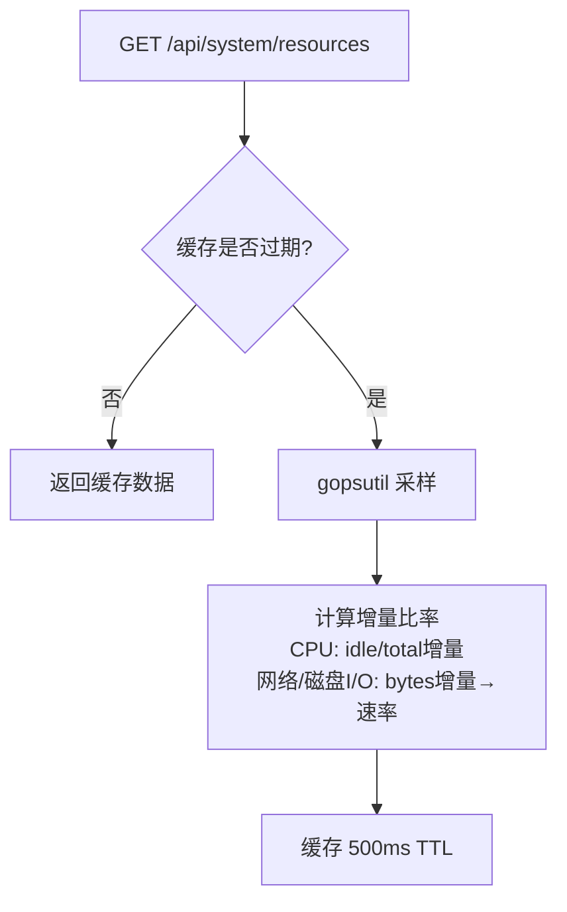
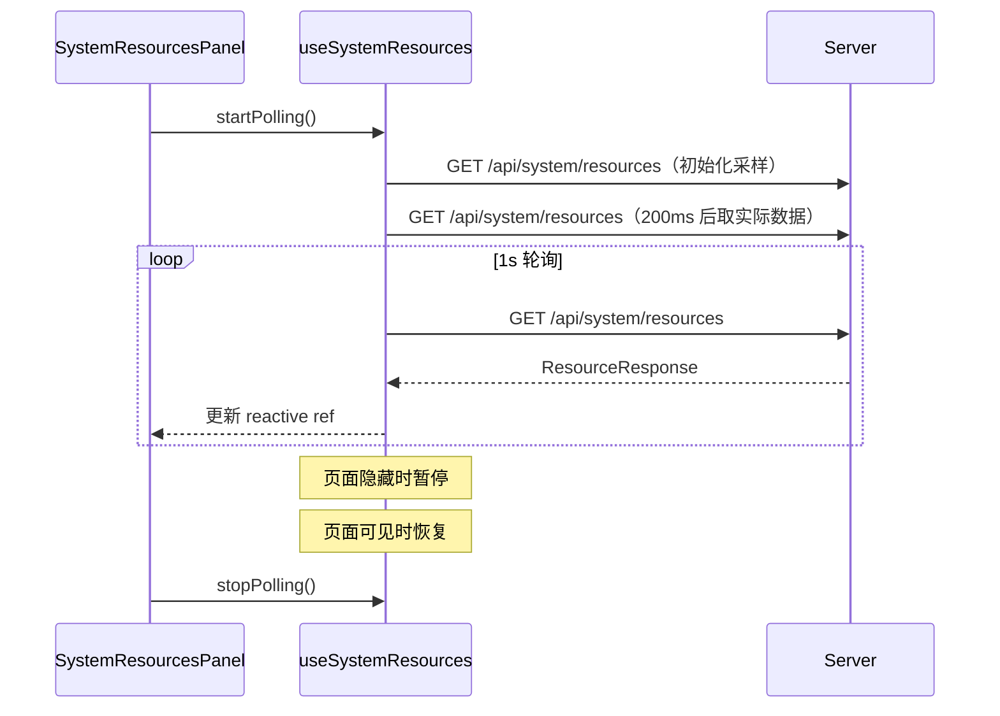

# 系统资源监控

系统资源监控让用户在手机上实时了解服务器状态——CPU 占用多高？磁盘还剩多少空间？网络带宽是否饱和？这些信息对判断 AI Agent 执行慢的原因至关重要：可能是 CPU 被其他进程占满，可能是磁盘 I/O 阻塞了文件操作，也可能是网络延迟影响了 API 响应。前端 `SystemResourcesPanel` 组件在 AppHeader 的 Gauge 图标弹出菜单中展示实时数据，后端 `gopsutil` 采集六类指标并通过 `GET /api/system/resources` 端点提供。

## 流程图

### 后端指标采集与缓存

### 前端轮询与暂停

首次请求初始化采样器状态（所有增量比率为零），200ms 后的第二次请求才能计算出 CPU 和网络速率的实际值。前端 composable 使用引用计数（`activeCount`）共享轮询定时器，多个消费者同时轮询不会创建多个定时器。

## 功能与设计要点

### 功能清单

- **六类系统指标**：CPU（占用百分比 + 核数）、内存（已用/总量/百分比，已用=总量-可用，排除 buffers/cache）、磁盘（数据目录所在分区用量）、磁盘 I/O（读/写速率 bytes/sec）、网络（上传/下载速率 bytes/sec，排除 loopback）、系统负载（1/5/15 分钟平均）。覆盖了判断 AI Agent 执行瓶颈所需的关键资源信息
- **实时资源面板**：`SystemResourcesPanel` 组件在 AppHeader 的 Gauge 图标弹出菜单中展示所有六类指标的实时数值，页面可见时自动轮询、隐藏时暂停。用户无需登录服务器即可了解运行环境状态
- **API 端点**：`GET /api/system/resources`（需认证）返回 `ResourceResponse` JSON，包含六类指标的完整数值。支持程序化访问（如定时任务的健康检查）

### 设计要点

- **500ms 缓存防采样间隔过短**：CPU 和网络速率需要两个采样点之间的时间差才能计算。并发请求若间隔过短，计算出的比率接近零。500ms TTL 缓存确保同一采样周期内的所有请求共享同一组数据，避免噪声
- **首次请求返回零值**：采样器首次调用时没有前一个采样点，增量比率全部为零。前端在启动轮询时先发两次请求（间隔 200ms），第二次请求才能得到有意义的数值——这是采样器的设计特性，不是 bug
- **内存已用排除缓存**：Linux 上 `MemoryInfo.Used = Total - Available`，而非 `Total - Free`。`Available` 包含可回收的 buffers/cache，更能反映实际可用内存
- **网络速率排除 loopback**：只统计非 loopback 接口的上传/下载速率，loopback 流量（如本机 WebSocket）不计入——用户关心的是对外网络带宽，而非内部通信
- **磁盘用量按数据目录分区**：报告数据目录（`model.DataDir` 或 "."）所在分区的用量，而非根分区。ClawBench 的所有数据（SQLite、上传文件、RAG 索引）存储在数据目录，该分区的空间才是真正需要关注的
- **引用计数共享轮询**：多个组件同时使用 `useSystemResources` 时，引用计数确保只有一个定时器运行。最后一个消费者调用 `stopPolling()` 才真正停止轮询，避免资源浪费
