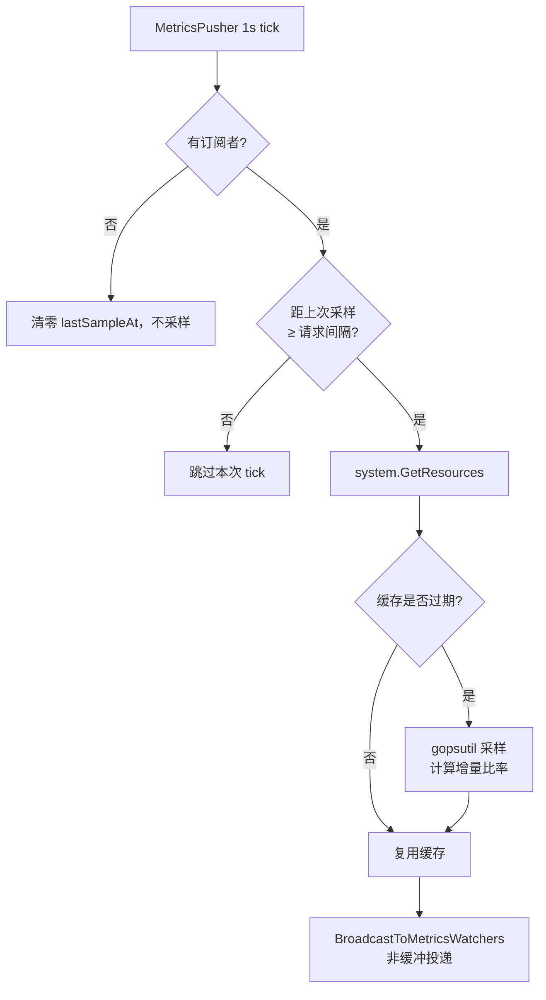
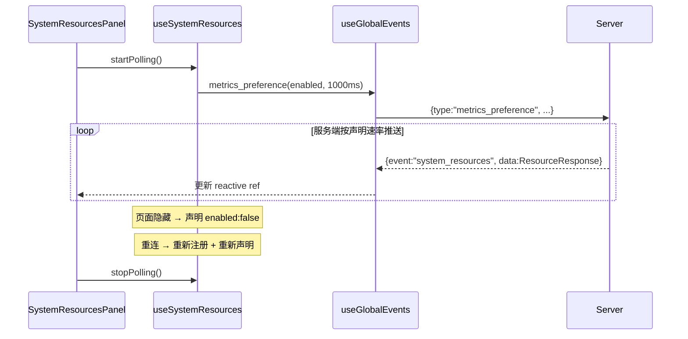

# 系统资源监控

系统资源监控让用户在手机上实时了解服务器状态——CPU 占用多高？磁盘还剩多少空间？网络带宽是否饱和？这些信息对判断 AI Agent 执行慢的原因至关重要：可能是 CPU 被其他进程占满，可能是磁盘 I/O 阻塞了文件操作，也可能是网络延迟影响了 API 响应。前端 `SystemResourcesPanel` 组件在 AppHeader 的 Gauge 图标弹出菜单中展示实时数据，后端 `gopsutil` 采集六类指标，经 `service.MetricsPusher` 通过 WebSocket 按需推送给已声明的订阅者。

## 流程图

### 后端按需采样与推送

### 前端订阅与声明

`MetricsPusher` 在启动时预热一次采样器：`GetResources` 首次调用没有前一个采样点，增量比率全为零。预热后第一帧推送即为真实速率，因此前端不再需要旧版"间隔 200ms 发两次请求"的绕行。

## 功能与设计要点

### 功能清单

- **六类系统指标**：CPU（占用百分比 + 核数）、内存（已用/总量/百分比，已用=总量-可用，排除 buffers/cache）、磁盘（数据目录所在分区用量）、磁盘 I/O（读/写速率 bytes/sec）、网络（上传/下载速率 bytes/sec，排除 loopback）、系统负载（1/5/15 分钟平均）。覆盖了判断 AI Agent 执行瓶颈所需的关键资源信息
- **实时资源面板**：`SystemResourcesPanel` 组件在 AppHeader 的 Gauge 图标弹出菜单中展示所有六类指标的实时数值。AppHeader 的 Server 图标在系统资源压力异常时（CPU/内存超过阈值）切换为压力指示图标，提醒用户关注资源状态。WS 断线或重连期间隐藏资源数据，改为展示连接状态指示器——断线时显示 `WifiOff` 图标（红色），重连中显示 `LoaderCircle` 旋转图标（黄色），避免展示过时数据误导用户
- **API 端点**：`GET /api/system/resources`（需认证）返回 `ResourceResponse` JSON，包含六类指标的完整数值。保留供程序化访问（如任务的健康检查）；UI 已不再使用它，不用时零成本（采样是惰性的）

### 设计要点

- **按订阅需求采样，而非定时推送**：`MetricsPusher` 每秒检查 `Manager.MetricsDemand()`，只有在存在**已连接且已声明**的订阅者时才采样。无订阅者时不触碰采样器——这是把旧版"每个打开的标签页永远每 5s 请求一次"（全站请求量第一的端点，累计 12 万次）压到与实际观看人数成正比的关键
- **速率由客户端声明，服务端取最快值**：客户端用 `metrics_preference` 声明期望间隔（前台 1000ms / 后台 5000ms / 关闭），服务端钳制到 `[1000ms, 60000ms]` 后按多个订阅者中的**最小间隔**采样，同一帧推给所有订阅者。混合速率时慢客户端会多收，接受这一点以换取不做每客户端调度的简单性
- **遥测走独立的非缓冲投递路径**：`BroadcastToMetricsWatchers` 与 `BroadcastEvent` 的关键差异是**不写回放缓冲**。1Hz 遥测若进入 50 条的重连回放缓冲，会在一分钟内挤掉聊天/任务事件——这是真实功能回归，故有专门的回归测试守护。同样地，发送队列满时遥测**丢弃而不关闭连接**：为丢一帧指标而中断正在进行的聊天流式输出是更严重的故障
- **新连接清空偏好**：`Subscribe` 会重置 `metricsEnabled`。服务端无法区分"重连后仍想要"与"重连后永不声明"，保留陈旧标志会让采样器为已离开的客户端空转。客户端在 `watch(connected)` 里重新注册并重新声明，代价至多是一个间隔的空窗
- **不干净断开由 conn 门控兜底**：`MetricsDemand` 要求 `sub.conn != nil`。半开 socket 最多让需求多活约 10 分钟（读空闲超时 + ping 写失败强制关闭），有界且代价可忽略
- **500ms 缓存防采样间隔过短**：CPU 和网络速率需要两个采样点之间的时间差才能计算。500ms TTL 缓存确保同一采样周期内的所有请求共享同一组数据，避免噪声；worker 与 HTTP 端点共用同一采样器，不会重复读 `/proc`
- **内存已用排除缓存**：Linux 上 `MemoryInfo.Used = Total - Available`，而非 `Total - Free`。`Available` 包含可回收的 buffers/cache，更能反映实际可用内存
- **网络速率排除 loopback**：只统计非 loopback 接口的上传/下载速率，loopback 流量（如本机 WebSocket）不计入——用户关心的是对外网络带宽，而非内部通信
- **磁盘用量按数据目录分区**：报告数据目录（`model.DataDir` 或 "."）所在分区的用量，而非根分区。ClawBench 的所有数据（SQLite、上传文件、RAG 索引）存储在数据目录，该分区的空间才是真正需要关注的
- **引用计数共享声明**：多个组件同时使用 `useSystemResources` 时，引用计数确保只发一次声明。最后一个消费者停止才声明关闭，避免无谓的消息。前台（1s）与后台（5s）双模式按需切换
