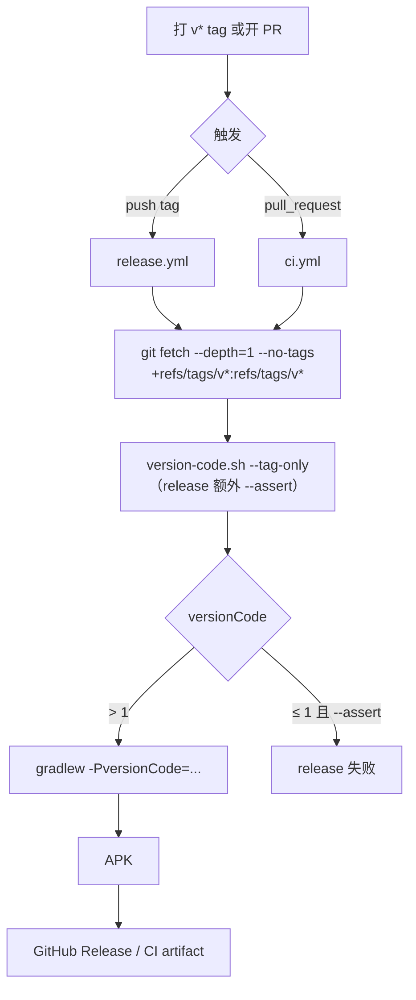
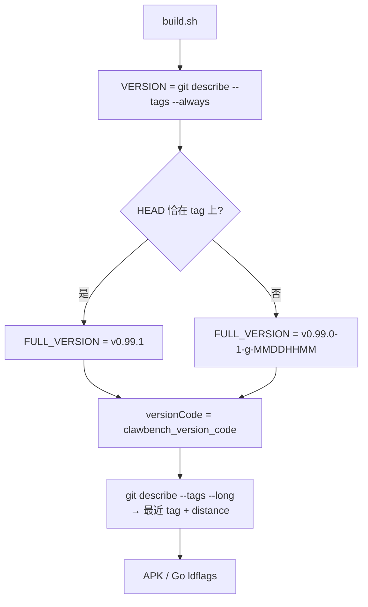

# 版本号策略

ClawBench 有**两套互不相关的版本号**，服务于两个不同的问题：

| | versionName | versionCode |
|---|---|---|
| 形态 | `v0.99.1` / `v0.97.0-51-g463667161` | 整数，如 `9901000` |
| 用途 | 人看、日志、UI 展示 | **Android 安装器判断能否覆盖安装** |
| 决定 | 服务端 `/api/health`、升级检查、Android 版本不匹配弹窗 | 系统是否允许安装 |
| 来源 | `git describe --tags --always` | 最近版本 tag（见下） |

**关键区分**：Android 的包安装器**只比 versionCode**，versionName 仅用于显示。所以「应用内提示版本不一致」与「系统拒绝安装」是两条独立的链路——前者看 versionName，后者看 versionCode。历史上曾把二者混为一谈，导致排查方向错误（见文末）。

## versionCode 公式

单一实现：`scripts/lib/version-code.sh`。`build.sh` 与两个 CI 工作流都调用它。

```
versionCode = major*100000000 + minor*100000 + patch*1000 + distance
```

`distance` = 距最近 `vX.Y.Z` tag 的提交数。取值示例：

| 版本 | 展开 | versionCode |
|------|------|-------------|
| v0.99.0 | `0*1e8 + 99*1e5 + 0*1e3 + 0` | 9900000 |
| v0.99.0 + 188 提交 | `0*1e8 + 99*1e5 + 0*1e3 + 188` | 9900188 |
| v0.100.0 | `0*1e8 + 100*1e5 + 0*1e3 + 0` | 10000000 |
| v1.0.0 | `1*1e8 + 0*1e5 + 0*1e3 + 0` | 100000000 |

### 位宽取值

`minor` 占 5 位（`*100000`）而非更直觉的 `*10000`：后者会让 `v0.100.0` 与 `v1.0.0` 同时塌成 1000000，`v1.0.0` 将**无法覆盖** `v0.100.0`。这是选择当前位宽的**唯一原因**。

字段上限（Android versionCode 封顶 2100000000）：

| 字段 | 上限 | 历史峰值 |
|------|------|---------|
| major | 20 | 0 |
| minor | 999 | 99 |
| patch | 99 | 8 |
| distance | 999（**钳位**，非报错） | 188 |

越界的 major / minor / patch **直接报错退出**，不静默截断——静默截断会产出错误的、可能更小的号。`distance` 超限只钳位到 999，因为它仅影响开发版之间的相对排序，不值得让一次发布失败。

### 两条取值路径

`distance` 需要提交图，而 CI 的 checkout 没有（见下）。因此按调用场景分两条路径：

| 调用方 | 入口 | 是否依赖提交历史 |
|--------|------|-----------------|
| CI（`ci.yml` / `release.yml`） | `--tag-only`，读最新 tag，distance 记 0 | **否**，零历史 |
| 本地 `build.sh` | `git describe`，含 distance | 是 |
| 裸跑 `./gradlew`（未传 `-PversionCode`） | `android/app/build.gradle` 的 `autoVersionCode()` Groovy 镜像兜底 | 是 |

CI 构建的就是 release tag，distance 本就是 0，所以两条路径在 release 场景下**必然同值**。在开发分支上 `--tag-only` 会报「基于哪个 release」而非带 distance 的值，这是刻意的。

### tag 排序

必须用 `git tag --sort=-v:refname`（版本序）。**字典序会把 `v0.99.1` 排在 `v0.100.0` 之后**，让前者拿到更大的 versionCode。

### 失败行为

- **无可用 tag** → fail-open 到 `1`（历史值），不阻塞构建
- **版本越界** → 退出码 2，**大声失败**
- **release 路径额外带 `--assert`**：versionCode ≤ 1 时整个 release 失败，防止再次静默产出不可安装的 APK

## 为什么不能用 `git rev-list --count HEAD`

这是本策略要修掉的原始缺陷，保留在此以免复发。

versionCode 曾由 `git rev-list --count HEAD` 生成。但 `actions/checkout@v4` **默认 `fetch-depth: 1`**，浅克隆里该命令恒返回 **1**。实测（`aapt dump badging`）：

| APK | versionCode | 构建环境 |
|-----|-------------|---------|
| GitHub Release v0.95.0 / v0.98.0 / v0.99.0 / v0.99.1 | **1** | CI 浅克隆 |
| 本地开发版 | **1167** | 全量克隆 |

后果是方向反转：更新的发布版（1）无法覆盖更旧的开发版（1167），Android 报「已安装更高版本」，而按 versionName 比较 v0.99.0 > v0.97.0-51 本是正确的。

### 仅换 `git describe` 还不够

改用 tag 推导后，PR 触发的 CI **仍然是 1**。根因在 `actions/checkout` 的 fetch refspec：

```
# pull_request —— tag 不可见
git fetch --no-tags --depth=1 origin +<sha>:refs/remotes/pull/483/merge
# push tag —— tag 可见
git fetch --no-tags --depth=1 origin +<sha>:refs/tags/v0.99.1
```

`--no-tags` 只禁「自动跟随 tag」，**显式 refspec 仍会创建 tag ref**。所以 tag push 路径一直正常，只有 PR 路径坏。

两个候选方案及实测结论：

| 方案 | 结果 |
|------|------|
| `fetch-tags: true` + `depth=1` | **无效**。它只是不再传 `--no-tags`，回退到 git 的 tag auto-follow，而 auto-follow 只跟随「指向已下载对象」的 tag；depth=1 只下了 merge commit，实测 tags 仍为空 |
| `fetch-depth: 0` | 有效但会拉全量历史，代价不必要 |

因此两个工作流各加一步**只拉 tag ref**：

```bash
git fetch --depth=1 --no-tags origin '+refs/tags/v*:refs/tags/v*'
```

实测该命令在 `depth=1` 下可拿到全部版本 tag，而**提交数仍为 1**（确实没拉历史）。

另一个不能只靠 `git describe` 的原因：它只在 HEAD 恰为 tag 或其后才反映 tag。PR 的 merge commit 不被任何 tag 覆盖，浅克隆下 `describe` 必失败。

## 流程图

### APK 版本号产生链路



### 本地开发版



## versionName 策略

- **APK 与 Go 后端同源**：都是 `git describe --tags --always`，APK 经 `-PversionName` 注入，Go 经 ldflags 注入 `internal/version.Version`
- **Go 侧回退链**（`internal/version/version.go`）：ldflags 注入值 → `vcs.revision` 短 SHA → `info.Main.Version` → `dev`
- **本地开发版加时间戳后缀**：`build.sh` 检测到 HEAD 不在 tag 上时追加 `-MMDDHHMM`，故形如 `v0.99.0-1-gd03109dc0-09220815`。同一提交多次构建因此可区分

versionName 参与的下游判断：

- 服务端 `/api/health` 返回的 `version`，供[应用自升级](self-upgrade.md)做版本检查
- Android 原生层在加载 WebView **之前**用 `VersionCompare.shouldShowMismatch` 对比 APK 与服务器版本（走 versionName，任一侧不可解析则 fail-open）

## 发布资产文件名

**每个 GitHub Release 资产的文件名都带 release tag**（如 `clawbench-linux-amd64-v0.99.1.zip`），这样下载到本地的文件自身就说明了版本，无需回到 Release 页对照。

tag 在 `release.yml` 顶层定义一次，全流程复用：

```yaml
env:
  RELEASE_TAG: ${{ github.ref_name }}   # tag，形如 v0.99.1（非裸版本号）
```

两条纪律：

- **打包步骤与上传步骤必须用同一个变量**。`zip -r "...-${RELEASE_TAG}.zip"` 与 `files: ...-${{ env.RELEASE_TAG }}.zip` 是两处独立插值；一旦拼写不一致，`files:` 匹配不到任何文件，`action-gh-release` **什么都不上传且 job 保持绿色** —— release 静默少一个平台。
- **版本号在文件名末尾、扩展名之前**（`<base>-<tag>.<ext>`），便于按前缀通配（`clawbench-linux-amd64-*.zip`）。

### 唯一例外：APK

`clawbench-android.apk` 的**构建产物名不可改**——Gradle 的 `outputFileName` 与 `go:embed` 路径（`assets/clawbench-android.apk`）都固定在无版本名上。因此发布时是**复制一份带版本副本**（`clawbench-android-${RELEASE_TAG}.apk`）上传，而非重命名构建产物；`/api/apk` 依旧读无版本名。

### 桌面端载荷包（增量升级）

桌面端全量包约 150MB，其中 Electron 运行时占 ~98%，**应用自身只有 `resources/` 目录（~3.8MB）**。因此除全量包外，每个平台还发布一个**载荷包** `<base>-payload-<tag>.zip`（如 `clawbench-desktop-linux-x64-payload-v0.99.1.zip`），客户端把它安装到从当前运行版本克隆出的目录上，从而复用运行时。

- **载荷边界 = 整个 `resources/` 目录**。`resources/` 之外的一切都是 Electron 运行时（二进制、`resources.pak`、`icudtl.dat`、`locales/`、各 `.so`/`.dll`），可以复用；`resources/` 之内都是自有资源，必须换新。**注意 `resources/app-update.yml` 只在 Linux 存在、Windows 不存在**，所以不能手挑文件，必须整体复制 `resources/`。
- **归档必须从 `payload/` 内部进行**，使条目为 `payload.json` + `resources/…`。二者**不共享顶层目录**，因此 `install.ts` 的 `extractZip` 不会剥掉前缀。若条目全在 `resources/` 下，该前缀会被剥掉，`app.asar` 会落到应用根目录而非 `resources/` 内。
- **`payload.json` 记录 Electron 版本**，客户端按**主版本**比对（原生模块 ABI 只随主版本变）。不匹配则回退全量下载。CI 用 Node 脚本（`desktop/scripts/stage-payload.mjs`）而非 PowerShell 通配复制，因为 `resources/` 内含点文件（`cpu-features` 的 `.eslintrc.js`、`.clang-format`），而 PowerShell 的 `*` 会静默漏掉隐藏项。
- **macOS 不发布载荷**。替换已签名 `.app` 内的 `resources/app.asar` 会破坏代码签名封条，Apple Silicon 拒绝运行无效签名，故 macOS 保持全量下载。`desktopPayloadAssetBase` 中 darwin 键**缺席**（而非空数组），客户端据此走全量。
- **失败静默性**：客户端把任何载荷问题（镜像 404、ABI 不符、归档损坏）都降级为全量下载，所以载荷资产名不一致**不会报错**，只会让每次升级又下 150MB。因此资产名由 `scripts/__tests__/releaseAssets.test.ts` 做跨语言比对（`release.yml` ↔ Go `desktopPayloadAssetBase`）。

### 下游影响

- **桌面端下载 URL 必须带 tag**：`internal/service/desktop_upgrade.go` 的 `desktopAssetBase` 只存基名，`desktopAssetName(osArch, tag)` 拼上 tag。因为名字含版本，**不存在** `releases/latest/download/<名>` 这种稳定链接，URL 一律由服务端上报的 tag 拼出。
- **README 的手工下载命令**：稳定链接已不可用，改为先解析最新 tag（`curl -sI .../releases/latest` 取 `Location`）再拼 URL；`docs/timer/deploy.md` 用 `--pattern "clawbench-linux-amd64-*.zip"` 通配。

## 发布版本号递增规则

由 `docs/timer/release.md` 的发布流程决定，与本文件的 versionCode 公式正交：

- `0.x.x` 阶段：含 `feat:` → minor 升级；仅 `fix:`/`perf:`/`refactor:` 等 → patch 升级
- `BREAKING CHANGE` 在 `0.x` 阶段仍只升 minor；仅在明确宣布 API 稳定、准备发 `1.0.0` 时才升 major
- 新 tag 一旦产生，下一个 release 的 versionCode 自动跟随（tag 是唯一输入）

## 测试

`scripts/__tests__/versionCode.test.ts`（24 个用例）直接执行真实实现，而非手抄公式：

- **公式**：映射表、`v0.100.0` 与 `v1.0.0` 不撞码、开发版夹在两 release 之间的排序
- **tag-only 模式**：版本序排序（含 `v0.100.0` vs `v0.99.1` 专项）、忽略非版本 tag、无提交图可用、无 tag 回退 1
- **边界**：fail-open、`distance` 钳位、越界报错（退出码 2）、`--assert`
- **漂移守护**：四处不得再出现 `rev-list --count`；CI 必须用 `--tag-only`；APK job 不得出现 `fetch-depth: 0`
- **Groovy 一致性**：用**真实 Gradle** 执行 `build.gradle` 里的 `autoVersionCode()`，与 shell 实现在同一仓库上逐值比对（未安装 Gradle 时跳过）

变异验证（均需有测试变红，否则是同义反复）：窄位宽 / Gradle 副本改回 `rev-list` / 删 `--assert` / fail-open 改 0 / 字典序排序 / 去掉 `--tag-only` / 给 APK job 加 `fetch-depth: 0`。

资产名的漂移守护在 `scripts/__tests__/releaseAssets.test.ts`（8 用例），按步骤边界扫描 `release.yml`（非整文件正则，故注释里提到资产名不会误判通过）：

- 顶层必须有 `RELEASE_TAG` 定义（单一来源）
- 每个 `action-gh-release` 的 `files:` 都含 `RELEASE_TAG`（覆盖行内与 `|` 块两种写法）
- 每个 `zip -r` / `Compress-Archive` 的产出名都含 `RELEASE_TAG`
- 两侧变量拼写一致（`${RELEASE_TAG}` / `$env:RELEASE_TAG` 对 `${{ env.RELEASE_TAG }}`）
- APK 例外：无版本 embed 路径仍在，且带版本的复制与上传两半都在
- Go 侧 `desktopAssetName` 由 base+tag 拼出，且源码里不再有裸 `clawbench-desktop-*.zip` 字面量
- 载荷资产名跨语言一致：`release.yml` 打包的三个 basename 与 Go `desktopPayloadAssetBase` 逐项相等，且 macOS 不得出现在该 map 中（载荷失败会静默降级为全量下载，名字不一致不会报错）

变异验证 4/4（均实测变红）：改回无版本归档名 / 上传 pattern 去掉 tag / 删掉 APK 版本化复制 / Go 资产名丢 tag。载荷守护另验：重命名 CI 载荷资产名 → 跨语言比对变红。

## 历史遗留

v0.95.0 ~ v0.99.1 的 GitHub Release APK 仍带 `versionCode=1`（缺陷期产物），**未回溯修复**。用户需卸载旧版后重装，或等待下一个含修复的 release。新规则下本地重建的开发版会拿到远大于 1167 的值，可直接覆盖安装。

## 相关

- [应用自升级](self-upgrade.md) — versionName 的下游消费者（升级检查、Android 版本不匹配弹窗）
- [Android 集成](../client/android-integration.md) — APK 嵌入与 `/api/apk` 下发
- `docs/timer/release.md` — 发布流程与 tag 递增规则
