# ClawBench 移动端使用说明

> 本文面向在**手机 / 平板浏览器**或 **Android App** 上使用 ClawBench 的用户。截图取自 390×844 的手机竖屏布局，与你的实际界面一致。
> 桌面端专属功能（宽屏三栏、鼠标右键菜单、悬停操作、快捷键）不在本文范围，详见[桌面端使用说明](user-guid.md)。
>
> 全文按 **快速上手 → 功能详解 → Android App 与进阶** 组织。功能详解部分逐项展开每个子功能。

---

## 目录

**第一部分：快速上手**
- [1. 登录](#1-登录)
- [2. 选择项目](#2-选择项目)
- [3. 界面总览：底部 Dock](#3-界面总览底部-dock)
- [4. 发起第一次对话](#4-发起第一次对话)

**第二部分：功能详解**
- [5. AI 对话](#5-ai-对话)
  - [5.1 输入栏](#51-输入栏) · [5.2 斜杠命令](#52-斜杠命令) · [5.3 附件与引用](#53-附件与引用) · [5.4 消息操作](#54-消息操作) · [5.5 语音输入](#55-语音输入) · [5.6 工具调用与权限审批](#56-工具调用与权限审批) · [5.7 提问卡与推荐回复](#57-提问卡与推荐回复)
- [6. 会话管理](#6-会话管理)
  - [6.1 会话列表](#61-会话列表) · [6.2 会话搜索](#62-会话搜索) · [6.3 标签](#63-标签) · [6.4 左右滑动切换会话](#64-左右滑动切换会话) · [6.5 分叉与回溯](#65-分叉与回溯)
- [7. 文件管理](#7-文件管理)
  - [7.1 工具栏](#71-工具栏) · [7.2 长按菜单](#72-长按菜单) · [7.3 预览窗格](#73-预览窗格) · [7.4 多选](#74-多选)
- [8. 文件查看与编辑](#8-文件查看与编辑)
  - [8.1 类型总览](#81-支持的文件类型总览) · [8.2 Markdown](#82-markdown) · [8.3 代码](#83-代码) · [8.4 图片与媒体](#84-图片与媒体) · [8.5 下载、导出与分享](#85-下载导出与分享)
- [9. 终端](#9-终端)
  - [9.1 标签与虚拟按键栏](#91-标签与虚拟按键栏) · [9.2 手势](#92-手势)
- [10. Git 管理](#10-git-管理)
- [11. 任务](#11-任务)
- [12. 数据统计](#12-数据统计)
- [13. 设置](#13-设置)

**第三部分：Android App 与进阶**
- [14. Android App 专有功能](#14-android-app-专有功能)
  - [14.1 安装与连接服务器](#141-安装与连接服务器) · [14.2 悬浮状态窗](#142-悬浮状态窗) · [14.3 灵动岛](#143-灵动岛) · [14.4 原生推送](#144-原生推送) · [14.5 屏幕常亮与后台端口转发](#145-屏幕常亮与后台端口转发) · [14.6 终端音量键方向键](#146-终端音量键方向键) · [14.7 重配服务器与 APK 自更新](#147-重配服务器与-apk-自更新) · [14.8 系统返回键](#148-系统返回键)
- [15. 网页移动端：PWA 安装与 APK 下载](#15-网页移动端pwa-安装与-apk-下载)
- [16. 手势与触屏操作速查](#16-手势与触屏操作速查)
- [17. 多项目与 Worktree](#17-多项目与-worktree)
- [18. 常见问题](#18-常见问题)

---

# 第一部分：快速上手

## 1. 登录

在手机浏览器里打开你的 ClawBench 地址（如 `https://your-server:20000`），输入访问密码即可。

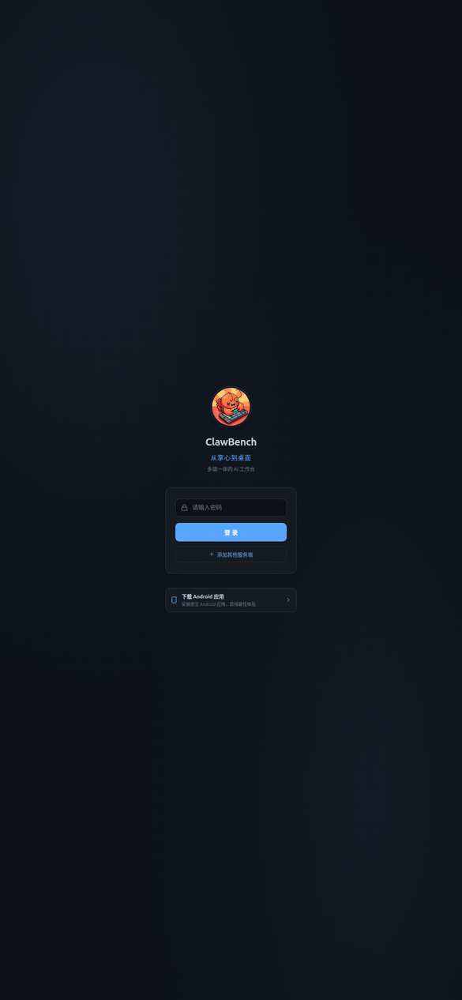

- **网页模式**：浏览器会记住登录状态（Cookie 有效期 7 天）。过期后任意请求返回 401，页面会自动跳回登录页重新认证，无需手动清理。
- **App 模式**：首次连接服务器后凭据保存在本地，之后自动登录，不必每次输密码。

> **提示**：手机浏览器推荐用 **Chrome**。它可以把这个页面**安装到主屏幕**，之后从桌面图标打开就是全屏无地址栏的体验，接近原生 App。详见 [15. PWA 安装](#15-网页移动端pwa-安装与-apk-下载)。

## 2. 选择项目

ClawBench 的一切操作（会话、文件、Git、任务）都绑定在某个**项目目录**上。

点顶栏左侧的项目名展开下拉：

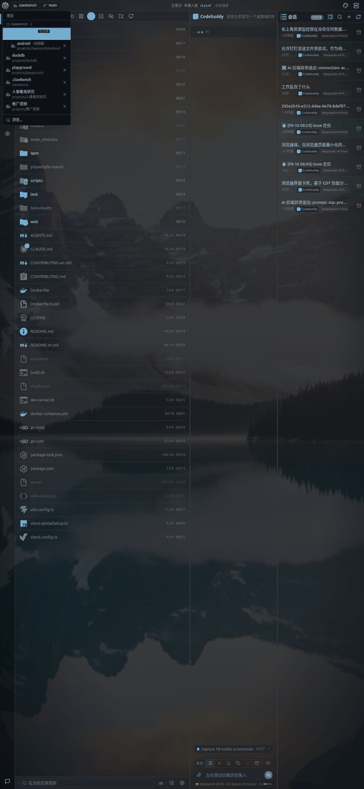

- **最近项目**：列出你打开过的项目，点一下即切换
- **新建项目**：输入服务器上的绝对路径，把该目录加为项目
- **移除**：条目右侧的移除按钮（仅从列表移除，不动磁盘文件）

切换项目后，会话列表、文件管理器、Git 历史都会跟着切到新项目。

## 3. 界面总览：底部 Dock

窄屏下所有功能入口都在**底部 Dock**：

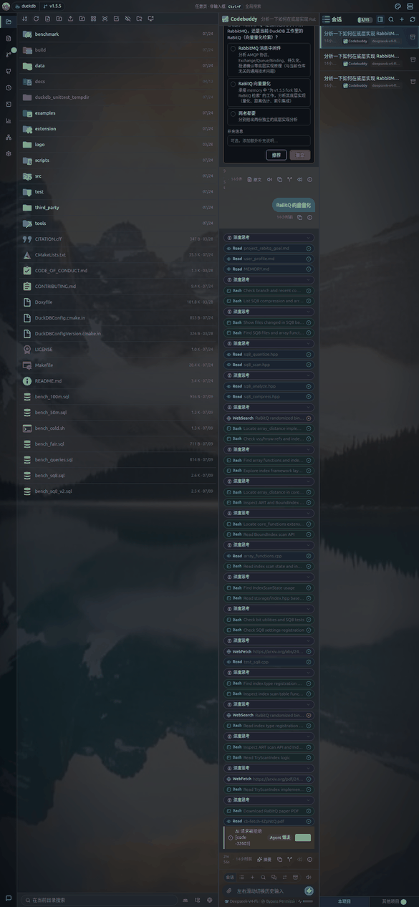

### 3.1 图标顺序与角标

从左到右固定为：

| 位置 | 图标 | 作用 | 角标含义 |
|---|---|---|---|
| 1 | 会话 | AI 对话与会话列表 | 未读消息数 |
| 2 | 文件管理器 | 浏览、预览、编辑文件 | — |
| 3 | 文件 | 当前打开的查看器 | — |
| 4 | 项目历史 | Git 提交、分支、标签、工作树 | 工作区变更数 |
| 5+ | 溢出项 | 见下 | 各项各自计数 |
| 末尾 | 更多 | 溢出菜单（空间不足时出现） | 聚合剩余角标 |

溢出项按固定顺序排列：**议题与合并请求 → 任务 → 终端 → 数据统计 → 端口映射 → 设置**（设置恒定最后，作为「出口」）。

> **注意**：Dock 图标上的角标是**未读/待处理提示**。点开对应页签后角标会清零。

### 3.2 溢出菜单

手机屏幕窄，Dock 放不下全部页签时，多出来的会收进「更多」按钮：

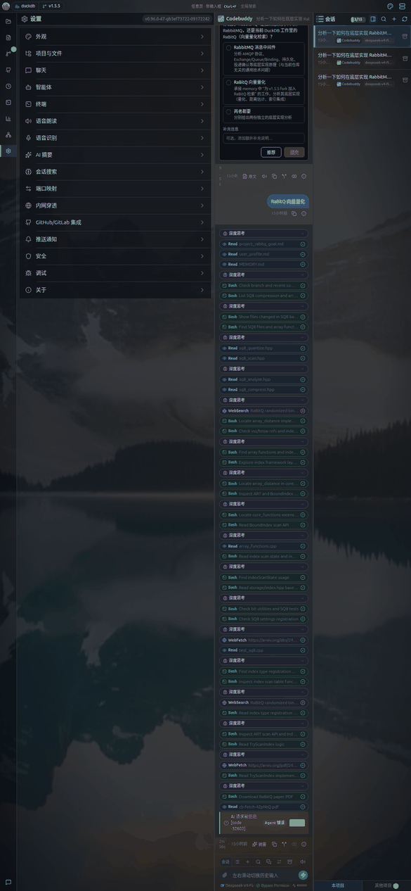

点「更多」弹出菜单，选择要去的页签。当前激活的页签如果在溢出菜单里，按钮会高亮。

### 3.3 全屏面板与二级抽屉

这一点与桌面端差别很大，值得先说清：

- **主面板是占满全屏的**。点 Dock 上的页签，对应的面板会**铺满整个屏幕**（顶部标题栏 + 内容区 + 底部 Dock）。它不是从底部弹出的抽屉。
- **抽屉（BottomSheet）只用于二级内容**。比如会话搜索、附件选择、工具调用详情、目录 TOC、按键配置——这些从底部滑出，带一个拖拽手柄，**点顶部标题或下滑即可关闭**。

所以你的操作模式是：**Dock 切主功能 → 主面板里点按钮开抽屉**。

## 4. 发起第一次对话

进入「会话」页签，底部输入框输入需求，点发送：

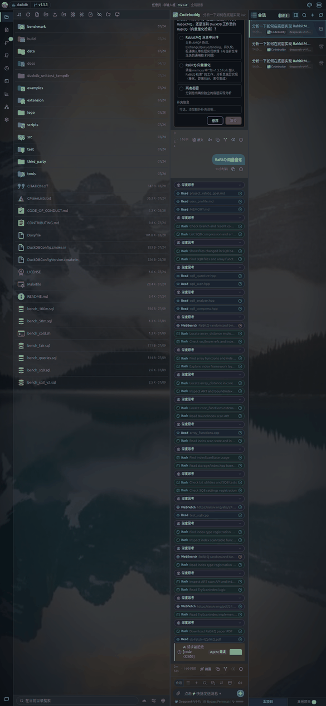

- 输入框在**屏幕最底部**，紧贴 Dock 上方，单手可及
- 键盘弹出时输入框会自动上推，不会被键盘遮住
- 发送后 AI 的回复以流式方式逐字显示
- 聊天区顶部显示**当前智能体图标 + 会话标题**，点标题可重命名

> **提示**：还没有会话时，输入框上方会有「新建会话」入口，会先让你选智能体（见 [5. AI 对话](#5-ai-对话)）。

---

# 第二部分：功能详解

## 5. AI 对话

### 5.1 输入栏

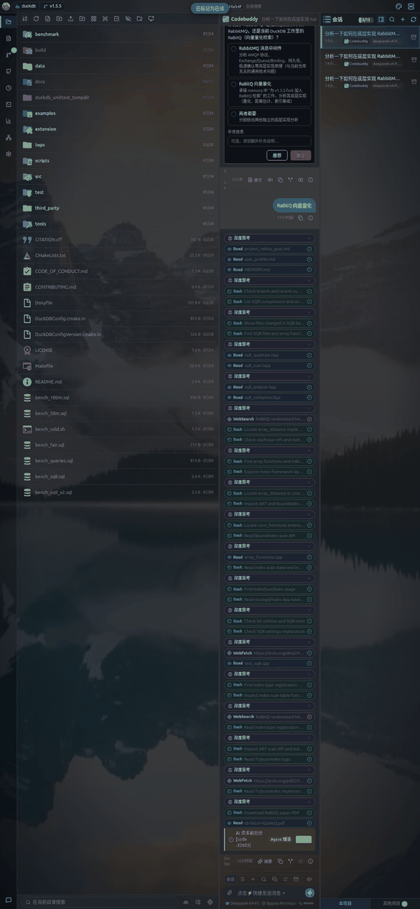

输入栏从上到下：

| 区域 | 内容 |
|---|---|
| 顶部操作条 | 新建会话、会话列表、搜索、消息索引、归档等（横向可滚动） |
| 输入区 | 多行文本框，`Enter` 发送、`Shift+Enter` 换行（软键盘上是换行键） |
| 底部按钮 | 左侧附件、右侧发送 |

> **注意**：顶部操作条在窄屏下**文字标签会隐藏**，只留图标以节省宽度；左右滑动可看到更多按钮。

### 5.2 斜杠命令

在输入框开头输入 `/` 会弹出命令补全菜单，可快速调用内置命令（如 `/cb-chatsearch` 搜索历史会话、`/cb-task` 管理任务、`/cb-usage` 查用量），以及当前智能体支持的技能命令。

- 继续输入可**模糊筛选**
- 点候选项即插入该命令
- 按 `Esc` 或点空白处关闭菜单

### 5.3 附件与引用

点输入栏左侧的附件按钮，从底部弹出附件抽屉：

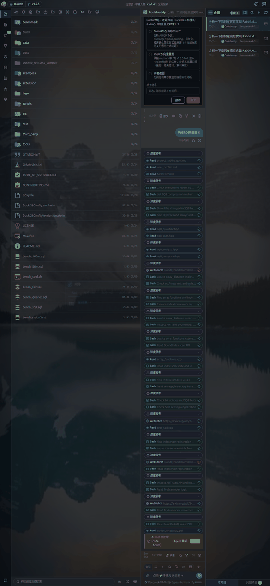

抽屉里有几个来源：

| 标签 | 内容 |
|---|---|
| 上传文件 | 从手机相册 / 文件选择器上传 |
| 当前 | 当前项目目录下的文件 |
| 最近引用 | 最近在聊天里引用过的文件 |
| 最近分享 | 通过系统「分享到 ClawBench」进来的文件（App 模式） |
| 最近上传 | 你最近上传过的文件 |

选中文件后会变成输入框下方的**附件标签**，发送时一并带给 AI。

> **提示**：也可以直接把图片/文件**粘贴**进输入框，或从系统相册**分享**到 ClawBench（App 模式，见 [14. Android App](#14-android-app-专有功能)）。

### 5.4 消息操作

每条消息下方有一排操作按钮：

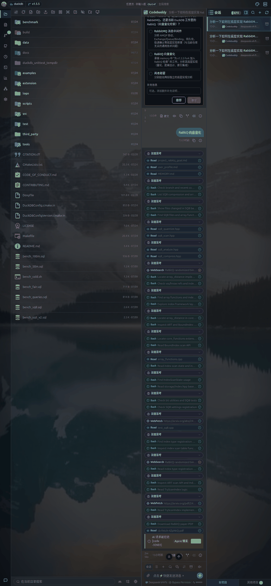

| 按钮 | 作用 |
|---|---|
| 复制 | 复制消息全文 |
| 朗读 | 用 TTS 朗读（需在设置里配置语音） |
| 分叉会话 | 从这条消息开一个新会话，继承之前的上下文 |
| 回溯会话 | 回到这条消息的状态，之后的对话被丢弃 |
| 查看详情 | 查看 token 用量、模型、耗时等元信息 |

> **注意**：桌面端这些按钮**悬停才出现**，触屏没有 hover——所以在手机上它们是**常显**的，直接点即可。

### 5.5 语音输入

**长按发送按钮**约 0.5 秒开始录音，松开结束：

- 录音期间附件按钮变为录音按钮
- 录音结束后自动走语音识别（STT），识别结果填进输入框
- 需要先在 **设置 → 语音识别** 里配置好 STT 服务

> **注意**：手机端没有独立的麦克风按钮——**长按发送键**就是语音入口。这是为了避免按钮过多。

### 5.6 工具调用与权限审批

AI 执行工具（读写文件、跑命令）时，聊天里会出现工具调用卡片：

- 点卡片展开**工具详情抽屉**，查看完整参数与输出
- 需要授权的操作（如执行 shell 命令）会弹出**审批卡片**，可选择允许一次 / 总是允许 / 拒绝
- 审批卡片上的按钮在触屏可直接点击

### 5.7 提问卡与推荐回复

AI 需要你补充信息时会给出**提问卡**（带选项按钮），点选即回复。

回复结束后，输入框上方可能给出**推荐回复**，点一下直接填入输入框，可再编辑后发送。

## 6. 会话管理

### 6.1 会话列表

「会话」页签内含会话列表与当前对话。列表按项目隔离——**每个项目有自己的会话集合**。

每条会话显示标题、智能体图标、运行状态、未读标记。**长按**会话条目弹出操作菜单：

- 置顶 / 取消置顶
- 重命名
- 设置标签
- 归档

> **注意**：归档是**单向**的，归档后不能从界面取消归档。

### 6.2 会话搜索

点输入栏的「搜索会话」按钮，从底部弹出搜索抽屉：

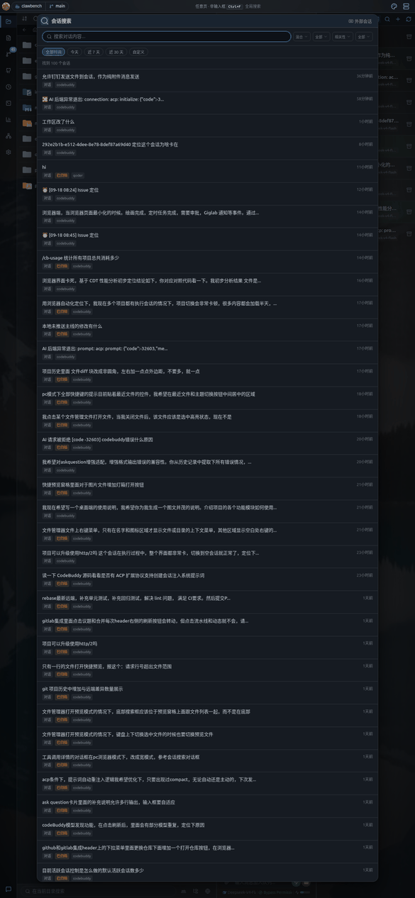

支持**混合检索**（关键词 + 语义向量），可按会话范围（当前项目 / 外部 / 全部）、匹配方式、时间范围筛选。结果里会高亮命中的片段，点击直接跳到对应消息。

### 6.3 标签

在会话的长按菜单里选「设置标签」，弹出标签弹窗：

- 列出**全局标签 + 当前项目标签**，点卡片选中 / 取消，支持多选
- 输入框可**新建标签**
- 标签按项目隔离——同名标签在不同项目里是独立的

设置好标签后，会话列表顶部会出现**过滤栏**，点标签即可筛选。

### 6.4 左右滑动切换会话

在对话区域**左右滑动**可快速切换上/下一个会话，滑动时屏幕中央显示会话位置指示器。

> **注意**：这个功能**默认关闭**，需要先在 **设置 → 聊天** 里打开「滑动切换会话」。开启后左滑=下一个、右滑=上一个（阈值 80px、500ms 内完成）。

### 6.5 分叉与回溯

- **分叉**：从某条消息开新会话，保留该消息之前的全部上下文，适合「换个方向再问」
- **回溯**：回到某条消息时的状态，之后的消息被丢弃，适合「刚才答得不对，重来」

两者都在消息操作条里，也支持从会话长按菜单进入。

## 7. 文件管理

### 7.1 工具栏

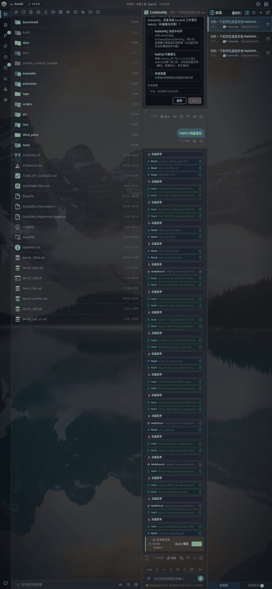

顶部工具栏（窄屏下部分按钮收进溢出）：

| 按钮 | 作用 |
|---|---|
| 排序 | 按名称 / 时间 / 后缀 / 大小排序 |
| 刷新 | 重新读取当前目录 |
| 新建文件 / 新建文件夹 | 在当前目录创建 |
| 上传文件 | 从手机选择文件上传 |
| 上传文件夹 | 上传整个目录（仅网页模式） |
| 图标视图 / 列表视图 | 切换显示模式 |
| 预览模式 | 开启后单击文件即预览（见下） |
| 多选 | 进入批量操作 |
| 跳转 | 直接输入路径跳转 |
| 显示隐藏文件 | 切换 `.` 开头文件可见性 |

面包屑在工具栏下方，点任意一级可跳回。**返回上一级**按钮在目录层级 > 1 时出现。

### 7.2 长按菜单

**长按**文件或目录约 0.45 秒，弹出上下文菜单（替代桌面端的右键）：

- 文件：复制、剪切、拷贝路径、重命名、下载、添加到聊天、删除、在此打开终端
- 目录：额外有「打包下载」「打开为项目」

在**空白处**长按则弹出目录级菜单（粘贴、新建文件、新建文件夹、在此打开终端）。

### 7.3 预览窗格

开启工具栏的**预览模式**后，文件管理器下方会出现一个停靠的预览窗格：

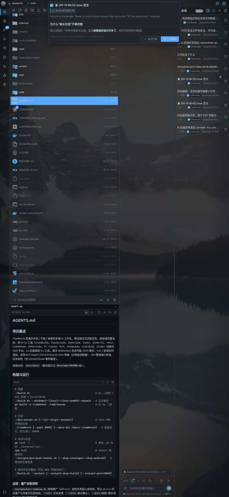

- **单击**文件即在下方窗格预览，不离开列表
- 预览窗格与列表之间有**分隔条**，可上下拖动调整高度
- **再点一次**同一个文件（或点窗格里的「打开」）才进入完整查看器

> **注意**：这个「点一次预览、点两次进入」的行为**只在开启预览模式时成立**。未开启时单击文件不会进入，需要用其他方式打开（如长按菜单）。

### 7.4 多选

点工具栏「多选」进入批量模式，工具栏替换为多选操作条：

| 按钮 | 作用 |
|---|---|
| 退出多选 | 返回普通模式 |
| 全选 | 选中当前目录全部条目 |
| 复制 / 剪切 | 批量复制剪切 |
| 打包下载 | 选中项打包为 zip 下载 |
| 分享 | 批量分享（仅 App 模式） |
| 删除 | 批量删除 |

点条目即切换选中状态，选中的条目有高亮边框。

## 8. 文件查看与编辑

### 8.1 支持的文件类型总览

| 类型 | 扩展名 | 查看方式 |
|---|---|---|
| 代码 | `.ts .js .go .py .rs .java .c .cpp` 等 | CodeMirror 编辑器（可编辑） |
| Markdown | `.md` | 渲染视图 + TOC |
| 图片 | `.png .jpg .gif .webp .svg` | 图片查看器 + 灯箱 |
| 音频 | `.mp3 .wav .m4a` | 内联播放器 |
| 视频 | `.mp4 .webm` | 内联播放器 |
| PDF | `.pdf` | 分页渲染 |
| Word | `.docx` | 文档视图 |
| Excel | `.xlsx` | 表格视图（多 Sheet） |
| PPT | `.pptx` | 逐页渲染 |
| OpenAPI | 含 `openapi` 字段的 YAML/JSON | Swagger UI |
| Excalidraw | `.excalidraw` | 内嵌画布编辑器 |
| 其他 | 任意 | 文本查看 |

### 8.2 Markdown

Markdown 渲染支持标题、列表、表格、代码块、公式、Mermaid 图、内嵌图片。

- 工具栏的**目录**按钮唤出 TOC 抽屉，点标题跳转
- 表格支持横向滚动查看宽表
- 公式（LaTeX）渲染为排版后的数学符号

### 8.3 代码

CodeMirror 编辑器，支持**浏览 / 编辑双模式**：

- 语法高亮、行号、自动换行、粘性滚动
- `Mod+F` 搜索
- 编辑态下 `Mod+S` 保存回原文件
- 基于 tree-sitter 的符号提取（函数/类列表）

### 8.4 图片与媒体

- 图片：适应窗口显示，右上角显示「当前序号 / 总数」，可左右滑动或点箭头在同目录图片间切换；**双指捏合缩放**
- 灯箱：点工具栏灯箱按钮全屏查看
- 音频/视频：内联播放器，支持播放暂停、进度拖动、音量
- PDF / PPT：**双指捏合缩放**

### 8.5 下载、导出与分享

- **下载**：长按菜单或工具栏的下载按钮
- **导出 HTML**：把 Markdown / 代码导出为独立 HTML
- **分享链接**：生成只读公开链接（在查看器的更多菜单里），任何拿到链接的人无需登录即可查看
- **App 模式分享**：调用系统分享面板，把文件发给其他 App

> **安全提示**：分享链接**链接即凭证**——任何拿到链接的人都能只读访问该文件，且关闭分享前一直有效。请勿分享敏感文件。

## 9. 终端

### 9.1 标签与虚拟按键栏

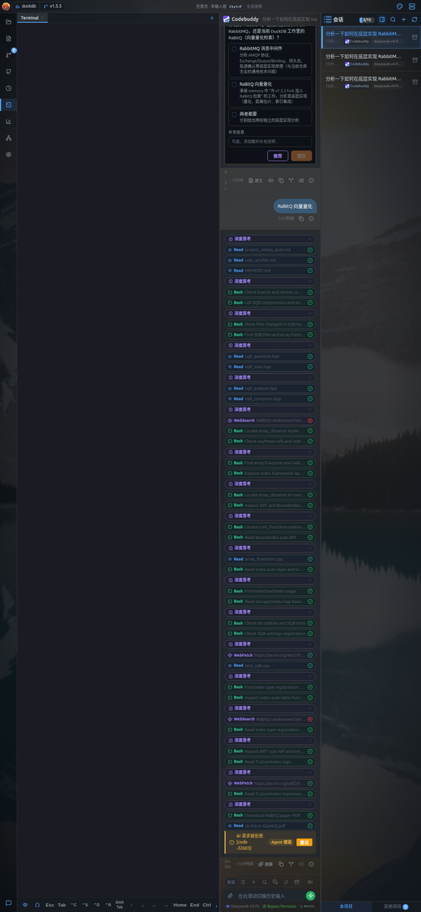

窄屏终端提供**虚拟按键栏**（桌面端没有）：

- `Esc`、`Tab`、方向键 `↑↓←→`、`Ctrl` 等常用键
- 顶部标签栏可开多个终端会话
- 终端字号可调

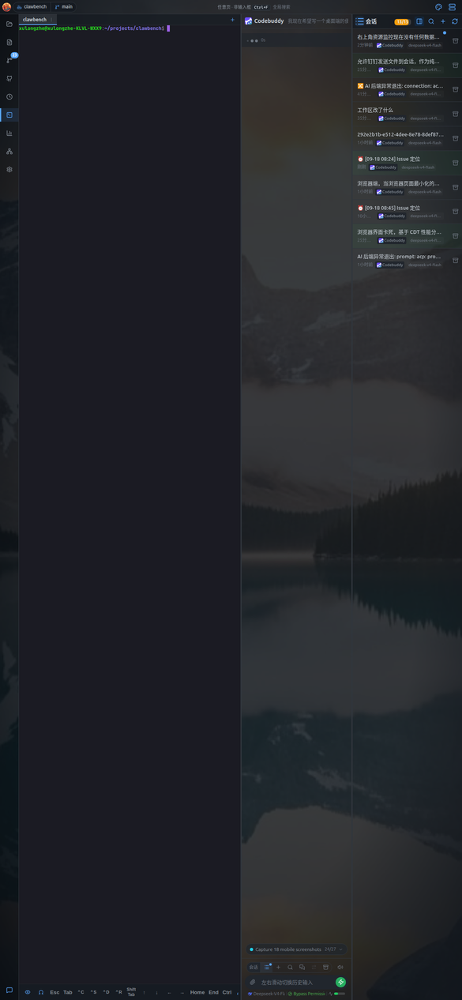

### 9.2 手势

终端支持丰富的手势操作（`useTerminalGestures.ts`）：

| 手势 | 作用 |
|---|---|
| 单指滑动 | 发送方向键（上/下/左/右） |
| 长按方向键 | 连续重复发送（500ms 后每 150ms 一次） |
| 双击 | 发送 `Tab`（用于补全） |
| 双指捏合 | 调整字号 |
| 双指上下滑 | `PageUp` / `PageDown` |

> **提示**：在 Android App 里，还可以用**音量键**当方向键，见 [14.6](#146-终端音量键方向键)。

## 10. Git 管理

「项目历史」页签展示当前项目的 Git 状态：

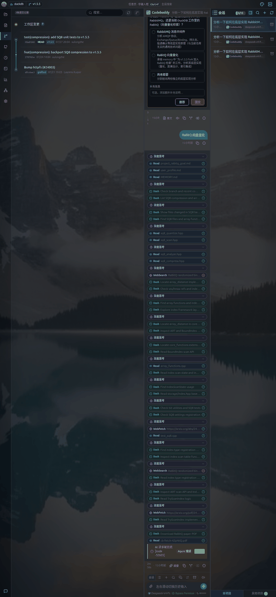

- **提交历史**：提交列表，点开看 diff；左右滑动可收起/展开分支图
- **管理**（工具栏按钮）：内含**分支 / 标签 / 工作树**三个标签页
  - 分支：查看、切换、删除
  - 标签：查看、删除
  - 工作树：查看、切换、作为项目打开
- **工作区变更**：未提交改动的文件列表，点文件看 diff

Diff 抽屉用红绿标出增删行，支持左右滑动查看长行。

## 11. 任务

「任务」页签管理定时任务与事件任务：

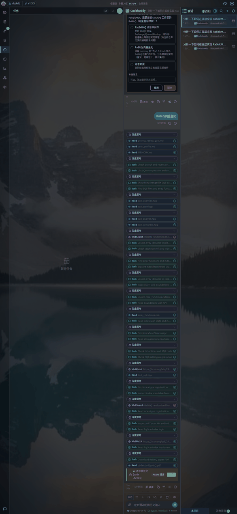

- **任务列表**：显示各任务的执行状态、下次执行时间、未读执行结果
- **新建任务**：设置任务名称、执行智能体、提示词、触发方式
  - **定时**：cron 表达式或可视化频率选择
  - **事件**：绑定 GitHub/GitLab 仓库事件（issue、PR、流水线等）
- **执行详情**：查看历史执行的输出、耗时、状态

任务完成后会有通知（应用内卡片 / 系统通知 / IM 推送，取决于设置）。

## 12. 数据统计

「数据统计」页签提供：

- **用量统计**：token 消耗、请求次数，按时间与模型分组
- **代码存量**：项目代码行数统计（按语言）
- **代码增量**：一段时间内的代码变更量
- **系统资源**：服务器 CPU、内存、磁盘、网络实时监控

## 13. 设置

「设置」页签是分类首页：

点任意分类进入子页。移动端相关的设置项：

| 分类 | 移动端要点 |
|---|---|
| **外观** | 主题、壁纸、字号、界面缩放 |
| **项目与文件** | 默认项目路径、文件显示选项 |
| **聊天** | **滑动切换会话**开关（默认关）、发送行为、上下文预算 |
| **智能体** | 扫描/配置 AI CLI、默认模型 |
| **终端** | 终端主题、字号、默认 shell |
| **语音朗读** | TTS 引擎与音色（消息的「朗读」按钮用它） |
| **语音识别** | STT 服务（长按发送键的语音输入用它） |
| **AI 摘要** | 会话摘要与推荐回复的模型 |
| **会话搜索** | RAG 检索的嵌入模型与参数 |
| **端口映射 / 内网穿透** | SSH 隧道与 frp |
| **GitHub/GitLab 集成** | 绑定仓库、令牌 |
| **推送通知** | 应用内通知、系统通知、IM 推送、**App 专有开关**（见 [14](#14-android-app-专有功能)） |
| **安全** | 访问密码、会话有效期 |
| **调试** | 日志捕获、重配服务器（App 专有） |
| **关于** | 版本信息、更新检查 |

---

# 第三部分：Android App 与进阶

## 14. Android App 专有功能

ClawBench 有独立的 **Android App**。它不只是「网页套壳」，而是通过原生桥接提供了一批浏览器做不到的能力。

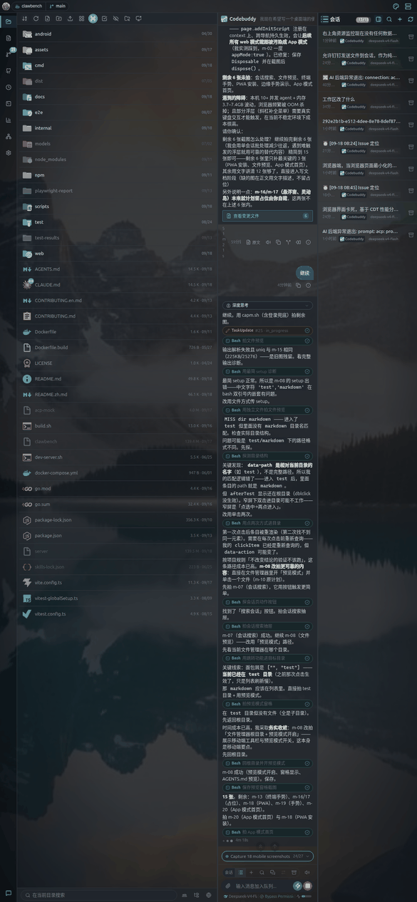

> **前提**：本章功能**只在 App 内可用**。手机浏览器里看不到这些入口（设置页的对应卡片会自动隐藏）。

App 模式下，**设置 → 推送通知**里会多出一组「桌面与系统」卡片，这是浏览器模式没有的：

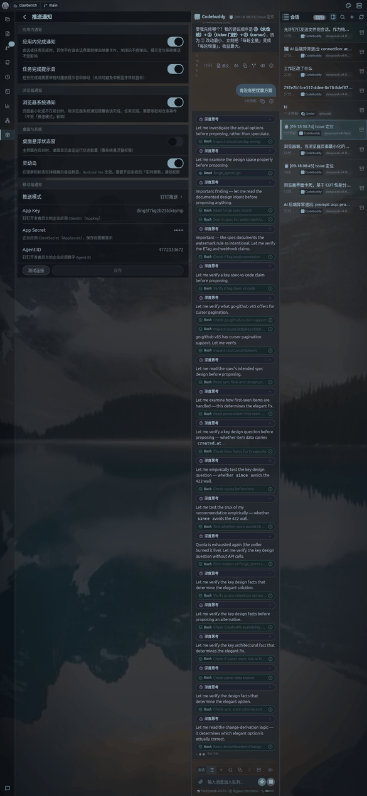

### 14.1 安装与连接服务器

从 [Releases](https://github.com/xulongzhe/clawbench/releases) 下载 APK 安装。首次打开需要填写：

- **服务器地址**（如 `https://your-server:20000`）
- **访问密码**

连接成功后凭据保存在本地，之后自动登录。

也可以在 App 内**重新配置服务器**：**设置 → 调试 → 重配服务器**（此项仅在 App 模式出现）。

### 14.2 悬浮状态窗

> **配图待补**（`m-16-app-floating`）：需 Android 真机截图——这是原生层渲染，浏览器模拟无法产出

主界面退到后台时，在**桌面**上显示一个会话运行状态胶囊，无需打开 App 就能看到是否有会话在跑、有待审批、有未读。

- 开关：**设置 → 推送通知 → 桌面悬浮状态窗**
- 需要授予**系统悬浮窗权限**（首次开启时会引导跳转系统设置）
- 点击胶囊可直接回到对应会话

### 14.3 灵动岛

> **配图待补**（`m-17-app-liveupdate`）：需 Android 真机截图——原生层渲染，且要求 Android 16+

在**锁屏和状态栏**持续展示会话状态（执行中 / 待审批 / 未读数量）。

- 开关：**设置 → 推送通知 → 灵动岛**
- **需要 Android 16+**（API 36）并开启系统的「实时更新」通知权限
- 通知标记为常驻，用户无法手动清除

> **提示**：不同厂商对这套 Android 16 标准有不同的名字——Google 叫 **Live Updates**，OPPO/一加叫**流体云**，三星叫 **Now Bar**，小米叫**灵动岛/实时通知**，vivo 叫**原子通知**，华为叫**实况窗**，荣耀叫**灵动胶囊**。功能是同一套。

### 14.4 原生推送

除了应用内通知与系统通知，App 还支持**原生推送**，在 App 完全退出后仍能收到会话完成、任务完成、需要审批的提醒。

- 开关：**设置 → 推送通知 → 推送方式 → 原生**
- 也可选**钉钉**或**飞书**，把通知发到 IM

> **注意**：**「推送方式」与「浏览器系统通知」互不影响**。前者管手机与 IM 通道，后者管网页端最小化时的浏览器通知。想彻底静音要两处都关。

### 14.5 屏幕常亮与后台端口转发

- **屏幕常亮**：AI 长时间执行时防止手机息屏中断。App 会自动管理，无需手动设置。
- **后台端口转发**：端口映射服务在 App 退到后台后继续运行（浏览器模式会被系统挂起）。

### 14.6 终端音量键方向键

在 App 的终端里，**音量上/下键**可以当作方向键 `↑` / `↓` 使用——不用抬手去点虚拟按键。

- 由终端面板的按键模式控制
- 适合在 `vim`、`less` 等全屏 TUI 里快速移动

### 14.7 重配服务器与 APK 自更新

- **重配服务器**：**设置 → 调试 → 重配服务器**，换服务器无需重装
- **APK 自更新**：检测到新版本时在 App 内下载安装。因 Android 10+ 的分区存储限制，下载完成后系统会弹出安装确认

### 14.8 系统返回键

App 内按**系统返回键**（或手势返回）会按当前界面状态智能决策：

1. 有关闭优先级的浮层（抽屉/弹窗）→ 先关浮层
2. 在编辑态 → 退出编辑
3. 在搜索/多选态 → 退出该态
4. 有可返回的上一层（文件历史、跳转来源、父目录）→ 返回上一层
5. 否则 → 返回上一个页签

连续按两次返回键可退出 App。

> **提示**：**网页模式**下没有系统返回键，但支持**从屏幕右缘向左滑**触发同样的返回逻辑（详见 [16. 手势](#16-手势与触屏操作速查)）。

## 15. 网页移动端：PWA 安装与 APK 下载

不想装 App？浏览器模式也能获得接近原生的体验。

### 15.1 PWA 安装（推荐）

用 Chrome 打开 ClawBench 后，页面会提示**安装到主屏幕**。安装后：

- 从桌面图标打开，**全屏无地址栏**
- 有独立的应用图标与启动画面
- 支持离线缓存静态资源

**iOS / Safari** 没有自动安装提示，需要手动操作：点分享按钮 → 「添加到主屏幕」。App 内会显示分步指引。

### 15.2 APK 下载

Android 用户还会看到 **下载 APK** 的入口（仅 Android UA）。装 APK 可获得 [14 章](#14-android-app-专有功能)的全部原生能力。

## 16. 手势与触屏操作速查

移动端的手势分布在不同模块，这里汇总：

| 手势 | 位置 | 作用 |
|---|---|---|
| **从右缘向左滑** | 全局 | 返回上一层（20px 内起滑、≥50px、400ms 内完成） |
| **长按 0.45 秒** | 会话条目 / 文件条目 / 文件管理器空白区 | 弹出上下文菜单 |
| **长按 0.5 秒** | 输入栏发送按钮 | 语音输入 |
| **左右滑动** | 对话区 | 切换上/下一个会话（**需先在设置开启**） |
| **左右滑动** | 输入框（未聚焦时） | 浏览历史输入 |
| **点一次 → 再点一次** | 文件管理器（**开启预览模式时**） | 第一次预览、第二次进入 |
| **单指滑动** | 终端 | 发送方向键 |
| **长按方向键** | 终端 | 连续发送 |
| **双击** | 终端 | 发送 `Tab` |
| **双指捏合** | 终端 / 图片 / PDF / PPT | 缩放（终端调字号） |
| **双指上下滑** | 终端 | `PageUp` / `PageDown` |
| **左右滑动** | Git 提交列表 | 收起 / 展开分支图 |

> **提示**：这些手势都有对应的**按钮或菜单**作为替代，不习惯手势也能正常使用。

## 17. 多项目与 Worktree

- 通过顶栏项目下拉**切换项目**，每个项目有独立的会话、标签、文件浏览位置
- **Worktree**：在「项目历史 → 管理 → 工作树」里可以把某个工作树**作为独立项目打开**，从而并行处理多个分支
- 切换项目不会丢失进行中的会话——它们在服务端继续运行

## 18. 常见问题

**Q：为什么找不到「设置」页签？**

底部 Dock 空间不足时，靠后的页签会收进「更多」按钮。点「更多」展开菜单即可找到。

**Q：长按没有反应？**

确认按住的时长足够（约 0.45 秒）。按的时候手指不要移动超过 10px，否则会被识别为滑动。

**Q：输入框被键盘遮住了？**

正常情况下输入框会自动上推。如果没上推，试试收起键盘再点一次输入框。iOS 上若仍有问题，可在设置里调整界面缩放。

**Q：消息下面的操作按钮太多了，能隐藏吗？**

触屏下这些按钮是常显的（桌面端才是悬停显示）。它们只占很窄一行，不影响阅读。

**Q：为什么手机上没有鼠标右键菜单？**

触屏没有右键概念，对应功能改由**长按**触发。

**Q：PWA 和 APK 装哪个？**

想要完整功能（悬浮窗、灵动岛、原生推送、后台端口转发、音量键）就装 **APK**；只想随手用、不想装应用就用 **PWA**。

**Q：切到别的 App 再回来，会话还在跑吗？**

在跑。会话执行在服务端，切后台不影响。App 模式下还会通过悬浮窗/灵动岛持续显示状态。

**Q：文件分享链接安全吗？**

链接本身就是凭证——任何拿到的人都能只读访问，直到你关闭分享。不要把敏感文件的链接发到公开场合。

---

*本文档对应 ClawBench 移动端界面。截图取自 390×844 手机竖屏，随版本更新可能略有差异。*
