# ClawBench 桌面端使用说明

> 本文面向在**电脑浏览器**上使用 ClawBench 的用户。截图取自 1280×720 的桌面宽屏布局，与你的实际界面一致。
> 移动端专属功能（悬浮窗、手势返回、PWA 安装）不在本文范围，详见[移动端使用说明](user-guid-mobile.md)。
> 功能概览见 [README](../../README.md#核心功能)。
>
> 全文按 **快速上手 → 功能详解 → 进阶** 组织。功能详解部分逐项展开每个子功能。

---

## 目录

**第一部分：快速上手**
- [1. 登录](#1-登录)
- [2. 选择项目](#2-选择项目)
- [3. 界面总览](#3-界面总览)
- [4. 发起第一次对话](#4-发起第一次对话)

**第二部分：功能详解**
- [5. AI 对话](#5-ai-对话)
  - [5.1 输入栏](#51-输入栏) · [5.2 斜杠命令](#52-斜杠命令) · [5.3 快捷发送](#53-快捷发送) · [5.4 附件与引用](#54-附件与引用) · [5.5 消息操作](#55-消息操作) · [5.6 工具调用与权限审批](#56-工具调用与权限审批) · [5.7 提问卡](#57-提问卡) · [5.8 推荐回复](#58-推荐回复) · [5.9 会话设置](#59-会话设置) · [5.10 流式过程中的操作](#510-流式过程中的操作)
- [6. 会话管理](#6-会话管理)
  - [6.1 侧栏](#61-会话侧栏) · [6.2 搜索](#62-会话搜索) · [6.3 标签](#63-会话标签) · [6.4 分叉与回溯](#64-分叉与回溯)
- [7. 文件管理](#7-文件管理)
  - [7.1 工具栏](#71-工具栏) · [7.2 排序](#72-排序) · [7.3 搜索](#73-搜索) · [7.4 多选](#74-多选) · [7.5 网格视图](#75-网格视图) · [7.6 右键菜单](#76-右键菜单) · [7.7 预览窗格](#77-预览窗格)
- [8. 文件查看与编辑](#8-文件查看与编辑)
  - [8.1 类型总览](#81-支持的文件类型总览) · [8.2 Markdown](#82-markdown) · [8.3 代码](#83-代码) · [8.4 图片与灯箱](#84-图片与灯箱) · [8.5 音频](#85-音频) · [8.6 视频](#86-视频) · [8.7 PDF](#87-pdf) · [8.8 Word](#88-word-文档) · [8.9 Excel](#89-excel-表格) · [8.10 PPT](#810-ppt-幻灯片) · [8.11 OpenAPI](#811-openapi-文档) · [8.12 Excalidraw](#812-excalidraw-画布) · [8.13 工具栏](#813-查看器工具栏) · [8.14 其他能力](#814-其他能力) · [8.15 下载与导出](#815-下载与导出) · [8.16 分享链接](#816-分享链接)
- [9. 标注与跳转系统](#9-标注与跳转系统)
  - [9.1 标注类型总览](#91-标注类型总览) · [9.2 文件路径标注](#92-文件路径标注) · [9.3 代码链接预览](#93-代码链接预览) · [9.4 Commit hash 标注](#94-commit-hash-标注) · [9.5 Worktree 路径标注](#95-worktree-路径标注) · [9.6 localhost 地址标注](#96-localhost-地址标注) · [9.7 处理顺序](#97-标注管道的处理顺序) · [9.8 流式期间](#98-流式期间的行为)
- [10. Git 管理](#10-git-管理)
  - [10.1 提交历史](#101-提交历史) · [10.2 分支](#102-分支) · [10.3 标签](#103-标签) · [10.4 工作树](#104-工作树) · [10.5 Diff](#105-diff)
- [11. 终端](#11-终端)
  - [11.1 快捷指令](#111-快捷指令)
- [12. 任务](#12-任务)
  - [12.1 列表](#121-任务列表) · [12.2 定时任务](#122-定时任务) · [12.3 事件任务](#123-事件任务) · [12.4 执行详情](#124-执行详情) · [12.5 Forge](#125-forge-集成github--gitlab) · [12.6 RAG](#126-会话搜索rag)
- [13. 数据统计](#13-数据统计)
- [14. 设置](#14-设置)
  - [14.1 外观](#141-外观) · [14.2 项目与文件](#142-项目与文件) · [14.3 聊天](#143-聊天) · [14.4 智能体](#144-智能体) · [14.5 终端](#145-终端) · [14.6 语音朗读](#146-语音朗读) · [14.7 语音识别](#147-语音识别) · [14.8 AI 摘要](#148-ai-摘要) · [14.9 会话搜索](#149-会话搜索) · [14.10 端口映射](#1410-端口映射) · [14.11 内网穿透](#1411-内网穿透) · [14.12 GitHub/GitLab 集成](#1412-githubgitlab-集成) · [14.13 推送通知](#1413-推送通知) · [14.14 安全](#1414-安全) · [14.15 调试](#1415-调试) · [14.16 关于](#1416-关于)

**第三部分：进阶**
- [15. 快捷键速查](#15-快捷键速查)
- [16. 多项目与 Worktree](#16-多项目与-worktree)
- [17. 上下文、摘要与分叉](#17-上下文摘要与分叉)
- [18. 推送通知](#18-推送通知)
- [19. 常见问题](#19-常见问题)

---

# 第一部分：快速上手

## 1. 登录

打开 ClawBench 的第一步：输入访问密码，验证身份后进入工作台。

浏览器打开你的 ClawBench 地址（默认 `https://<主机>:20000`），输入访问密码即可。

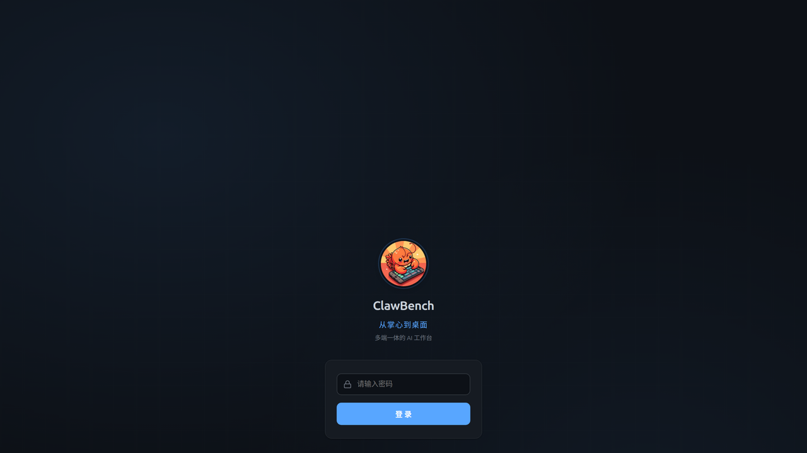

页面构成：

- **品牌区**：Logo、产品名、标语「从掌心到桌面」、副标题「多端一体的 AI 工作台」
- **密码输入框**：服务端设置的访问密码
- **「登录」按钮**：提交后写入登录 Cookie
- **多服务器列表**（仅 Android App 模式且已保存 ≥2 个服务器时出现）：可在多个已保存的服务器之间切换，或删除某个服务器

密码在服务端配置文件 `~/.clawbench/config/config.yaml` 的 `password` 字段，由部署者设置。登录态通过 Cookie 保持；若你使用多个 ClawBench 实例，各实例登录态互相隔离，可同时登录。

> **提示**：服务端默认使用 HTTPS。若浏览器提示证书不受信任（自签证书），首次访问时手动信任即可。

## 2. 选择项目

项目就是服务器上的一个目录，切换项目等于切换整套工作环境（会话、任务、Git、文件都跟着变）。

ClawBench 的一切操作都围绕「项目」展开——项目就是服务器上的一个目录。点击顶栏的项目名称可切换或新增项目。

- 每个项目独立维护自己的**会话列表、任务、Git 状态、文件树**。
- 切换项目时，当前项目的聊天输入草稿会被保留，切回来时自动恢复。
- 项目路径必须位于服务器可访问的文件系统内。不在列表里的目录可通过「打开目录」手动指定路径添加。
- 最近打开的项目会出现在项目下拉面板中，可单独移除。

## 3. 界面总览

介绍宽屏下的三栏布局：左侧功能栏、中间聊天区、右侧会话列表。

桌面宽屏（视口宽度 ≥ 1024px）下，界面自动切换为**三栏布局**：

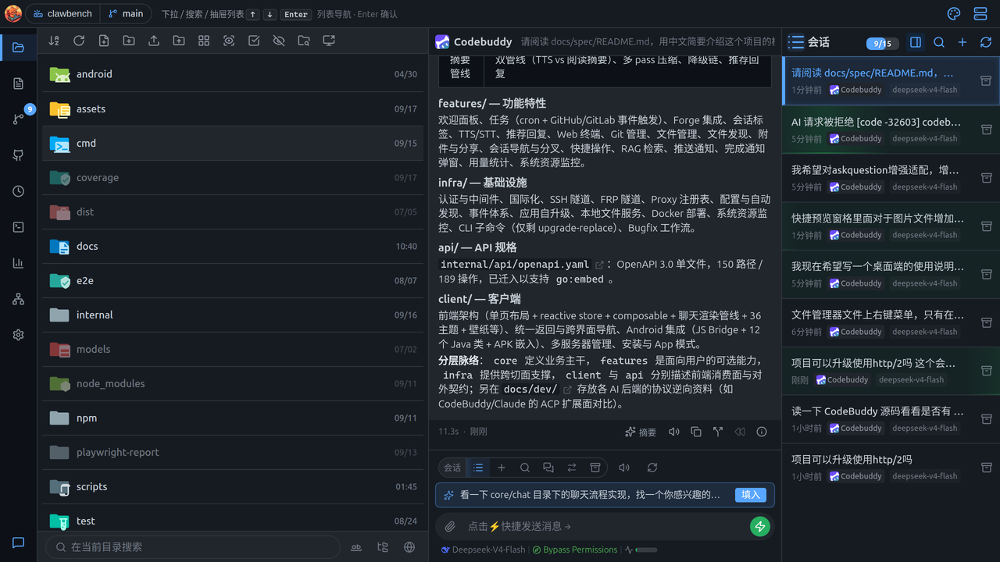

| 区域 | 作用 |
|---|---|
| **最左侧竖向图标栏**（Dock） | 切换左侧面板；最底部是「隐藏/显示聊天区域」开关 |
| **左侧内容区** | 当前选中的面板内容（默认是文件管理器） |
| **中间聊天区** | 与 AI 的对话；这是你花时间最多的地方 |
| **右侧会话侧栏** | 当前项目的会话列表（固定 280px 宽） |

Dock 的九个页签，从上到下：

| 图标位置 | 页签 | 作用 |
|---|---|---|
| 1 | **文件管理器** | 浏览/操作项目文件（默认打开） |
| 2 | **文件** | 文件查看器（双击文件后在此打开） |
| 3 | **项目历史** | Git 提交历史、分支、标签、工作树 |
| 4 | **议题与合并请求** | GitHub/GitLab 集成（Forge） |
| 5 | **任务** | 定时任务与事件任务 |
| 6 | **终端** | Web 终端 |
| 7 | **数据统计** | 用量统计、代码存量、代码增量 |
| 8 | **端口映射** | SSH 隧道端口转发 |
| 9 | **设置** | 全部配置项 |
| 底部 | **隐藏/显示聊天区域** | 把聊天区折叠，左栏占满宽度 |

**调整左右分栏宽度**：把鼠标移到左侧内容区与聊天区之间的分隔条上，光标变为左右箭头后拖动即可。比例会被记住。

> **提示**：Dock 页签的角标会提示待处理事项（如 Git 有未提交变更、Forge 有未读动态、任务有未读执行）。点击**已激活**的页签会折叠左栏（VS Code 行为），再点一次恢复。

窄屏（窗口宽度 < 1024px）下，三栏收成单栏，Dock 变成底部标签栏。

## 4. 发起第一次对话

从零开始：新建会话、选智能体、输入需求、看 AI 流式回复。

1. 点击会话侧栏顶部的 **「+」**（新建会话）；
2. 在弹窗中**选择智能体**；
3. 在底部输入框输入你的需求，按 `Enter` 发送（`Shift+Enter` 换行）。

### 4.1 选择智能体

弹窗里挑用哪个 AI CLI 来干活，可以设为默认。

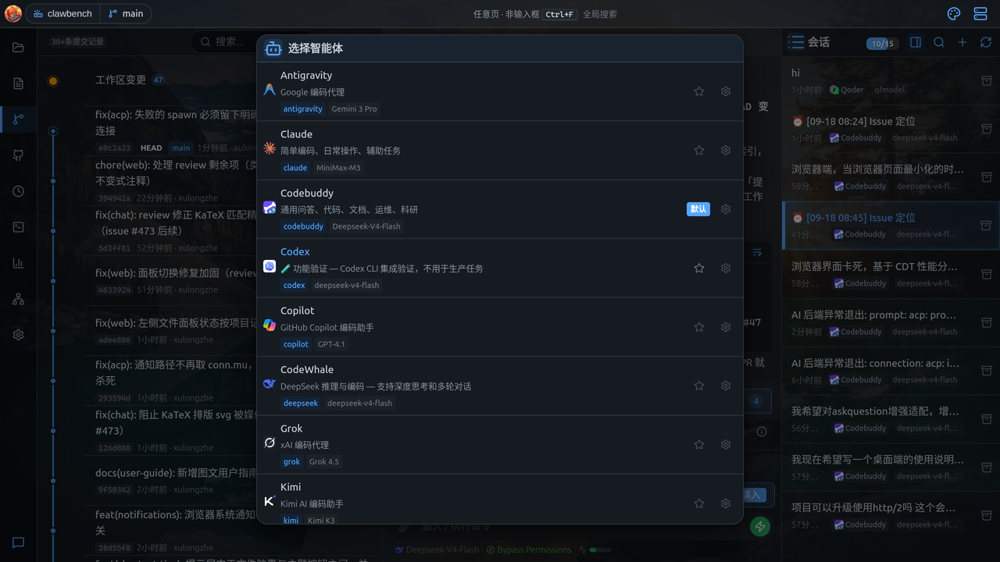

弹窗列出服务端已安装的全部 AI CLI。每个智能体卡片显示：图标、名称、一句话定位、标识名、默认模型。

- 带「**默认**」标记的是当前默认智能体，新建会话时优先选中它
- 卡片右侧按钮可**设为默认**或进入**配置页**
- 若列表为空，说明服务端未安装任何 CLI，需先在「设置 → 智能体」中重新扫描

### 4.2 切换项目

从顶栏项目下拉切换或新增项目，也能看到最近打开的文件。

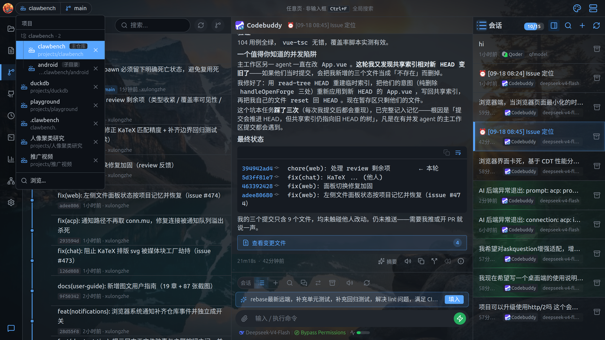

点顶栏的项目名展开下拉，包含：

- **项目列表**：每个项目显示名称、路径与角标（会话数等）
- **最近文件**：当前项目最近打开的文件，点击直接打开
- **快捷操作**：任务页搜索、全局搜索等

AI 会以流式方式回复，你可以实时看到它的思考过程与工具调用。

---

# 第二部分：功能详解

## 5. AI 对话

和 AI 聊天相关的全部操作：输入、命令、附件、消息操作、审批、会话设置。

### 5.1 输入栏

底部那条输入区，负责打字发消息，以及会话级的一排操作按钮。

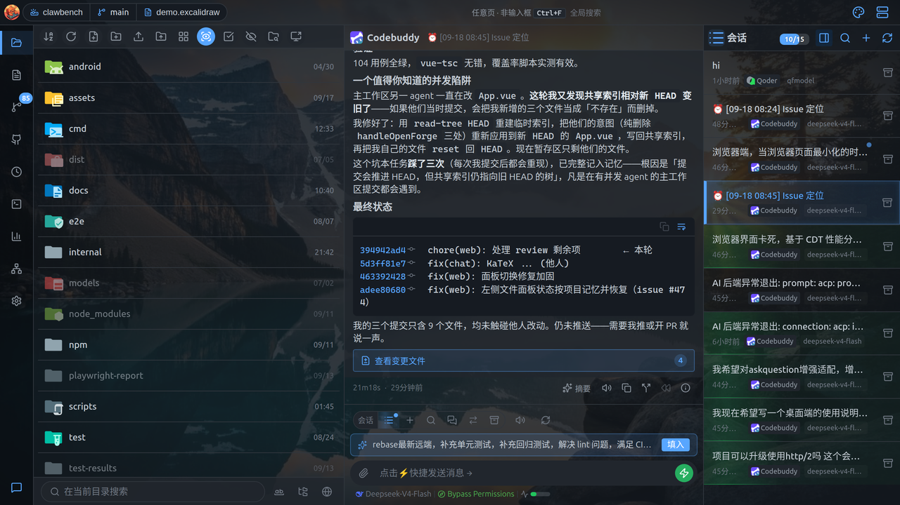

输入栏从上到下分为几层：

**顶部操作条**（会话级操作）：

| 按钮 | 作用 |
|---|---|
| 会话列表 | 打开会话抽屉 |
| 新建会话 | 新建（长按可选智能体） |
| 会话搜索 | 打开搜索抽屉 |
| 消息索引 | 打开用户消息索引，快速跳转到某条消息 |
| 同步外部会话 | 把 ACP 外部会话同步进来 |
| 归档 | 归档当前会话 |
| 自动朗读 | 开关 AI 回复的自动语音朗读 |
| 刷新会话 | 重新拉取当前会话 |

**输入区**：

- **附件按钮**（回形针）：打开附件抽屉
- **输入框**：支持多行；占位符会轮播提示
- **发送按钮**：有内容时发送；**空输入时点它会弹出「快捷发送」菜单**（见 [5.3 快捷发送](#53-快捷发送)）
- **停止按钮**：流式进行中出现，点击可取消当前回合（需二次确认）

**底部信息行**：

- **上下文用量条**：显示当前上下文占用量，点击展开详情弹窗（含「压缩」按钮）
- **模型**：点击打开会话设置抽屉
- **模式**：点击/长按切换（如自动、只读等）

### 5.2 斜杠命令

输入 `/` 调出命令菜单，快速执行内置命令或智能体自带的命令。

在输入框输入 `/` 会弹出命令菜单：

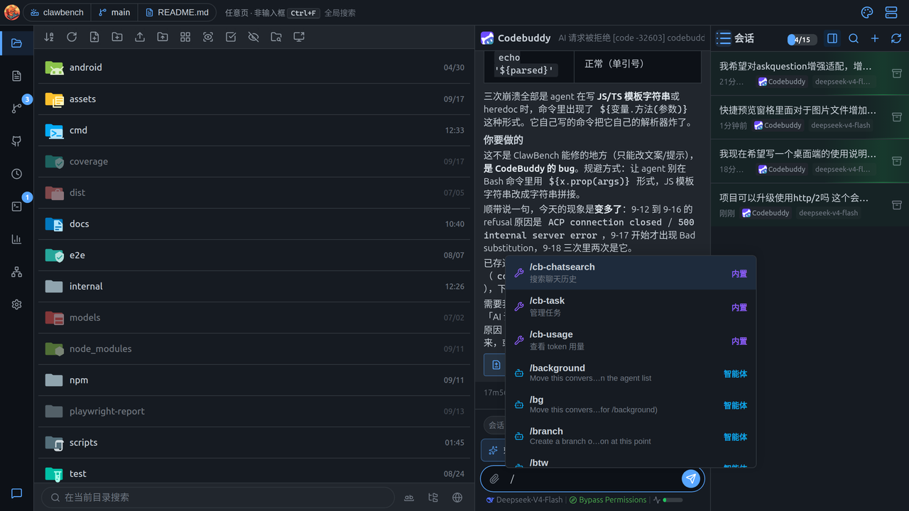

菜单分两组：

- **内置命令**（ClawBench 提供，带「内置」标签）：`/cb-chatsearch` 搜索聊天历史、`/cb-task` 管理任务、`/cb-usage` 查看 token 用量等
- **智能体命令**（来自当前 AI 后端）：如 `/background`、`/branch`、`/btw` 等，取决于所用 CLI

用上下键选择，`Enter` 或点击确认。斜杠命令必须位于消息**开头**才生效。

### 5.3 快捷发送

把常用 Prompt 存起来一键发送，省去反复打字。

把常用 Prompt 存成快捷项，一键发送，省去重复输入。

**调用**：清空输入框后点**发送按钮**（或点它旁边的下拉），弹出快捷发送菜单：

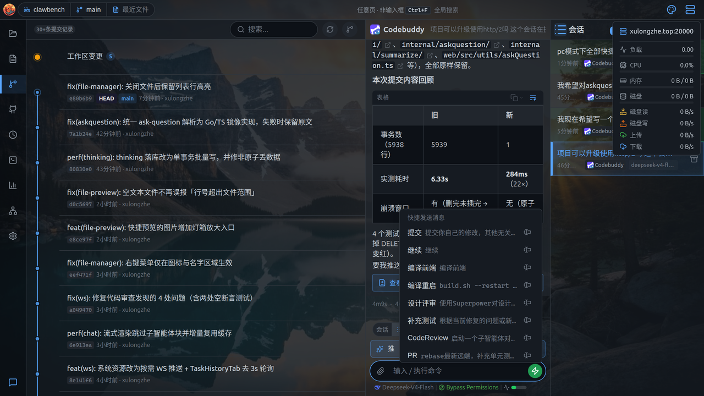

- **单击条目**：直接发送这条 Prompt
- **点条目右侧的填入图标**：只把内容填进输入框，你可以先改再发（适合「套模板 + 补参数」）
- **点「编辑」**：打开管理抽屉

**管理**：点「编辑」进入快捷发送抽屉：

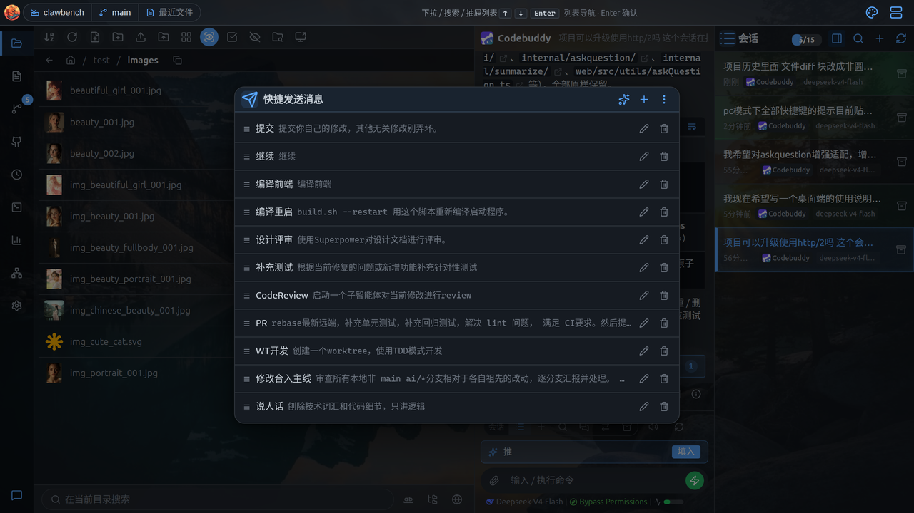

| 操作 | 说明 |
|---|---|
| **拖动左侧手柄（≡）** | 调整顺序，顺序会持久化到服务端 |
| **点条目** | 编辑内容 |
| **右上角「+」** | 新增快捷项 |
**消息聚类**（Message Clustering）将同一主题的多轮对话自动归为一组，方便回溯与整理。聚类基于消息内容语义与时间间隔进行 Union-Find 三阶段合并：
1. **语义相近**：连续若干轮对话若讨论的是同一主题，则合并
2. **时间合并**：间隔短的多轮对话段若主题相关则合并
3. **边界识别**：若两段之间有明显的话题转换（如新问题或新文件），则分开

聚类结果以折叠卡片形式展示，用户可点击展开查看完整多轮对话。适合长会话中快速定位到之前讨论过的某个子话题。

| **右上角 ✨** | 打开消息聚类抽屉（从历史消息里发现可复用的 Prompt） |
| **右上角「⋮」** | 导出 / 导入 JSON（便于备份与跨设备迁移） |

快捷项按用户存储（不区分项目），因此换项目也能用。

### 5.4 附件与引用

把文件或选中的文字片段作为上下文带给 AI。

| 方式 | 操作 |
|---|---|
| **附件按钮** | 点回形针 → 附件抽屉（当前文件 / 引用 / 分享 / 上传历史四个页签） |
| **拖拽** | 直接把文件拖到输入框 |
| **粘贴** | 直接粘贴剪贴板中的图片或文件 |
| **@ 引用** | 输入 `@` 唤出文件选择菜单，把文件内容作为上下文带入 |
| **行范围引用** | 引用文件时指定行范围，只把需要的片段送给 AI |
| **选中文本引用** | 在聊天里选中文字，会弹出引用问答栏，可直接针对该段提问 |
| **面包屑拖拽** | 把文件管理器的路径面包屑拖到输入框 |

附件抽屉从输入栏左侧的回形针打开，含「当前 / 最近引用 / 最近分享 / 最近上传」四个来源：

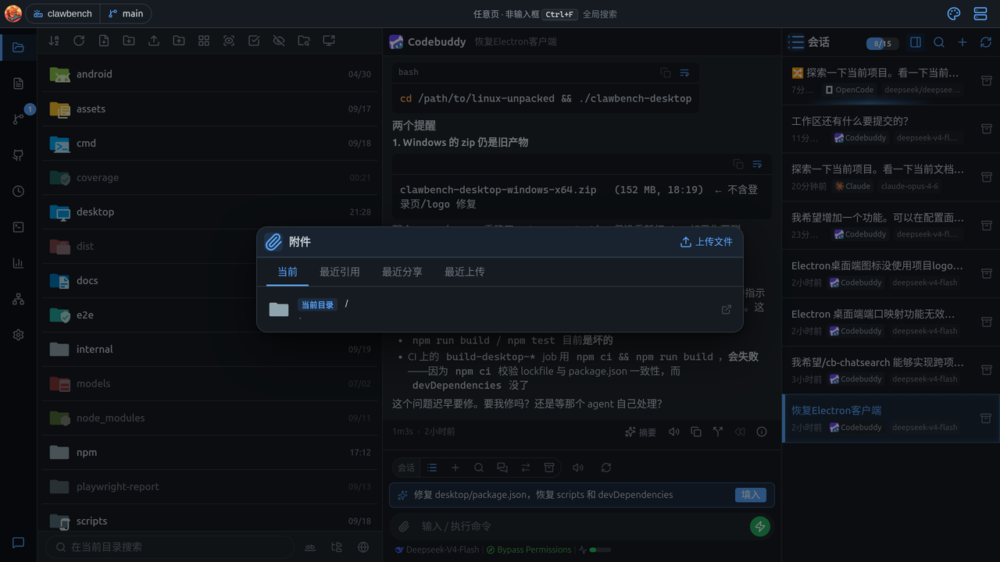

### 5.5 消息操作

每条回复下面那排按钮，以及聊天区里的思考、工具、耗时等元素。

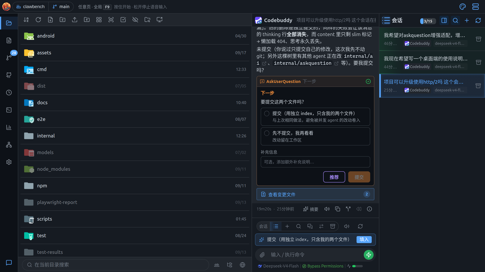

每条 AI 回复下方有一排操作按钮：

| 按钮 | 作用 |
|---|---|
| **摘要** | 切换摘要视图（AI 生成的要点式总结） |
| **朗读** | 语音朗读这条回复 |
| **复制** | 复制全文 |
| **分叉会话** | 从这条消息创建一个新分支会话 |
| **回溯会话** | 把会话截断到这条消息处并重启 AI |
| **查看详情** | 打开元数据弹窗（模型、耗时、Token 用量等） |

用户消息同样支持复制与查看详情。

其他聊天区元素：

- **深度思考**：AI 的推理过程，默认折叠，点击标题展开
- **工具调用**：以胶囊/卡片形式展示，点击展开详情
- **耗时标注**：每条回复下方显示本轮耗时
- **文件变更横幅**：本轮改了哪些文件，点击打开抽屉
- **计划面板**：AI 的多步计划及进度
- **滚动悬浮按钮**：快速跳到上一条/下一条消息、顶部/底部
- **代码块头按钮**：代码块右上角的复制、换行、附加到聊天

### 5.6 工具调用与权限审批

看 AI 用了哪些工具，并在它要动文件或跑命令时决定允不允许。

AI 执行操作时会显示工具调用卡片。点击卡片可展开查看完整输入输出。

当 AI 请求执行**有副作用**的操作（写文件、执行命令等）时，会弹出**权限审批卡片**，包含：

- 工具名称与详情
- **允许** / **拒绝** 按钮

选择结果会被记住用于本次会话。若开启了自动批准，则会显示「已自动批准」标记。

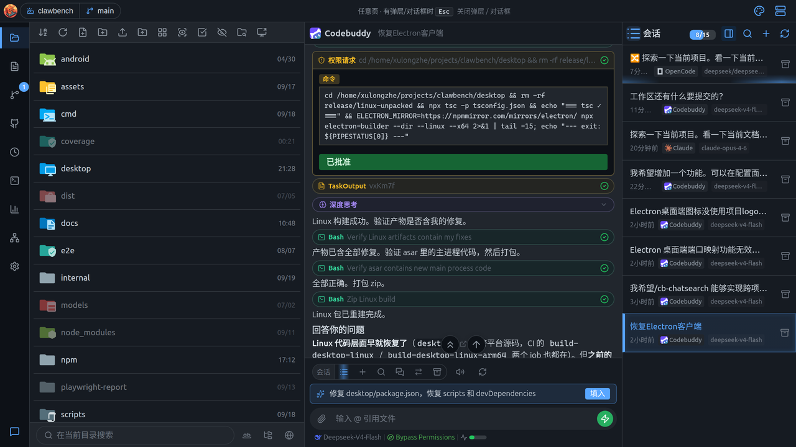

上图为一次命令执行：顶部是「权限请求」卡片（展开显示完整命令，批准后标记「已批准」），下方是「深度思考」与多个 Bash 工具调用卡片。

### 5.7 提问卡

AI 需要你选择时给出的可点选项卡片，选完提交即可。

当 AI 需要你做出选择时，会渲染**交互式选项卡片**而非纯文本：

- 单选/多选选项，点击选中
- 可选的**补充说明**输入框
- **推荐**按钮（AI 给出的建议选项）
- **提交**按钮

已选项会跨重渲染保持，可以反悔重选。

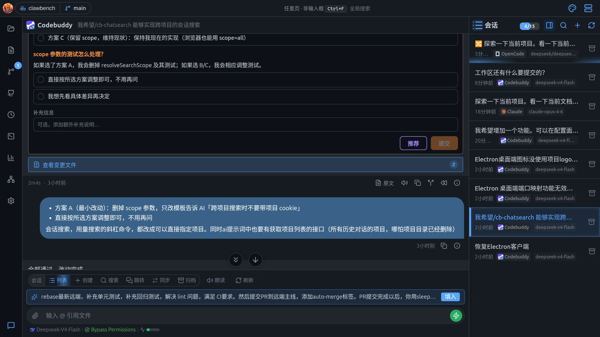

卡片中含单选 / 多选选项、可选的「补充信息」输入框，以及底部的「推荐」与「提交」按钮。

### 5.8 推荐回复

AI 回复完后给出的下一步建议，点一下就能填进输入框。

AI 回复完成后，输入框上方会出现若干**下一步建议**（见上方截图）。点击文本会展开，点「填入」按钮把它放进输入框。

这是基于当前上下文实时生成的，可在设置中关闭。

### 5.9 会话设置

针对当前会话调整模型、思考档位、消息显示模式、权限模式等。

点击输入栏底部的**模型**或**模式**，打开会话设置抽屉，含四个页签：

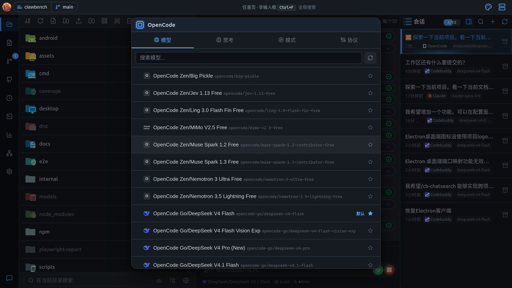

| 页签 | 内容 |
|---|---|
| **模型** | 切换当前会话使用的模型 |
| **思考** | 调整思考等级/预算 |

> **深度思考档位说明**：低档（Thinking Budget ≈ 200）适合简单问答；中档（≈ 800）适合常规开发任务；高档（≈ 3200+）适合需要多步推理的复杂任务如架构设计或深度调试。思考档位越高，AI 的推理 token 越多，响应会稍慢但质量更稳定。

| **消息显示模式** | 混合 / 仅摘要 / 仅原文 |

> **消息显示模式**：混合模式（默认）同时展示摘要卡片与原始消息，适合概览与细节兼顾；仅摘要模式只显示 AI 生成的摘要卡片，省界面空间；仅原文模式只展示原始消息，无摘要。切换模式后，新加载的消息按新模式显示，已加载的消息不受影响。

| **模式** | 切换权限模式（如自动批准） |

> **分叉上下文预算**：分叉时携带的历史上下文上限，单位为 token 数。值越小，分叉后新会话越轻量但上下文越少；值越大则保留更多历史但 token 消耗增加。默认值适中，修改后建议观察实际效果。

| **传输** | 查看/切换后端传输方式 |

> **推荐回复上下文条数**：生成推荐回复时参考的最近消息轮数。值越大，推荐内容越丰富但计算略慢；值越小推荐越精简。设为 0 则关闭推荐回复。

抽屉内还有「设为默认」与「自动批准」开关。

### 5.10 流式过程中的操作

AI 还在输出时你能做的事：插话、取消、重置会话。

- **插话（steer）**：流式进行中直接发送新消息，会在当前回合的合适位置插入，不必等 AI 说完
- **取消**：点停止按钮取消当前回合
- **重置会话**：会话卡死时，用错误横幅上的按钮重启 AI 进程，对话上下文保留

> **文件变更自动刷新**：AI 在对话过程中修改了文件后，ClawBench 会自动将文件管理器中对应的文件标记为已修改（高亮显示）。用户无需手动刷新即可看到最新内容。该刷新为单向感知（仅感知外部变化），不会覆盖用户未保存的编辑。

### 5.11 应用内完成通知

后台发生会话、任务或仓库事件时滑入的提示卡片，告诉你"有事发生了"并让你一键跳过去。

当聊天界面不在前台时，会话/任务/仓库事件会滑入一张**纯通知卡片**——它只是一条通知，不是可以就地操作的迷你界面：

| 行为 | 说明 |
|---|---|
| **事件覆盖** | 会话完成/取消/待审批、任务启动/完成/失败/取消、仓库议题与合并请求的六类变化，与系统通知完全一致 |
| **头部** | 智能体图标 + 主类别徽章（会话 / 任务 / 议题与合并）+ 事件类型标题（如「会话已完成」「任务失败」「合并请求 #42 · 已合并」，纯文字、按语义配色、14px）+ 关闭按钮 |
| **正文** | 标题段（会话名 / 任务名 / 仓库）+ 最多 4 行纯文本摘要（字号与聊天正文一致） |
| **跨项目标识** | 事件属于其他项目时，整张卡片换色，底部额外显示「外部」标签 + 加粗的项目名 + 完整路径 |
| **位置** | 桌面端右下角滑入；移动端顶部滑下 |
| **跳转** | 点击整张卡片跳到对应会话 / 任务执行详情 / 议题与合并页签，并顺带把该条标记为已读 |
| **关闭** | 点击卡片上的关闭按钮 |
| **自动关闭** | 5 秒无操作自动消失（错过的内容靠未读角标找回）；鼠标悬停在卡片上时倒计时暂停，移开后继续走完剩余时间 |
| **非模态** | 卡片不会挡住页面其他操作，点击别处也不会把它关掉 |
| **队列** | 多个事件依次展示，最多排队 3 条；同一仓库的仓库事件合并成「N 条新变化」一条 |
| **开关** | 设置 → 推送通知 → 应用内通知。关闭后不再弹新卡片，不影响提示音与系统/IM 推送 |

> 想看完整内容时，点卡片跳转到会话即可——卡片本身不再提供展开预览或快捷回复。

## 6. 会话管理

会话的增删改查：侧栏、搜索、标签、分叉回溯。

### 6.1 会话侧栏

右侧固定那一列，列出当前项目的会话，并提供新建、搜索、刷新入口。

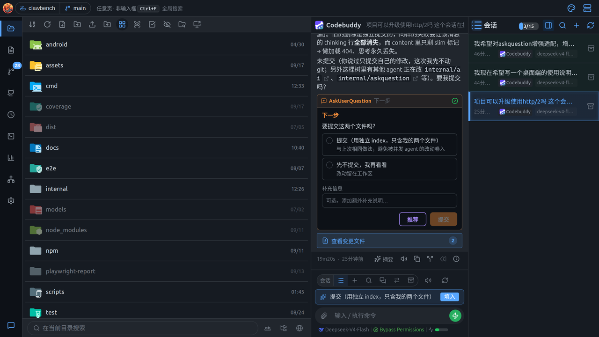

侧栏头部（从左到右）：

| 按钮 | 作用 |
|---|---|
| **取消固定** | 把侧栏从常驻改为抽屉模式 |
| **会话搜索** | 打开搜索抽屉 |
| **新建会话** | 新建（需先选智能体） |
| **刷新** | 重新拉取会话列表 |

侧栏顶部还有一条**会话计数进度条**，显示当前会话数 / 上限。

每个会话项显示：标题、相对时间、使用的智能体与模型、标签；有未读时显示角标，运行中显示竖线。

**会话项交互**：

- **单击**：切换会话
- **右键**：菜单（置顶 / 取消置顶、重命名、设置标签、归档）
- **悬停**：出现归档按钮

侧栏底部是**跨项目会话分组**，列出其他项目的会话，点击可直接跳转。

### 6.2 会话搜索

用关键词或语义搜索历史会话，带归档、排序、时间等筛选。

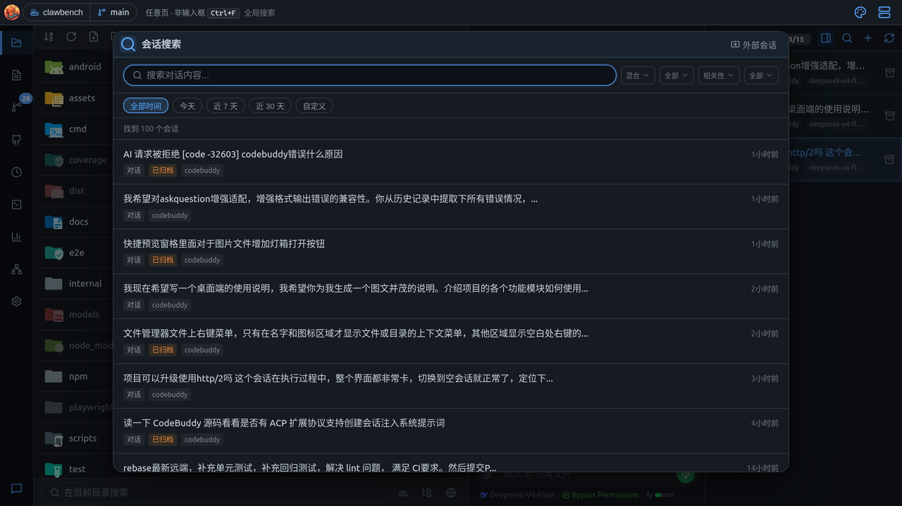

点侧栏头部的搜索按钮打开搜索抽屉，支持：

| 筛选项 | 可选值 |
|---|---|
| **搜索模式** | 混合 / 全文 |
| **归档状态** | 全部 / 未归档 / 已归档 |
| **排序** | 相关性 / 最新 / 最早 |
| **类型** | 全部 / 对话 / 任务 |
| **时间** | 全部 / 今天 / 近 7 天 / 近 30 天 / 自定义 |

结果项显示标题、摘要、类型标签、标签与时间。点击进入详情页，可继续对话或删除。

### 6.3 会话标签

给会话贴自定义分类标签，之后按标签筛选，方便归类。

标签用来给会话分类，便于在侧栏里快速筛出同类会话。标签显示在会话条目的**最底部一行**，颜色按标签名哈希映射到统一调色板，因此同一标签在任何地方颜色都一致。

#### 设置标签

在会话上右键打开弹窗，勾选已有标签或新建标签。

在会话条目上**右键 → 设置标签**，打开标签弹窗：

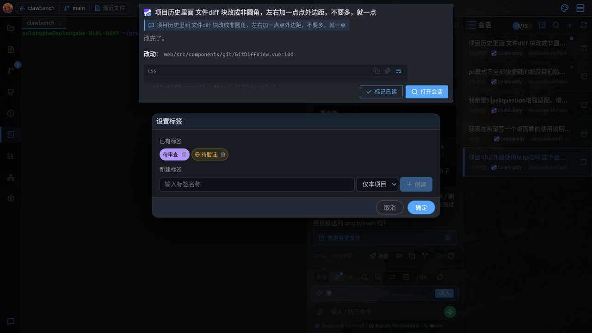

弹窗分两块：

**已有标签**：列出全部候选标签（全局标签 + 当前项目的标签）。点标签卡片即可**选中 / 取消**，支持多选。已选中的卡片有高亮边框。

**新建标签**：输入名称后点「+ 创建」。创建前需选择作用范围：

| 范围 | 含义 |
|---|---|
| **仅本项目** | 标签只在当前项目内可见、可用（默认） |
| **全局** | 标签在所有项目中都可见、可用 |

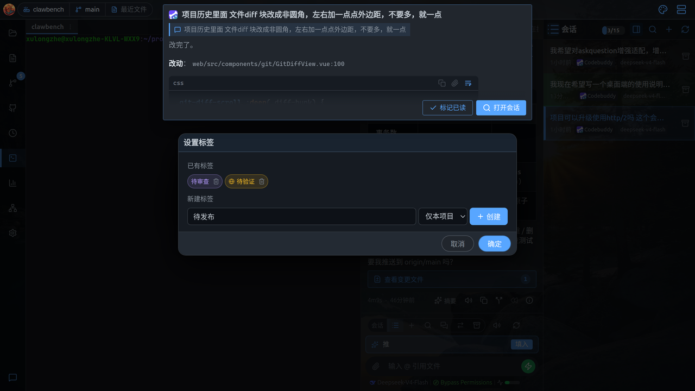

改完点底部**确定**保存，**取消**放弃。

标签名会自动去除首尾空白并转为小写，因此 `Bug` 与 `bug` 是同一个标签。

#### 标签作用范围

说明「仅本项目」和「全局」两种标签的区别与适用场景。

| 范围 | 可见性 | 适用场景 |
|---|---|---|
| **项目内** | 仅当前项目 | 与某个项目强相关的分类，如「待发布」「重构中」 |
| **全局** | 所有项目 | 跨项目通用的分类，如「待验证」「重要」 |

**项目隔离**：不同项目可以有同名标签，互不影响。例如 A 项目的「bug」和 B 项目的「bug」是两个独立标签，各自维护自己的颜色与关联会话。

> **提示**：把标签从项目内改成全局**不会**自动发生——标签的范围只在创建时确定。给会话重新打标签时，已存在标签会保留原有范围。

#### 标签过滤栏

会话列表上方那一行标签按钮，点一下就只看这类会话。

只要当前项目里有**正在使用**的标签，会话列表上方就会出现一条横向的标签过滤栏：

- **只列出当前项目实际在用的标签**（避免出现点了必然为空的选项），并显示每个标签下的会话数
- **点击标签筛选**，再点一次取消筛选
- 筛选在服务端完成，因此分页加载的会话也能被正确筛出（不会出现「明明有匹配却要滚很久才出现」）
- 当前项目没有在用标签时，整条过滤栏隐藏
- 跨项目会话分组**不显示**标签行，也不参与标签筛选

#### 删除标签

在标签弹窗里把某个标签整个删掉，同时解除它与所有会话的关联。

在标签弹窗中，把鼠标移到标签卡片上，点出现的**删除按钮**即可删除该标签本身（同时解除它与所有会话的关联）。

> **注意**：删除标签是按**范围**精确删除的。若同名标签同时存在「全局」和「项目内」两条，删除时只会删掉你所见的那个范围，不会误删另一个。

### 6.4 分叉与回溯

从某条消息另起一个新方向，或退回某条消息重来。

- **分叉**：从某条消息创建对话分支，原会话不受影响。分叉会带上压缩后的上下文（预算可在设置中调整）。
- **回溯（Rewind）**：把会话截断到某条消息处并重启 AI 会话，用于「走错路了重来」。回溯会同时清空计划面板。
- **续接**：在已有会话基础上开新会话，标题会带时间戳前缀。

## 7. 文件管理

浏览和管理项目目录里的文件：看、搜、传、复制、删除。

左侧 Dock 第一个图标即文件管理器。

### 7.1 工具栏

文件管理器顶部那排按钮，以及 AI 改完文件后的自动高亮提示。

> **AI 修改文件后自动刷新**：AI 在会话中修改了某个文件后，ClawBench 会自动将该文件在文件管理器中标记为已修改（黄色高亮），无需手动刷新。Diff 高亮会在打开文件时显示变更行（红色删除/绿色新增）。若文件被外部程序修改，ClawBench 也会通过定期轮询感知并高亮提示。

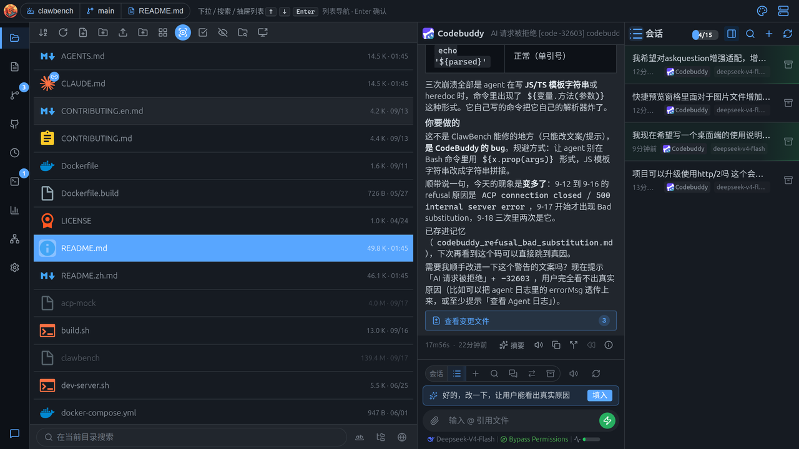

工具栏按钮（从左到右）：

| 按钮 | 作用 |
|---|---|
| **排序** | 打开排序菜单（见下） |
| **刷新** | 重新拉取当前目录 |
| **新建文件** | 在当前目录创建文件 |
| **新建文件夹** | 在当前目录创建目录 |
| **上传文件** | 上传单个或多个文件 |
| **上传文件夹** | 上传整个文件夹（保持目录结构） |
| **图标视图 / 列表视图** | 切换显示模式 |
| **预览模式** | 开关下方预览窗格 |
| **多选** | 进入多选模式 |
| **显示/隐藏隐藏文件** | 切换隐藏文件可见性 |
| **跳转** | 输入路径直接跳转 |
| **已分享文件** | 打开分享记录抽屉 |

工具栏会随面板宽度自适应，放不下的按钮收进「更多」菜单。

### 7.2 排序

按名称、时间、后缀或大小排列文件，再点一次切换升降序。

点排序按钮展开菜单：

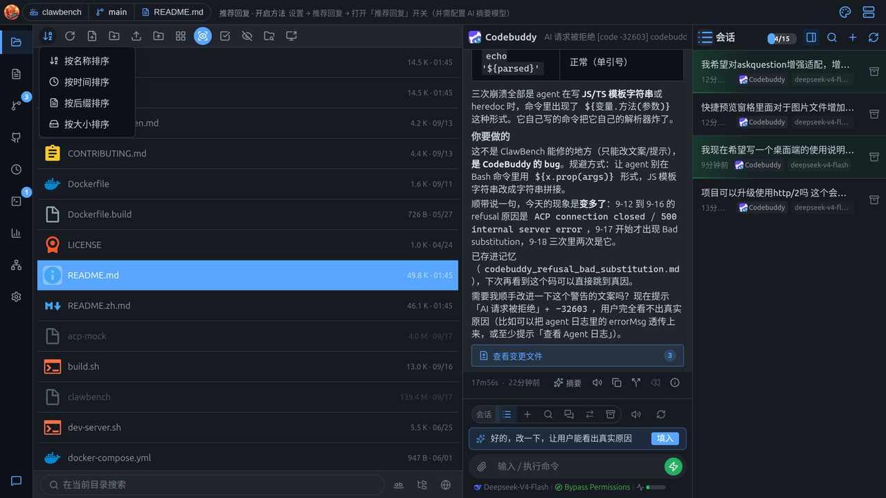

- 按名称排序
- 按时间排序
- 按后缀排序
- 按大小排序

再次点击同一项可切换升序/降序。

### 7.3 搜索

底部搜索坞，可在当前目录、递归或整个项目范围内找文件。

底部常驻搜索坞：

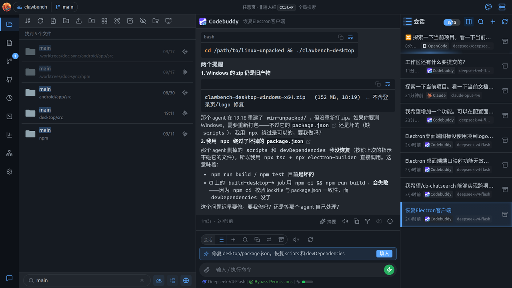

- **搜索输入框**：支持上下键在结果间导航、回车打开
- **精确匹配**开关：只匹配完整词
- **递归**开关：在当前目录下递归搜索
- **全局**开关：在整个项目范围内搜索（蕴含递归）

结果显示条目所在目录，点结果旁的小按钮可「在目录中定位」。

### 7.4 多选

批量模式，一次选中多个文件做复制、打包下载、删除。

点「多选」进入多选模式，工具栏替换为多选操作条：

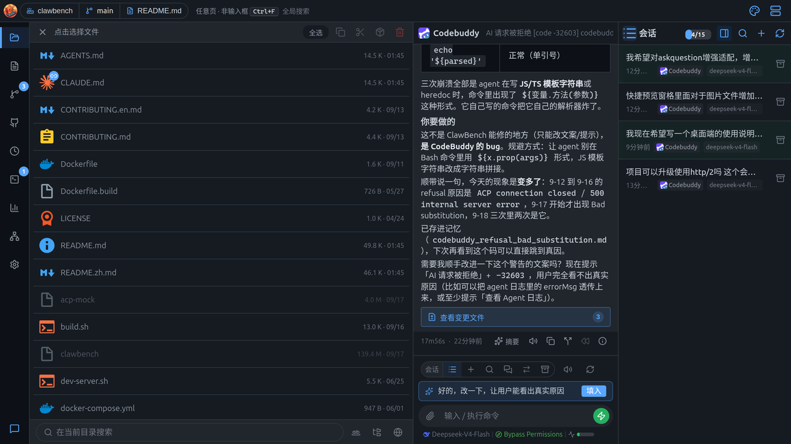

| 操作 | 说明 |
|---|---|
| **退出多选** | 返回普通模式 |
| **全选 / 取消全选** | 批量选择 |
| **复制 / 剪切** | 放入剪贴板 |
| **打包下载** | 把选中项打包为压缩包 |
| **删除** | 批量删除 |

配合 `Shift` 点击可做范围选择，`Ctrl` 点击可增减单个选择。

### 7.5 网格视图

把文件列表换成缩略图网格，适合浏览图片。

点「图标视图」切换为网格布局：

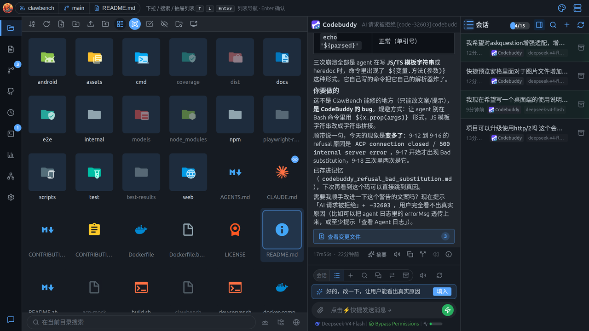

适合浏览图片等以缩略图为主的内容。再点一次切回列表。

### 7.6 右键菜单

在文件、目录或空白处右键弹出的操作菜单，替代敲命令行。

**在文件上右键**：

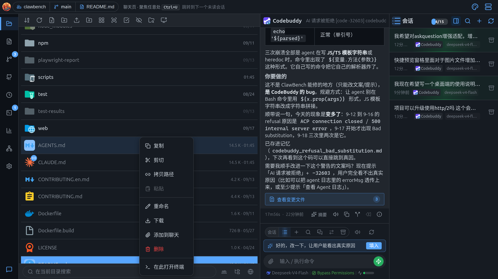

复制、剪切、拷贝路径、粘贴、重命名、下载、添加到聊天、删除、在此打开终端。

**在目录上右键**：


比文件多出：下载目录树（保持结构的打包下载）、作为项目打开。

**在空白区右键**：粘贴、新建文件、新建文件夹。

> **注意**：右键菜单只在**图标与名字区域**生效；点行的其他区域会弹出空白区菜单（与 Windows 资源管理器一致）。

### 7.7 预览窗格

列表下方多出一块可调高度的区域，单击文件先在这里瞄一眼。

点工具栏的**预览模式**按钮，列表下方出现可拖拽高度的预览窗格：

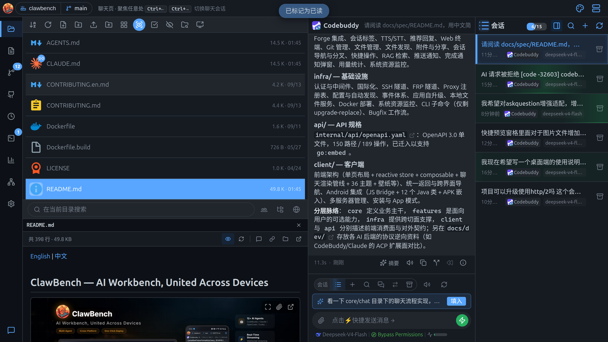

- 开启后**单击**文件即可在下方预览，不必双击打开完整查看器
- 目录会在预览窗格中列出内容
- 大文件按行窗口取数，不会整体传输，因此打开很快
- 拖分隔条调整高度；点关闭按钮收起窗格（预览模式仍开启）

## 8. 文件查看与编辑

打开单个文件后能做什么：不同类型的文件用不同方式看，代码还能直接改。

双击文件会在「文件」页签中打开完整查看器。查看器按文件类型自动选择渲染方式，以下逐类说明。

### 8.1 支持的文件类型总览

一张表说明每种扩展名会用哪种方式打开。

| 类型 | 扩展名 | 渲染方式 |
|---|---|---|
| Markdown | `.md` | 完整渲染（表格、代码高亮、公式、Mermaid） |
| 代码 | `.ts` `.go` `.py` 等 | CodeMirror 编辑器（浏览 / 编辑双模式） |
| 图片 | `.jpg` `.png` `.svg` `.webp` 等 | 内联预览 + 灯箱 |
| 音频 | `.mp3` `.wav` `.ogg` 等 | 内联播放器 |
| 视频 | `.mp4` `.webm` 等 | 内联播放器 |
| PDF | `.pdf` | 分页渲染 |
| Word | `.docx` | Office 预览 |
| Excel | `.xlsx` | 表格渲染 |
| PPT | `.pptx` | 幻灯片渲染 |
| OpenAPI | `.yaml` `.json`（含 openapi 字段） | Swagger UI |
| Excalidraw | `.xdraw` `.excalidraw` | 内嵌画布编辑器 |
| HTML | `.html` | iframe 渲染预览 |
| 其他 | 任意 | 文本查看（超大文件按窗口取数） |

### 8.2 Markdown

把 `.md` 渲染成带目录、表格、公式、图表的文档。

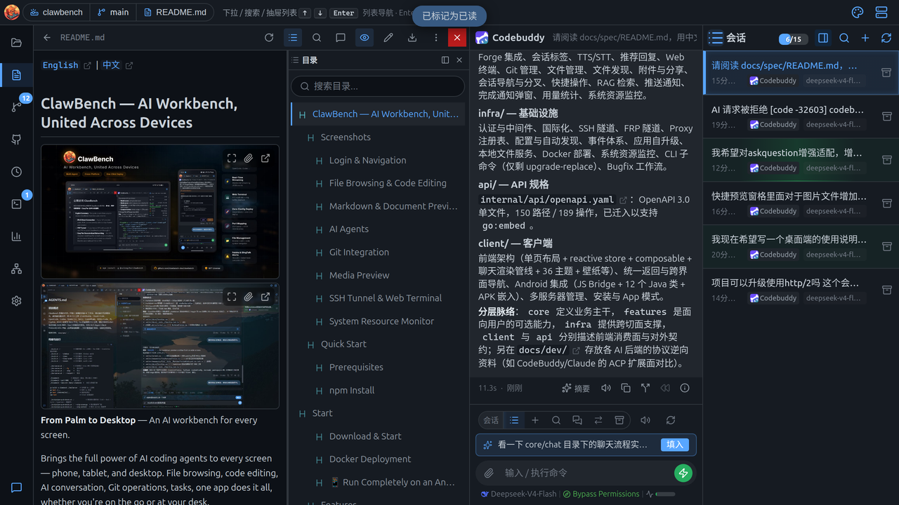

支持完整的 Markdown 渲染。工具栏的**目录**按钮唤出 TOC 侧栏，点击标题跳转，滚动位置与标题锚定同步。

**表格**：

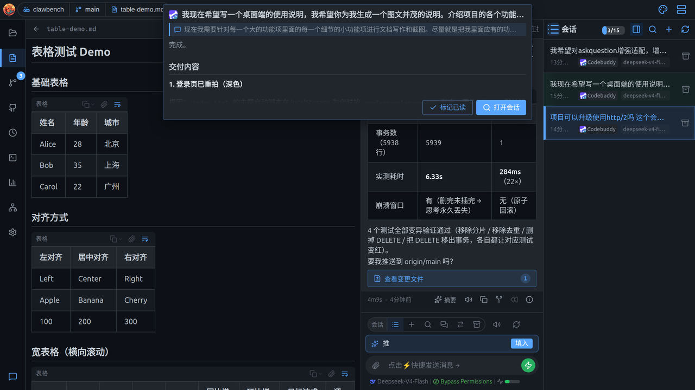

支持基础表格、对齐方式（左/中/右）与宽表格横向滚动。

**数学公式（LaTeX）**：

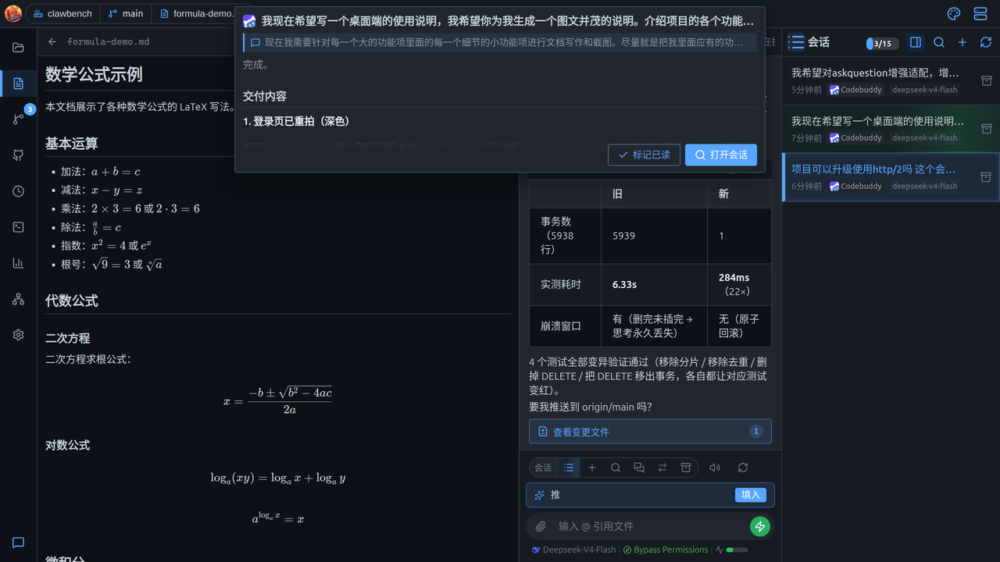

行内公式与块级公式都会渲染为排版后的数学符号（分数、根号、上下标、求和积分等）。

**Mermaid 图表**：

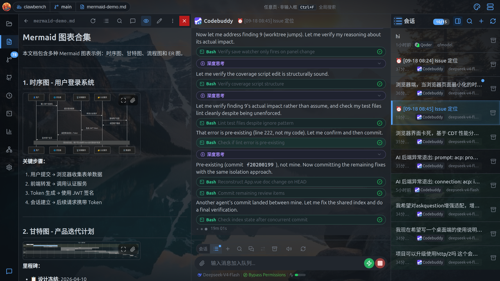

支持时序图、甘特图、流程图、ER 图等。图表以 SVG 渲染，可随容器缩放。

**内嵌图片**：


文档中的相对路径图片会从项目目录读取并显示。

### 8.3 代码

代码文件用 CodeMirror 打开，能高亮、能补全、能直接改并保存。

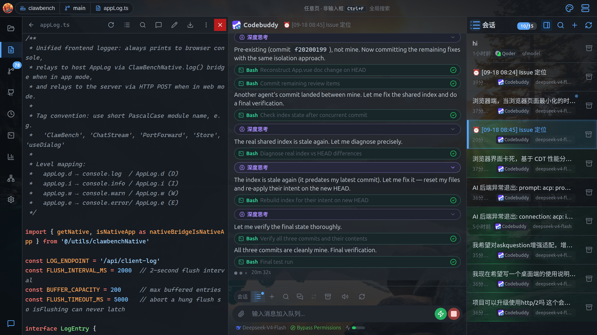

CodeMirror 编辑器，支持**浏览 / 编辑双模式**切换。特性：

- **语法高亮**：按文件扩展名自动选择语言
- **代码自动补全**：编辑模式下为 11 种语言（JS/TS/HTML/CSS/Python/SQL/Go/Less/Sass/Liquid/Markdown）提供语言感知补全
- **行号**：可开关
- **自动换行**：可开关
- **粘性滚动（sticky scroll）**：滚动时当前函数/类名吸顶
- **搜索**：`Mod+F` 打开搜索面板
- **符号提取**：基于 tree-sitter 提取函数/类列表
- **保存**：编辑态下 `Mod+S` 保存回原文件

### 8.4 图片与灯箱

图片按窗口大小显示，可在同目录图片间切换，也能全屏细看。

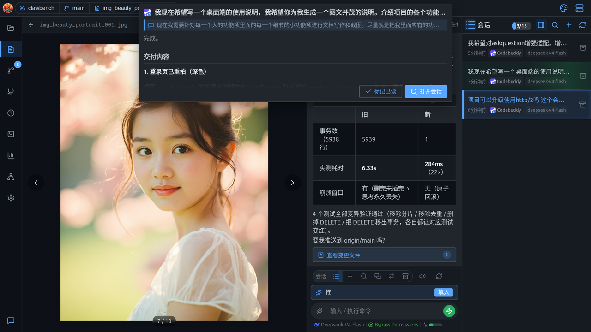

图片以适应窗口的方式预览。右上角显示**当前序号 / 总数**（如 `7 / 10`），可用左右箭头或键盘在**同目录图片**间切换。

点工具栏的**灯箱**按钮进入全屏查看：


灯箱模式下图片占满视口，适合细看大图。

### 8.5 音频

内联音频播放器，能播放、暂停、拖进度、调音量。

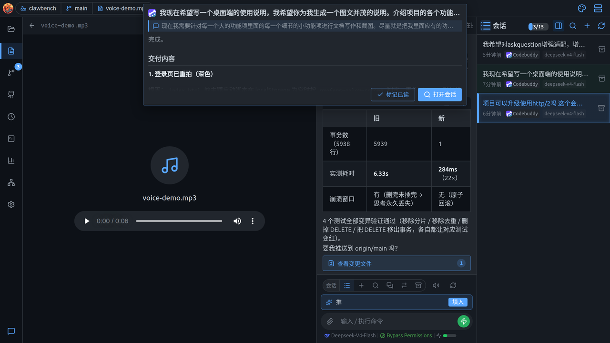

内联音频播放器，显示文件名、播放/暂停、进度条、当前时间与总时长、音量控制。

### 8.6 视频

内联视频播放器，支持播放控制与全屏。

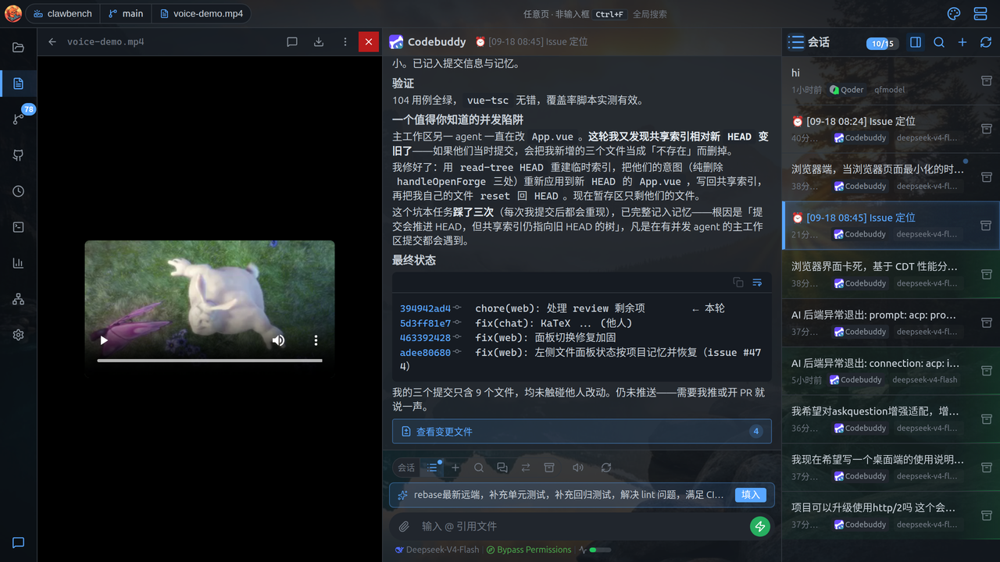

内联视频播放器，支持播放/暂停、进度拖动、音量、全屏。视频文件通过 `/api/local-file` 端点流式传输，不会整份加载进内存。

### 8.7 PDF

PDF 分页渲染，可以滚动翻页、缩放、切换页码。

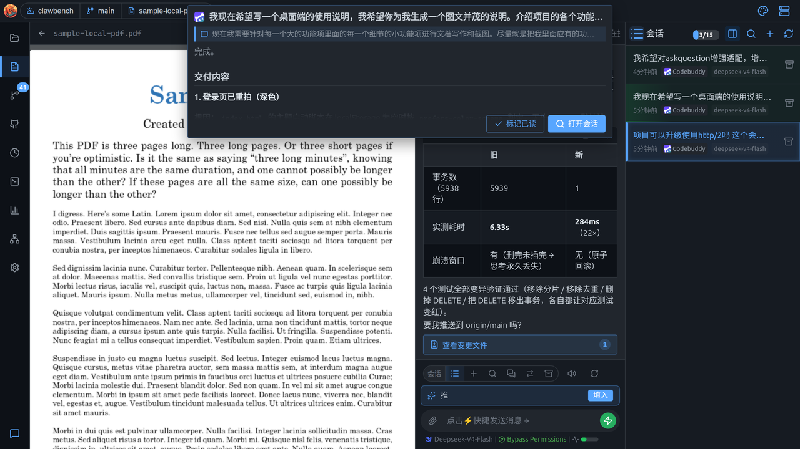

分页渲染，支持滚动翻页、适应宽度、放大缩小。工具栏可切换页码。

### 8.8 Word 文档

把 `.docx` 渲染成保留标题、段落与基本排版的文档视图。

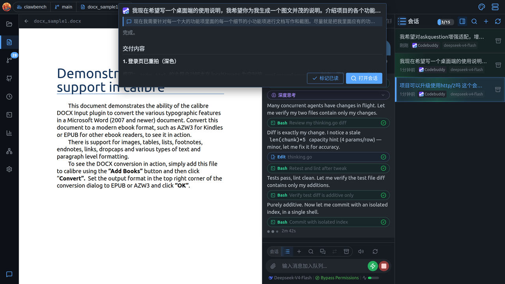

`.docx` 渲染为可读的文档视图，保留标题层级、段落与基本排版。

### 8.9 Excel 表格

把 `.xlsx` 渲染成表格，支持多个 Sheet 切换。

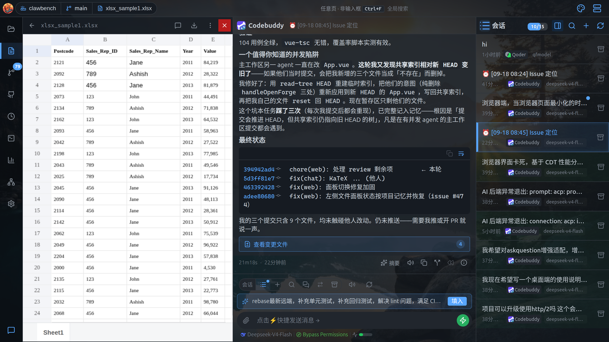

`.xlsx` 渲染为表格，支持多 Sheet 切换（顶部标签）、单元格内容查看。

### 8.10 PPT 幻灯片

把 `.pptx` 逐页渲染成幻灯片，可翻页浏览。

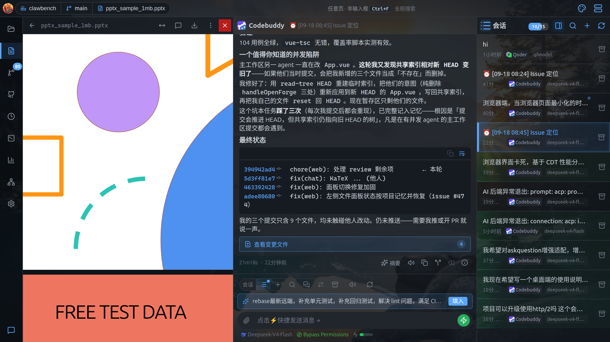

`.pptx` 逐页渲染幻灯片，保留形状、配色与文字排版。可翻页浏览。

### 8.11 OpenAPI 文档

识别 OpenAPI 文件并渲染成 Swagger UI，可直接展开查看接口。

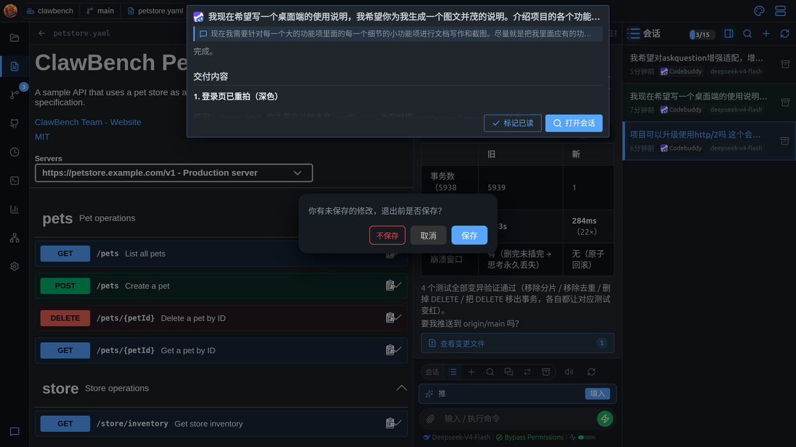

识别含 `openapi` 字段的 YAML/JSON 文件，渲染为 **Swagger UI**：显示 API 标题、Servers 下拉、按 tag 分组的端点列表，可展开查看参数与响应。

### 8.12 Excalidraw 画布

用内嵌的画布编辑器打开 `.xdraw` 文件，可编辑并保存回原文件。

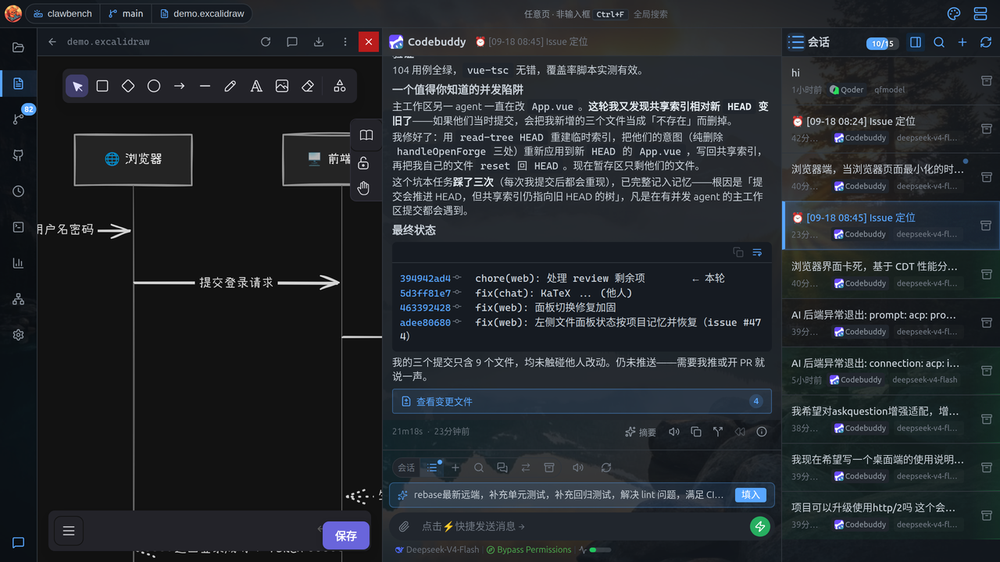

`.xdraw` 文件在内嵌的 Excalidraw 编辑器中打开（独立 React 构建，通过 iframe 加载），可直接编辑并保存回原文件。

`.xdraw` 是本应用推荐使用的短扩展名。从 Excalidraw 官网导出、或由其他工具生成的文件扩展名是 `.excalidraw`，同样可以直接打开——两者行为完全一致（同样识别为画布、同样可编辑保存），文件内容格式相同，改扩展名即可互换。不想打那么长的扩展名时用 `.xdraw` 就行。

### 8.13 查看器工具栏

查看器顶部那排按钮，随文件类型变化（返回、目录、编辑、下载等）。

工具栏按钮（随文件类型变化）：

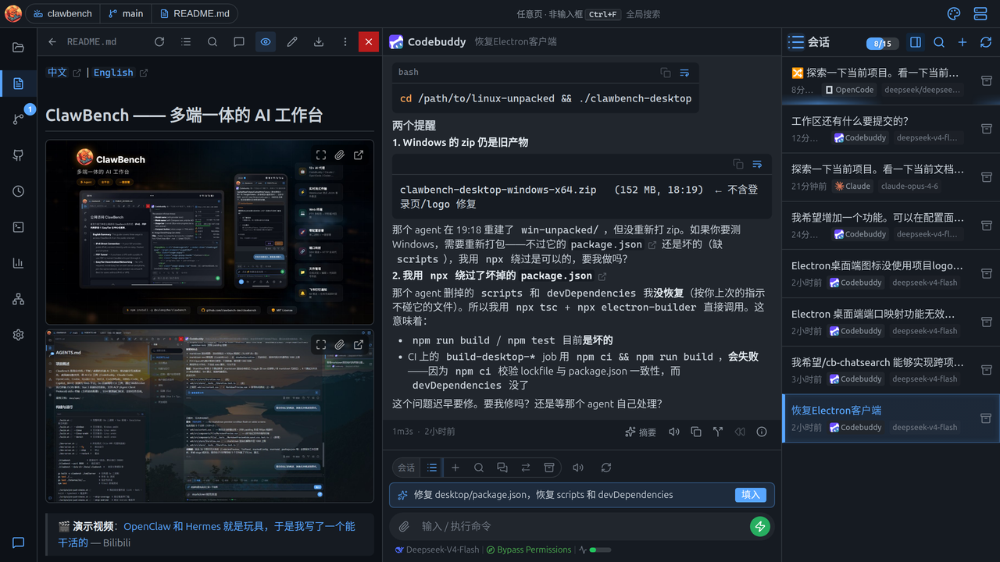

| 按钮 | 作用 |
|---|---|
| 返回 / 前进 | 在打开历史中导航 |
| 刷新 | 重新读取文件 |
| 目录 | 唤出 TOC 侧栏（Markdown） |
| 搜索 | 打开搜索面板 |
| 适应宽度 | 缩放适配 |
| 引用到聊天 | 把文件（或选中行范围）加入聊天上下文 |
| 灯箱 | 全屏查看（图片） |
| 渲染 / 源码 | 切换渲染视图与原始文本 |
| 编辑 | 进入编辑模式（代码） |
| 下载 | 下载文件 |
| 更多菜单 | 详情、打开目录、文件历史、分享链接、以文本打开、导出 HTML、设为背景、自动换行、行号、粘性滚动、删除 |

### 8.14 其他能力

代码链接预览、快速引用到聊天、差异高亮、设为壁纸等零散能力。

- **代码链接预览**：聊天里出现经过验证的 `文件路径` 或 `路径:行号` 时，点击弹出代码切片浮层，不必离开对话
- **快速预览到聊天**：预览窗格中的内容可一键引用到聊天：

  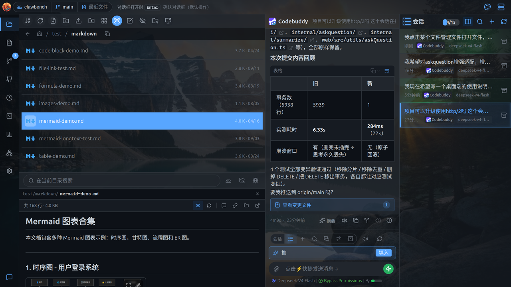

- **差异高亮**：AI 修改文件后，查看器自动刷新并高亮变化的块/行（Markdown 块级、代码行级）
- **设为背景**：把图片设为界面壁纸

### 8.15 下载与导出

把文件取回本地、导出成独立 HTML，或批量打包下载。

文件有四种取用方式，按场景选择：

| 方式 | 入口 | 适用 |
|---|---|---|
| **下载原文件** | 查看器工具栏的「下载」 | 取回单个原始文件 |
| **导出 HTML** | 更多菜单 → 导出 HTML | 把 Markdown 变成可离线分发的单文件网页 |
| **打包下载** | 多选模式 → 打包下载 | 批量取回多个文件/整个目录 |
| **分享链接** | 更多菜单 → 分享链接 | 不下载，直接给别人一个只读链接 |

#### 更多菜单

查看器右上角那个 `⋮` 按钮，导出、分享、删除等操作都从这里进。

查看器右上角的**更多**按钮（`⋮`）集中了导出与分享入口：

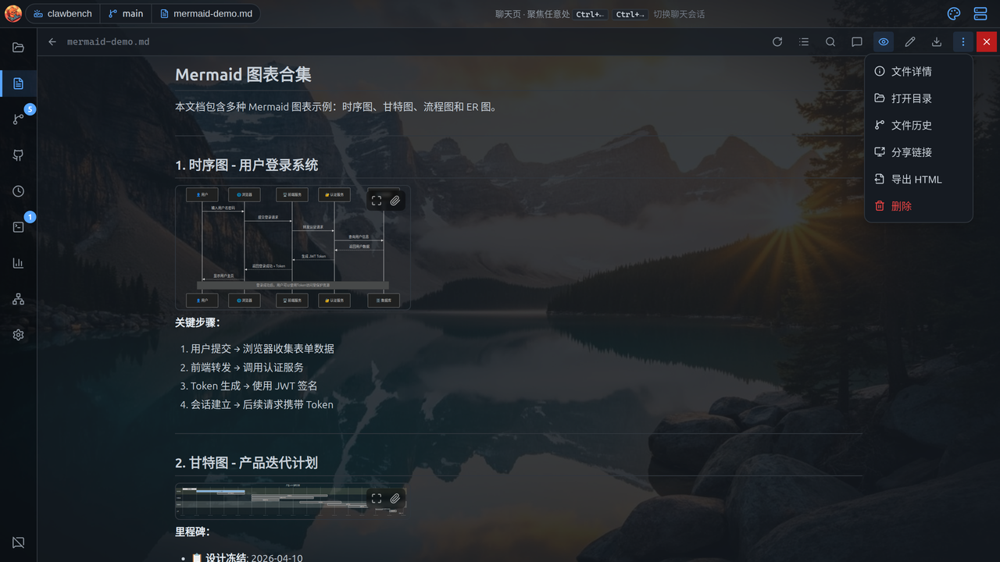

菜单项：文件详情、打开目录、文件历史、**分享链接**、**导出 HTML**、删除。

#### 导出 HTML

把 Markdown 变成一个自带样式和图片的单文件网页，可以直接发给别人。

对 Markdown 文件选「导出 HTML」，会生成一个**自包含的单文件 HTML**（样式与图片内联），可直接发给别人或离线打开。

- 导出成功会提示生成的路径
- 若文档引用了无法内联的图片（如远程图片、超出大小限制），会**跳过并在提示里说明数量**，不会静默丢弃
- 导出失败会明确报错，不会产生半成品文件

#### 打包下载

把选中的多个文件或整个目录压缩成一个包下载，目录结构保持不变。

在文件管理器点「多选」进入多选模式，选中多个文件（或整个目录）后点**打包下载**：

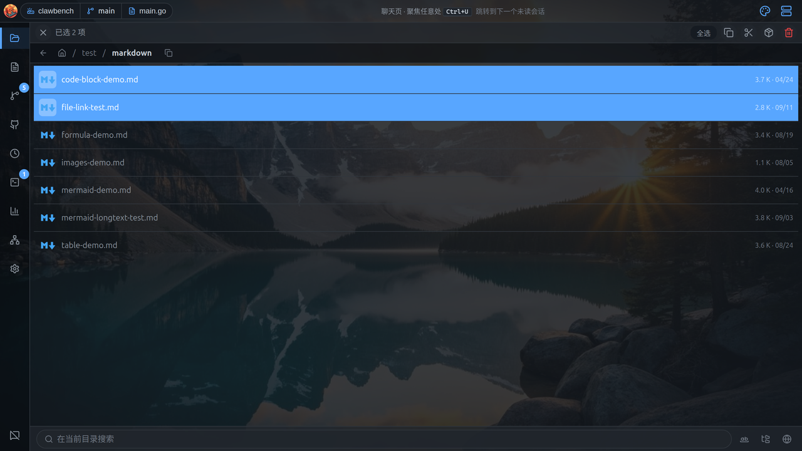

会把选中项打包成一个压缩包下载，目录结构保持不变。

> **提示**：`Shift + 点击` 可做范围选择，`Ctrl + 点击` 可增减单个选择，配合「全选」可快速圈定范围。

### 8.16 分享链接

生成只读链接发给别人，对方无需登录即可查看，并可在分享记录里统一管理。

把文件分享给别人时不必下载再转发——生成一个**只读链接**即可。

#### 生成分享链接

给文件生成一个只读链接，对方打开就能看，不需要登录。

在查看器的**更多菜单**里选「分享链接」，打开分享弹窗：

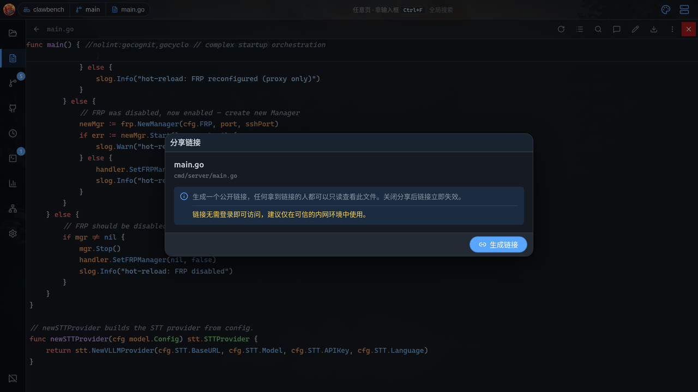

弹窗显示文件名与完整路径，并说明规则。点底部的**生成链接**按钮创建链接：

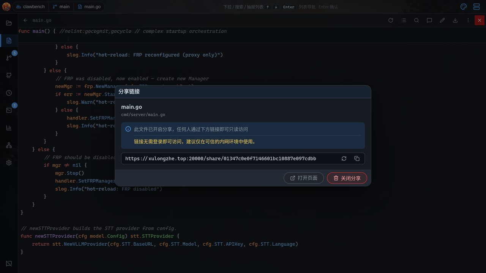

生成后弹窗变为「已开启分享」状态，出现**链接栏**，包含：

| 元素 | 作用 |
|---|---|
| 链接输入框 | 只读，点击自动全选，便于手动复制 |
| **复制**按钮 | 复制链接到剪贴板 |
| **重新生成**按钮 | 换一个新链接（**原链接立即失效**，需二次确认） |
| **打开页面** | 在新标签页打开分享页预览效果 |
| **关闭分享** | 撤销分享（**链接立即失效**，需二次确认） |

#### 分享页面

拿到链接的人看到的样子：只读渲染 + 目录大纲 + 下载入口。

拿到链接的人在浏览器打开后，看到的是一个**只读页面**，无需登录：

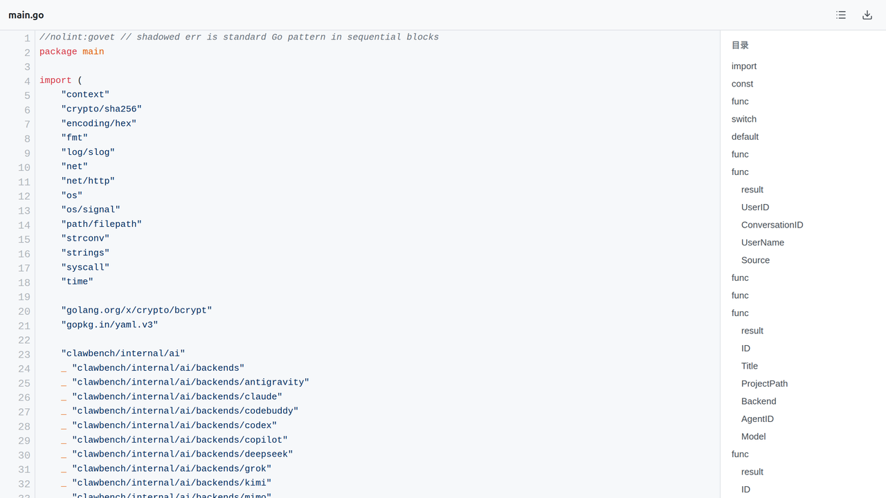

- 按文件类型渲染（代码带语法高亮与行号、Markdown 渲染为文档、图片直接显示等）
- 右侧有基于内容的**目录大纲**，点击可跳转
- 提供下载入口，方便对方取回原文件
- 页面是独立构建的轻量 SPA，不含编辑器与聊天等主应用功能

> **安全提示**：**链接即凭证**——任何拿到链接的人都能只读访问，无需登录。弹窗中也有同样的提醒。请仅在可信环境（如内网）中分享，不再需要时及时「关闭分享」。

#### 管理已分享文件

集中查看所有正在分享的文件，可以复制链接或随时取消分享。

文件管理器工具栏的**已分享文件**按钮打开分享记录抽屉：

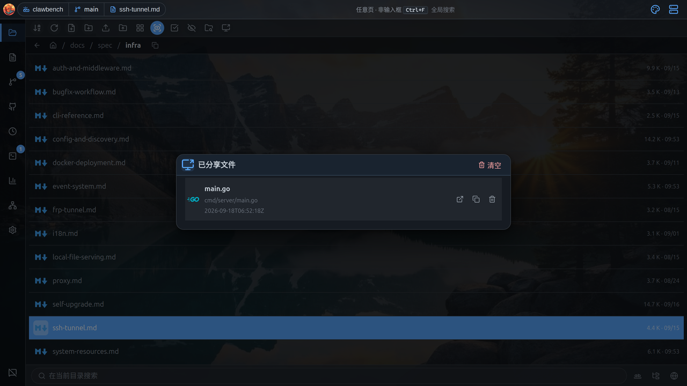

列出所有正在分享的文件，每项显示文件名、路径与创建时间，并提供：

| 操作 | 说明 |
|---|---|
| **打开外部链接** | 在新标签页打开分享页 |
| **复制链接** | 复制该文件的分享链接 |
| **取消分享** | 撤销这一条分享 |
| **清空**（顶部） | 一次性撤销全部分享 |

> **注意**：重新生成链接或关闭分享后，**旧链接立即失效**，已经拿到旧链接的人将无法再访问。

## 9. 标注与跳转系统

自动把聊天里出现的路径、commit、端口变成可点击的链接，点一下就跳过去。

ClawBench 会自动识别聊天与文档里的**技术引用**（文件路径、commit hash、worktree 路径、localhost 地址），把它们变成可点击的标注。点一下就能跳到对应位置，不必手动复制路径再去找。

### 9.1 标注类型总览

一张表列出能被识别的几类引用，以及点击后会发生什么。

| 类型 | 外观 | 点击后 |
|---|---|---|
| **文件路径** | 蓝色等宽文字，悬停下划线 | 打开文件查看器并定位到该行 |
| **代码链接预览** | 同上，但在**预览模式**下 | 弹出代码切片浮层，不离开当前页面 |
| **Commit hash** | 短 SHA + 打开图标 | 切到项目历史并定位到该提交详情 |
| **Worktree 路径** | 蓝色等宽文字 + 图标 | 打开该工作树下的文件 |
| **localhost 地址** | 地址 + 打开图标 | 建立端口映射并打开 WebView |

标注是**基于 DOM 遍历**生成的（不是简单正则替换），因此会先验证路径真实存在再标注——不存在的路径保持纯文本，避免点了打不开。

### 9.2 文件路径标注

聊天里出现的文件路径会变成可点文字，点击打开文件并定位到对应行。

聊天里出现的文件路径会自动变成可点击标注：

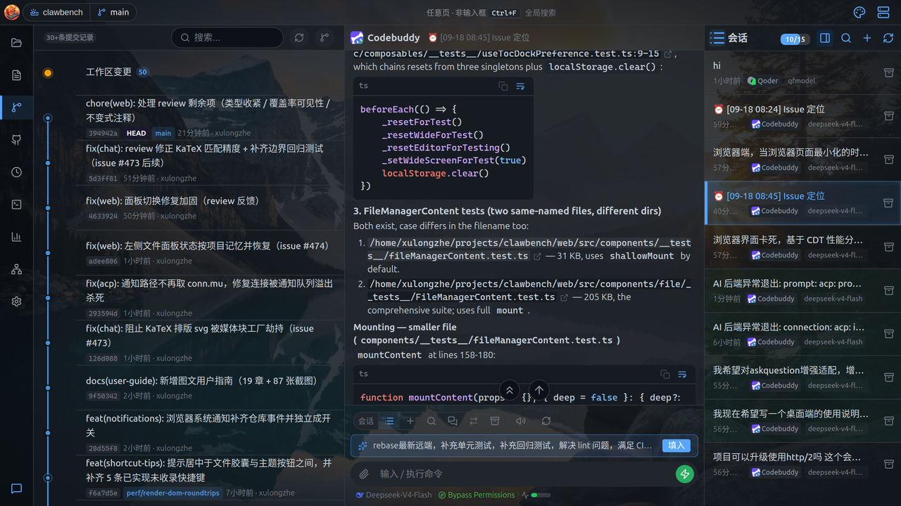

标注支持 `路径` 与 `路径:行号` 两种形式（如 `cmd/server/main.go:1415`）。

**点击后**打开文件查看器并**直接定位到对应行**：


**双候选路径解析**：同一个相对路径可能相对于「当前文件所在目录」或「项目根目录」，ClawBench 会两个候选都试，哪个存在用哪个。所以文档里写 `../images/a.png` 和 `web/src/app.ts` 都能正确解析。

### 9.3 代码链接预览

在预览模式下点路径不跳走，而是在当前页弹一个小浮层看代码。

在**预览模式**下（文件管理器工具栏开启「预览模式」），点击路径不再跳转，而是弹出**代码切片浮层**：

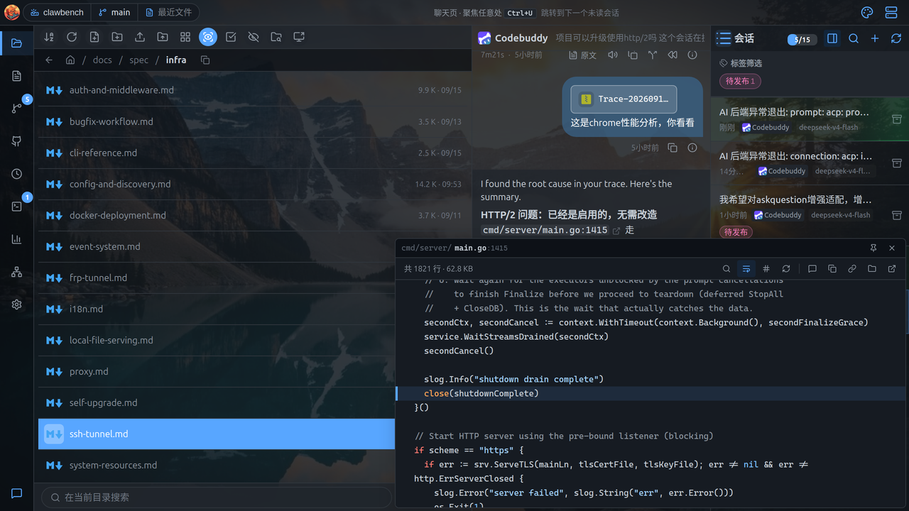

浮层包含：

| 元素 | 说明 |
|---|---|
| **标题栏** | 文件名 + 行号引用（如 `cmd/server/main.go:1415`） |
| **目录** | 文件所在目录（长路径跑马灯滚动） |
| **代码区** | 目标行上下文的代码切片，带语法高亮与行号 |
| **展开条** | 向上/向下加载更多上下文行 |
| **操作按钮** | 固定卡片、关闭、复制路径、在完整查看器中打开 |

浮层是**临时卡片**（transient）：点卡片外部会关闭；点「固定」按钮则常驻，方便边看代码边对话。

> **提示**：若点击路径直接跳转了查看器而不是弹浮层，说明**预览模式未开启**。开启后即为浮层模式。

> **为何有时不弹浮层直接跳转到查看器？**：这是因为「预览模式」未开启。代码链接预览浮层依赖预览模式开关——开启时点击路径弹浮层，关闭时点击路径直接跳转到完整查看器。如需使用浮层预览，请先在文件管理器工具栏开启「预览模式」。

### 9.4 Commit hash 标注

聊天里的短 commit id 可以点击，直接跳到该提交的详情页。

聊天里出现的短 commit hash 会附带一个打开图标：

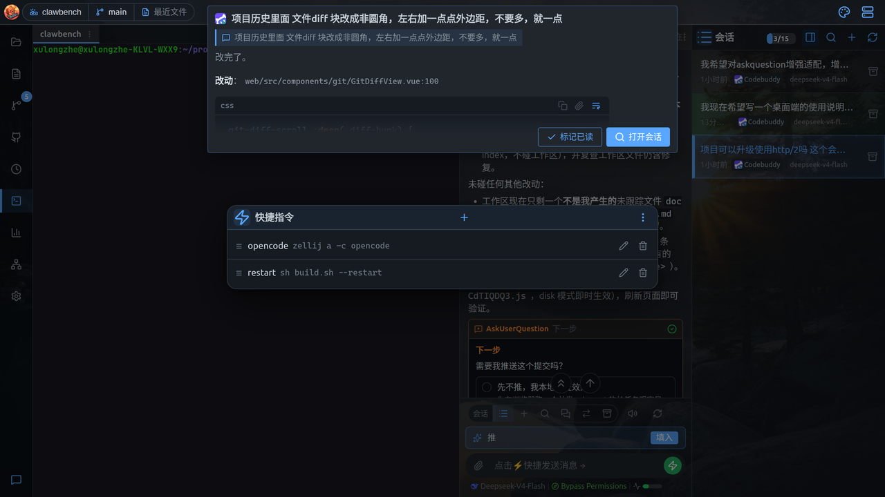

**点击后**切到「项目历史」并**直接定位到该提交的详情页**：

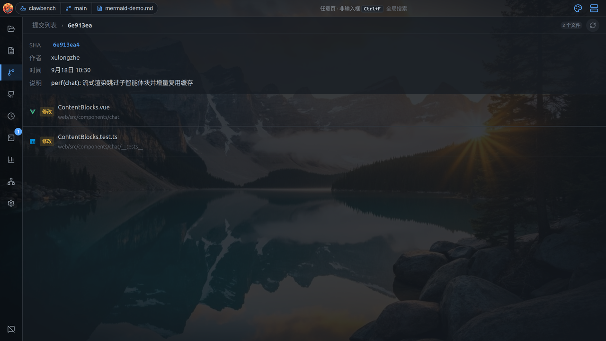

详情页显示 SHA、作者、时间、提交说明与变更文件列表，可继续查看 diff。SHA 本身也可点击复制。

### 9.5 Worktree 路径标注

多工作树环境下，聊天里的 worktree 路径也能点击打开。

在多工作树（worktree）环境下，聊天里出现的 worktree 路径会被识别并标注。worktree 标注**优先于**文件路径标注——避免 worktree 路径被当作普通相对路径二次匹配。

### 9.6 localhost 地址标注

聊天里的 `localhost:端口` 可以点击，自动建隧道并打开页面。

聊天里出现的 `localhost:PORT` 或 `127.0.0.1:PORT` 会附带一个打开图标。点击后 ClawBench 会：

1. 为该端口建立 SSH 隧道（端口映射）
2. 在内置 WebView 中打开该地址

这让「AI 说服务跑在 localhost:3000」到「我直接看到页面」变成一次点击。

### 9.7 标注管道的处理顺序

几类标注按固定先后识别，避免互相误匹配。

四种标注按固定顺序处理，且**已标注的元素不会被后续标注重复匹配**：

```
Worktree 标注 → 文件路径标注 → localhost 标注 → commit hash 标注
```

这个顺序有实际意义：worktree 路径本身就是文件路径，必须先识别为 worktree 才不会被子路径标注误处理。

### 9.8 流式期间的行为

AI 还在输出时不做标注，等这一轮结束、内容稳定后再做。

**流式输出进行中，标注管线不运行**——此时只做纯 Markdown 渲染。等这一轮回复结束、内容稳定后，才启动完整管线（含路径验证与标注）。

这样做的原因：流式期间内容不完整，路径可能只写了一半，此时标注会产出大量无效结果并造成闪烁。

## 10. Git 管理

查看当前项目的提交历史、分支、标签、工作树和未提交改动。

左侧 Dock 的「项目历史」图标进入 Git 管理。

### 10.1 提交历史

图形化的提交列表，可搜索，点开能看这次改了哪些文件。

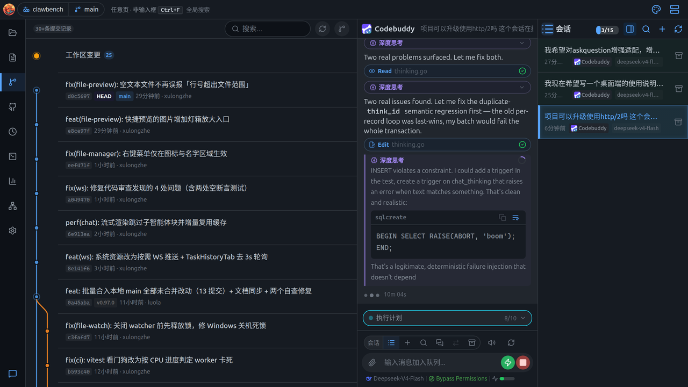

- 带图形化的提交列表，显示分支、标签、作者与时间
- 顶部有**搜索框**可按提交信息过滤
- 右上角「刷新」与「管理」按钮
- 滚动到底自动加载更多
- 顶部的**工作区变更**入口列出已暂存 / 未暂存 / 未跟踪的文件（角标显示数量）

点任意提交进入详情页：

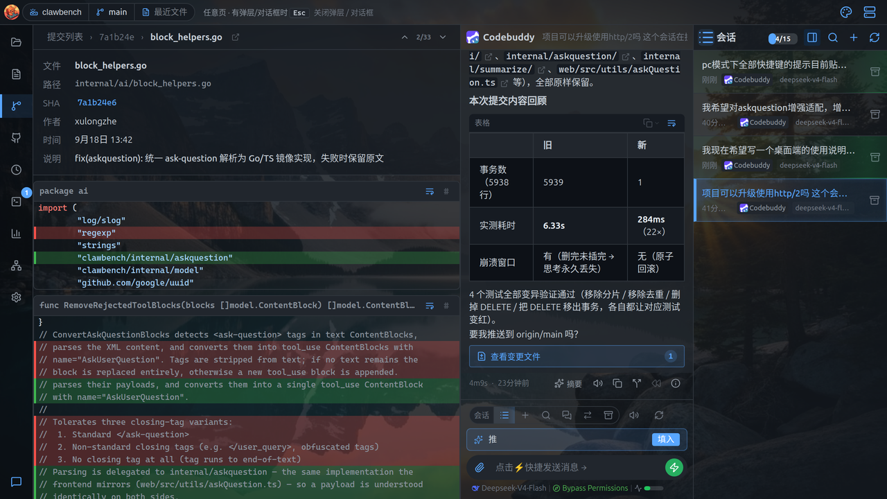

详情页显示：面包屑（提交列表 › 短 SHA › 文件名）、变更文件计数（如 `2/33 文件`）、文件路径、完整 SHA（点击复制）、作者、时间、提交说明，以及该文件的**代码 diff**（红绿标出增删行）。

### 10.2 分支

查看、切换、删除分支，并显示每个分支领先/落后多少个提交。

点「管理」进入分支/标签/工作树管理页：

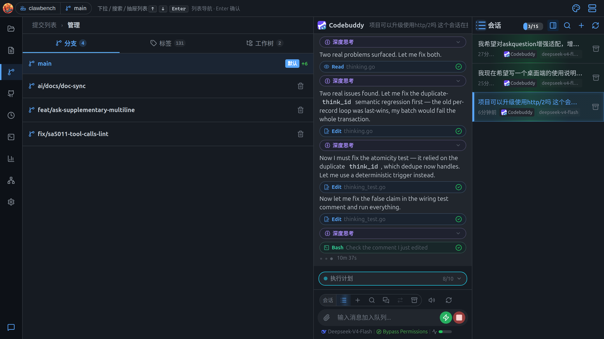

- 列出全部分支，当前分支高亮
- 显示每个分支的领先/落后提交数（`↑n ↓n`）
- 点分支行可切换分支；有未提交改动时会弹出 stash/强制切换确认框
- 分支行右侧可删除分支

### 10.3 标签

列出所有 Git 标签，可以删除。

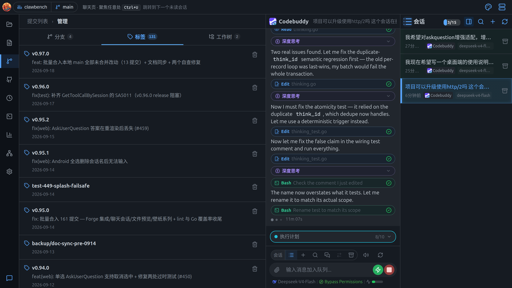

列出全部标签，显示标签名、附注信息与日期。可删除标签。

### 10.4 工作树

列出所有 worktree 及其状态，可删除非主工作树。

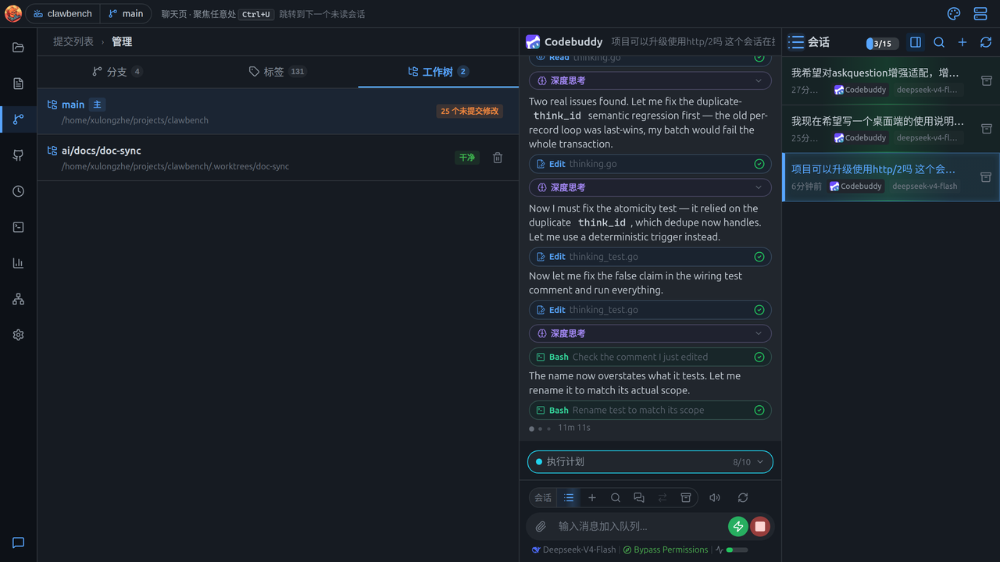

列出所有 worktree，显示名称、路径与状态徽标（main / dirty / clean / locked / missing）。可删除非主工作树。

### 10.5 Diff

红绿标出增删行的差异视图，可在文件之间前后切换。

点任意文件打开 diff 抽屉：

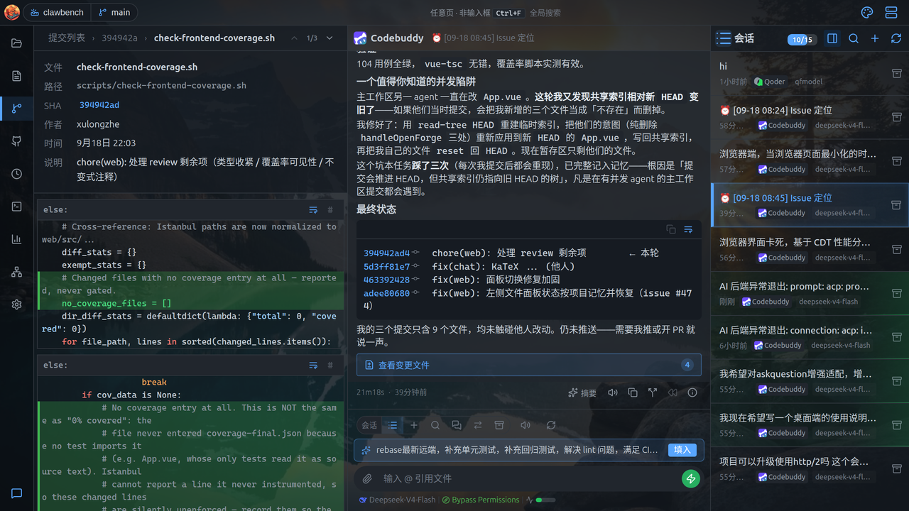

- 红绿标出增删行
- 顶部有**上一文件 / 下一文件**导航与计数
- 支持行号定位、hunk 折叠
- 提交详情页可查看提交元信息（SHA 点击复制）

## 11. 终端

服务器上的真实命令行，可开多个标签，并支持主题与虚拟键。

左侧 Dock 的终端图标打开 Web 终端，这是服务器上的真实 PTY 会话。

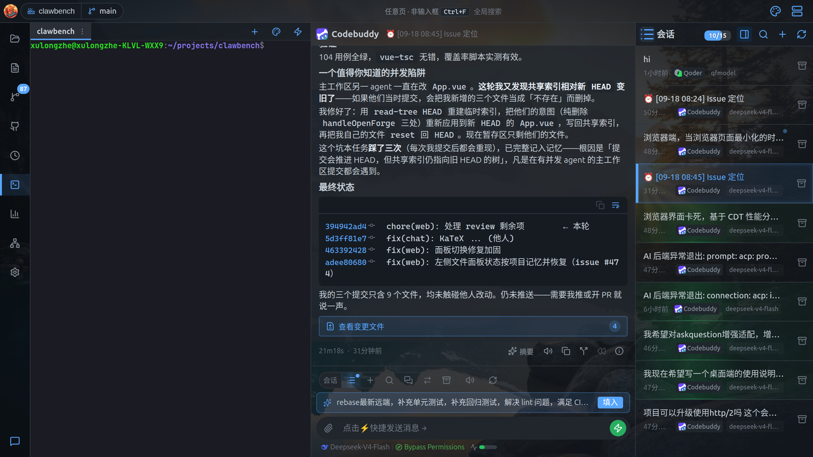

**标签栏**：可同时开多个终端会话，每个标签有标题与未读点；标签菜单（右键或菜单按钮）可复制路径、关闭、全部关闭。

**PC 顶栏按钮**：新建标签、主题、快速指令。

**终端工具栏**（移动端/窄屏更常用）：

| 按钮 | 作用 |
|---|---|
| 符号 | 展开符号栏（标点/数学/括号/引号/shell） |
| 终端模式 | 循环切换浏览/手势/选择三种手势模式 |
| 输入 | 打开输入抽屉（便于长文本输入） |
| 快捷指令 | 打开快捷指令菜单（见下） |
| 主题 | 打开终端主题选择器 |
| 工具栏配置 | 配置虚拟键位与符号 |
| 终端操作帮助 | 打开帮助抽屉 |

**虚拟键**：Ctrl / Alt / Esc / Tab / 方向键 / Home / End 等，补齐移动端缺失的按键。

**主题选择器**：

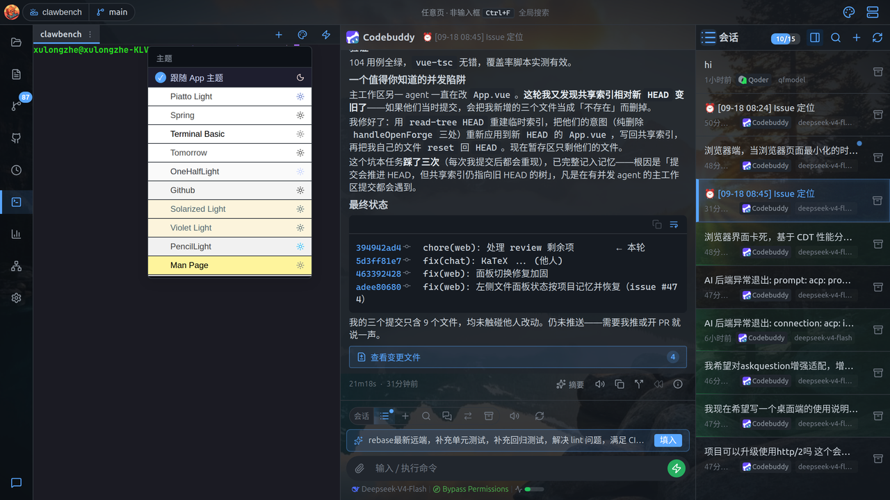

可选「跟随 App 主题」或指定具体配色（Piatto Light、Spring、GitHub、Solarized Light 等），每个主题标注明暗。

### 11.1 快捷指令

把常用 shell 命令存起来，一键写进当前终端。

把常用 shell 命令存成快捷项，一键写入当前终端。

**调用**：点终端顶栏（或工具栏）的**快捷指令**按钮，弹出菜单：

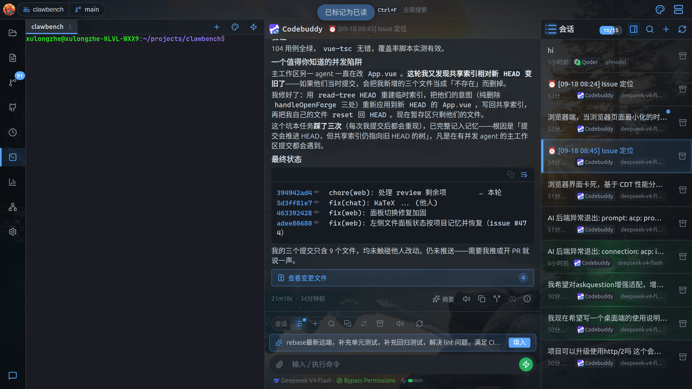

- **单击条目**：把命令**写入当前活动终端**（不自动回车，你可以先确认再按 Enter）
- **点「编辑」**：打开管理抽屉

**管理**：点「编辑」进入快捷指令抽屉：

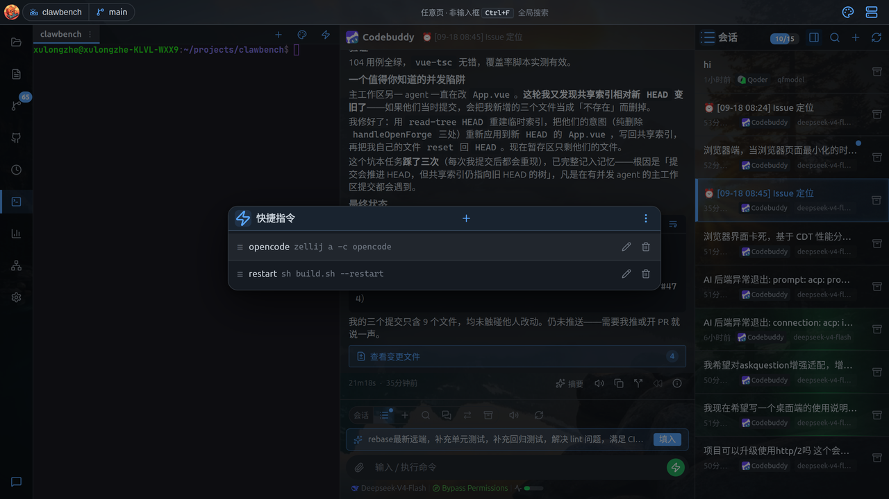

| 操作 | 说明 |
|---|---|
| **拖动左侧手柄（≡）** | 调整顺序，顺序持久化 |
| **点条目** | 编辑命令 |
| **右上角「+」** | 新增快捷指令 |
| **右上角「⋮」** | 导出 / 导入 JSON |

快捷指令只作用于**当前可见的活动终端标签**，不会误发到后台标签页。

> **与聊天快捷发送的区别**：聊天快捷发送存的是 Prompt（发给 AI），终端快捷指令存的是 shell 命令（写进 PTY）。两者分开存储，互不影响。

> **注意**：终端执行的是服务器上的真实命令，权限与运行 ClawBench 的用户一致。请谨慎执行破坏性操作。

## 12. 任务

让 AI 按时间或事件自动干活：定时执行，或仓库有新动态时自动跑。

左侧 Dock 的任务图标进入任务列表。任务让 AI 按计划或事件自动工作。

### 12.1 任务列表

列出所有任务，以及它们的触发方式、下次执行时间和状态。

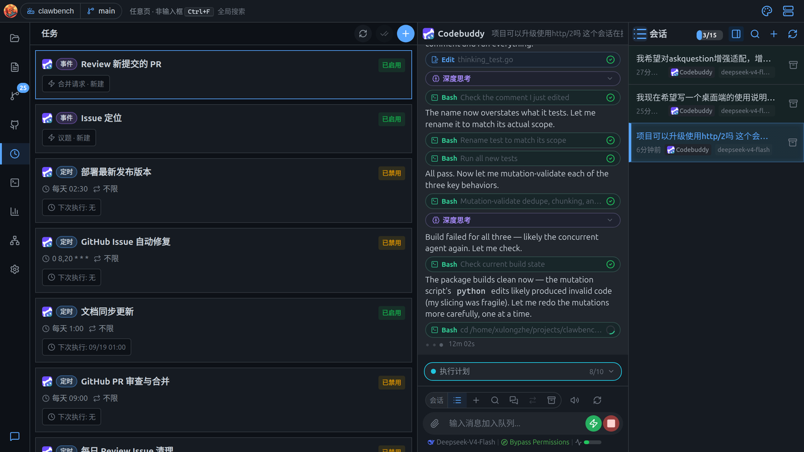

每个任务项显示：

- **触发类型徽标**：定时 / 事件
- **任务名**、运行中指示点、未读标记
- **cron 表达式或订阅事件**
- **下次执行时间**
- **状态标签**：已启用 / 已禁用

顶部按钮：**刷新**、**全部标记已读**、**新建任务**。

### 12.2 定时任务

新建任务的表单，配置名称、智能体、频率、提示词等。

点「新建任务」进入创建表单：

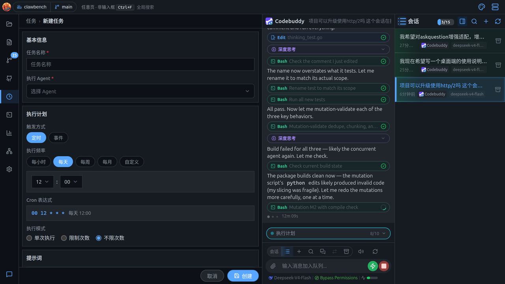

| 字段 | 说明 |
|---|---|
| **任务名称** | 便于识别的名字 |
| **执行 Agent** | 用哪个智能体执行 |
| **触发方式** | 定时 / 事件（按钮组切换） |
| **执行频率** | 每小时 / 每天 / 每周 / 每月 / 自定义 |
| **时间** | 按频率选择小时/分钟/星期几 |
| **Cron 表达式** | 选「自定义」时直接填 |
| **重复模式** | 不限次数 / 限制次数（填最大运行次数） |
| **提示词** | 每次执行时发给 AI 的指令 |

底部为「取消」与「创建」。

### 12.3 事件任务

让任务监听仓库事件（议题、合并请求、流水线），事件一到就自动触发。

触发方式选「事件」后，表单切换为事件配置：

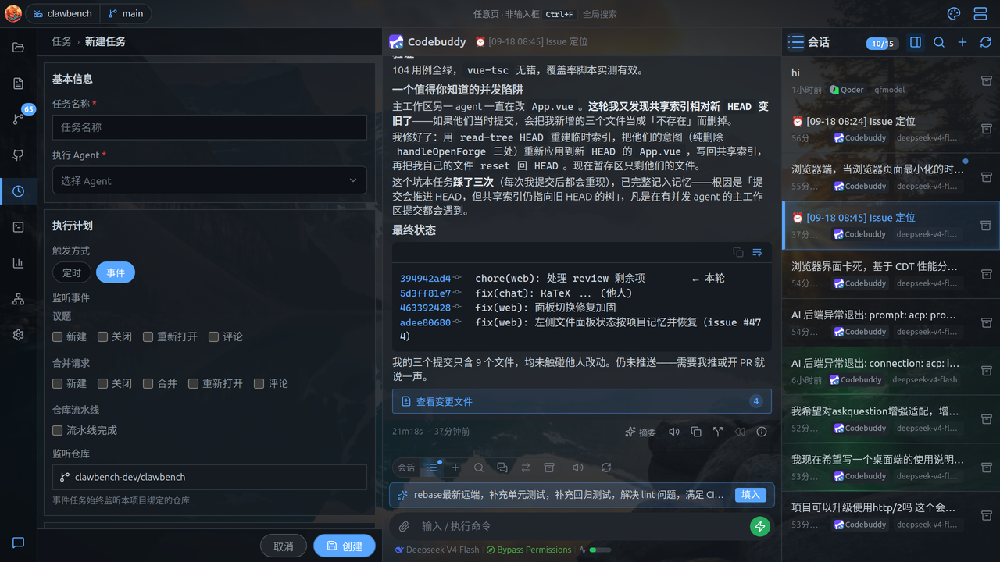

可勾选的监听事件（按类型分组）：

| 分组 | 事件 |
|---|---|
| **议题** | 新建、关闭、重新打开、评论 |
| **合并请求** | 新建、关闭、合并、重新打开、评论 |
| **流水线** | 流水线完成 |

下方显示**监听仓库**（只读，来自项目绑定）。未绑定项目时会显示警告。

> **事件变量**：事件触发时，AI 的提示词中可使用以下变量，系统会自动替换为实际值：
> 
> | 变量 | 说明 | 适用事件 |
> |---|---|---|
> | `{{TITLE}}` | Issue/PR 的标题 | issue.* / pr.* |
> | `{{NUMBER}}` | Issue/PR 编号 | issue.* / pr.* |
> | `{{URL}}` | Issue/PR 的完整 URL | issue.* / pr.* |
> | `{{BODY}}` | Issue/PR 正文（纯文本，截断至前 2000 字符） | issue.* / pr.* |
> | `{{AUTHOR}}` | 操作者的用户名 | 全部 |
> | `{{ACTION}}` | 触发的动作名称（如 `opened`、`merged`） | 全部 |
> | `{{REPO}}` | 仓库全名（如 `owner/repo`） | 全部 |
> | `{{PIPELINE_STATUS}}` | 流水线状态（success/failed/running） | pipeline_done |
> | `{{PIPELINE_BRANCH}}` | 触发流水线的分支名 | pipeline_done |
> | `{{PIPELINE_URL}}` | 流水线页面 URL | pipeline_done |
> 
> 示例提示词：「新 Issue「{{TITLE}}」已打开，请查看 {{URL}} 并给出分析。」

### 12.4 执行详情

看某个任务的历史执行记录、输出与耗时，并能编辑、暂停、删除。

点任务项进入详情页：

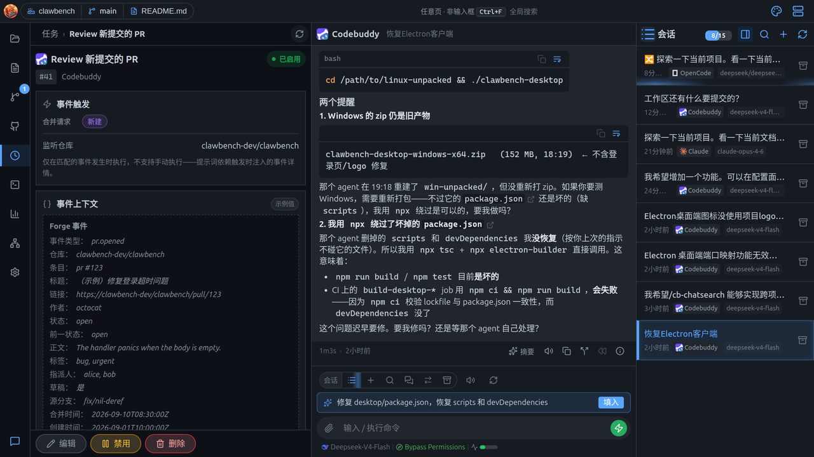

- **概览卡**：状态、任务 ID（点击复制）、提示词（可折叠）
- **定时卡 / 事件卡**：cron 或订阅事件、下次运行时间、事件上下文预览
- **执行历史**：每次执行的记录，含触发类型（手动/自动）、状态徽标、耗时、摘要；运行中的可取消，历史项可删除
- **底部操作栏**：编辑、手动运行、暂停、恢复、删除

每个执行记录独立计数未读，点进具体执行才标记已读。

### 12.5 Forge 集成（GitHub / GitLab）

把 GitHub/GitLab 的议题、PR、流水线搬进界面看，并驱动事件任务。

左侧 Dock 的「议题与合并请求」图标进入 Forge 面板。

面板顶部有**仓库徽标**（点击可改绑定 / 打开仓库 / 解绑）、**全部标记已读**、**刷新**。

四个页签：

| 页签 | 内容 |
|---|---|
| **动态** | 聚合未读 / 已读 / 全部条目，后台轮询感知变化 |
| **议题** | Issue 列表，支持状态筛选（开启/已关闭/全部）与「我的」筛选（分配给我/我提的/待我 review） |
| **合并** | PR / MR 列表，筛选同上 |
| **流水线** | CI 流水线列表，显示状态、分支、提交、事件类型 |

点任意条目进入详情：正文、状态徽标、关联 CI、评论区（可加载更多）。PR 详情可展开关联的流水线。

**仓库绑定**：优先从项目 git remote 自动识别并绑定（官方 host 自动绑定，自建实例需确认 host），也可手动填 URL；绑定关系随项目走。自建实例同时支持 http 与 https——host 仍是身份键，同一实例两种协议访问到的仍是同一个仓库。

**变化感知与未读**：后台轮询仓库变化，页签显示未读徽标；六类事件（新开 / 关闭 / 合并 / 重开 / 评论 / CI 完成）可分别开关通知。未读按**条目**计数——同一 issue 的三条评论算一条未读，可单条标记已读，也可整仓库一键清除。

**动态页签**：聚合所有条目并可在未读 / 已读 / 全部之间切换（默认未读），带行级已读标记与「有新评论」这类事件原因文案。

**事件触发任务**：任务可选「触发方式：事件」，订阅 `issue.opened`、`pr.merged`、`pipeline_done` 等事件；事件到达自动唤起 AI 任务，prompt 前置只读的事件上下文（仓库、编号、标题、链接、作者、评论正文等按事件类型条件注入），执行记录可深链回原始 issue/PR。

**引用到对话**：详情页 header 的引用按钮把 issue/PR 作为 URL 附件带入聊天（chip 显示 `owner/repo#123`），可再划取文本补充；正文也支持双击复制与划取引用。

**凭据与安全**：token 按 `(平台, host)` 隔离存储（自建 GitLab 各自独立），配置接口只回传存在性、不回传明文；自建实例可开启「跳过 TLS 校验」支持自签名证书（默认关，有安全风险）。内网 / 自建 host 服务端不拦截，改在绑定弹窗里提示。

> **提示**：GitHub API 有速率限制。若提示 `API rate limit exceeded`，稍后再试或换用 token。

> **AI 自身事件抑制**：当 AI 在对话中执行了某个操作（如在 GitHub 上评论了 Issue），该操作产生的事件**不会再次触发**任务执行，以避免 AI 动作 → 事件触发 → AI 再次响应 → 死循环。抑制基于事件来源判断（AI 自身操作的发起方与当前 Agent 一致时跳过）。

### 12.6 会话搜索（RAG）

建好索引后，用自然语言搜索历史会话和项目文档。

在设置中启用「会话搜索」后，项目文档会被分块、向量化并建立索引，之后可用自然语言搜索历史会话与文档内容（见 [13.9 会话搜索](#139-会话搜索)）。

会话搜索抽屉支持关键词 / 语义 / 混合三种检索方式，以及归档、排序、时间范围等筛选：

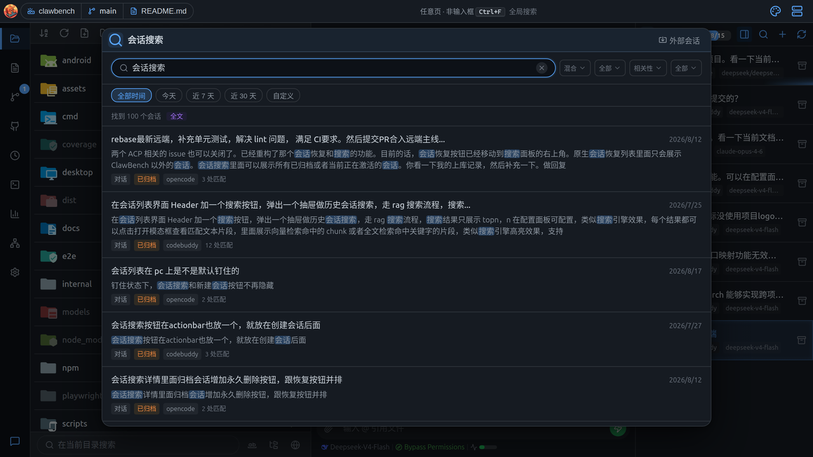

## 13. 数据统计

看用量、代码量、系统资源的数字面板。

左侧 Dock 的「数据统计」图标进入统计页，含三个子页签。

### 13.1 用量统计

按时间、模型、后端统计 token 消耗与请求次数。

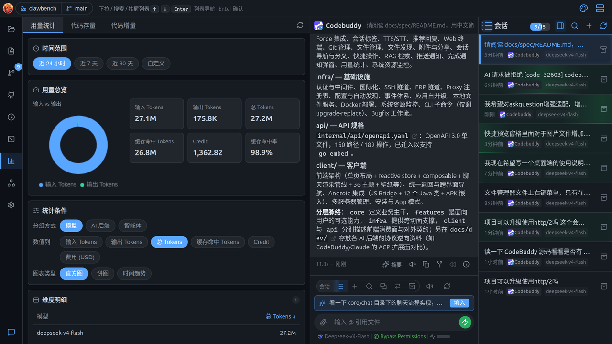

- **时间范围**：近 24 小时 / 近 7 天 / 近 30 天 / 自定义（选起止日期）
- **用量总览环形图**：输入 vs 输出的占比，可下钻
- **指标卡**：输入 Tokens、输出 Tokens、总 Tokens、缓存命中 Tokens、Credit、缓存命中率
- **统计条件**：分组方式（模型 / AI 后端 / 智能体）、数值列（多选）、图表类型（直方图 / 饼图 / 时间趋势）
- **维度明细表**：按所选维度列出各项数值，点表头可排序

> 用量数据是独立台账，不会因为删除会话而丢失。

### 13.2 代码存量

按语言统计项目里一共有多少行代码。

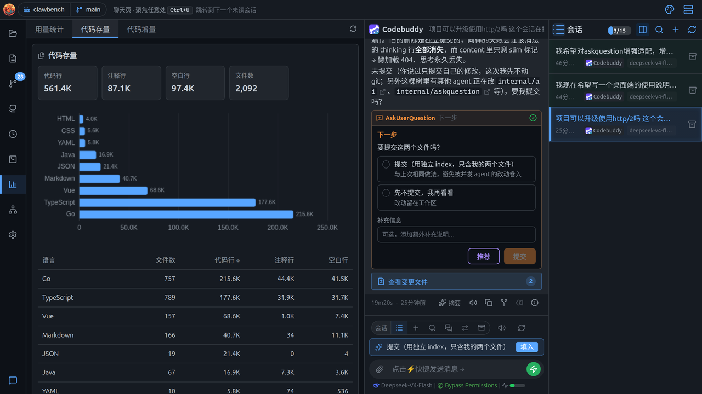

项目代码量快照，按语言分类统计代码行数。排除规则 = 内置规则 ∩ 项目 `.gitignore`。

> 首次计算耗时较长（需要扫描全项目），会显示「加载中」。

### 13.3 代码增量

统计一段时间内每个人新增、删除了多少行代码。

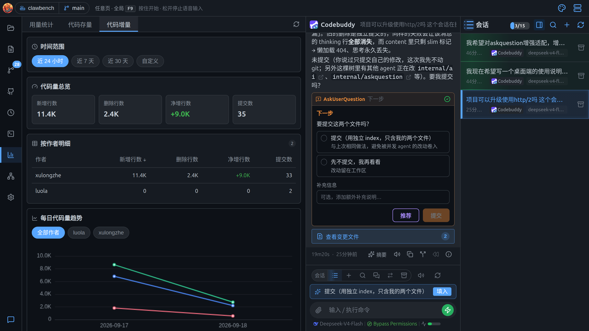

指定时间窗内按作者统计新增 / 删除 / 净增行数与提交数。支持作者筛选。

### 13.4 系统资源监控

实时查看服务器 CPU、内存、磁盘、网络的占用情况。

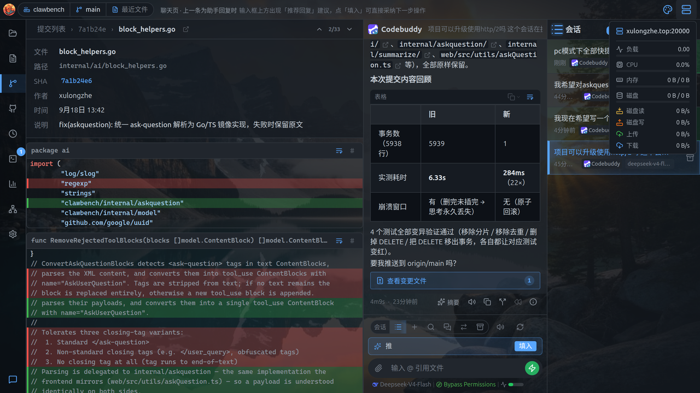

点顶栏右侧的资源指示图标展开实时面板，显示：

| 指标 | 说明 |
|---|---|
| **CPU** | 实时占用率 |
| **内存** | 已用 / 总量 |
| **磁盘** | 已用 / 总量 |
| **磁盘读写** | 每秒读 / 写字节数 |
| **上传 / 下载** | 每秒网络流量 |
| **负载** | 系统 load average |

面板顶部显示当前主机标识（host:port）。数据按需推送——面板关闭时不采集，不占用资源；WebSocket 断线时会显示连接状态。刚打开时指标可能短暂显示 0，等一个采样周期即可。

## 14. 设置

所有配置项的入口，按分类排列。

左侧 Dock 最后一个图标进入设置。

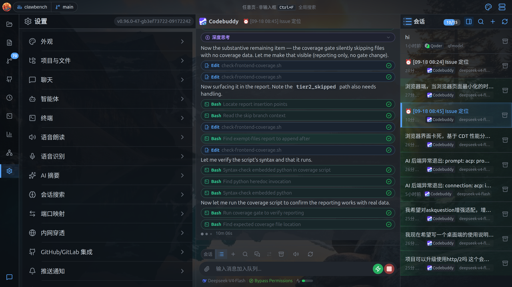

设置首页按两列列出 16 个分类。以下逐类说明。

### 14.1 外观

主题、语言、字体、缩放、壁纸等看得见的东西。

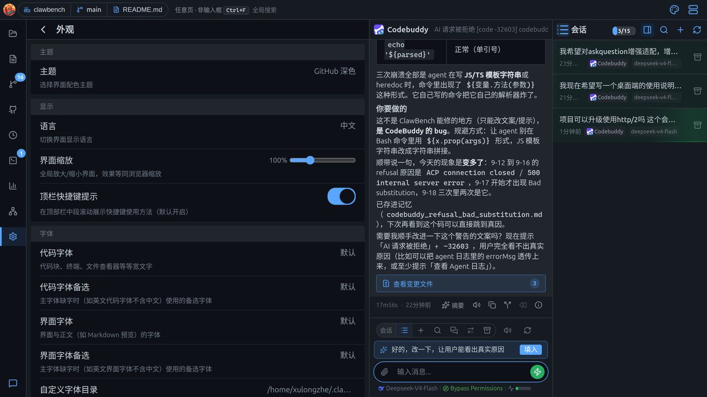

| 设置项 | 类型 | 说明 |
|---|---|---|
| **主题** | 下拉 | 36+ 种命名主题，可选「跟随系统」 |
| **语言** | 下拉 | 中文 / English |
| **界面缩放** | 滑块 | 80%–150%，效果等同浏览器缩放 |
| **顶栏快捷键提示** | 开关 | 是否在顶栏显示快捷键跑马灯 |
| **代码字体** | 下拉 | 代码区字体 |
| **代码字体备选** | 下拉 | 主字体缺失时的回退 |
| **界面字体** | 下拉 | UI 字体 |
| **界面字体备选** | 下拉 | 主字体缺失时的回退 |
| **自定义字体目录** | 文本 | 服务器上存放字体文件的目录 |
| **壁纸 / 面板不透明度** | 专用组件 | 自定义背景图与面板透明度 |

自定义壁纸支持本地上传与 Bing 每日图两种来源，并可用高斯模糊虚化背景：

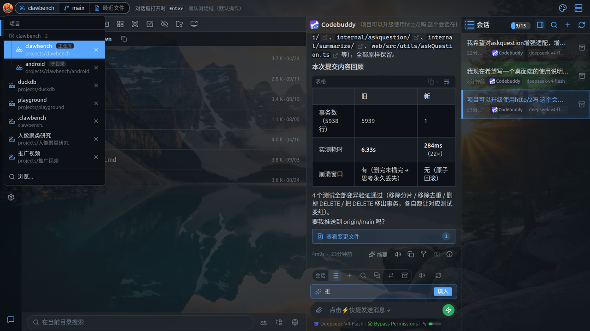

- **壁纸开关**：总开关
- **来源**：本地图片 / Bing 每日图
- **面板不透明度**：让背景半透明透出，范围可调
- **模糊强度**：对背景图做高斯模糊
- **设置为主题背景**：在文件查看器中右键图片即可快速设为壁纸

> **Bing 每日图**：选「Bing 每日图」后，壁纸每日自动更新为 Bing 首页当日图片。图片保存在 `{data-dir}/wallpaper/bing/` 目录，每次更新前会先删除旧图片。服务器需能访问 `www.bing.com` 才能获取当日图片。

### 14.2 项目与文件

项目列表长度、文件搜索上限、查看器默认行为、上传限制。

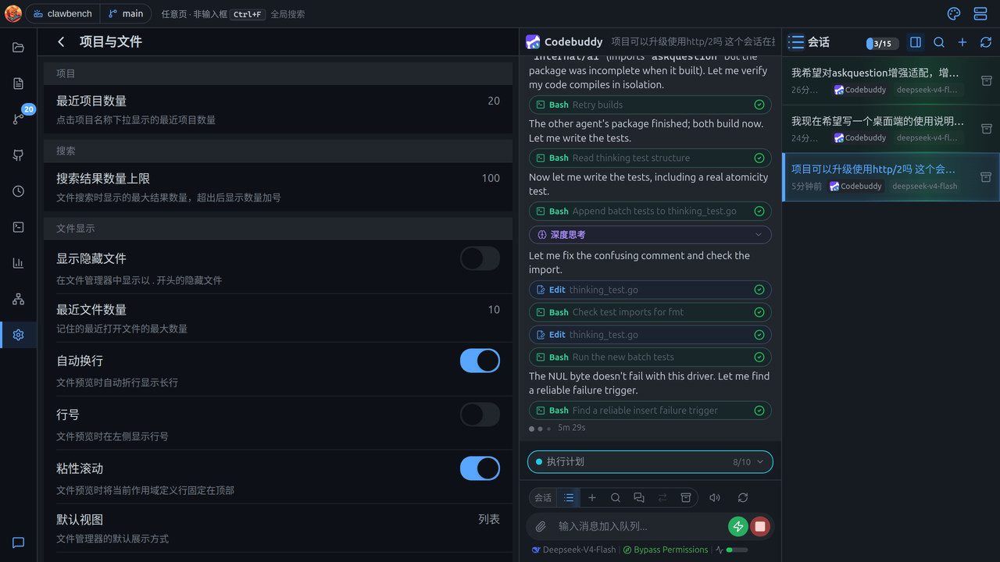

| 设置项 | 说明 |
|---|---|
| **最近项目数量** | 项目下拉里保留几个 |
| **搜索结果数量上限** | 文件搜索最多返回多少条（10–500） |
| **显示隐藏文件** | 文件管理器默认是否显示 |
| **最近文件数量** | 顶栏最近文件列表长度（1–50） |
| **自动换行** | 代码查看器默认换行 |
| **行号** | 代码查看器默认显示行号 |
| **粘性滚动** | 滚动时函数名吸顶 |
| **默认视图** | 列表 / 网格 |
| **排序字段 / 方向** | 默认排序方式 |
| **代码链接预览** | 是否启用点击路径弹出代码切片 |
| **文件预览模式** | 是否默认开启预览窗格 |
| **上传大小上限 / 文件数** | 上传限制 |

### 14.3 聊天

聊天相关行为：朗读、锁屏、加载条数、上下文预算、会话上限等。

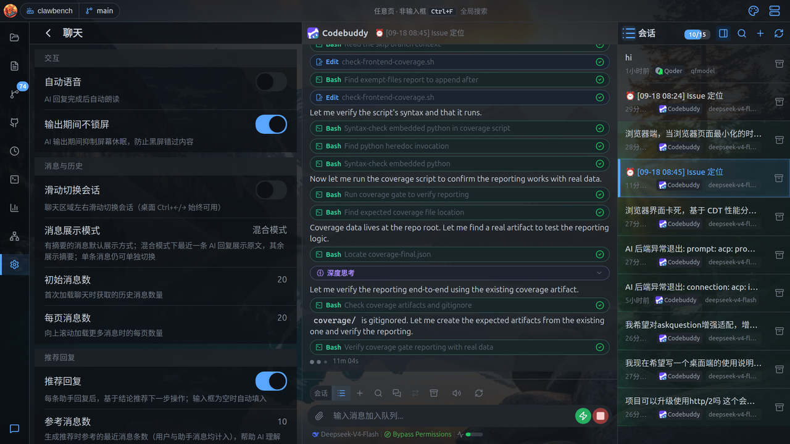

| 设置项 | 说明 |
|---|---|
| **自动朗读** | AI 回复完成后自动朗读 |
| **防止锁屏** | 执行期间阻止屏幕休眠 |
| **滑动切换会话** | 手势切换 |
| **消息显示模式** | 混合 / 仅摘要 / 仅原文 |
| **初始消息数 / 分页大小** | 打开会话时加载多少条 |
| **系统提示间隔** | 每隔多少条消息在上下文开头重新注入系统提示（用于刷新 AI 对项目状态/指令的感知）。间隔太短会增加 token 消耗，太长则 AI 可能遗忘重要指令。设置为 0 则只在会话开始时注入一次。 |
| **分叉上下文预算** | 分叉时带多少 token 的上下文 |
| **推荐开启 / 上下文条数** | 推荐回复的开关与参考范围 |
| **跳转 AI 摘要** | 快捷入口 |
| **会话上限** | 项目内最多保留多少会话 |
| **归档保留开关 / 天数** | 自动清理过期归档会话 |

> ⚠️ 归档为**单向操作**，归档后的会话无法从界面取消归档，只能删除。若需要保留会话内容，请勿归档。

### 14.4 智能体

扫描服务器上装了哪些 AI CLI，并配置它们的默认模型。

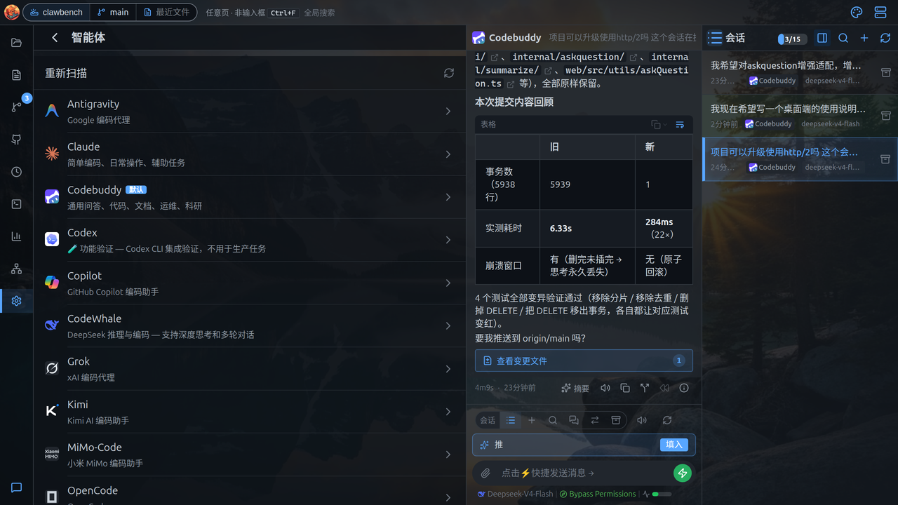

- **重新扫描**：重新探测服务器上已安装的 AI CLI
- 智能体列表：每个智能体可进入详情页，查看配置、复制、删除

点智能体进入详情页可配置默认模型等偏好：

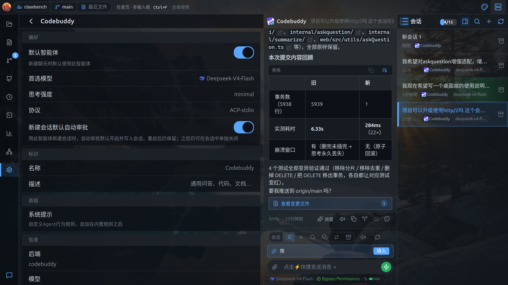

详情页按模型来源分组列出可选模型，选中后点保存。此处设置的默认模型会影响该智能体新建会话时的初始模型。

### 14.5 终端

终端的开关、主题、字号、超时、并发上限与缓冲行数。

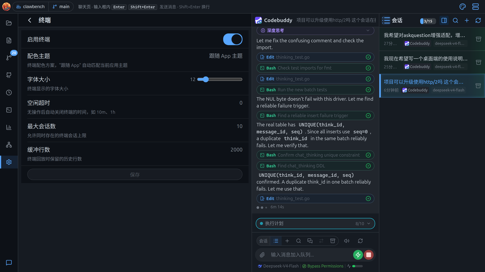

| 设置项 | 说明 |
|---|---|
| **启用终端** | 总开关 |
| **配色主题** | 终端默认主题 |
| **字号** | 10–24 |
| **空闲超时** | 多久无操作后回收会话 |
| **最大会话数** | 并发上限 |
| **缓冲行数** | 回放缓冲大小 |

### 14.6 语音朗读

配置把文字读出来的 TTS 引擎、音色与缓存。

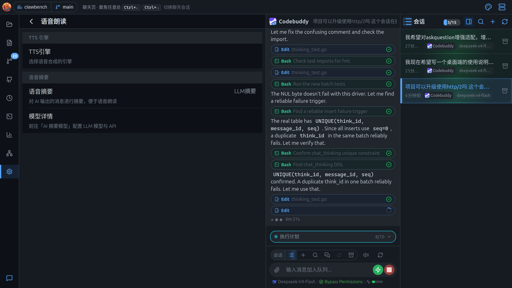

- **TTS 引擎入口**：进入引擎子页配置
- **朗读摘要后端**：simple / api

引擎子页可选 Edge / Piper / Kokoro / MOSS-TTS-Nano，并配置音色、语速、缓存上限；不同引擎有各自的模型路径等专属字段。

> **TTS 缓存策略**：已朗读过的内容会将音频缓存到本地磁盘，下次播放同一内容时直接读缓存，不消耗 TTS API 额度。缓存上限为 100 个文件，超出后按 LRU（最近最少使用）驱逐策略自动清理旧缓存。缓存目录为 `{data-dir}/tts-cache/`，可直接查看或手动清理。

### 14.7 语音识别

配置把语音转成文字的 STT 服务（语音输入用它）。

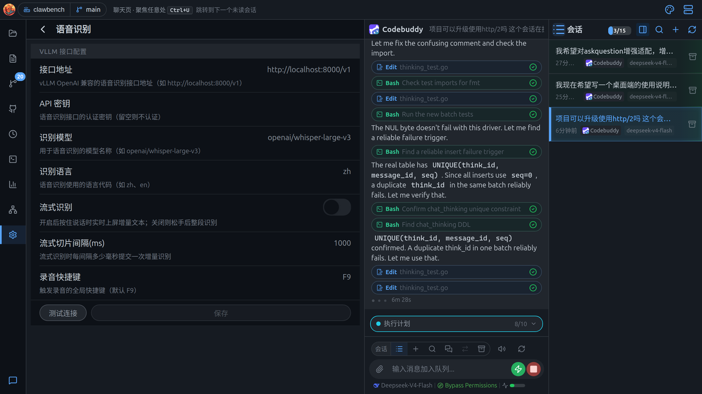

| 设置项 | 说明 |
|---|---|
| **服务地址** | vLLM Whisper 服务地址 |
| **API Key** | 访问密钥 |
| **识别模型** | 模型名 |
| **语言** | 识别语言 |
| **流式识别** | 流式识别（开启）在说话过程中实时返回文字，延迟低、体验流畅，适合日常使用；非流式（关闭）需等待说完再返回结果，延迟较高但服务端资源消耗更少。移动端语音输入强烈建议开启流式识别。 |
| **分片毫秒** | 流式分片大小（200–10000） |
| **快捷键** | 触发语音输入的按键 |

底部有「测试连通」按钮。

### 14.8 AI 摘要

配置生成会话摘要和推荐回复所用的模型。

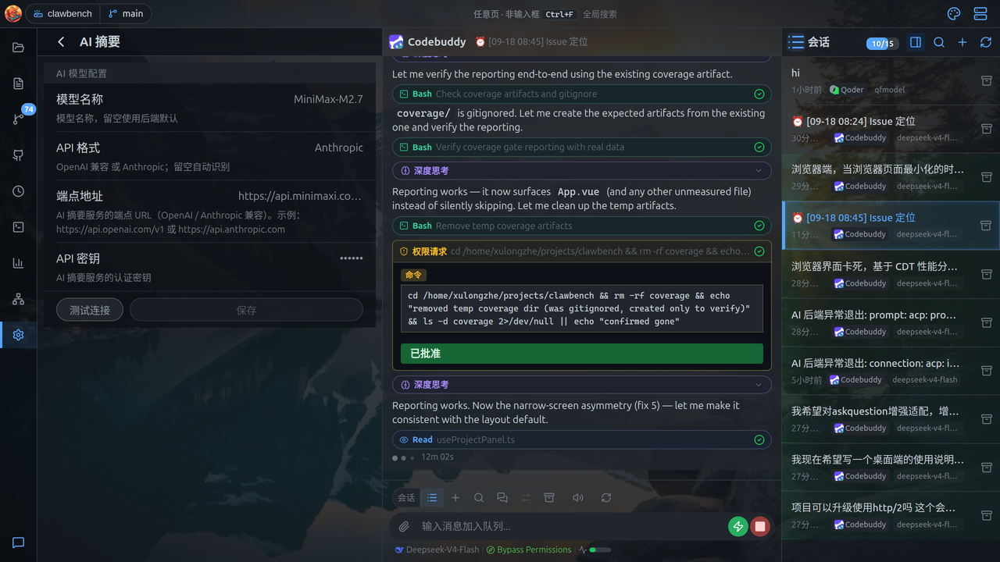

| 设置项 | 说明 |
|---|---|
| **模型名称** | 用于摘要的模型 |
| **API 格式** | auto / openai / anthropic |
| **Base URL** | 服务地址 |
| **API Key** | 访问密钥 |

底部有「测试连通」按钮。

### 14.9 会话搜索

配置 RAG 检索的分块、向量模型与索引重建。

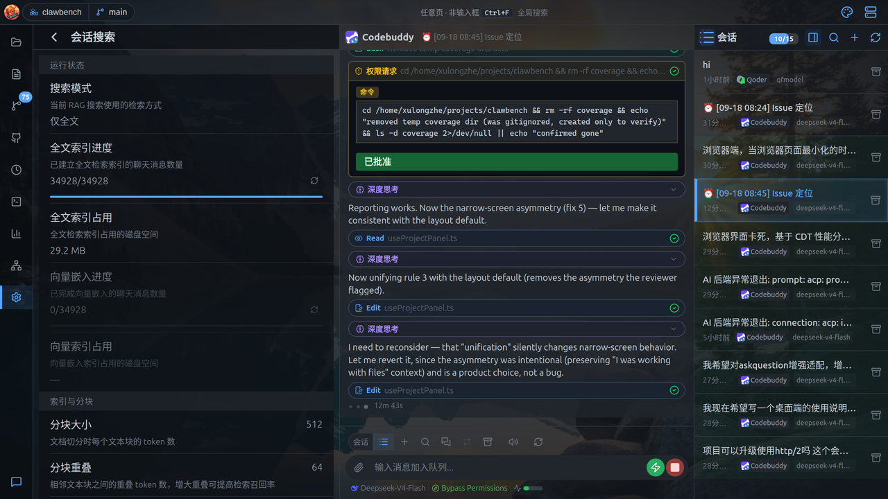

- **状态信息**：当前模式、索引进度、FTS 索引大小、向量化进度、向量索引大小、嵌入服务健康状态
- **索引参数**：分块大小、分块重叠、批次大小、保留天数、搜索条数上限
- **向量区**：向量开关、Base URL、模型、API Key、搜索池大小
- **底部重建按钮**：重建 FTS 索引 / 重建向量索引 / 全量重建

> 全量重建耗时较长（需重新分词），会在后台异步执行。

### 14.10 端口映射

把服务器上的端口转发到本地，方便直接访问。

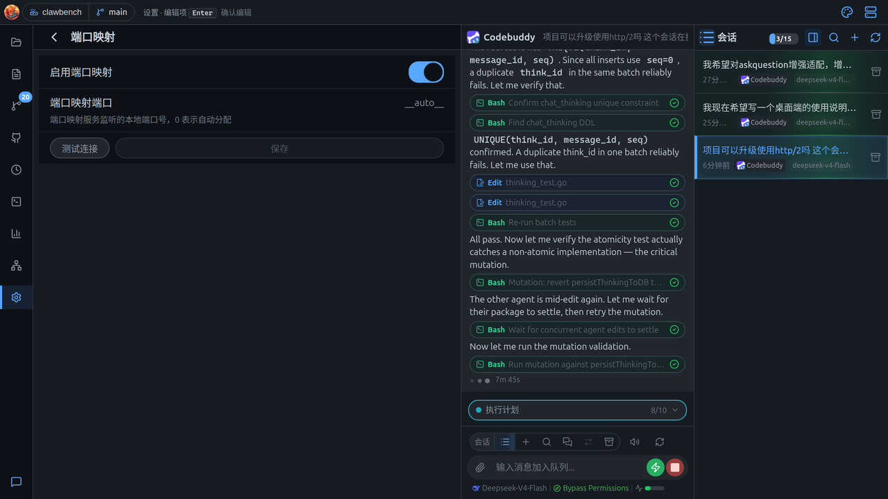

| 设置项 | 说明 |
|---|---|
| **启用端口映射** | 总开关 |
| **端口** | 映射端口（0 表示自动分配） |

左侧 Dock 的「端口映射」页签是它的操作界面：

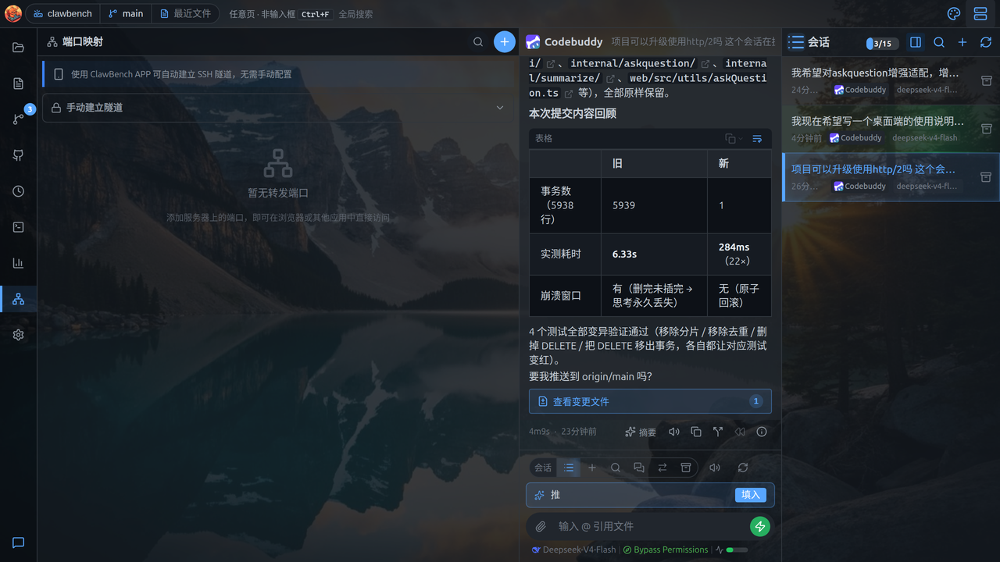

- **使用 ClawBench APP 可自动建立 SSH 隧道**：移动端会自动配置，无需手动
- **手动建立隧道**：桌面端在浏览器访问时，按提示手动建立
- **转发端口列表**：添加服务器上的端口后，即可在浏览器或其他应用中直接访问

底部有「测试连通」按钮。

### 14.11 内网穿透

通过公网 FRP 服务把内网服务暴露出去。

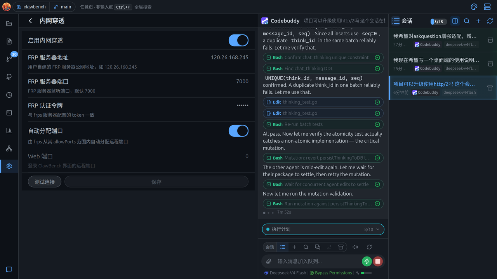

| 设置项 | 说明 |
|---|---|
| **启用** | 总开关 |
| **FRP 服务器地址 / 端口** | 公网 FRP 服务 |
| **FRP 认证令牌** | 访问密钥 |
| **自动分配端口** | 开关；关闭后需手填远程端口与 SSH 远程端口 |

底部有「测试连通」按钮。

### 14.12 GitHub/GitLab 集成

保存各仓库平台的访问令牌，并控制哪些事件要通知。

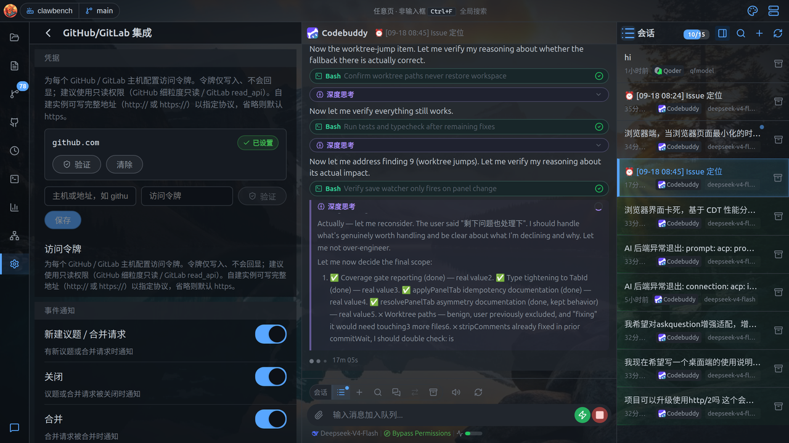

- **凭据区**：按 host 分别保存访问令牌，可验证 / 清除 / 添加
- **通知开关**：新建议题、关闭、合并、重新打开、评论、流水线完成
- **跳过 TLS 校验**：自建实例用自签证书时开启
- **暂停事件任务**：临时停止所有事件触发的任务

### 14.13 推送通知

决定完成、审批、仓库动态等提醒通过哪些渠道发给你。

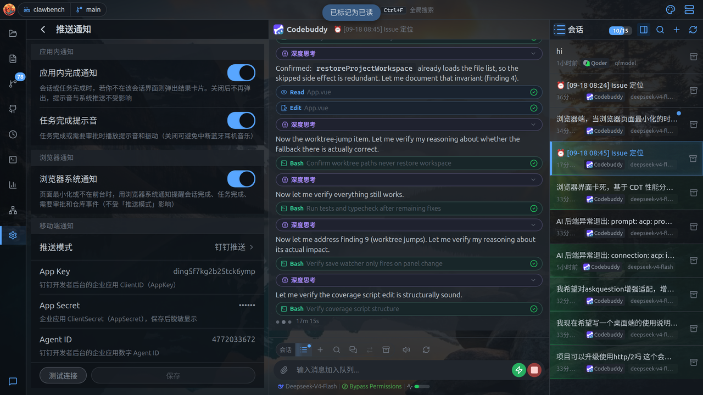

| 设置项 | 说明 |
|---|---|
| **应用内完成通知** | 会话/任务完成时弹出卡片 |
| **任务完成提示音** | 通知音效（关掉可避免蓝牙耳机中断） |
| **浏览器系统通知** | 页面最小化或不在前台时，用操作系统通知提醒会话完成、任务完成、需要审批和仓库事件。浏览器与 App 模式都可用 |
| **悬浮状态窗** | App 模式专属 |
| **实时更新** | App 模式专属 |
| **推送方式** | 原生 / 钉钉 / 飞书 / 关闭；钉钉与飞书各自有 app_key、app_secret 等字段 |

底部有「测试连通」按钮。

> **「推送方式」与「浏览器系统通知」互不影响。** 「推送方式」选的是**手机与 IM** 通道（原生推送 / 钉钉 / 飞书），设成「关闭」只表示不再往手机和 IM 发消息；只要「浏览器系统通知」开着，网页端最小化时仍会弹系统通知。反过来，关掉「浏览器系统通知」也不影响手机推送。若想彻底静音，两处都要关。

### 14.14 安全

配置 HTTPS 证书与修改访问密码。

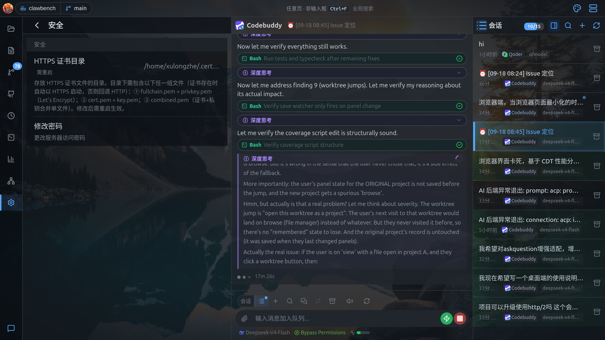

| 设置项 | 说明 |
|---|---|
| **HTTPS 证书目录** | TLS 证书路径（修改后需重启） |
| **修改密码** | 打开改密弹窗 |

> **文件分享 Token 安全模型**：分享链接中的 token 即为访问凭证——任何人拿到链接即可只读访问对应文件，无需额外认证，且链接在关闭分享前持续有效。敏感文件请勿生成分享链接，或生成后尽快手动关闭分享。

### 14.15 调试

打开日志回传排查问题，以及查看 WebSocket 投递统计。

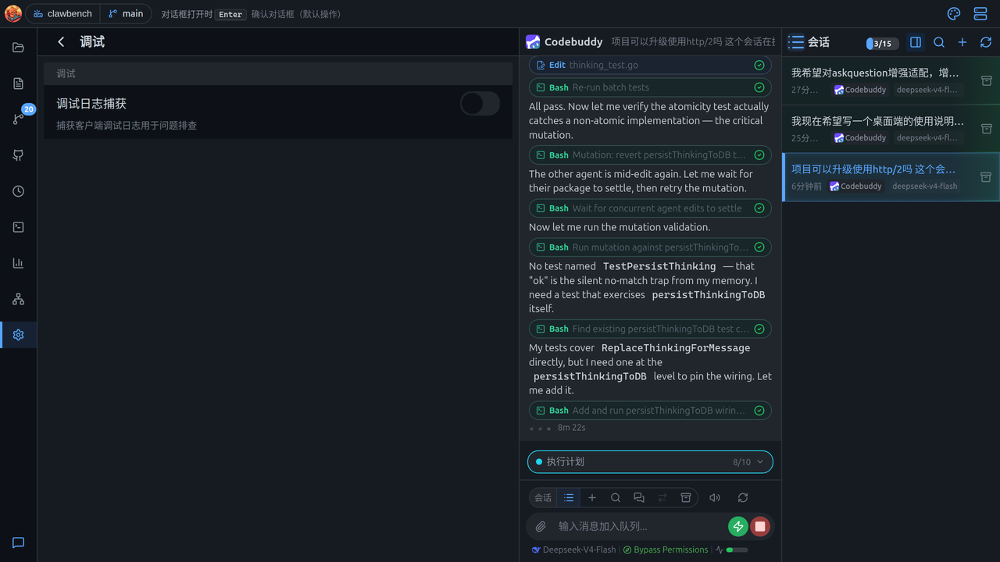

| 设置项 | 说明 |
|---|---|
| **调试日志捕获** | 把前端与 App 日志回传到服务器（默认关闭） |
| **重新配置服务器** | App 模式专属 |

开启日志捕获后，日志写入 `{data-dir}/logs/client.log`，可用 `tail -f` 查看。

> **WS 投递统计**：调试页底部显示 WebSocket 投递统计（`GET /api/ws/delivery-stats`），记录按原因的投递丢弃计数（网络慢/缓冲区满/客户端离线等）。如发现投递丢弃数持续增长，说明 WebSocket 通道存在瓶颈，可据此判断是否网络问题或服务端积压。

### 14.16 关于

版本信息、PWA/APK 入口、重启服务端与检查更新。

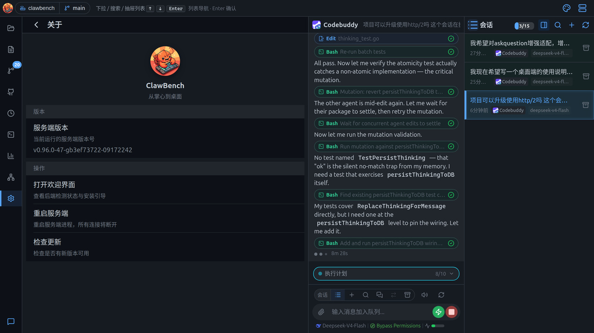

| 设置项 | 说明 |
|---|---|
| **服务端版本 / 应用版本** | 当前版本号 |
| **添加到主屏** | PWA 安装 |
| **下载安卓应用** | 下载 APK |
| **显示欢迎页** | 重新打开首次访问的欢迎面板 |
| **重启服务端** | 重启 ClawBench 进程 |
| **检查更新** | 检查新版本 |

---

# 第三部分：进阶

## 15. 快捷键速查

一张表汇总键盘快捷键，按聊天、文件管理器、查看器、应用分组。

| 快捷键 | 作用 |
|---|---|
| `Enter` | 发送消息 |
| `Shift+Enter` | 输入框内换行 |
| `Ctrl+↑` / `Ctrl+↓` | 在用户消息之间跳转 |
| `Esc` | 关闭当前弹窗 / 抽屉 / 菜单 |

**文件管理器**：

| 快捷键 | 作用 |
|---|---|
| `Ctrl+C` / `Ctrl+X` / `Ctrl+V` | 复制 / 剪切 / 粘贴 |
| `Delete` | 删除选中项 |
| `Ctrl+A` | 全选 |
| `Enter` | 打开选中项 |
| `Alt+↑` | 返回上级目录 |
| `F2` | 重命名 |
| `Ctrl+R` / `F5` | 刷新 |
| `Ctrl+Shift+H` | 切换隐藏文件 |
| `Ctrl+Shift+M` | 切换多选模式 |
| `Shift+点击` | 范围选择 |

**代码查看器**：`Mod+F` 打开搜索面板，`Mod+S` 保存（编辑态）。

**桌面端应用级快捷键**（Electron 壳）：

| 快捷键 | 作用 |
|---|---|
| `F5` | 普通刷新：重新加载页面（保留 HTTP 缓存） |
| `Ctrl+Shift+R`（macOS `Cmd+Shift+R`） | 强制刷新：清空缓存与存储后重载页面 |
| `F12` / `Ctrl+Shift+I`（macOS `Cmd+Option+I`） | 打开 / 关闭开发者工具 |

`F5` 在页面内已有用途时会优先让给页面，不会被刷新抢走：终端里按 `F5` 是把它发给正在运行的程序（vim / tmux 用来翻页），文件管理器聚焦时按 `F5` 是刷新文件列表。只有在其他位置按下时才会刷新整个页面。

强制刷新（`Ctrl+Shift+R`）会一并清除 Cookie 与本地存储，因此会重新登录；在 ClawBench 默认的 localhost 部署下会自动登回。

顶栏的快捷键提示跑马灯点击可打开完整快捷键弹窗。

## 16. 多项目与 Worktree

同时处理多个项目或分支：切项目，或把某个工作树当成独立项目打开。

- 顶栏可随时切换项目，各项目的会话、任务、Git 状态完全独立。
- 切换项目时会保留聊天输入草稿。
- 对需要隔离的开发工作，用 Git 面板的 **Worktree** 功能创建独立工作区，避免污染主目录。
- **Worktree 作为独立项目**：在「项目历史 → 管理 → 工作树」里，可以把某个工作树**作为独立项目打开**。这意味着该 worktree 有自己独立的会话列表、标签、文件浏览位置，与主项目完全隔离。可以同时在多个 worktree 对应的项目间切换，并行处理不同分支上的任务。
- **Worktree 路径标注**：在多 worktree 环境下，聊天中出现的其他 worktree 路径会被自动识别并标注（显示为蓝色可点击文字），点击可直接跳转到该 worktree 下的文件。标注优先级高于普通文件路径标注，避免 worktree 路径被误匹配为子路径。
- 其他项目的会话会出现在会话列表的跨项目分组中，点击直接跳转（注意跳转后是在**那个项目**的上下文中对话）。

## 17. 上下文、摘要与分叉

长会话如何自动压缩历史、生成摘要，以及分叉与回溯的区别。

- **上下文压缩**：对话很长时会自动压缩历史，优先保留全部用户消息，助手条目按预算填充。预算可在设置中调整。
- **摘要**：长回复可生成摘要卡片，快速回顾结论；消息显示模式可设为「仅摘要」。
- **分叉**：从任意一条用户消息创建对话分支，原会话不受影响。分叉会带上压缩后的上下文。
- **回溯（Rewind）**：把会话截断到某条消息处并重启 AI 会话。
- **续接**：在已有会话基础上开新会话，标题会带时间戳前缀。

## 18. 推送通知

说明各种通知渠道：应用内、系统通知、钉钉/飞书、离线补拉。

- **应用内通知**：会话完成/取消/待审、任务启动/完成/失败/取消、Forge 新动态都会以纯通知卡片弹出——点击整卡跳转并顺带标记已读，5 秒自动关闭。详见 [5.11 应用内完成通知](#511-应用内完成通知)。

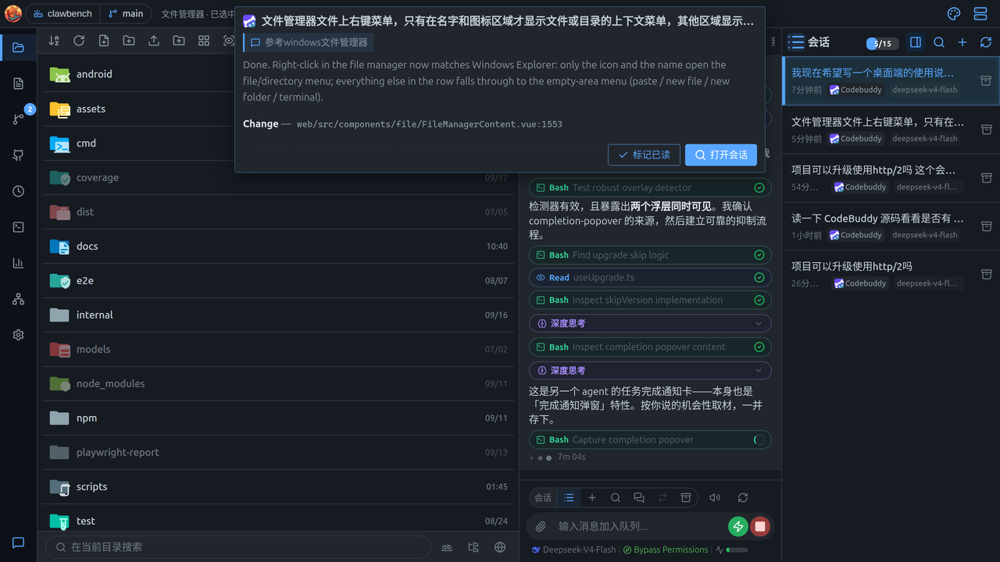

- **通知音效**：可在设置中关闭（避免蓝牙耳机被中断）。
- **钉钉 / 飞书**：可配置企业机器人，把通知推送到 IM。支持 Markdown 单聊与交互式卡片。
- **离线事件**：WebSocket 断开期间的事件会被持久化，重连后按游标补拉，不会丢通知。

> Completion Popover 与推送通知互为补充：前者通知当前在线用户会话已完成，后者负责在用户离开时通过系统通知或 IM 推送告知。

## 19. 常见问题

使用中容易遇到的疑问与解决办法。

**Q：AI 一直不回复 / 卡住了？**
检查会话是否在运行（有停止按钮）。若确实卡死，用错误横幅上的**重置会话**按钮重启 AI 进程，对话上下文会保留。

**Q：刷新页面后消息没了 / 重复了？**
ClawBench 以数据库为权威。刷新会从 DB 重建消息列表。若仍异常，说明后端尚未把流式内容落库，稍等片刻再刷新。

**Q：升级提示怎么处理？**
发现新版本时会弹出升级卡片：

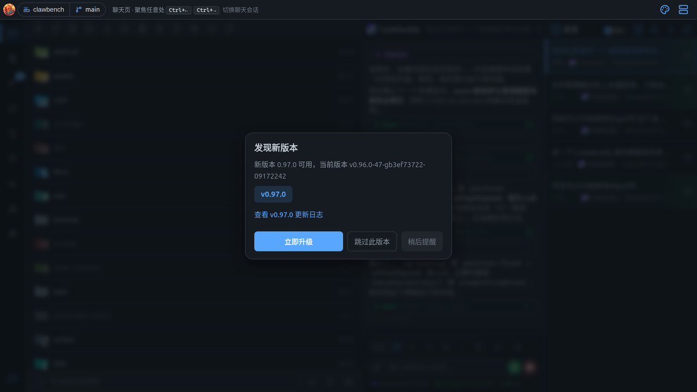

可选「立即升级 / 跳过此版本 / 稍后提醒」。Docker 部署下会额外提示：容器内可自升级，但重建镜像会回退，建议改用 `docker pull` 更新镜像。

**Q：某个功能找不到？**
大部分功能都在左侧 Dock 的九个图标里。设置类选项统一在最后一个「设置」图标。若 Dock 里没有终端或端口映射，说明该功能在服务端被禁用或平台不支持。

**Q：界面元素太小 / 太大？**
设置 → 外观 → **界面缩放**，可在 80%–150% 之间调整。

**Q：Forge 提示 API rate limit exceeded？**
GitHub API 有速率限制。稍后再试，或在设置 → GitHub/GitLab 集成中换用有效 token。

**Q：代码存量一直显示「加载中」？**
首次计算需要扫描全项目，耗时较长（大项目可能数十秒）。等待即可。

---

*本文档由截图实测整理，界面以你实际部署的版本为准。*
