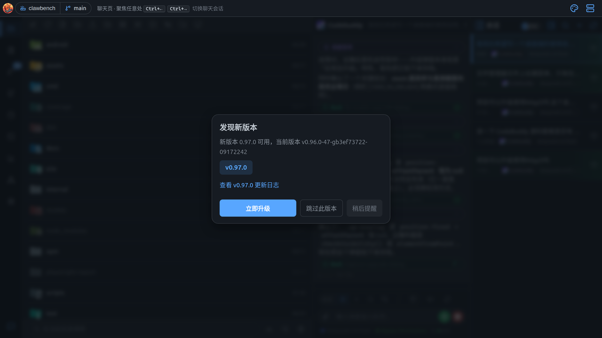

# 常见问题（FAQ）

**Q: ClawBench 支持哪些操作系统？**

A: 支持 Linux（x86_64 / ARM64）、macOS（Apple Silicon / Intel）和 Windows（x86_64）。后端使用 Go 编写，前端为标准 Web 应用，可跨平台运行。

**Q: 支持哪些 AI 后端？**

A: 支持 CodeBuddy、Claude Code、OpenCode、Codex、Qoder CLI、VeCLI、CodeWhale、DeepSeek Harness、MiMo-Code、Pi、Copilot、Kimi、Antigravity、Grok Build、ZCode 十五种后端，均支持 CLI 和/或 ACP 传输模式。可在 Web UI 中实时切换，会话数据隔离。CLI 后端需确保对应 CLI 已安装并在 PATH 中可用。

**Q: 如何添加新的智能体？**

A: 从欢迎屏幕安装智能体，或在 Web UI 中创建新智能体，选择 LLM 提供商、输入 API Key、验证模型、命名智能体即可。智能体配置存储在数据库中。公共规则内嵌于 Go 二进制（`commonRulesTemplate`），会自动注入到所有智能体的系统提示词中。`{{AVAILABLE_AGENTS}}` 占位符会自动替换为可用智能体列表。`/cb-chatsearch`、`/cb-task`、`/cb-usage`、`/cb-user-guide` 命令按需注入。

**Q: 是否需要配置 API Key？**

A: 不需要。ClawBench 通过调用本地 CLI（CodeBuddy、Claude Code、OpenCode、Codex、Qoder CLI、VeCLI、CodeWhale、MiMo-Code 或 Pi）实现 AI 功能，这些 CLI 工具已经完成了 API Key 的配置和管理。

**Q: TTS 语音合成可以使用本地模型吗？**

A: 可以。将 `summarize.tts_backend` 设为 `"api"` 并配置 Ollama 的 OpenAI 兼容端点即可使用本地 Ollama 服务进行语音文本总结，无需任何云 API。只需安装 Ollama 并拉取模型（如 `ollama pull gemma3:270m`），然后在配置文件中设置：

```yaml
summarize:
  tts_backend: "api"

ai_summary:
  model: "gemma3:270m"
  format: "openai"
  api:
    base_url: "http://localhost:11434/v1/chat/completions"
```

TTS 引擎本身也支持本地离线方案（piper / kokoro / moss-nano），两者搭配可实现完全离线的语音朗读。其中 moss-nano 支持多语言和音色克隆，48kHz 高音质输出。

**Q: 可以同时运行多个 ClawBench 实例吗？**

A: 可以。每个实例使用独立的 `--data-dir` 指定不同的数据目录，并在 `config/config.yaml` 中配置不同端口即可。默认数据目录为 `~/.clawbench/`，同一用户下的多实例需要显式指定不同的 `--data-dir` 以实现数据隔离。

**Q: 是否需要配置文件才能启动？**

A: 不需要。所有配置项均有默认值，无需 `config/config.yaml` 即可启动。未配置 `password` 时自动生成随机密码并保存到 `.clawbench/auto-password`，启动时会自动显示。如需自定义，复制 `config/config.example.yaml` 为 `config/config.yaml` 并修改。

**Q: 忘记自动生成的密码怎么办？**

A: 查看 `.clawbench/auto-password` 文件即可获取密码。也可以在 `config/config.yaml` 中设置 `password` 来使用固定密码。

**Q: 数据存储在哪里？**

A: 数据存储在用户家目录下的 `~/.clawbench/` 中（Windows 为 `%USERPROFILE%\.clawbench\`），包括数据库文件（`ClawBench.db`）、日志文件（`logs/`）和自动密码（`auto-password`）。上传的文件存放在项目目录的 `.clawbench/uploads/` 中。可通过 `--data-dir` 指定其他数据目录。

**Q: 如何备份数据？**

A: 备份 `~/.clawbench/ClawBench.db` 数据库文件即可。

**Q: 如何管理智能体？**

A: 所有智能体存储在数据库中（`agents` 表），通过欢迎面板安装或首次启动时自动发现。

**Q: 如何启用 HTTPS？**

A: 将证书文件放入 `<DataDir>/config/tls/` 目录即可。ClawBench 自动检测证书文件，支持三种命名方式（按优先级）：
1. `fullchain.pem` + `privkey.pem`（Let's Encrypt 风格）
2. `cert.pem` + `key.pem`（通用风格）
3. `combined.pem`（证书和私钥合并文件）

找到有效证书对即自动启用 HTTPS，否则回退 HTTP。也可通过 `tls.cert_dir` 配置项指定其他目录。

**Q: 如何启用语音输入（STT）？**

A: 需要部署 vLLM Whisper 引擎（或兼容 OpenAI `/v1/audio/transcriptions` 端点的 ASR 服务），在设置面板中配置 STT 端点地址和模型名称即可。语音输入需要 HTTPS 或 localhost 环境才能访问麦克风。

**Q: AI 一直不回复 / 卡住了？**

A: 检查会话是否在运行（有停止按钮）。若确实卡死，用错误横幅上的**重置会话**按钮重启 AI 进程，对话上下文会保留。

**Q: 刷新页面后消息没了 / 重复了？**

A: ClawBench 以数据库为权威。刷新会从 DB 重建消息列表。若仍异常，说明后端尚未把流式内容落库，稍等片刻再刷新。

**Q: 升级提示怎么处理？**

A: 发现新版本时会弹出升级卡片：



可选「立即升级 / 跳过此版本 / 稍后提醒」。Docker 部署下会额外提示：容器内可自升级，但重建镜像会回退，建议改用 `docker pull` 更新镜像。

**Q: 某个功能找不到？**

A: 大部分功能都在左侧 Dock 的九个图标里。设置类选项统一在最后一个「设置」图标。若 Dock 里没有终端或端口映射，说明该功能在服务端被禁用或平台不支持。

**Q: 界面元素太小 / 太大？**

A: 设置 → 外观。默认开启的 **自动缩放** 会以 1080p 为基准，在更高分辨率的屏幕上自动放大界面（最高 200%），并在系统已缩放过的屏幕上保持原样（不会二次放大）。若想自己控制，关闭 **自动缩放** 后用 **界面缩放** 滑块在 80%–150% 之间调整。

**Q: Forge 提示 API rate limit exceeded？**

A: GitHub API 有速率限制。稍后再试，或在设置 → GitHub/GitLab 集成中换用有效 token。

**Q: 代码存量一直显示「加载中」？**

A: 首次计算需要扫描全项目，耗时较长（大项目可能数十秒）。等待即可。

**Q: 为什么找不到「设置」页签？**

A: 底部 Dock 空间不足时，靠后的页签会收进「更多」按钮。点「更多」展开菜单即可找到。

**Q: 长按没有反应？**

A: 确认按住的时长足够（约 0.45 秒）。按的时候手指不要移动超过 10px，否则会被识别为滑动。

**Q: 输入框被键盘遮住了？**

A: 正常情况下输入框会自动上推。如果没上推，试试收起键盘再点一次输入框。iOS 上若仍有问题，可在设置里调整界面缩放。

**Q: 消息下面的操作按钮太多了，能隐藏吗？**

A: 触屏下这些按钮是常显的（桌面端才是悬停显示）。它们只占很窄一行，不影响阅读。

**Q: 为什么手机上没有鼠标右键菜单？**

A: 触屏没有右键概念，对应功能改由**长按**触发。

**Q: PWA 和 APK 装哪个？**

A: 想要完整功能（悬浮窗、灵动岛、原生推送、后台端口转发、音量键）就装 **APK**；只想随手用、不想装应用就用 **PWA**。

**Q: 切到别的 App 再回来，会话还在跑吗？**

A: 在跑。会话执行在服务端，切后台不影响。App 模式下还会通过悬浮窗/灵动岛持续显示状态。

**Q: 文件分享链接安全吗？**

A: 链接本身就是凭证——任何拿到的人都能只读访问，直到你关闭分享。不要把敏感文件的链接发到公开场合。
