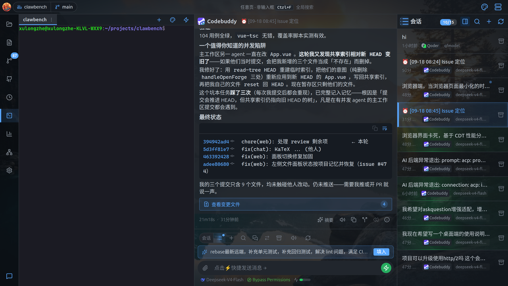
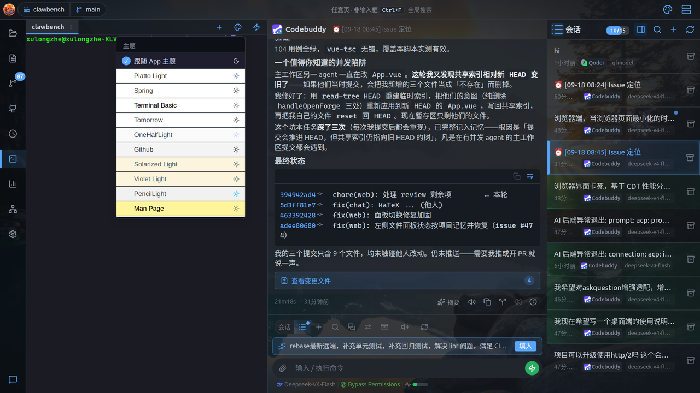
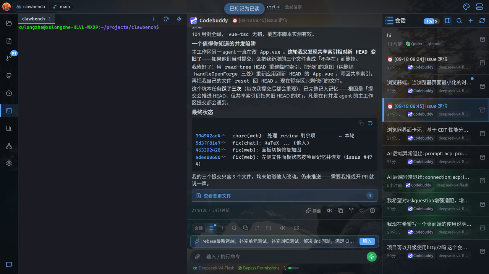
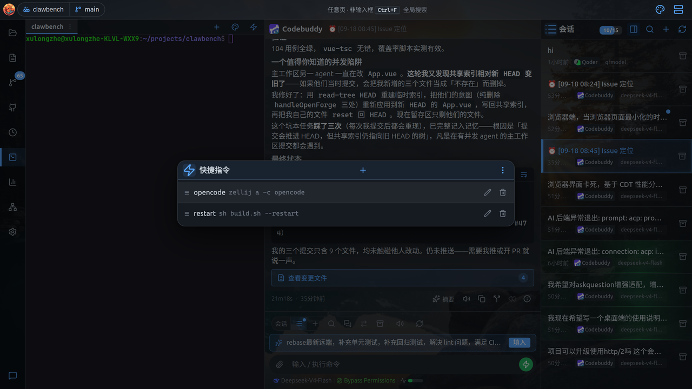
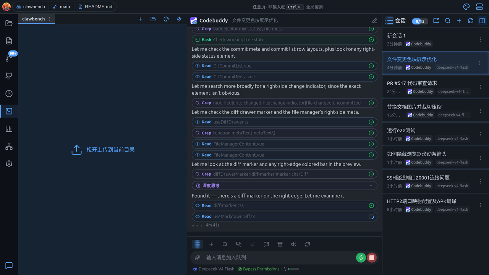
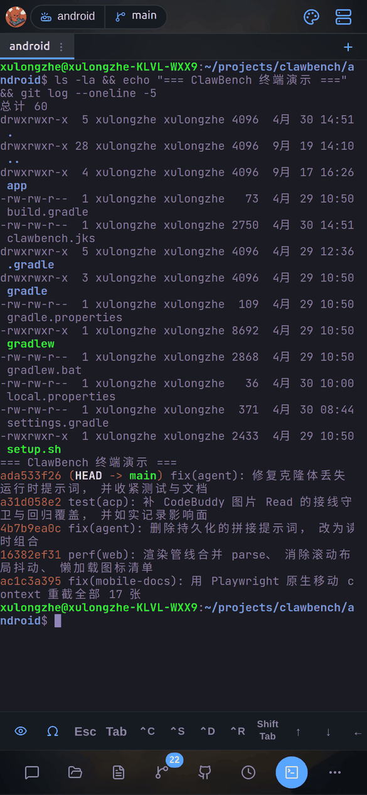
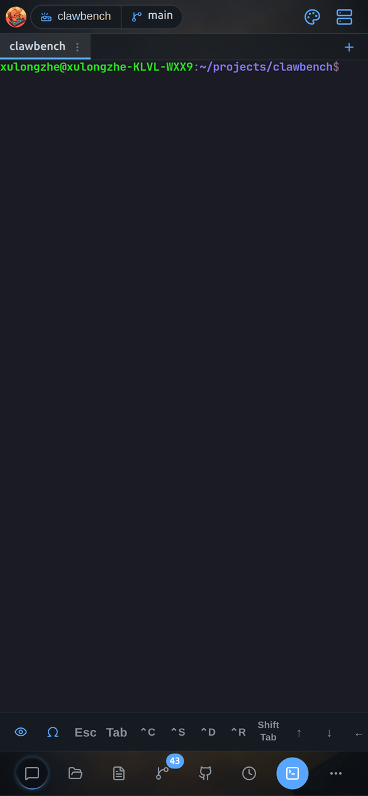

# Web 终端使用指南

ClawBench 的 Web 终端基于 PTY + WebSocket + xterm.js 实现，让你在浏览器或手机 App 内直接操作服务器终端，拥有接近原生终端的完整体验。本文档详细介绍终端的各项功能、触摸手势、虚拟按键、快捷命令等。

---

## 目录

- [交互式终端](#交互式终端)
- [多会话并发](#多会话并发)
- [虚拟按键栏](#虚拟按键栏)
- [触摸手势](#触摸手势)
- [快捷命令](#快捷命令)
- [字体与视口](#字体与视口)
- [连接与重连](#连接与重连)
- [目录检测与重建](#目录检测与重建)
- [Android 音量键](#android-音量键)
- [配置选项](#配置选项)

---

## 界面与入口

终端面板由**标签栏**、**顶栏按钮**、终端区域与**工具栏**组成。



**标签栏**：可同时开多个终端会话，每个标签有标题与未读点；标签菜单（右键或菜单按钮）可复制路径、关闭、全部关闭。

**PC 顶栏按钮**：新建标签、主题、快速指令。

**终端工具栏**（移动端 / 窄屏更常用）：

| 按钮 | 作用 |
|---|---|
| 符号 | 展开符号栏（标点/数学/括号/引号/shell） |
| 终端模式 | 循环切换浏览/手势/选择三种手势模式 |
| 输入 | 打开输入抽屉（便于长文本输入） |
| 打开当前目录 | 在文件管理器中打开 shell 当前所在目录（反向于文件管理器的「在终端打开此目录」） |
| 快捷指令 | 打开快捷指令菜单（见下） |
| 主题 | 打开终端主题选择器 |
| 工具栏配置 | 配置虚拟键位与符号 |
| 终端操作帮助 | 打开帮助抽屉 |

**打开当前目录**取的是 shell **实时**的工作目录——你在终端里 `cd` 之后（包括在 `bash`、`sudo -i` 等嵌套子 shell 里 `cd`），点它打开的就是当前真实位置，而不是开终端时的起始目录。该按钮仅在服务端能探测 cwd 时出现（Linux/Android；macOS 无 `/proc` 故不显示），会话尚未连接时点击会给出提示而非跳到项目根。

**虚拟键**：Ctrl / Alt / Esc / Tab / 方向键 / Home / End 等，补齐移动端缺失的按键。按键分组、三态修饰键与符号栏的完整说明见下方[虚拟按键栏](#虚拟按键栏)。

**主题选择器**：



可选「跟随 App 主题」或指定具体配色（Piatto Light、Spring、GitHub、Solarized Light 等），每个主题标注明暗。

## 快捷指令

把常用 shell 命令存起来，一键写进当前终端。

**调用**：点终端顶栏（或工具栏）的**快捷指令**按钮，弹出菜单：



- **单击条目**：把命令**写入当前活动终端**（不自动回车，你可以先确认再按 Enter）
- **点「编辑」**：打开管理抽屉

**管理**：点「编辑」进入快捷指令抽屉：



| 操作 | 说明 |
|---|---|
| **拖动左侧手柄（≡）** | 调整顺序，顺序持久化 |
| **点条目** | 编辑命令 |
| **右上角「+」** | 新增快捷指令 |
| **右上角「⋮」** | 导出 / 导入 JSON |

快捷指令只作用于**当前可见的活动终端标签**，不会误发到后台标签页。

> **与聊天快捷发送的区别**：聊天快捷发送存的是 Prompt（发给 AI），终端快捷指令存的是 shell 命令（写进 PTY）。两者分开存储，互不影响。

> **注意**：终端执行的是服务器上的真实命令，权限与运行 ClawBench 的用户一致。请谨慎执行破坏性操作。

字段定义、自动执行规则与管理界面的数据库约束见下方[快捷命令](#快捷命令)。

## 拖拽上传

把文件从系统拖进终端，直接上传到 shell **当前所在目录**。

想把本地文件送到服务器上正在操作的目录，不必先切到文件管理器再找路径——直接从系统文件管理器把文件**拖进终端区域**：



- 拖入时终端区域浮出「松开上传文件」的提示层
- 松开后文件上传到**该终端 shell 此刻所在的目录**，而不是终端启动时的目录
- 支持一次拖入多个文件或整个文件夹（保留目录结构）
- 上传完成后可在终端里直接 `ls` 看到这些文件

> **「当前目录」是实时的**：终端会向服务器查询该会话的**前台进程组**所在目录，所以即使你在终端里 `cd` 过、甚至进入了嵌套的子 shell，上传目标也会跟着走。

> **探测不到目录时不接管拖拽**：如果服务端无法确定该终端的实时目录，终端会**放弃拦截这次拖拽**——与其把文件传到错误的目录，不如让浏览器按默认行为处理。

> **拖入的是文件，不是路径**：这个操作把文件内容上传到服务器目录，和「把路径粘进终端」不同。若只想把本地路径写进命令行，请直接用终端的粘贴功能。

## 移动端：标签与手势

手机上用屏幕上的虚拟按键和手势补齐键盘缺失的键。



窄屏终端提供**虚拟按键栏**（桌面端没有）：

- `Esc`、`Tab`、方向键 `↑↓←→`、`Ctrl` 等常用键
- 顶部标签栏可开多个终端会话
- 终端字号可调



终端支持完整的交互式 shell——上图即为执行 `ls -la` 与 `git log --oneline -5` 后的实际输出。

终端支持丰富的手势操作：

| 手势 | 作用 |
|---|---|
| 单指滑动 | 发送方向键（上/下/左/右） |
| 长按方向键 | 连续重复发送（500ms 后每 150ms 一次） |
| 双击 | 发送 `Tab`（用于补全） |
| 双指捏合 | 调整字号 |
| 双指上下滑 | `PageUp` / `PageDown` |
| 选择模式下拖选文本 | 自动复制到剪贴板（「选中即复制」，默认开启，可在设置 → 终端关闭） |

「选中即复制」开启时移动端会隐藏悬浮复制栏（已自动复制，再弹一次是多余的第二道确认）；若系统拒绝延迟写剪贴板，复制栏会自动放回来，保证仍有复制入口。

终端内置手势帮助（点终端工具栏的帮助按钮查看）：


完整的手势判定阈值与按键联动规则见下方[触摸手势](#触摸手势)。

> **提示**：在 Android App 里，还可以用**音量键**当方向键，见 [Android 音量键](#android-音量键)。

---

## 交互式终端

终端通过 WebSocket 连接到服务器端的 PTY（伪终端），所有输入即时发送到 PTY，输出实时回传到浏览器渲染。

- **Shell 检测**：Linux/macOS 自动使用 `$SHELL` 环境变量（回退到 `/bin/sh`），Windows 按 `pwsh` → `powershell` → `cmd.exe` 顺序检测
- **光标闪烁**：启用光标闪烁，更接近原生终端体验
- **自动换行**：`convertEol` 开启，`\n` 自动转换为 `\r\n`
- **滚动回看**：支持 5000 行滚动回看
- **URL 可点击**：终端中输出的 URL 可直接点击打开
- **右键选词**：右键点击自动选中光标下的单词
- **主题**：支持亮色（Catppuccin Latte）和暗色（Catppuccin Mocha）主题，跟随系统设置自动切换

## 多会话并发

每个终端客户端拥有独立的 PTY 会话，互不干扰。

- **独立会话**：每次新建连接自动创建独立的 PTY 会话，拥有唯一的 8 位十六进制会话 ID
- **会话上限**：默认最多 10 个并发会话（可配置），达到上限时会提示错误
- **独立状态**：每个会话拥有独立的 PTY、环形缓冲区、空闲计时器和 WebSocket 连接
- **自动清理**：PTY 进程退出后自动移除会话

## 虚拟按键栏

终端下方提供两层工具栏：主工具栏（固定显示）和符号栏（按需展开），专为移动端操作优化。

### 主工具栏

主工具栏包含左侧的开关按钮区和可横向滚动的按键区，按键按功能分组，组间以竖线分隔。

#### 开关按钮

工具栏左侧有两个开关按钮（独立于滚动区域）：

| 按钮 | 说明 |
|------|------|
| 🖐 手势开关 | 开关触摸手势模式 |
| # 符号开关 | 展开/收起符号栏 |

#### 修饰键组

| 按键 | 说明 |
|------|------|
| **Ctl** | Ctrl 修饰键 |
| **Alt** | Alt 修饰键 |
| **Shift** | Shift 修饰键（图标显示） |

**三态切换机制**：

1. **关闭** → 点击 → **单次**（发送下一个按键后自动清除）
2. **单次** → 点击 → **关闭**
3. **单次** → 长按 → **锁定**（持续生效，直到再次点击）
4. **锁定** → 点击 → **关闭**

视觉效果：单次和锁定状态显示激活背景色，锁定状态额外显示底部内嵌边框。

**修饰键输入处理**：

- Ctrl + A-Z：发送 `\x01` 到 `\x1a`
- Ctrl + `[` `\` `]` `@` `^` `_`：发送对应的控制字符
- Alt + 任意单字符：发送 `\x1b` + 字符（ESC 前缀）
- Shift + Tab：发送 `\x1b[Z`
- 处理后，单次修饰键自动清除，锁定修饰键保持

### 快捷键组

| 按键 | 发送 | 说明 |
|------|------|------|
| **^C** | `\x03` | 中断当前命令 |
| **^Z** | `\x1a` | 挂起当前进程 |

### 导航键组

| 按键 | 发送 | 说明 |
|------|------|------|
| **Home** | `\x1b[H` | 光标移到行首 |
| **End** | `\x1b[F` | 光标移到行尾 |
| **PgUp** | `\x1b[5~` | 上翻页（手势开启时隐藏） |
| **PgDn** | `\x1b[6~` | 下翻页（手势开启时隐藏） |

### 方向键组

| 按键 | 说明 |
|------|------|
| ↑ ↓ ← → | 四个方向键（手势开启时整组隐藏） |

### 符号栏

点击主工具栏的 **# 符号开关** 按钮，在主工具栏上方展开符号栏。符号栏可横向滑动，包含 19 个终端高频符号：

```
. / - $ " ' & ; | = > _ ~ * : < ` ! #
```

**智能排序**：符号按使用频率自动排序，兼顾次数和时效性。排序采用指数衰减模型：

- 每次点击符号，该符号的分数按时间差衰减后 +1，更新时间戳
- 每次打开符号栏，所有符号按当前衰减分数降序排列
- 衰减半衰期约 4.6 小时（λ = 0.15/h），近期频繁使用的符号排在最前，过去常用但近期未用的符号逐渐后退
- 分数持久化到 `localStorage`，跨会话保留

**默认顺序**（按终端使用频率从高到低）：

| 分类 | 符号 | 典型用途 |
|------|------|---------|
| 路径/命令 | `.` `/` `-` | `./script`、`../`、参数 `-f`、`cd -` |
| 变量/引用 | `$` `"` `'` | `$VAR`、`"$HOME"`、`'literal'` |
| 命令组合 | `&` `;` `\|` | 后台 `&`、`&&`、命令分隔 `;`、管道 `\|` |
| 赋值/重定向 | `=` `>` | `VAR=val`、`cmd > file` |
| 路径/通配 | `_` `~` `*` | `ENV_VAR`、`~/`、`*.txt` |
| 低频 | `:` `<` `` ` `` `!` `#` | PATH 分隔、输入重定向、命令替换、`!!`、注释 |

### 操作键组

| 按键 | 说明 |
|------|------|
| **快捷命令** ⚡ | 弹出菜单，显示可见的快捷命令，点击执行 |
| **复制输出** 📋 | 将 xterm.js 缓冲区中所有非空行复制到剪贴板 |
| **重建会话** 🔄 | 关闭当前 PTY 并在新 CWD 创建新会话 |

## 触摸手势

终端支持 Termius 风格的触摸手势，通过工具栏的手势开关按钮启用/禁用。

### 手势开启时

| 手势 | 动作 | 详细说明 |
|------|------|---------|
| **单指滑动** | 方向键 | 任意方向滑动 30px+：左/右/上/下滑动分别发送对应方向键 |
| **持续按住** | 方向键连发 | 滑动后保持方向，500ms 后开始以 150ms 间隔自动重复发送方向键 |
| **长按** | Esc | 手指静止不动超过 500ms（移动不超过 10px） |
| **双击** | Tab | 300ms 内在 20px 范围内点击两次（三击不会触发） |
| **双指捏合** | 缩放字体 | 捏合/张开改变字体大小，每 10px 累积变化 1px，范围 8-28px |
| **双指垂直滑动** | PgUp / PgDn | 双指同方向垂直滑动 30px+，方向向上为 PgUp，向下为 PgDn |

**手势提示覆盖层**：手势触发时，终端中央显示一个半透明大图标（方向箭头、Esc、Tab、页面符号），持续 600ms 并带有淡入淡出动画。

**按键联动**：手势开启时，Esc、Tab、方向键组、PgUp/PgDn 按键会从虚拟按键栏中隐藏（这些操作由手势接管）。

**右键菜单抑制**：手势开启时，长按不会弹出系统选择/复制菜单。

### 手势关闭时

- **单指垂直拖动**：滚动 xterm.js 视口（`term.scrollLines()`），不发送输入到 PTY
- 这是因为移动端浏览器中 xterm.js 滚动区域不是触摸目标，需要单独处理触摸滚动
- **长按**：可正常弹出系统选择/复制菜单

## 快捷命令

快捷命令是用户预定义的终端命令快捷方式，一键执行。

### 数据字段

| 字段 | 说明 |
|------|------|
| 标签 | 命令名称（最长 100 字符） |
| 命令 | 实际执行的命令（最长 4096 字符） |
| 隐藏 | 启用后不在弹出菜单中显示 |
| 自动执行 | 启用后每次连接/重连自动运行（最多一个命令可设为自动执行） |
| 仅本项目 | 把该命令限定为**只在当前项目可见/生效**；不勾选则为全局命令 |
| 排序 | 拖拽排序权重 |

### 自动执行

- 同一时间最多一个命令可设为自动执行（由数据库唯一索引保证）
- 设置新的自动执行命令时，旧的自动执行标记自动清除
- 每次终端连接或重连成功后，如果存在自动执行命令，会立即发送到 PTY
- **项目优先**：同时存在「仅本项目」的自动执行命令与全局自动执行命令时，优先用当前项目的那条

### 管理界面

- 点击虚拟按键栏的 ⚡ 图标打开命令弹出菜单
- 点击「编辑命令」打开管理界面：
  - 拖拽排序（≡ 拖动手柄）
  - 内联删除确认
  - 创建/编辑对话框：标签、命令、隐藏开关、自动执行开关
  - 自动执行命令显示 ⚡ 标记，隐藏命令显示 👁️‍🗨️ 标记并灰显
- 拖拽排序采用乐观更新策略，API 失败时自动回滚

## 字体与视口

### 字体设置

- **字体族**：`JetBrains Mono`、`Fira Code`、`Cascadia Code`、等宽回退
- **默认字号**：12px
- **字号范围**：8-28px
- **持久化**：字号存储在 `localStorage` 中

### 字号调整方式

| 方式 | 操作 |
|------|------|
| **桌面** | 在终端区域 Ctrl+滚轮（或 Cmd+滚轮） |
| **移动端** | 双指捏合手势 |
| **头部数字** | 点击头部显示的字号数字，重置为默认值 12px |

### 键盘避让（移动端）

- 使用 `window.visualViewport` 检测软键盘高度
- 键盘高度作为 CSS 变量 `--keyboard-height` 应用到面板
- FitAddon `fit()` 调用防抖 100ms，防止键盘弹出动画期间出现重复提示行
- 底部安全区域适配：`padding-bottom: max(6px, env(safe-area-inset-bottom))`

### 滚动条

自定义 2px 细滚动条指示器，覆盖 xterm.js 默认滚动条样式。

## 连接与重连

### 连接状态

通过头部状态点指示：

| 颜色 | 状态 |
|------|------|
| 🟢 绿色 | 已连接 |
| 🟡 黄色闪烁 | 连接中 / 重连中 |
| ⚪ 灰色 | 已断开 / 错误 |

### 重连机制

- WebSocket 断开后自动尝试重连，最多 3 次
- 重连间隔采用递增策略：`2000ms × 尝试次数`
- 重连时携带存储的 `sessionId`，如果会话仍存活则重新附着
- 如果会话已不存在，则创建新会话

### 踢出处理

当新客户端连接到已有客户端的会话时，旧客户端收到自定义关闭码 `4001`，前端识别后**不再自动重连**，避免无限踢出-重连循环。

### 致命错误

以下错误码会阻止重连，显示错误覆盖层：

| 错误码 | 说明 |
|--------|------|
| `terminal_disabled` | 终端功能已禁用（无重连按钮） |
| `shell_start_failed` | Shell 启动失败（可重连） |
| `session_limit` | 会话数已达上限（无重连按钮） |

### 环形缓冲区与回放

- PTY 输出实时写入环形缓冲区，同时通过 WebSocket 发送
- 三级内存保护：
  - 单行字节数上限（默认 64KB），超出截断并标记 `[truncated]`
  - 行数上限（默认 2000 行），满时淘汰最旧行
  - 总内存上限（默认 4MB），超出时淘汰最旧行
- 重连时，缓冲区内容通过 `replay` 消息一次性回放到客户端
- 会话关闭或进程退出时缓冲区自动重置

### 空闲超时

当没有任何 WebSocket 客户端连接到会话时，启动空闲计时器（默认 10 分钟）。超时后 PTY 进程被终止并清理会话。

### 进程退出

PTY 进程退出时（用户输入 `exit`、Shell 退出等），发送 `exit` 消息携带退出码，清理 PTY 文件描述符，重置缓冲区，移除会话。前端显示 Toast 通知。

### 进程终止

用户主动关闭会话时，先发送 `SIGTERM`，3 秒后进程仍未退出则发送 `SIGKILL`。Windows 下使用 `cmd.Process.Kill()`。

## 目录检测与重建

### CWD 解析优先级

1. `requestedCwd` — 显式传入的工作目录参数
2. `currentFilePath` — 当前查看文件所在目录
3. `currentDir` — 文件管理器当前目录
4. 空字符串 — 默认为项目根目录

### 目录变更检测

终端不会在目录变更时自动重建，因为可能有正在运行的命令。当检测到目标 CWD 与当前会话 CWD 不一致时，显示覆盖提示：

- **「继续此处」**：忽略提示，保持当前会话
- **「在此打开」**：关闭当前 PTY，在目标目录创建新会话

### 重建会话

通过虚拟按键栏的 🔄 按钮或目录变更提示触发：

1. 显示「重建中...」旋转加载覆盖层
2. 发送 `POST /api/terminal/close` 关闭 PTY 进程
3. 重置 WebSocket 连接、清除错误、清空会话 ID
4. 清空 xterm.js 显示
5. 创建新的 PTY 会话
6. 隐藏加载覆盖层

## Android 音量键

在 Android App 内，终端打开时音量键映射为方向键：

- **音量+** → 方向上键
- **音量-** → 方向下键

终端关闭时自动恢复正常音量行为。通过 Android WebView 的 JS Bridge（`AndroidNative.setVolumeKeyMode`）实现。

## 配置选项

所有终端配置项均可选，未设置时使用默认值。在 `config/config.yaml` 中配置：

| 配置项 | 默认值 | 说明 |
|--------|--------|------|
| `terminal.enabled` | `true` | 启用/禁用终端功能（注意：YAML 中省略此字段等同于 `true`） |
| `terminal.idle_timeout` | `"10m"` | 无连接时 PTY 空闲超时时间 |
| `terminal.buffer_lines` | `2000` | 环形缓冲区最大行数 |
| `terminal.max_line_bytes` | `65536` | 单行最大字节数（64KB），超出截断 |
| `terminal.max_buffer_mb` | `4` | 环形缓冲区总内存上限（MB） |
| `terminal.max_sessions` | `10` | 每个项目最大并发终端会话数 |

### 配置示例

```yaml
terminal:
  enabled: true
  idle_timeout: "10m"
  buffer_lines: 2000
  max_line_bytes: 65536
  max_buffer_mb: 4
  max_sessions: 10
```
