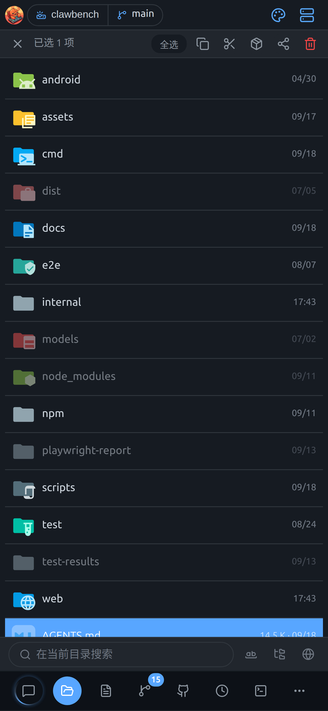
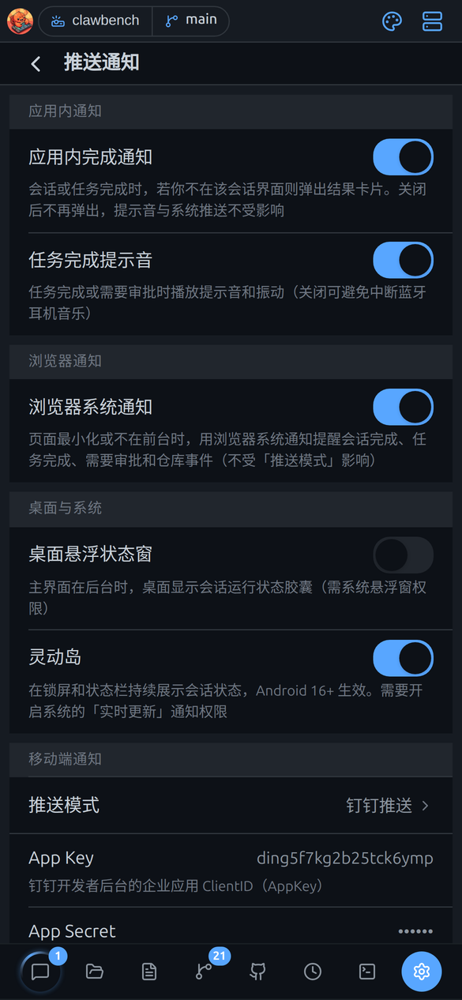
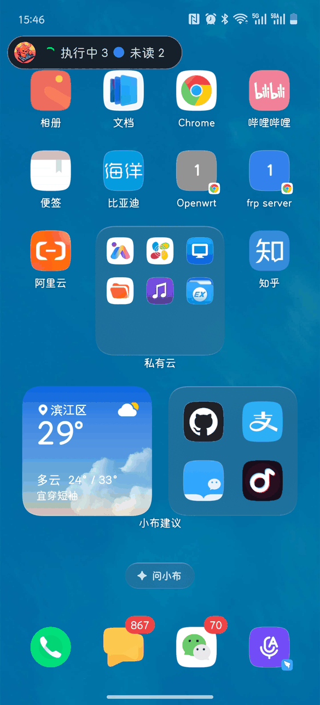
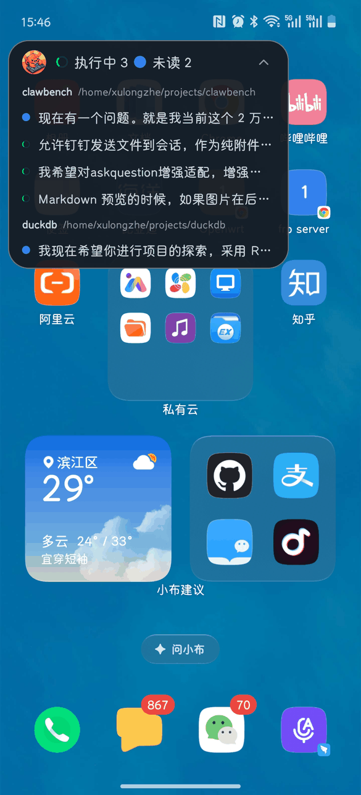
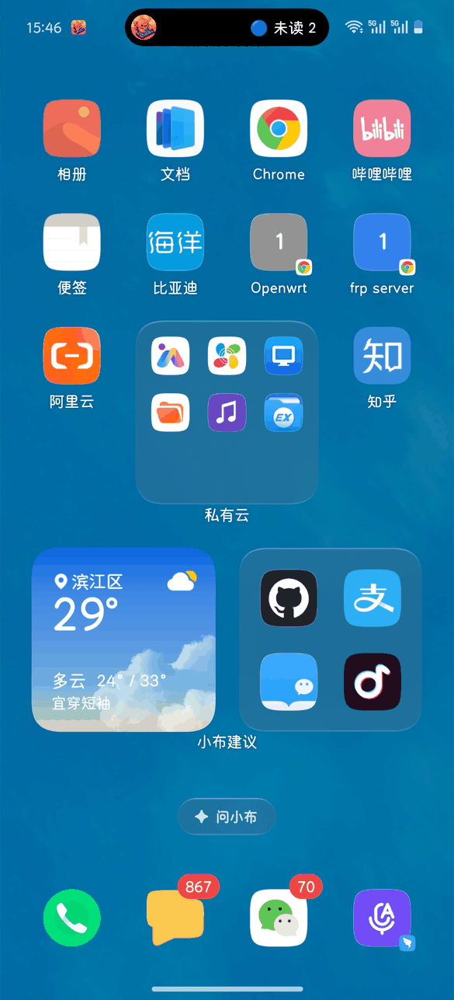
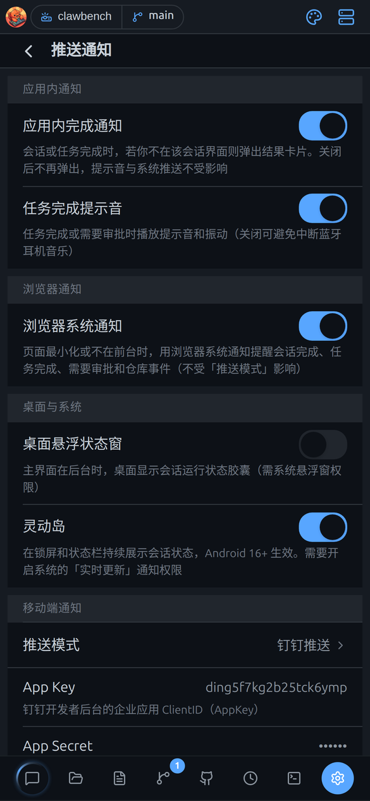
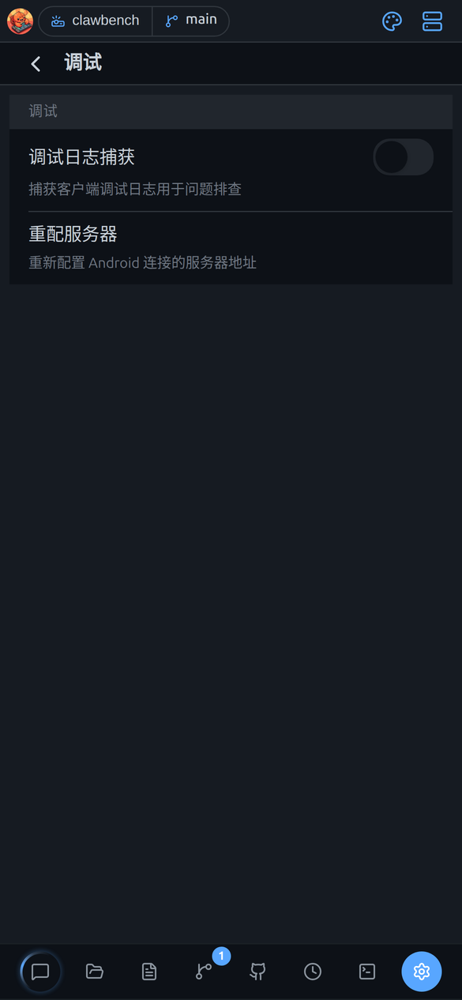

# Android App 专有功能

> 本文适用于 Android App 模式。

只有装了 APK 才有的原生能力：悬浮窗、灵动岛、原生推送、音量键等。

ClawBench 有独立的 **Android App**。它不只是「网页套壳」，而是通过原生桥接提供了一批浏览器做不到的能力。

> **前提**：本章功能**只在 App 内可用**。手机浏览器里看不到这些入口（设置页的对应卡片会自动隐藏）。

App 模式下，**设置 → 推送通知**里会多出一组「桌面与系统」卡片，这是浏览器模式没有的：

## 安装与连接服务器

下载 APK 后填服务器地址和密码，连上就能用。

从 [Releases](https://github.com/xulongzhe/clawbench/releases) 下载 APK 安装。首次打开需要填写：

- **服务器地址**（如 `https://your-server:20000`）
- **访问密码**

连接成功后凭据保存在本地，之后自动登录。

也可以在 App 内**重新配置服务器**：**设置 → 调试 → 重配服务器**（此项仅在 App 模式出现）。

## 悬浮状态窗

退到后台后，桌面上留一个小胶囊显示有没有会话在跑、有待审批、有未读。

主界面退到后台时，在**桌面**上显示一个会话运行状态胶囊，无需打开 App 就能看到是否有会话在跑、有待审批、有未读。

收起时是一条贴顶的横向药丸，显示「执行中 N」与「未读 N」：

点一下展开为面板，按项目分组列出各会话的当前状态，右上角「⌃」收起：

- 开关：**设置 → 推送通知 → 桌面悬浮状态窗**
- 需要授予 **系统悬浮窗权限**（`SYSTEM_ALERT_WINDOW`）。首次开启时 App 会引导你跳转到系统设置 → 应用 → 特殊权限 → 悬浮窗，将 ClawBench 设为允许。
- 点击胶囊可直接回到对应会话

## 灵动岛

在锁屏和状态栏持续显示会话状态（需要 Android 16+）。

在**锁屏和状态栏**持续展示会话状态（执行中 / 待审批 / 未读数量），形态是居中的小岛：

灵动岛基于 Android 16（API 36）引入的 **Live Updates（实时更新通知）**，把**正在进行的任务**提升为状态栏 chip + 锁屏 / 通知抽屉顶部常驻卡片：

- 状态栏 chip：图标 + 短文本（如「执行中 2」），常驻显示
- 展开卡片：默认展开、不可折叠，显示完整分组（如「执行中 2 · 待审批 0 · 未读 3」）
- 通知标记为常驻，用户无法手动清除

- 开关：**设置 → 推送通知 → 灵动岛**
- **需要 Android 16+**（API 36）并开启系统的「实时更新」通知权限

### 各厂商的叫法

不同厂商对这套 Android 16 标准有不同的名字——功能是同一套：

| 厂商 | 官方名称 | 说明 |
|------|---------|------|
| Google / Pixel | **Live Updates**（实时更新） | 原生叫法，Android 16 起 |
| Apple（iOS） | **Dynamic Island**（灵动岛） | 「灵动岛」一词的起源，iPhone 14 Pro 挖孔动态区 |
| OPPO / 一加（ColorOS / OxygenOS） | **流体云**（Fluid Cloud） | 完整接入 Google Live Updates API，第三方 App 遵循规范即可适配 |
| 三星（One UI） | **Now Bar**（即时动态栏） | 锁屏底部胶囊条 |
| 小米（HyperOS） | **灵动岛 / 实时通知** | 挖孔胶囊展示 |
| vivo（OriginOS） | **原子通知**（Atoms） | 基于挖孔 / 胶囊的轻量通知 |
| 华为（HarmonyOS） | **实况窗**（Live Window） | 自研体系 |
| 荣耀（MagicOS） | **灵动胶囊**（Magic Capsule） | 挖孔胶囊展示 |

### 权限

灵动岛需要用户在系统设置中开启，且**每个 ROM 有一层独立的授权开关**：

- **AOSP / Pixel**：通知设置里的「实时更新 / 推广通知」权限
- **ColorOS 流体云**：对第三方 App **默认关闭**，需在设置 → 通知 → 流体云 中为 ClawBench 单独开启
- **三星 Now Bar**、**vivo 原子通知** 等同理

**如果未授权**：通知退化为普通常驻通知（状态栏无 chip）。ClawBench 设置页开启「灵动岛」开关时若检测到无权限，会自动跳转对应权限设置页引导开启。

### ClawBench 的表现

- 「灵动岛」开关（默认开启）与「桌面悬浮状态窗」互相独立，互不影响
- 三态互斥显示：待审批 > 执行中 > 未读（chip 只显示最紧急的一个）
- 展开卡片固定显示三组数量（含 0）
- 无任何活跃会话时移除 chip，状态栏保持干净，直到下一个会话开始
- 刷新节流 5 秒合并，计时由系统自行更新，耗电极低

## 原生推送

App 完全退出后仍能收到会话完成、任务完成、需要审批的提醒，也能推到钉钉、飞书。

除了应用内通知与系统通知，App 还支持**原生推送**，在 App 完全退出后仍能收到会话完成、任务完成、需要审批的提醒。

- 开关：**设置 → 推送通知 → 推送方式 → 原生**
- 也可选**钉钉**或**飞书**，把通知发到 IM

> **注意**：**「推送方式」与「浏览器系统通知」互不影响**。前者管手机与 IM 通道，后者管网页端最小化时的浏览器通知。想彻底静音要两处都关。

App 模式下「推送通知」设置会多出「桌面与系统」与「移动端通知」分组（悬浮状态窗、灵动岛、推送方式等）：

## 屏幕常亮与后台端口转发

AI 跑长任务时不让手机息屏，端口映射退到后台也继续工作。

- **屏幕常亮**：AI 长时间执行时防止手机息屏中断。App 会自动管理，无需手动设置。
- **后台端口转发**：端口映射服务在 App 退到后台后继续运行（浏览器模式会被系统挂起）。

### 国产 ROM 的自启动与省电白名单

部分国产系统（小米 / 华为 / OPPO / vivo / 三星等）对第三方应用有额外的后台限制，**可能把退到后台的 ClawBench 一并冻结**，导致悬浮窗、灵动岛、原生推送、后台端口转发失效。首次开启端口映射时，App 会主动请求**电池优化豁免**；在检测到是国产 ROM 时，还会引导你跳转到该 ROM 的**自启动**设置页开启权限（只提示一次，不会反复打扰）。

若发现后台功能异常，请手动检查这几项：

| 设置 | 常见路径 |
|---|---|
| **自启动 / 允许后台活动** | 设置 → 应用管理 → ClawBench → 自启动 / 后台活动 |
| **省电策略设为「无限制」** | 设置 → 电池 → 应用耗电管理 → ClawBench → 无限制 |
| **锁定后台任务** | 最近任务列表里下拉 ClawBench 卡片（加锁），防止被一键清理 |

> 各家 ROM 的入口名称不同，但目标一致：让系统**不要冻结** ClawBench 的后台进程。

## 终端音量键方向键

在终端里把音量上/下键当方向键用，方便操作 vim 这类全屏程序。

在 App 的终端里，**音量上/下键**映射为方向键：

| 物理按键 | 映射为 |
|---|---|
| 音量上键（Vol+） | 方向键 `↑` |
| 音量下键（Vol-） | 方向键 `↓` |

由终端面板的按键模式控制开关。适合在 `vim`、`less` 等全屏 TUI 里快速移动，无需抬手点虚拟按键。

## 重配服务器与 APK 自更新

换服务器不用重装；有新版本直接在 App 内下载安装。

- **重配服务器**：**设置 → 调试 → 重配服务器**，换服务器无需重装
- **APK 自更新**：检测到新版本时在 App 内下载安装。因 Android 10+ 的分区存储限制，下载完成后系统会弹出安装确认

App 模式的「调试」页提供「重配服务器」入口，换服务器无需重装：

## 系统返回键

按手机的返回键会先关弹窗、退编辑，再回上一层，符合直觉。

App 内按**系统返回键**（或手势返回）会按当前界面状态智能决策：

1. 有关闭优先级的浮层（抽屉/弹窗）→ 先关浮层
2. 在编辑态 → 退出编辑
3. 在搜索/多选态 → 退出该态
4. 有可返回的上一层（文件历史、跳转来源、父目录）→ 返回上一层
5. 否则 → 返回上一个页签

连续按两次返回键可退出 App。

> **提示**：**网页模式**下没有系统返回键，但支持**从屏幕右缘向左滑**触发同样的返回逻辑（详见[快捷键与手势](shortcuts.md)）。
