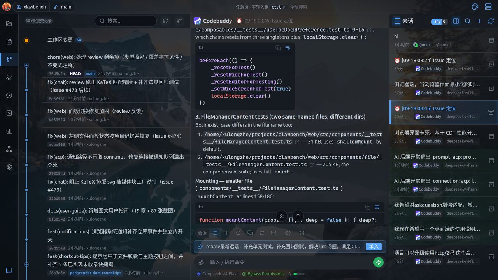
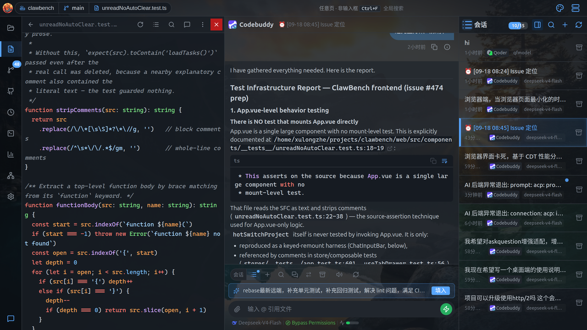
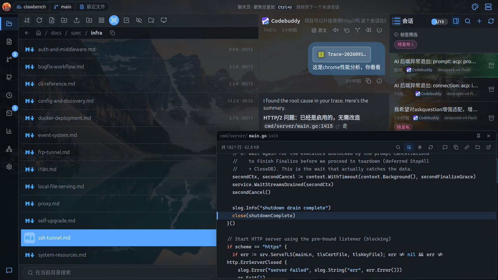
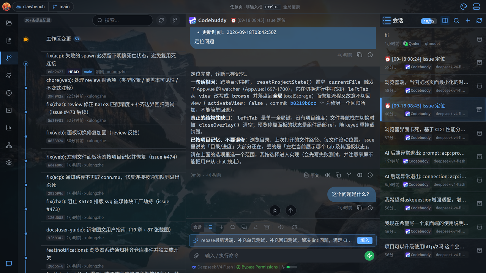
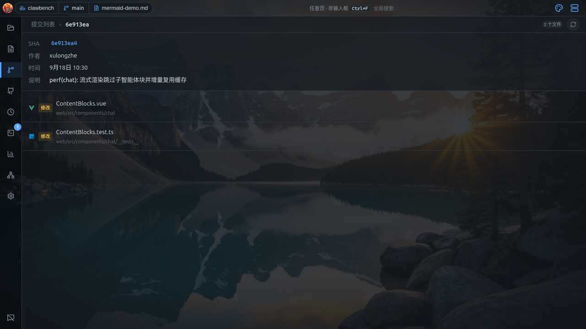

# 标注与跳转系统

> 本文同时适用于桌面端与移动端；两端差异处用 **桌面端** / **移动端** 标注。

自动把聊天里出现的路径、commit、端口变成可点击的链接，点一下就跳过去。

ClawBench 会自动识别聊天与文档里的**技术引用**（文件路径、commit hash、worktree 路径、localhost 地址），把它们变成可点击的标注。点一下就能跳到对应位置，不必手动复制路径再去找。

## 标注类型总览

一张表列出能被识别的几类引用，以及点击后会发生什么。

| 类型 | 外观 | 点击后 |
|---|---|---|
| **文件路径** | 蓝色等宽文字，悬停下划线 | 打开文件查看器并定位到该行 |
| **代码链接预览** | 同上，但在**预览模式**下 | 弹出代码切片浮层，不离开当前页面 |
| **Commit hash** | 短 SHA + 打开图标 | 切到项目历史并定位到该提交详情 |
| **Worktree 路径** | 蓝色等宽文字 + 图标 | 打开该工作树下的文件 |
| **localhost 地址** | 地址 + 打开图标 | 建立端口映射并打开 WebView |

标注是**基于 DOM 遍历**生成的（不是简单正则替换），因此会先验证路径真实存在再标注——不存在的路径保持纯文本，避免点了打不开。

## 文件路径标注

聊天里出现的文件路径会变成可点文字，点击打开文件并定位到对应行。

聊天里出现的文件路径会自动变成可点击标注：



标注支持 `路径` 与 `路径:行号` 两种形式（如 `cmd/server/main.go:1415`）。

**点击后**打开文件查看器并**直接定位到对应行**：



**双候选路径解析**：同一个相对路径可能相对于「当前文件所在目录」或「项目根目录」，ClawBench 会两个候选都试，哪个存在用哪个。所以文档里写 `../images/a.png` 和 `web/src/app.ts` 都能正确解析。

## 代码链接预览

在预览模式下点路径不跳走，而是在当前页弹一个小浮层看代码。

在**预览模式**下（文件管理器工具栏开启「预览模式」），点击路径不再跳转，而是弹出**代码切片浮层**：



浮层包含：

| 元素 | 说明 |
|---|---|
| **标题栏** | 文件名 + 行号引用（如 `cmd/server/main.go:1415`） |
| **目录** | 文件所在目录（长路径跑马灯滚动） |
| **代码区** | 目标行上下文的代码切片，带语法高亮与行号 |
| **展开条** | 向上/向下加载更多上下文行 |
| **操作按钮** | 固定卡片、关闭、复制路径、在完整查看器中打开 |

浮层是**临时卡片**（transient）：点卡片外部会关闭；点「固定」按钮则常驻，方便边看代码边对话。

> **提示**：若点击路径直接跳转了查看器而不是弹浮层，说明**预览模式未开启**。开启后即为浮层模式。

> **为何有时不弹浮层直接跳转到查看器？**：这是因为「预览模式」未开启。代码链接预览浮层依赖预览模式开关——开启时点击路径弹浮层，关闭时点击路径直接跳转到完整查看器。如需使用浮层预览，请先在文件管理器工具栏开启「预览模式」。

## Commit hash 标注

聊天里的短 commit id 可以点击，直接跳到该提交的详情页。

聊天里出现的短 commit hash 会附带一个打开图标：



**点击后**切到「项目历史」并**直接定位到该提交的详情页**：



详情页显示 SHA、作者、时间、提交说明与变更文件列表，可继续查看 diff。SHA 本身也可点击复制。

## Worktree 路径标注

多工作树环境下，聊天里的 worktree 路径也能点击打开。

在多工作树（worktree）环境下，聊天里出现的 worktree 路径会被识别并标注。worktree 标注**优先于**文件路径标注——避免 worktree 路径被当作普通相对路径二次匹配。

## localhost 地址标注

聊天里的 `localhost:端口` 可以点击，自动建隧道并打开页面。

聊天里出现的 `localhost:PORT` 或 `127.0.0.1:PORT` 会附带一个打开图标。点击后 ClawBench 会：

1. 为该端口建立 SSH 隧道（端口映射）
2. 在内置 WebView 中打开该地址

这让「AI 说服务跑在 localhost:3000」到「我直接看到页面」变成一次点击。

## 标注管道的处理顺序

几类标注按固定先后识别，避免互相误匹配。

四种标注按固定顺序处理，且**已标注的元素不会被后续标注重复匹配**：

```
Worktree 标注 → 文件路径标注 → localhost 标注 → commit hash 标注
```

这个顺序有实际意义：worktree 路径本身就是文件路径，必须先识别为 worktree 才不会被子路径标注误处理。

## 流式期间的行为

AI 还在输出时不做标注，等这一轮结束、内容稳定后再做。

**流式输出进行中，标注管线不运行**——此时只做纯 Markdown 渲染。等这一轮回复结束、内容稳定后，才启动完整管线（含路径验证与标注）。

这样做的原因：流式期间内容不完整，路径可能只写了一半，此时标注会产出大量无效结果并造成闪烁。
