# AI 对话

和 AI 聊天相关的全部操作：输入、斜杠命令、附件与引用、消息操作、语音输入、审批、会话设置、流式操作与通知。

> 本文同时适用于桌面端与移动端；两端差异处用 **桌面端** / **移动端** 标注。

## 输入栏

底部那条输入区，负责打字发消息，以及会话级的一排操作按钮。

**桌面端**：

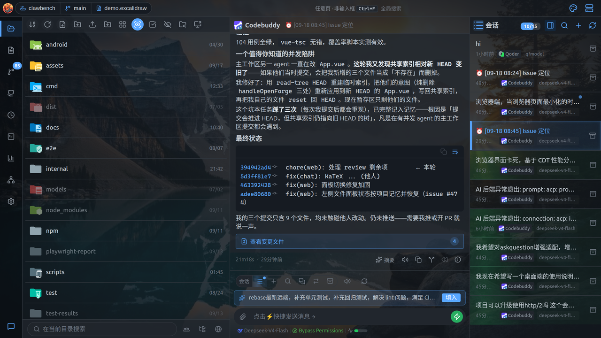

**移动端**：

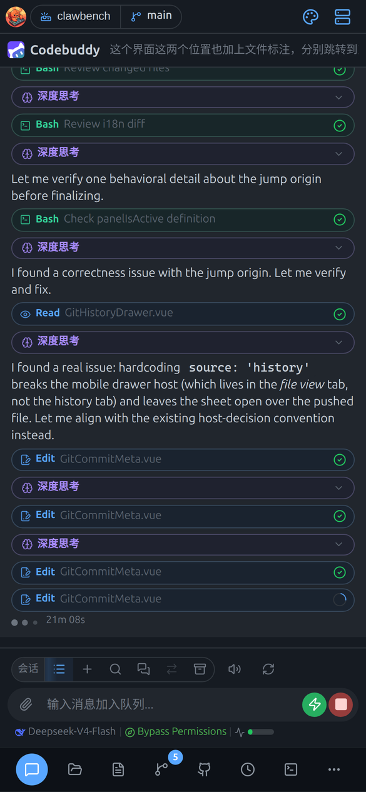

输入栏从上到下分为几层。

### 顶部操作条

会话级操作。

| 按钮 | 作用 |
|---|---|
| 会话列表 | 打开会话抽屉 |
| 新建会话 | 新建（**桌面端**长按可选智能体；**移动端**新建时会先弹出智能体选择器） |
| 新建群聊 | 新建多智能体群聊（见 [AI 群聊](group-chat.md)） |
| 会话搜索 | 打开搜索抽屉 |
| 消息索引 | 打开用户消息索引，快速跳转到某条消息 |
| 同步外部会话 | 把 ACP 外部会话同步进来（见下方「外部会话同步与恢复」） |
| 归档 | 归档当前会话 |
| 自动朗读 | 开关 AI 回复的自动语音朗读 |
| 刷新会话 | 重新拉取当前会话 |

**移动端**新建会话时会先弹出**智能体选择器**，选择用哪个 AI CLI：

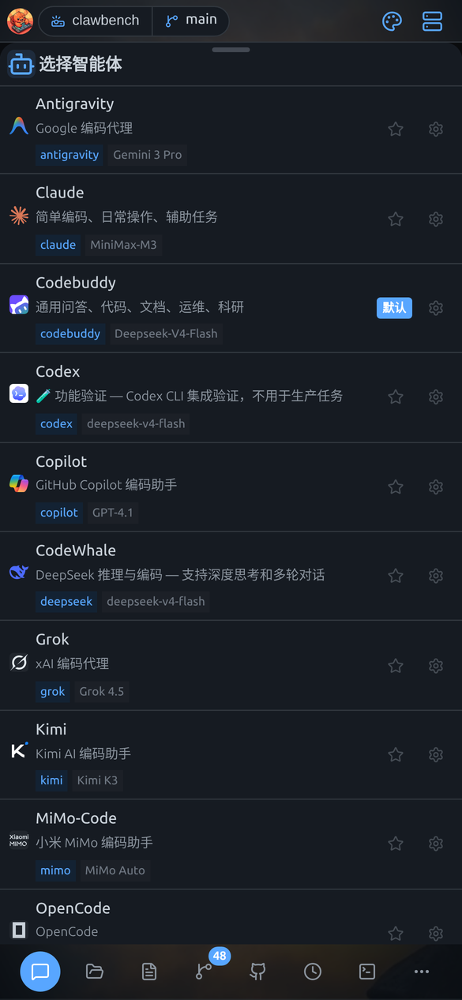

> **注意（移动端）**：顶部操作条在窄屏下**文字标签会隐藏**，只留图标以节省宽度；左右滑动可看到更多按钮。

**移动端**「对话索引」抽屉按时间列出最近的**用户提问与 AI 回复摘要**（交错时间线，每行带角色图标），点击可跳到对应位置：

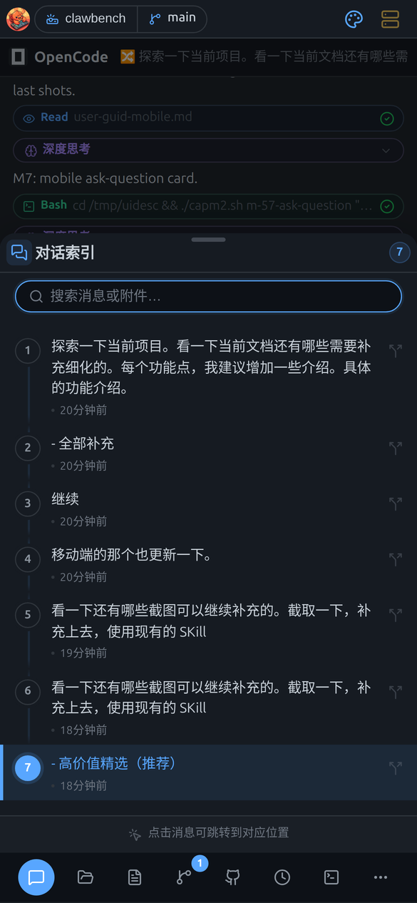

**消息索引抽屉顶部有搜索框**，可过滤条目并高亮命中片段；键盘 `↑`/`↓` 选择、`Enter` 跳转。过滤后每条仍保留其**原始序号徽标**（便于对照真实位置），`/btw` 旁路问答条目带独立图标。

### 外部会话同步与恢复

**桌面端**顶栏的「同步外部会话」按钮用于把**该智能体在 CLI 侧已有的会话**导入 ClawBench：

- 点击后打开**恢复抽屉**，列出该智能体的历史会话（带搜索框、滚动加载更多），点条目即恢复；标题为空时显示「未命名会话」
- 该智能体**不支持列出会话**时，抽屉会明确提示，而不是显示空列表
- 属于**其他项目**的会话默认折叠，抽屉底部会提示「另有 N 个属于其他项目」
- **同步**会**重写当前会话的历史**，因此会先弹出危险操作确认框；会话正在运行或为空时该按钮禁用。同步完成后提示「已同步 N 条」

### 输入区

- **附件按钮**（回形针）：打开附件抽屉
- **输入框**：支持多行；占位符会轮播提示
- **发送按钮**：有内容时发送；**空输入时点它会弹出「快捷发送」菜单**（见下方「快捷发送」）
- **停止按钮**：流式进行中出现，点击可取消当前回合（需二次确认）

**移动端**：多行文本框，`Enter` 发送、`Shift+Enter` 换行（软键盘上是换行键）。

### 底部信息行

- **上下文用量条**：显示当前上下文占用量，点击展开详情弹窗（含「压缩」按钮）
- **模型**：点击打开会话设置抽屉
- **模式**：点击/长按切换（如自动、只读等）

**移动端**底部按钮为左侧附件、右侧发送。

## 斜杠命令

输入 `/` 调出命令菜单，快速执行内置命令或智能体自带的命令。

**桌面端**在输入框输入 `/` 会弹出命令菜单：

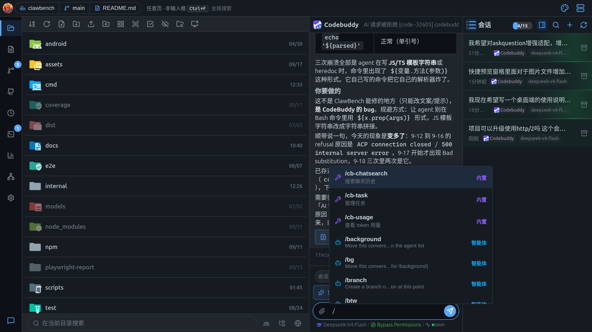

菜单分两组：

- **内置命令**（ClawBench 提供，带「内置」标签）：`/cb-chatsearch` 搜索聊天历史、`/cb-task` 管理任务、`/cb-usage` 查看 token 用量、`/cb-user-guide` 查阅本手册、`/btw` 旁路问答等
- **智能体命令**（来自当前 AI 后端）：如 `/background`、`/branch` 等，取决于所用 CLI

用上下键选择，`Enter` 或点击确认。斜杠命令必须位于消息**开头**才生效。

**`/cb-chatsearch` 与 `/cb-usage` 支持跨项目与指定项目**：默认作用于当前项目；你也可以在命令里点名另一个项目（AI 会先查项目列表拿到确切路径，再切到该项目搜索），或要求「全部项目」。项目列表包含**目录已被删除**的历史项目——只要还有对话或用量记录就仍可检索，不会被静默漏掉。

**`/cb-user-guide <问题>` 查阅本手册**：AI 直接读手册源文件作答，并**在回答末尾附上参考文件的绝对路径与章节标题**，方便你顺着路径看原文。

**`/btw <问题>` 是旁路问答**：由 ClawBench 用摘要模型基于当前会话作答，**不经过当前会话的 AI、不占用会话、不写进对话历史**——所以当 AI 正在跑长任务时也能随时「顺便问一句」。答案在聊天区留一个锚点，点击后在抽屉里查看；抽屉里渲染成一条完整的问答对（与正常消息同样的 Markdown、代码、表格、标注）。

> **前提**：`/btw` 用的是**AI 摘要模型**，因此需要先在 **设置 → AI 摘要** 里配置好模型；未配置时该命令会直接报错。此外，失败的问题**同样会留下锚点**（记录失败原因），不会静默消失。对话索引里 `/btw` 条目带独立图标，可与普通提问区分。

**移动端**在输入框开头输入 `/` 会弹出命令补全菜单，可快速调用内置命令（如 `/cb-chatsearch` 搜索历史会话、`/cb-task` 管理任务、`/cb-usage` 查用量、`/cb-user-guide` 查阅本手册），以及当前智能体支持的技能命令：

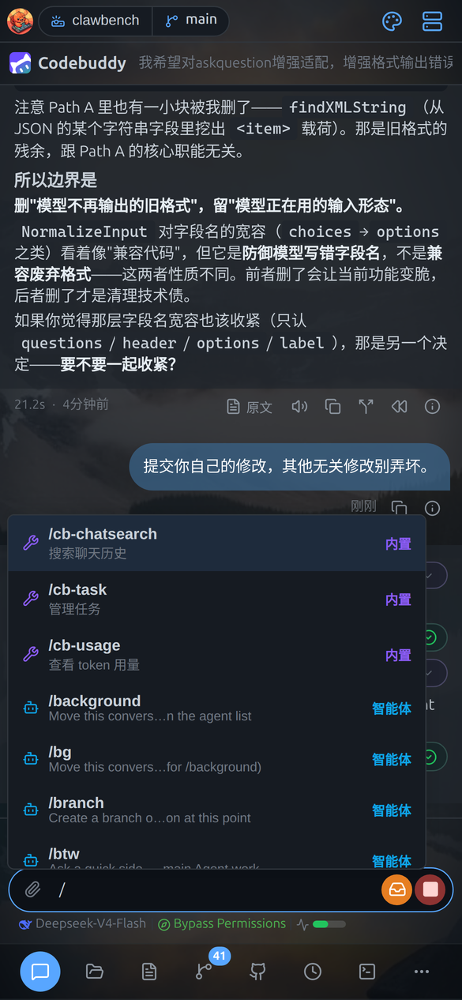

- 继续输入可**模糊筛选**
- 点候选项即插入该命令
- 按 `Esc` 或点空白处关闭菜单

## 快捷发送

把常用 Prompt 存起来一键发送，省去反复打字。

**调用**：清空输入框后点**发送按钮**（或点它旁边的下拉），弹出快捷发送菜单：

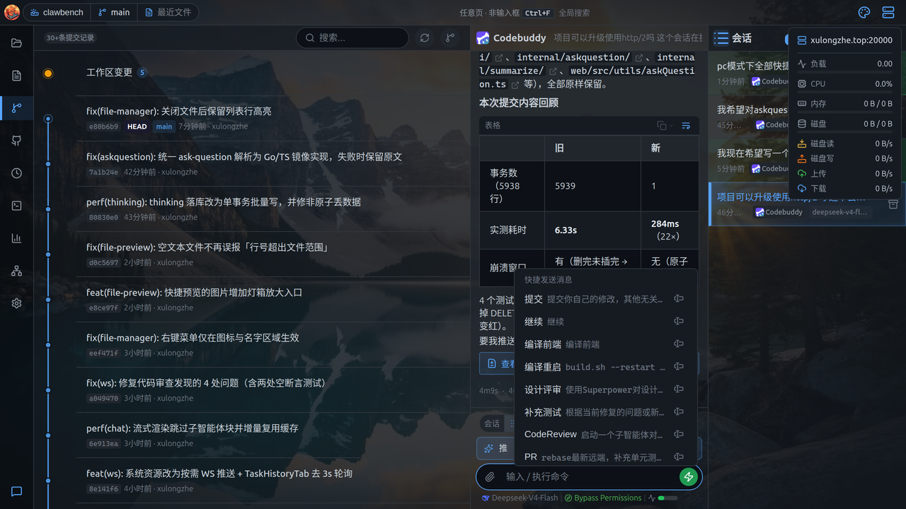

- **单击条目**：直接发送这条 Prompt
- **点条目右侧的填入图标**：只把内容填进输入框，你可以先改再发（适合「套模板 + 补参数」）
- **点「编辑」**：打开管理抽屉

**管理**：点「编辑」进入快捷发送抽屉：

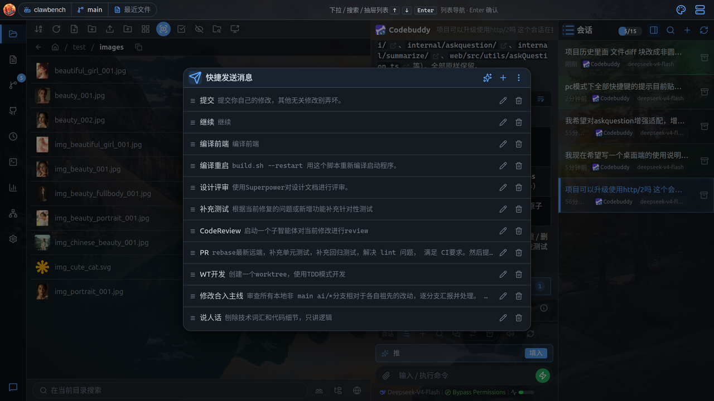

| 操作 | 说明 |
|---|---|
| **拖动左侧手柄（≡）** | 调整顺序，顺序会持久化到服务端 |
| **点条目** | 编辑内容 |
| **右上角「+」** | 新增快捷项 |
| **右上角 ✨** | 打开消息聚类抽屉（从历史消息里发现可复用的 Prompt） |
| **右上角「⋮」** | 导出 / 导入 JSON（便于备份与跨设备迁移） |

快捷项按用户存储（不区分项目），因此换项目也能用。

## 附件与引用

把文件或选中的文字片段作为上下文带给 AI。

| 方式 | 操作 |
|---|---|
| **附件按钮** | 点回形针 → 附件抽屉（当前文件 / 引用 / 分享 / 上传历史四个页签） |
| **拖拽上传** | 把电脑里的文件拖到聊天区，松开即上传并附加到会话 |
| **拖拽引用** | 把文件管理器里的文件（或它的面包屑）拖进聊天区，作为引用附加 |
| **粘贴** | 直接粘贴剪贴板中的图片或文件 |
| **@ 引用** | 输入 `@` 唤出文件选择菜单，把文件内容作为上下文带入 |
| **行范围引用** | 引用文件时指定行范围，只把需要的片段送给 AI |
| **区域引用** | 在文件或聊天里划取一段文字，弹出引用问答栏，可直接针对该段提问（见下方「区域引用与批注」） |
| **消息「引用」按钮** | 消息操作栏里的引用按钮（位于最左，用户消息与 AI 回复都有），把整条消息作为引用卡片带入 |

**桌面端**附件抽屉从输入栏左侧的回形针打开，含「当前 / 最近引用 / 最近分享 / 最近上传」四个来源：

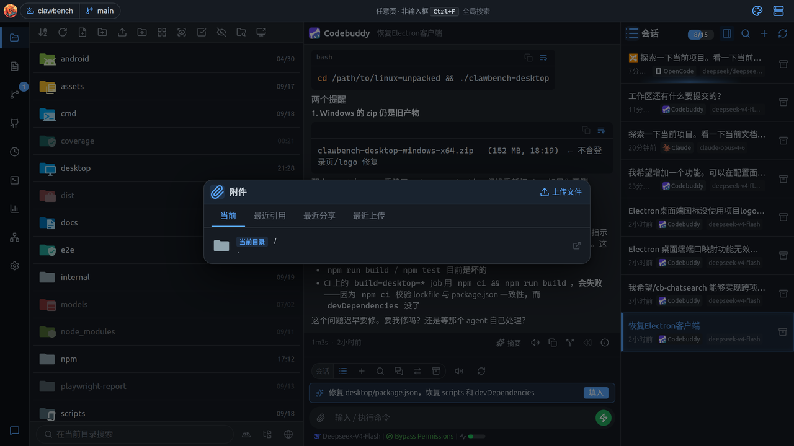

**拖拽上传**：从系统文件管理器（Finder / 资源管理器）里把文件拖到聊天区，整个聊天列会亮起虚线边框并浮出「松开添加到会话」提示，松开后文件自动上传并挂到会话附件上：

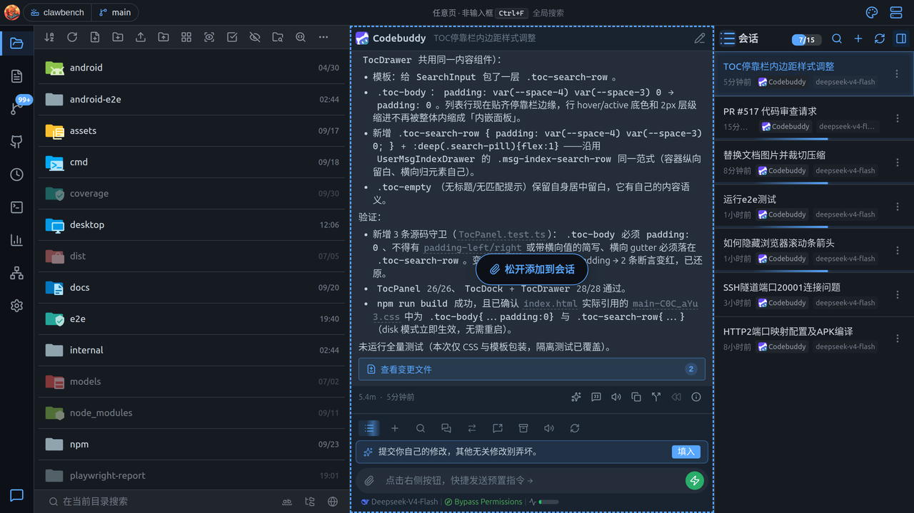

上传成功后输入框上方会出现附件卡片，可直接发送。拖拽也区分来源：

| 拖进来的东西 | 结果 |
|---|---|
| **系统文件** | 上传到项目目录，并附加到当前会话 |
| **文件管理器里的文件** | 不复制文件，直接作为引用附加（可带行范围） |
| **提交 / 任务 / 议题行** | 作为引用卡片放进输入框，不会自动发送 |

> **宽屏专属**：从文件管理器拖拽（引用）需要宽屏三栏布局；把系统文件拖进来在任何宽度都可用。移动端没有拖拽，请用回形针按钮。

**移动端**点输入栏左侧的附件按钮，从底部弹出附件抽屉：

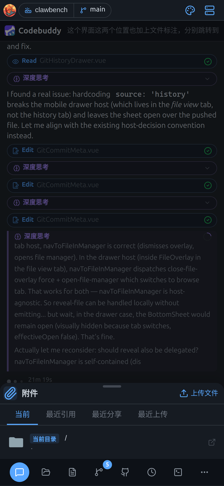

抽屉里有几个来源：

| 标签 | 内容 |
|---|---|
| 上传文件 | 从手机相册 / 文件选择器上传 |
| 当前 | 当前项目目录下的文件 |
| 最近引用 | 最近在聊天里引用过的文件 |
| 最近分享 | 通过系统「分享到 ClawBench」进来的文件（App 模式） |
| 最近上传 | 你最近上传过的文件 |

选中文件后会变成输入框下方的**附件标签**，发送时一并带给 AI。

> **提示（移动端）**：也可以直接把图片/文件**粘贴**进输入框，或从系统相册**分享**到 ClawBench（App 模式，见 Android App 专有功能）。

## 消息操作

每条回复下面那排按钮，以及聊天区里的思考、工具、耗时等元素。

**桌面端**：

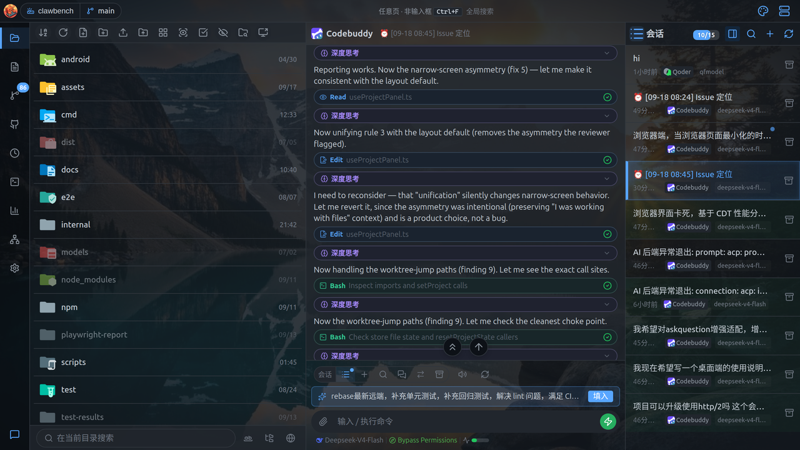

**移动端**：

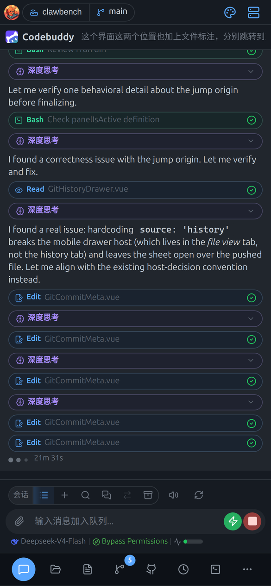

每条 AI 回复下方有一排操作按钮：

| 按钮 | 作用 |
|---|---|
| **摘要** | 切换摘要视图（AI 生成的要点式总结）。**仅桌面端** |
| **朗读** | 语音朗读这条回复（**移动端**需在设置里配置语音） |
| **复制** | 复制全文 |
| **分叉会话** | 从这条消息创建一个新分支会话（继承之前的上下文） |
| **回溯会话** | 把会话截断到这条消息处并重启 AI（**移动端**：之后的对话被丢弃） |
| **查看详情** | 打开元数据弹窗（模型、耗时、Token 用量等） |

用户消息同样支持复制与查看详情。

**「查看详情」弹窗字段**：除模型、耗时、Token 用量外，还包含请求/追踪 ID、缓存读/写与缓存命中 Token 数及命中率、Credit、思考 Token、按类别的用量明细、墙钟耗时、结束原因、回合结果、Agent 阶段、是否已建全文/向量索引、外部会话 ID 等。字段较多，适合排查「这条回复到底花了多少、走的哪条链路」。

> **注意**：**桌面端**这些按钮**悬停才出现**，触屏没有 hover——所以在**移动端**它们是**常显**的，直接点即可。

**移动端**在消息里**选中文字**会弹出引用条，可以把这段内容带进下一轮提问。

其他聊天区元素（**桌面端**）：

- **深度思考**：AI 的推理过程，默认折叠，点击标题展开
- **工具调用**：以胶囊/卡片形式展示，点击展开详情
- **耗时标注**：每条回复下方显示本轮耗时
- **文件变更横幅**：本轮改了哪些文件，点击打开抽屉
- **计划面板**：AI 的多步计划及进度。折叠时显示当前进行中那一步的文字与「完成数/总数」；计划更新时折叠条会闪一下高亮提示。展开后是按顺序排列的纵向时间线，每一步带状态节点（已完成 ✓ / 进行中脉动点 / 待办空心点）与**优先级圆点**（高红 / 中黄 / 低蓝）。回溯会话会清空计划面板
- **团队面板**：当智能体派出**多智能体团队**（目前 CodeBuddy 支持）时，输入框上方出现一条团队状态栏——折叠时显示当前正在工作的成员与进度（如「alpha · 进行中　1/2」），团队结束后收起为「团队名 · 已结束」；展开可看每个成员的名称（按成员配色）、状态、工具调用次数与 token 用量（如 `85.2k`，为输入+输出之和）。成员行有原生提示气泡，额外显示该成员的**职责描述、agentType、输入/输出 token 拆分与最近一次上下文窗口大小**。成员各自产出的思考、工具调用和输出都归到它自己的 Agent 卡片下，不会和主对话混在一起。若这个团队是智能体**自动组建**的（未显式指定成员），标题旁会有一枚「**自动团队**」徽标。成员状态包含运行中 / 已完成 / 失败 / 已结束（被回收的成员整行变暗，仅表示资源已回收，不代表失败）
- **滚动悬浮按钮**：快速跳到上一条/下一条消息、顶部/底部
- **代码块头按钮**：代码块右上角的复制、换行、附加到聊天
- **外部链接**：Markdown 里的 http/https 外链在**浏览器**里点击会**新标签页打开**，不会把当前应用界面顶掉（App 模式交给系统浏览器；同源链接与锚点、相对路径仍在原地导航）

## 语音输入（移动端）

长按发送键说话，松开后自动转成文字填进输入框。

**长按发送按钮**约 0.5 秒开始录音，松开结束：

- 录音期间附件按钮变为录音按钮
- 录音结束后自动走语音识别（STT），识别结果填进输入框
- 需要先在 **设置 → 语音识别** 里配置好 STT 服务

> **注意**：手机端没有独立的麦克风按钮——**长按发送键**就是语音入口。这是为了避免按钮过多。

## 工具调用与权限审批

看 AI 用了哪些工具，并在它要动文件或跑命令时决定允不允许。

AI 执行操作时会显示工具调用卡片。点击卡片可展开查看完整输入输出。

当 AI 请求执行**有副作用**的操作（写文件、执行命令等）时，会弹出**权限审批卡片**，包含：

- 工具名称与详情
- **允许** / **拒绝** 按钮（**移动端**为允许一次 / 总是允许 / 拒绝）

选择结果会被记住用于本次会话。若开启了自动批准，则会显示「已自动批准」标记。

当审批来自**团队中的某个成员**时，卡片标题旁会多一枚**成员徽标**（成员配色圆点 + 名字），方便你分清是谁在请求权限——尤其是多个成员并行时。

**桌面端**：

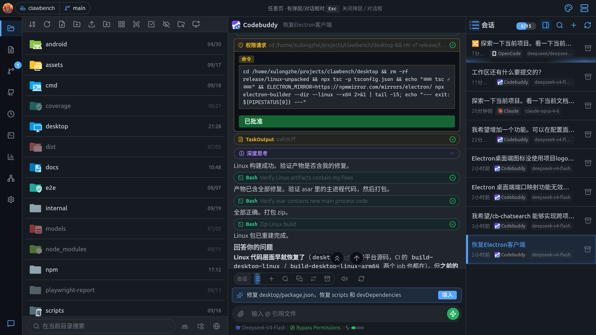

上图为一次命令执行：顶部是「权限请求」卡片（展开显示完整命令，批准后标记「已批准」），下方是「深度思考」与多个 Bash 工具调用卡片。

**移动端**点卡片展开**工具详情抽屉**，查看完整参数与输出：

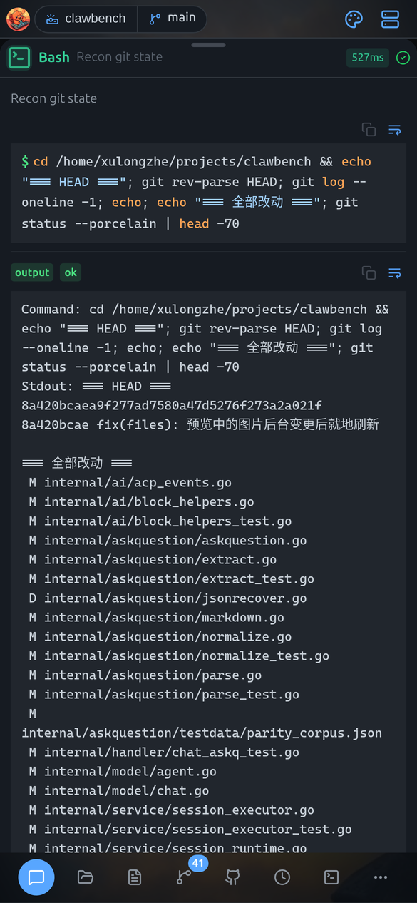

- 需要授权的操作（如执行 shell 命令）会弹出**审批卡片**，可选择允许一次 / 总是允许 / 拒绝
- 审批卡片上的按钮在触屏可直接点击

## 提问卡

AI 需要你选择时给出的可点选项卡片，选完提交即可。

当 AI 需要你做出选择时，会渲染**交互式选项卡片**而非纯文本：

- 单选/多选选项，点击选中
- 可选的**补充说明**输入框
- **推荐**按钮（AI 给出的建议选项）
- **提交**按钮

已选项会跨重渲染保持，可以反悔重选。

**桌面端**：

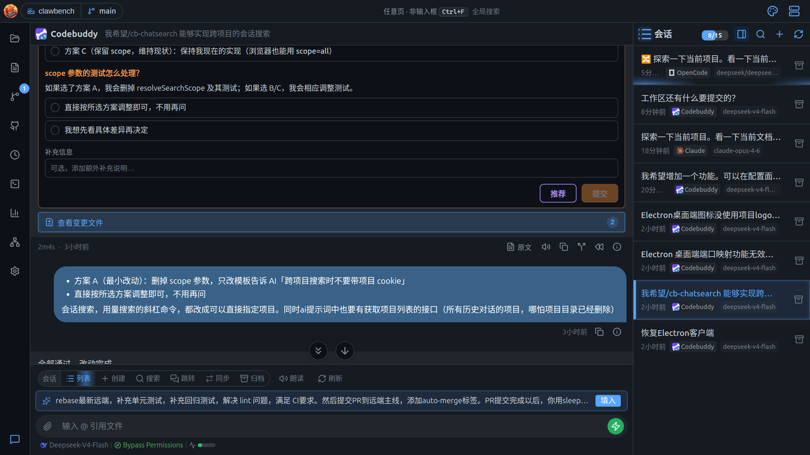

卡片中含单选 / 多选选项、可选的「补充信息」输入框，以及底部的「推荐」与「提交」按钮。

**移动端**提问卡会把选项渲染成可点按钮，并带「补充信息」输入框与「推荐 / 提交」操作：

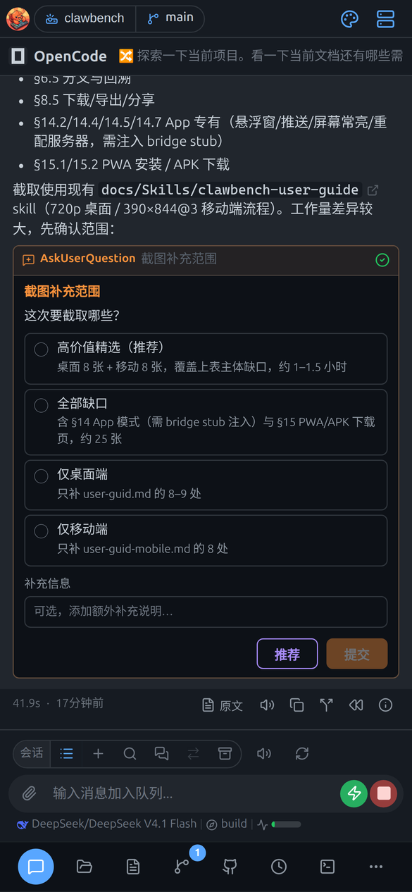

## 推荐回复

AI 回复完后给出的下一步建议，点一下就能填进输入框。

AI 回复完成后，输入框上方会出现若干**下一步建议**。点击文本会展开，点「填入」按钮把它放进输入框。

这是基于当前上下文实时生成的，可在设置中关闭。

**移动端**：回复结束后，输入框上方可能给出**推荐回复**，点一下直接填入输入框，可再编辑后发送。

## 会话设置

针对当前会话调整模型、思考档位、消息显示模式、权限模式等。

点击输入栏底部的**模型**或**模式**，打开会话设置抽屉：

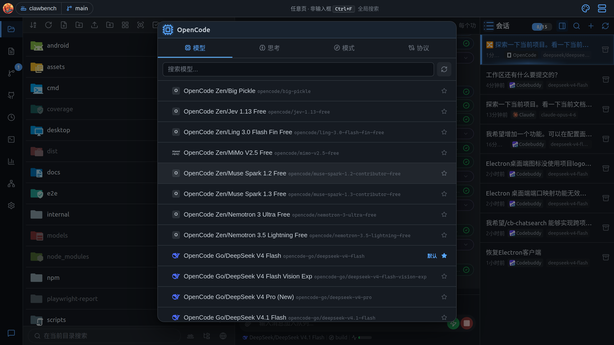

| 页签 | 内容 |
|---|---|
| **模型** | 切换当前会话使用的模型 |
| **思考** | 调整思考等级/预算 |
| **消息显示模式** | 混合 / 仅摘要 / 仅原文 |
| **模式** | 切换权限模式（如自动批准） |
| **传输** | 查看/切换后端传输方式 |

抽屉内还有「设为默认」与「自动批准」开关。

> **深度思考档位说明**：低档（Thinking Budget ≈ 200）适合简单问答；中档（≈ 800）适合常规开发任务；高档（≈ 3200+）适合需要多步推理的复杂任务如架构设计或深度调试。思考档位越高，AI 的推理 token 越多，响应会稍慢但质量更稳定。

> **消息显示模式**：混合模式（默认）同时展示摘要卡片与原始消息，适合概览与细节兼顾；仅摘要模式只显示 AI 生成的摘要卡片，省界面空间；仅原文模式只展示原始消息，无摘要。切换模式后，新加载的消息按新模式显示，已加载的消息不受影响。

> **分叉上下文预算**：分叉时携带的历史上下文上限，单位为 token 数。值越小，分叉后新会话越轻量但上下文越少；值越大则保留更多历史但 token 消耗增加。默认值适中，修改后建议观察实际效果。

> **推荐回复上下文条数**：生成推荐回复时参考的最近消息轮数。值越大，推荐内容越丰富但计算略慢；值越小推荐越精简。设为 0 则关闭推荐回复。

## 流式过程中的操作

AI 还在输出时你能做的事：插话、取消、重置会话。

- **插话（steer）**：流式进行中直接发送新消息，会在当前回合的合适位置插入，不必等 AI 说完
- **排队**：AI 忙碌时发的消息进入输入框上方的**排队面板**（收起态显示「排队中 · N」，展开看每一条）。逐条执行，**每条答完都会推送一次完成通知**（不再等整队列排空才推最后一条）；面板里每条可删除，另有「插话」按钮把该条插入当前回复
  - **合并**：排队两条及以上时，面板底部提供**「合并」**操作，把队列里所有消息合并成一条再发送（附件与引用一并合并），避免 AI 逐条处理零散指令
  - **收起态**：只有一条时不显示数量（冗余）；数量为 0 时面板自动收起
  - **插话按钮的图标随能力变化**：后端支持打断时显示闪电图标、否则显示方块图标，但标签始终是「插话」——点下去都是「插进当前回合」的语义
- **取消**：点停止按钮取消当前回合
- **重置会话**：会话卡死时，用错误横幅上的按钮重启 AI 进程，对话上下文保留

> **文件变更自动刷新**：AI 在对话过程中修改了文件后，ClawBench 会自动将文件管理器中对应的文件标记为已修改（高亮显示）。用户无需手动刷新即可看到最新内容。该刷新为单向感知（仅感知外部变化），不会覆盖用户未保存的编辑。**移动端** Diff 高亮在打开文件时显示变更行（红色删除/绿色新增）。

## 异常终止自动继续

会话因**进程崩溃、AI 无输出或后端报错**而意外中断时，ClawBench 可以自动替你发一条「继续」并接着往下跑——你不用守着屏幕，也不会出现"看着像说完了、其实活儿没干完"的情况。

| 会触发自动继续 | 不会触发（会话保持中断，等你处理） |
|---|---|
| Agent 进程崩溃（无终止事件） | 你手动点了停止，或用了「打断并重发」 |
| 本轮完全没有产出 | 达到无进度超时（30 分钟预算已用尽） |
| 后端报错：进程异常退出 / 输出无法解析 / 请求失败 / 模型拒绝 / Agent 未真正运行 | 服务端重启、连接断开、内部 panic |
| | Agent 启动握手超时（重跑同样的握手只会再等一轮） |

**「有部分产出」不会阻止自动继续**：长任务跑到一半被杀时，AI 往往已经说了不少话、也调了不少工具，但工作并没有做完。此时续接比"看着像完成了"更符合预期。代价是极少数情况下（正常答完后残留一条警告块）会多发一次「继续」，比长任务卡住无人察觉的损失小得多。

自动续接有**次数上限**，并且只在**会话仍在运行**且**你没有排队消息**时执行——你手动插话或发新消息后，续接立即让位。每次自动续接都会以真实用户气泡的形式出现在对话里，你可以随时点停止打断。

- **设置位置**：设置 → 聊天 → 「会话恢复」分组
- **异常终止自动继续**：总开关，默认关闭
- **最大重试次数**：每个用户消息允许自动续接几次；`-1` 表示不限（服务端仍有硬上限保护），`0` 表示不重试

## 应用内完成通知

后台发生会话、任务或仓库事件时滑入的提示卡片，告诉你「有事发生了」并让你一键跳过去。

当聊天界面不在前台时，会话/任务/仓库事件会滑入一张**纯通知卡片**——它只是一条通知，不是可以就地操作的迷你界面：

| 行为 | 说明 |
|---|---|
| **事件覆盖** | 会话完成/取消/待审批、任务启动/完成/失败/取消、仓库议题与合并请求的六类变化，与系统通知完全一致 |
| **头部** | 智能体图标 + 主类别徽章（会话 / 任务 / 议题与合并）+ 事件类型标题（如「会话已完成」「任务失败」「合并请求 #42 · 已合并」，纯文字、按语义配色、14px）+ 关闭按钮 |
| **正文** | 标题段（会话名 / 任务名 / 仓库）+ 最多 4 行纯文本摘要（字号与聊天正文一致） |
| **跨项目标识** | 事件属于其他项目时，整张卡片换色，底部额外显示加粗的项目名 + 完整路径（不再有单独的「外部」标签——整卡换色已足够区分） |
| **位置** | 桌面端右下角滑入；移动端顶部滑下 |
| **跳转** | 点击整张卡片跳到对应会话 / 任务执行详情 / 议题与合并页签，并顺带把该条标记为已读 |
| **关闭** | 点击卡片上的关闭按钮 |
| **自动关闭** | 5 秒无操作自动消失（错过的内容靠未读角标找回）；鼠标悬停在卡片上时倒计时暂停，移开后继续走完剩余时间 |
| **非模态** | 卡片不会挡住页面其他操作，点击别处也不会把它关掉 |
| **队列** | 多个事件依次展示，最多排队 3 条；同一仓库的仓库事件合并成「N 条新变化」一条 |
| **开关** | 设置 → 推送通知 → 应用内通知。关闭后不再弹新卡片，不影响提示音与系统/IM 推送 |

> 想看完整内容时，点卡片跳转到会话即可——卡片本身不再提供展开预览或快捷回复。

## 区域引用与批注

在文件或聊天里划取一段文字，直接针对这一段向 AI 提问，并给它写一条批注。

读文档、看代码或回看对话时，经常只需要针对**其中一小段**提问。用鼠标（触屏则长按拖选）在内容里划出一段文字，就会浮出一条**引用问答栏**：

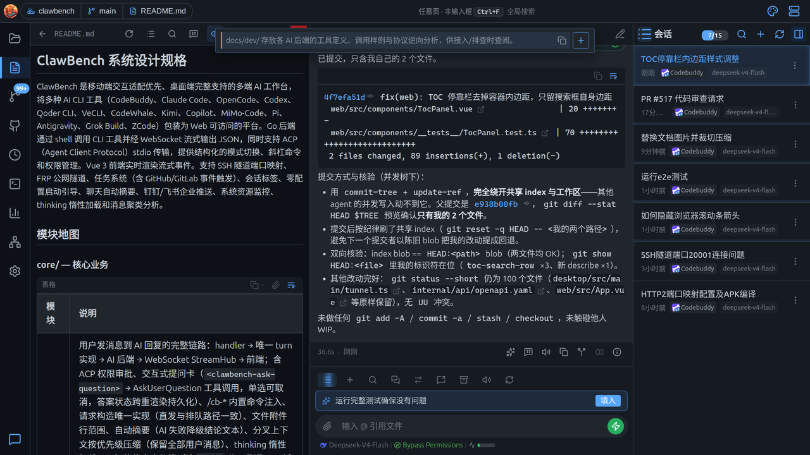

支持划取的内容区域：

| 区域 | 说明 |
|---|---|
| **Markdown 正文** | 渲染后的文档段落、列表、表格 |
| **代码** | 代码预览里的行（CodeMirror 编辑器内的选择走同一入口） |
| **Office 预览** | Word / Excel / PPT 预览正文 |
| **聊天消息** | 任意一条用户或 AI 消息 |
| **Git diff** | 变更行 |
| **议题 / 合并请求** | 详情页正文 |

引用问答栏有两种形态：

- **收起态**：显示划取的片段（单行）+ 右侧 `+` 按钮
- **展开态**：显示完整片段 + 输入框 + `+`（加入）与发送按钮

点片段或按 Enter 展开；两种形态下的操作不同：

| 按钮 | 作用 |
|---|---|
| **发送** | 把批注作为消息发出去，引用片段一并带给 AI |
| **+（加入）** | 不发消息，先把这段引用**暂存**到输入框，可继续追加内容或再加别的引用 |

**批注**：暂存到输入框的引用会显示为一张引用卡片，点它打开「引用详情」抽屉，可以在**批注**框里写下你的说明（比如「这里为什么这么写？」）：

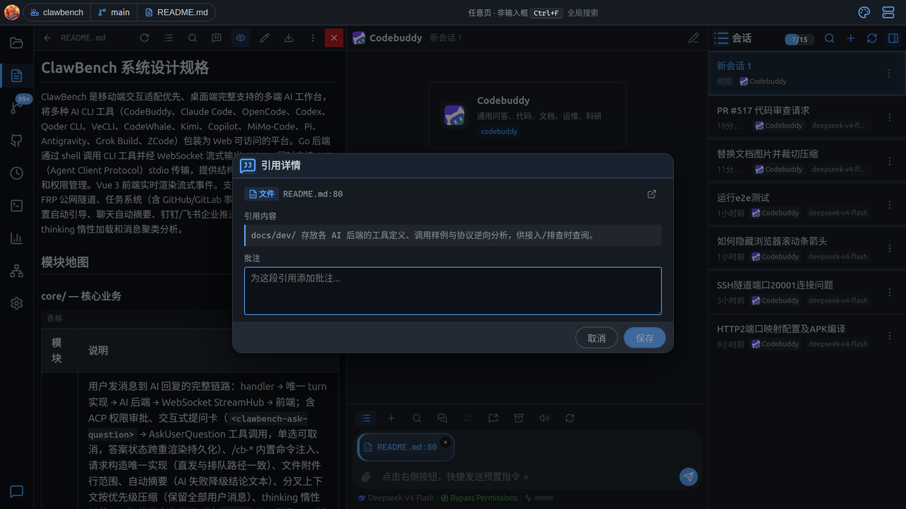

抽屉里同时展示引用来源（文件名 + 行范围，可点跳转图标跳到原文）、引用内容与批注输入框。

> **批注在发送后仍可修改**：发送前可反复修改并点「保存」；消息发出后，在引用详情抽屉里依然能改批注，改完即时生效（按引用自身的稳定 id 定位，不因消息里条目增删而错位）。

> **从文件发起引用**：文件查看器工具栏上的「引用对话」按钮（引号图标）会直接打开引用问答栏，并把当前文件作为引用对象附加进去，省去先划取再引用的步骤。

### 统一引用卡片

不管是引用一段文字、一个文件、一个议题，还是引用某条聊天消息，最终都生成**同一张引用卡片**——输入框上方显示一张 chip，发出后变成消息里的一张卡片。引用内容与批注一起交给 AI，不再把原文直接摊进消息正文。

引用卡片的来源与入口：

| 入口 | 引用的是什么 |
|---|---|
| 聊天里划选文字 | 选中的那段话 |
| 消息操作栏的「引用」按钮 | 整条消息 |
| 文件浏览器 / 代码预览的引用按钮 | 文件路径（可选行范围） |
| 议题 / 合并请求详情 | `owner/repo#123` 与该条目地址 |
| CI 流水线运行详情 | 该次运行的标题与地址 |

发送后点卡片可打开**引用详情抽屉**：查看引用全文、编辑批注、按来源跳回原处（文件打开对应行、议题/流水线打开原地址；聊天消息引用没有跳转目标，不显示跳转按钮）。

- **引用按内容注入，不再摊进你的消息正文**：引用内容与批注以带序号的独立分段交给 AI，AI 能逐条读到；你发出去的消息文本保持干净。引用整个文件/议题（不带正文）时只给路径与地址、不带空代码块——AI 自己会去读那个对象
- **看不到聊天面板时会先问「发给哪个会话」**：如果你此刻停在别的页签（窄屏），或宽屏下把聊天列折叠了，引用/附件该进哪个会话就是有歧义的——此时会弹出会话选择列表。**点一行 = 只添加到该会话、留在当前界面**；**点行尾的 `→` = 添加后直接打开该会话**。列表里当前会话置顶高亮，末尾一条「新建会话」用默认智能体开一个新会话。聊天面板本来就在眼前时不会弹（你直接切会话就行，多问一步反而碍事）

## 消息聚类

把长会话里聊同一件事的多轮对话自动归成一组，帮你从历史消息里发现可复用的 Prompt。

**消息聚类**（Message Clustering）是一个**按需分析的抽屉**，入口在**快捷发送抽屉**右上角的 **✨** 按钮。抽屉打开后：

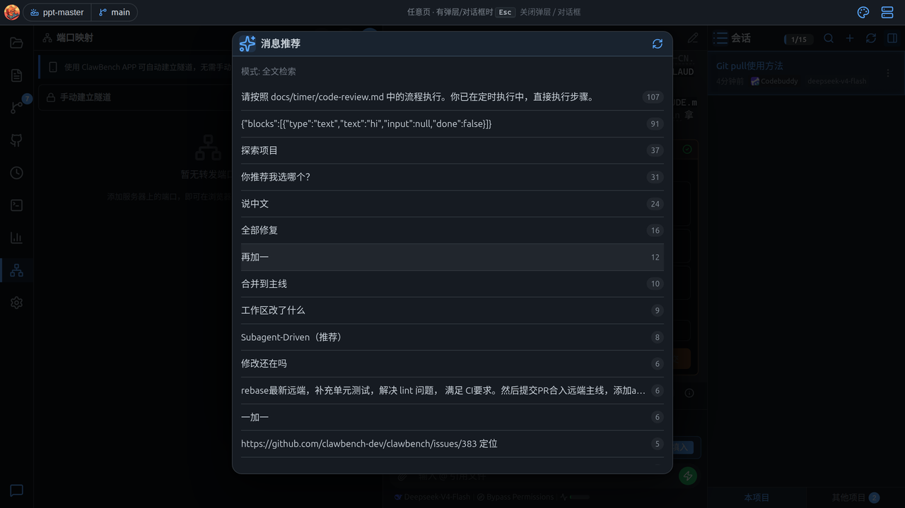

1. 点「**开始分析**」（已有结果时为「重新分析」），ClawBench 会对当前会话的历史消息做语义聚类
2. 分析过程中显示**进度条与阶段**（提取 → 聚类 → 保存，带百分比）与所用的匹配方式（全文检索 / 语义向量 / 精确匹配）
3. 完成后按组列出**聚类结果**，每组显示包含多少条相关对话；点开一组可查看其变体，并把满意的 Prompt **「添加」到快捷发送**，之后一键复用

聚类基于消息内容语义与时间间隔进行 Union-Find 三阶段合并：

1. **语义相近**：连续若干轮对话若讨论的是同一主题，则合并
2. **时间合并**：间隔短的多轮对话段若主题相关则合并
3. **边界识别**：若两段之间有明显的话题转换（如新问题或新文件），则分开

> 聚类结果只在点「开始分析」时计算，不随对话实时变化——长会话中想找某个子话题时再跑一次即可。

**移动端**入口相同（快捷发送抽屉右上角 ✨），抽屉从底部弹出：

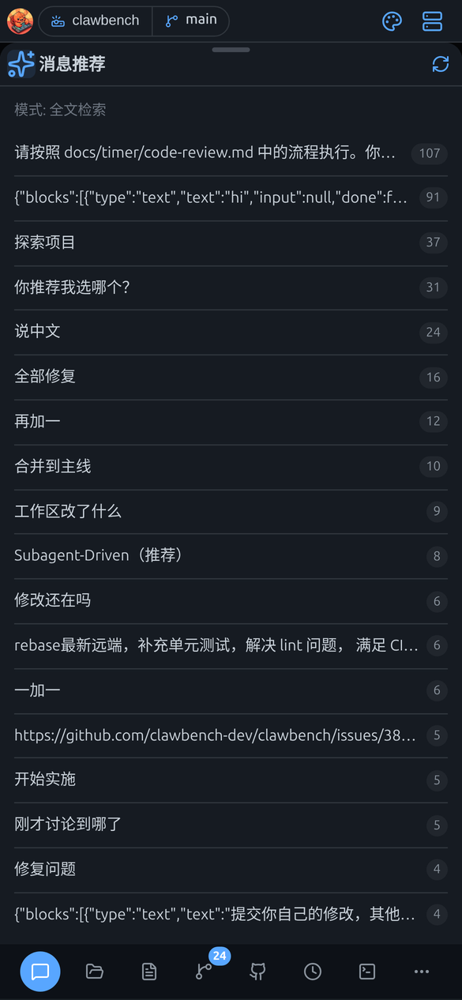
