# 文件管理

> 本文同时适用于桌面端与移动端；两端差异处用 **桌面端** / **移动端** 标注。

浏览和管理项目目录里的文件：看、搜、传、复制、删除。左侧 Dock 第一个图标即文件管理器。

## 工具栏

文件管理器顶部那排按钮，以及 AI 改完文件后的自动高亮提示。

> **AI 修改文件后自动刷新**：AI 在会话中修改了某个文件后，ClawBench 会自动将该文件在文件管理器中标记为已修改（黄色高亮），无需手动刷新。Diff 高亮会在打开文件时显示变更行（红色删除/绿色新增）。若文件被外部程序修改，ClawBench 也会通过定期轮询感知并高亮提示。

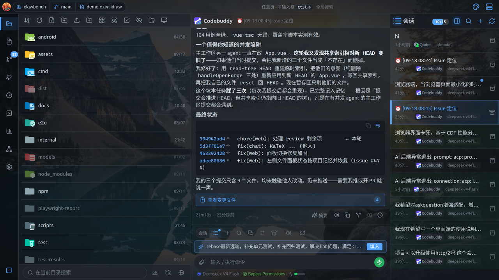

**桌面端**工具栏按钮（从左到右）：

| 按钮 | 作用 |
|---|---|
| **排序** | 打开排序菜单（见下） |
| **刷新** | 重新拉取当前目录 |
| **新建文件** | 在当前目录创建文件 |
| **新建文件夹** | 在当前目录创建目录 |
| **上传文件** | 上传单个或多个文件 |
| **上传文件夹** | 上传整个文件夹（保持目录结构） |
| **图标视图 / 列表视图** | 切换显示模式 |
| **预览模式** | 开关下方预览窗格 |
| **多选** | 进入多选模式 |
| **显示/隐藏隐藏文件** | 切换隐藏文件可见性 |
| **跳转** | 输入路径直接跳转 |
| **已分享文件** | 打开分享记录抽屉 |

工具栏会随面板宽度自适应，放不下的按钮收进「更多」菜单。

**移动端**顶部工具栏（窄屏下部分按钮收进溢出）：

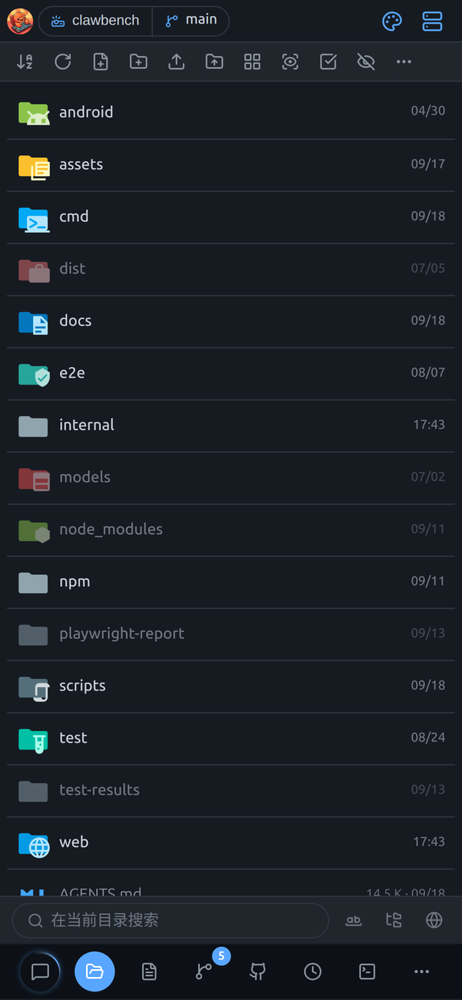

| 按钮 | 作用 |
|---|---|
| 排序 | 按名称 / 时间 / 后缀 / 大小排序 |
| 刷新 | 重新读取当前目录 |
| 新建文件 / 新建文件夹 | 在当前目录创建 |
| 上传文件 | 从手机选择文件上传 |
| 上传文件夹 | 上传整个目录（仅网页模式） |
| 图标视图 / 列表视图 | 切换显示模式 |
| 预览模式 | 开启后单击文件即预览（见下） |
| 多选 | 进入批量操作 |
| 跳转 | 直接输入路径跳转 |
| 显示隐藏文件 | 切换 `.` 开头文件可见性 |

**移动端**工具栏下方是**搜索框**，输入即筛当前目录；配合「递归搜索」「全局搜索」开关可搜整个项目。面包屑在工具栏下方，点任意一级可跳回。**返回上一级**按钮在目录层级 > 1 时出现。

> **移动端**无「已分享文件」按钮。

## 排序

按名称、时间、后缀或大小排列文件，再点一次切换升降序。

点排序按钮展开菜单：

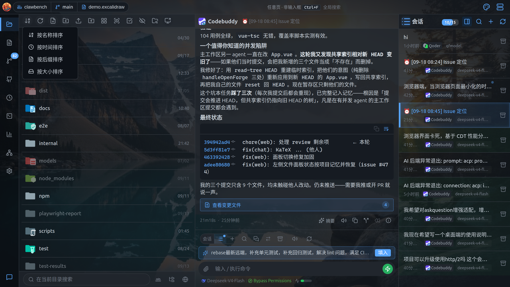

- 按名称排序
- 按时间排序
- 按后缀排序
- 按大小排序

再次点击同一项可切换升序/降序。

## 搜索

底部搜索坞，可在当前目录、递归或整个项目范围内找文件。

底部常驻搜索坞：

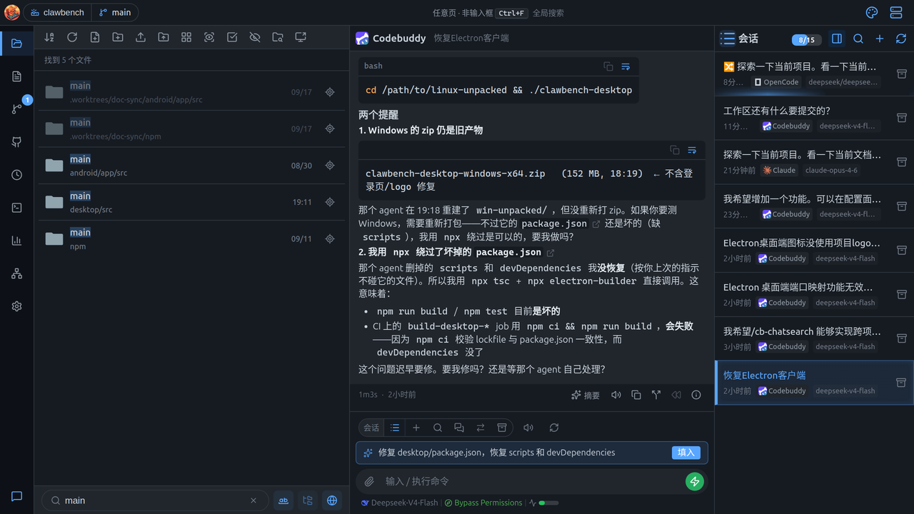

- **搜索输入框**：支持上下键在结果间导航、回车打开
- **精确匹配**开关：只匹配完整词
- **递归**开关：在当前目录下递归搜索
- **全局**开关：在整个项目范围内搜索（蕴含递归）

结果显示条目所在目录，点结果旁的小按钮可「在目录中定位」。

**移动端**：搜索框位于工具栏下方，输入即筛当前目录，配合「递归搜索」「全局搜索」开关可搜整个项目。

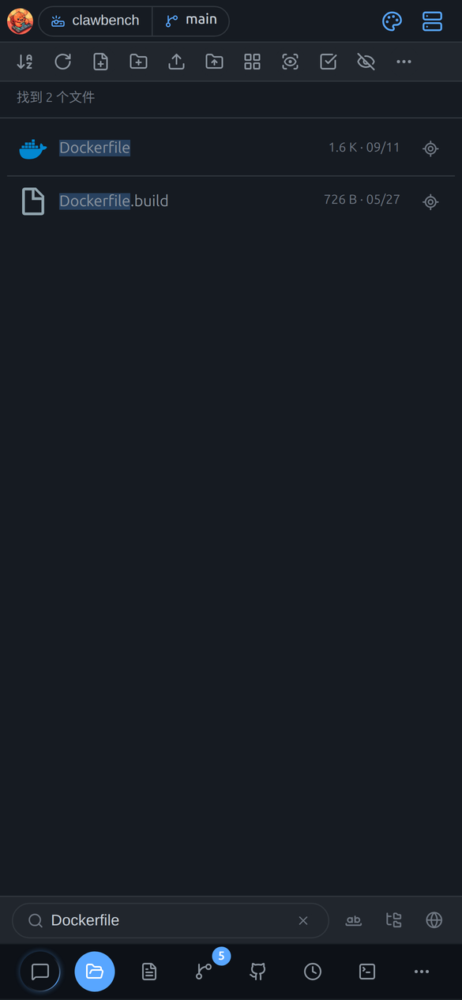

> **移动端**未列出「精确匹配」开关。

### 按内容搜索（grep）

找的是**文件里的文字**而不是文件名——工具栏的 `SearchCode` 按钮或 `Ctrl+Shift+F` 打开，对标 VS Code 的「在文件中搜索」：

- **四个选项**：递归 / 正则 / 全词匹配 / 大小写敏感
- **文件包含 / 排除**：gitignore 语法（如 `*.ts`、`!dist/**`）
- **范围**：当前目录 / 整个项目；标题会带浅色后缀标出当前范围（仅当前目录 / 当前目录及子目录 / 整个项目）
- **结果按文件分组**、可折叠，显示「N 个文件 / M 处匹配」，点击任意匹配行打开文件并跳到该行
- **搜索进行中**显示实时计数（能区分"还在搜"和"搜完了"）；随时可点**停止**，已到达的结果留在屏幕上并标注为部分结果
- **结果数量有上限**（默认 100 处）；达到上限时提示已截断
- **正则语法错误**会就地提示（不会静默返回 0 结果）

> 内容搜索会跳过依赖缓存、构建产物与版本控制目录（`.git`、`node_modules`、`.venv`、`dist` 等），大仓库也能秒级出结果。

> **移动端**用工具栏的搜索图标打开同一个独立对话框；结果按文件分组，点匹配行打开文件并跳到该行。

## 多选

批量模式，一次选中多个文件做复制、打包下载、删除。

**桌面端**点「多选」进入多选模式，工具栏替换为多选操作条：

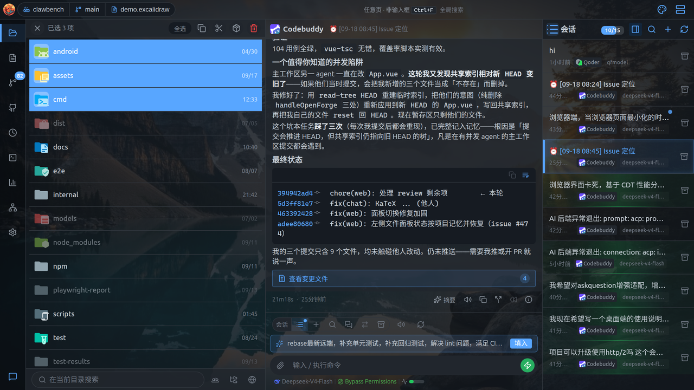

| 操作 | 说明 |
|---|---|
| **退出多选** | 返回普通模式 |
| **全选 / 取消全选** | 批量选择 |
| **复制 / 剪切** | 放入剪贴板 |
| **打包下载** | 把选中项打包为压缩包 |
| **删除** | 批量删除 |

配合 `Shift` 点击可做范围选择，`Ctrl` 点击可增减单个选择。

**移动端**点工具栏「多选」进入批量模式，工具栏替换为多选操作条：

| 按钮 | 作用 |
|---|---|
| 退出多选 | 返回普通模式 |
| 全选 | 选中当前目录全部条目 |
| 复制 / 剪切 | 批量复制剪切 |
| 打包下载 | 选中项打包为 zip 下载 |
| 分享 | 批量分享（仅 App 模式） |
| 删除 | 批量删除 |

点条目即切换选中状态，选中的条目有高亮边框。

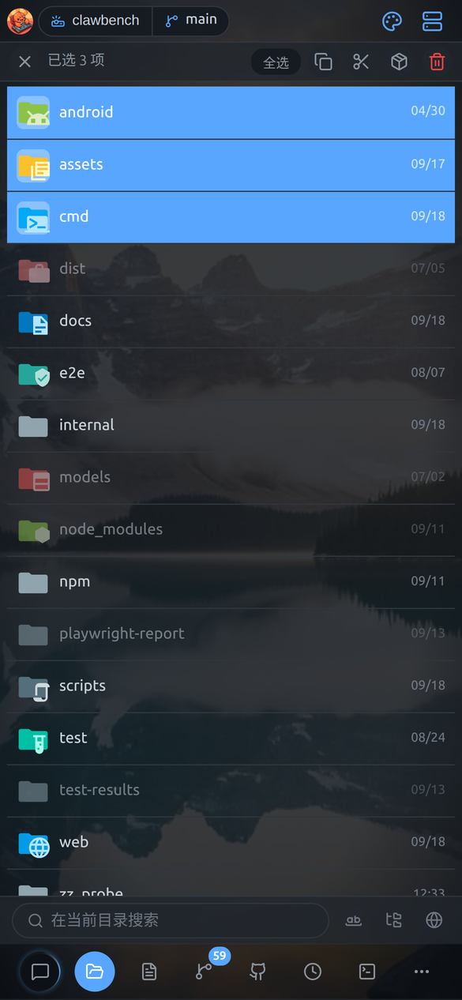

## 网格视图

把文件列表换成缩略图网格，适合浏览图片。

点「图标视图」切换为网格布局：

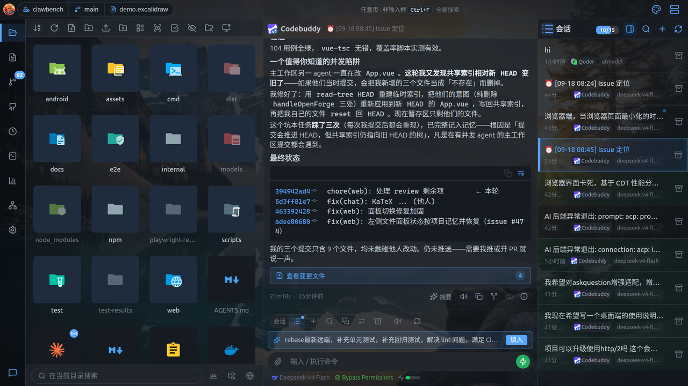

适合浏览图片等以缩略图为主的内容。再点一次切回列表。

## 右键菜单与长按菜单

在文件、目录或空白处弹出操作菜单，替代敲命令行。

**桌面端**在文件、目录或空白处右键弹出操作菜单。

**在文件上右键**：

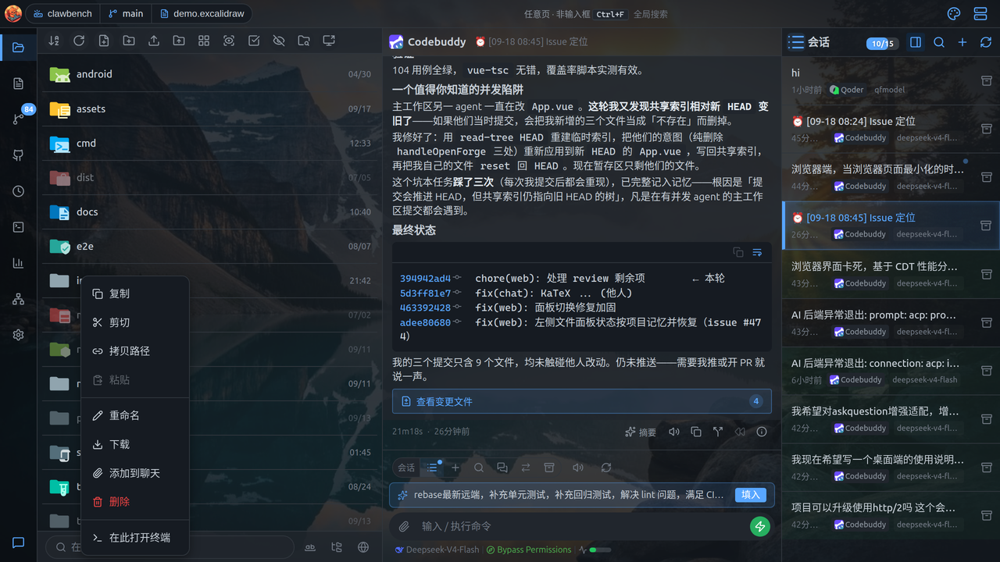

复制、剪切、拷贝路径、粘贴、重命名、下载、添加到聊天、删除、在此打开终端。

**在目录上右键**：

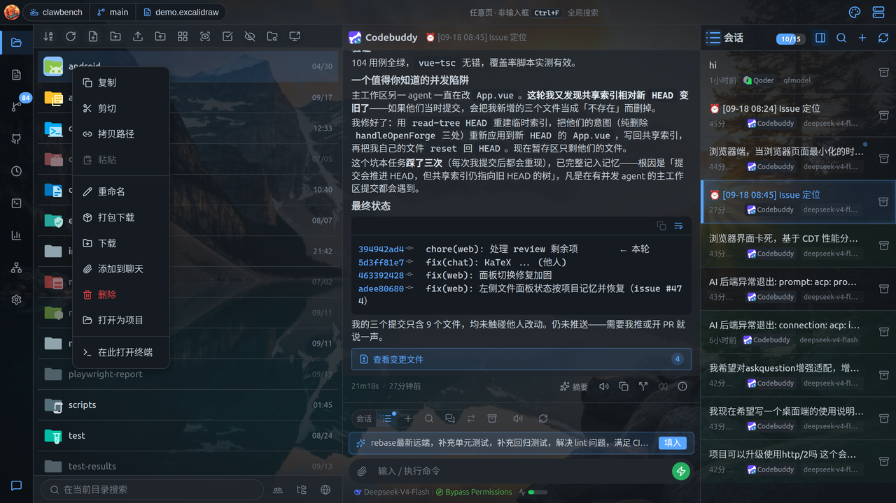

比文件多出：下载目录树（保持结构的打包下载）、作为项目打开。

**在空白区右键**：粘贴、新建文件、新建文件夹。

> **注意**：右键菜单只在**图标与名字区域**生效；点行的其他区域会弹出空白区菜单（与 Windows 资源管理器一致）。

**移动端**用**长按**代替鼠标右键：长按文件或目录约 0.45 秒，弹出上下文菜单。

- 文件：复制、剪切、拷贝路径、重命名、下载、添加到聊天、删除、在此打开终端
- 目录：额外有「打包下载」「打开为项目」

在**空白处**长按则弹出目录级菜单（粘贴、新建文件、新建文件夹、在此打开终端）。

文件长按菜单：

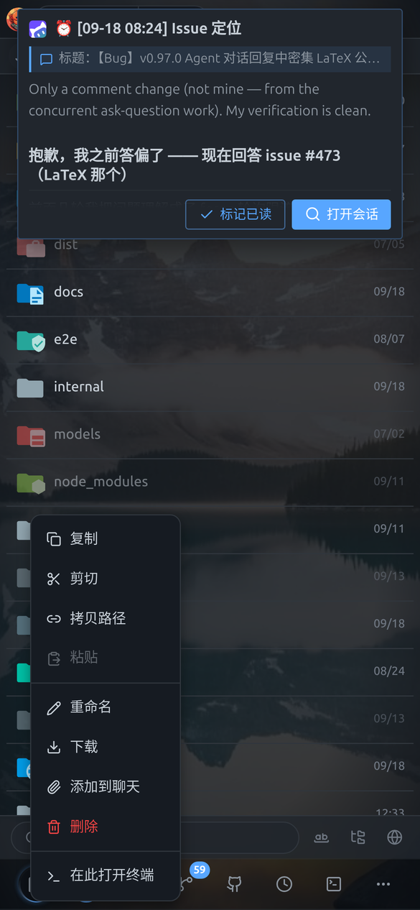

## 预览窗格

列表下方多出一块可调高度的区域，单击文件先在这里瞄一眼。

**桌面端**点工具栏的**预览模式**按钮，列表下方出现可拖拽高度的预览窗格：

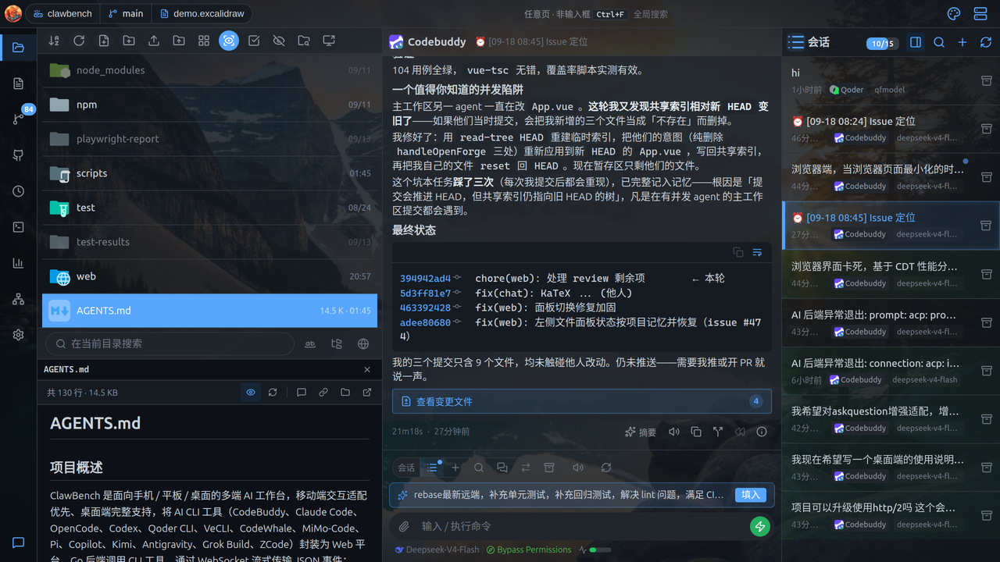

- 开启后**单击**文件即可在下方预览，不必双击打开完整查看器
- 目录会在预览窗格中列出内容
- 大文件按行窗口取数，不会整体传输，因此打开很快
- 拖分隔条调整高度；点关闭按钮收起窗格（预览模式仍开启）

**移动端**开启工具栏的**预览模式**后，文件管理器下方会出现一个停靠的预览窗格：

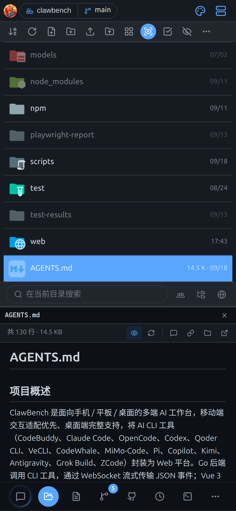

- **单击**文件即在下方窗格预览，不离开列表
- 预览窗格与列表之间有**分隔条**，可上下拖动调整高度
- **再点一次**同一个文件（或点窗格里的「打开」）才进入完整查看器

> **注意**：这个「点一次预览、点两次进入」的行为**只在开启预览模式时成立**。未开启时单击文件不会进入，需要用其他方式打开（如长按菜单）。

## 拖拽上传

把文件从系统文件管理器直接拖进文件列表，就地上传到当前目录。

除了工具栏的「上传文件 / 上传文件夹」按钮，还可以直接从系统文件管理器（Finder / 资源管理器）把文件或文件夹**拖进文件列表**：

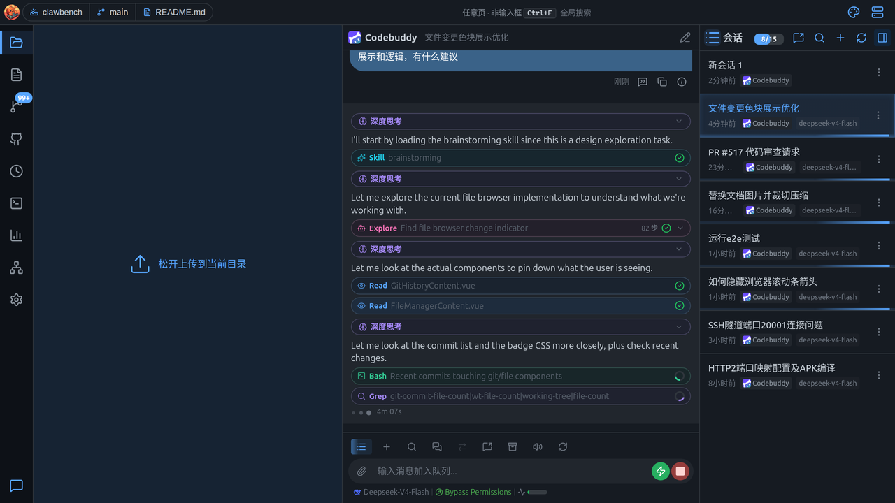

- 拖入时整个列表区浮出「松开上传到当前目录」的提示层
- 松开后上传到**当前浏览的目录**（不是项目根目录）
- 拖入文件夹会保留目录结构，与「上传文件夹」按钮行为一致
- 搜索状态下不响应拖拽——此时列表显示的已不是当前目录内容，上传目标会有歧义

> **与拖拽进聊天区的区别**：拖到聊天区是「上传 + 附加到会话」，拖到文件管理器只是上传到目录，不会附加到任何会话。

> **从文件管理器往外拖**是另一回事：把列表里的文件拖到聊天区是**引用**（不复制文件），拖到目录上是**移动**。拖拽移动需要宽屏布局。
