# 文件查看与编辑

> 本文同时适用于桌面端与移动端；两端差异处用 **桌面端** / **移动端** 标注。

打开单个文件后能做什么：不同类型的文件用不同方式看，代码还能直接改。双击文件会在「文件」页签中打开完整查看器。查看器按文件类型自动选择渲染方式，以下逐类说明。

## 支持的文件类型总览

一张表说明每种扩展名会用哪种方式打开。

**桌面端**：

| 类型 | 扩展名 | 渲染方式 |
|---|---|---|
| Markdown | `.md` | 完整渲染（表格、代码高亮、公式、Mermaid） |
| 代码 | `.ts` `.go` `.py` 等 | CodeMirror 编辑器（浏览 / 编辑双模式） |
| 图片 | `.jpg` `.png` `.svg` `.webp` 等 | 内联预览 + 灯箱 |
| 音频 | `.mp3` `.wav` `.ogg` 等 | 内联播放器 |
| 视频 | `.mp4` `.webm` 等 | 内联播放器 |
| PDF | `.pdf` | 分页渲染 |
| Word | `.docx` | Office 预览 |
| Excel | `.xlsx` | 表格渲染 |
| PPT | `.pptx` | 幻灯片渲染 |
| OpenAPI | `.yaml` `.json`（含 openapi 字段） | Swagger UI |
| Excalidraw | `.xdraw` `.excalidraw` | 内嵌画布编辑器 |
| HTML | `.html` | iframe 渲染预览 |
| 其他 | 任意 | 文本查看（超大文件按窗口取数） |

**移动端**：

| 类型 | 扩展名 | 查看方式 |
|---|---|---|
| 代码 | `.ts .js .go .py .rs .java .c .cpp` 等 | CodeMirror 编辑器（可编辑） |
| Markdown | `.md` | 渲染视图 + TOC |
| 图片 | `.png .jpg .gif .webp .svg` | 图片查看器 + 灯箱 |
| 音频 | `.mp3 .wav .m4a` | 内联播放器 |
| 视频 | `.mp4 .webm` | 内联播放器 |
| PDF | `.pdf` | 分页渲染 |
| Word | `.docx` | 文档视图 |
| Excel | `.xlsx` | 表格视图（多 Sheet） |
| PPT | `.pptx` | 逐页渲染 |
| OpenAPI | 含 `openapi` 字段的 YAML/JSON | Swagger UI |
| Excalidraw | `.xdraw` `.excalidraw` | 内嵌画布编辑器 |
| 其他 | 任意 | 文本查看 |

> **移动端**未列出 HTML 类型。

## Markdown

把 `.md` 渲染成带目录、表格、公式、图表的文档。

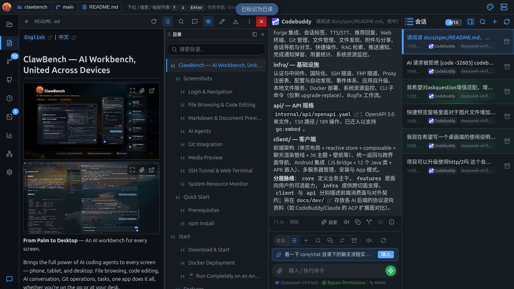

支持完整的 Markdown 渲染。工具栏的**目录**按钮唤出 TOC 侧栏，点击标题跳转，滚动位置与标题锚定同步。

**表格**：

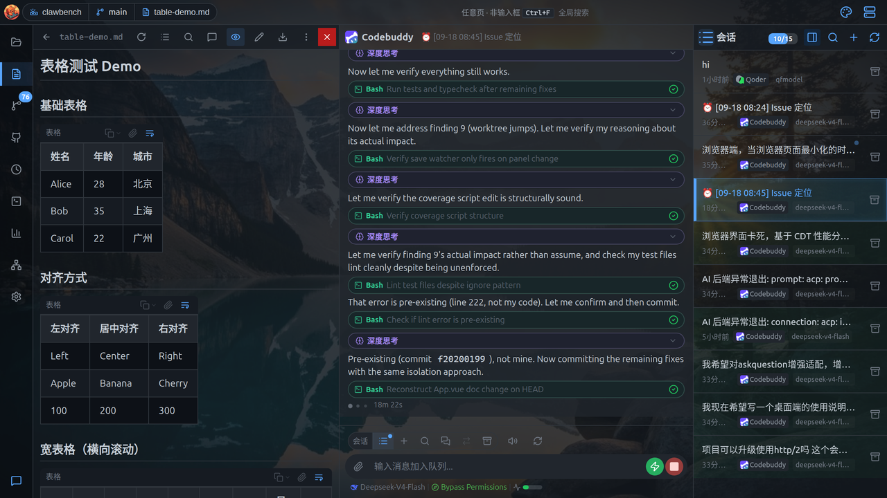

支持基础表格、对齐方式（左/中/右）与宽表格横向滚动。

**选中表格里的任意一行**（含表头行与数据行）「添加到聊天」时，引用标注的是该行自己的源文件行号，而不是整张表格的起始行。

**数学公式（LaTeX）**：

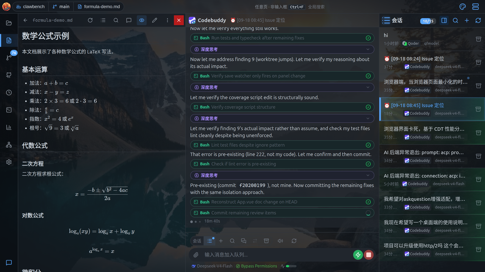

行内公式与块级公式都会渲染为排版后的数学符号（分数、根号、上下标、求和积分等）。

**Mermaid 图表**：

支持时序图、甘特图、流程图、ER 图等。图表以 SVG 渲染，可随容器缩放。

**内嵌图片**：

文档中的相对路径图片会从项目目录读取并显示。**SVG 图片（含 mermaid 图）会等比撑满正文栏宽度**，高度上限约 60% 屏高——不再按固有尺寸渲染而在宽屏上留下大片空白。

**移动端**渲染支持标题、列表、表格、代码块、公式、Mermaid 图、内嵌图片：

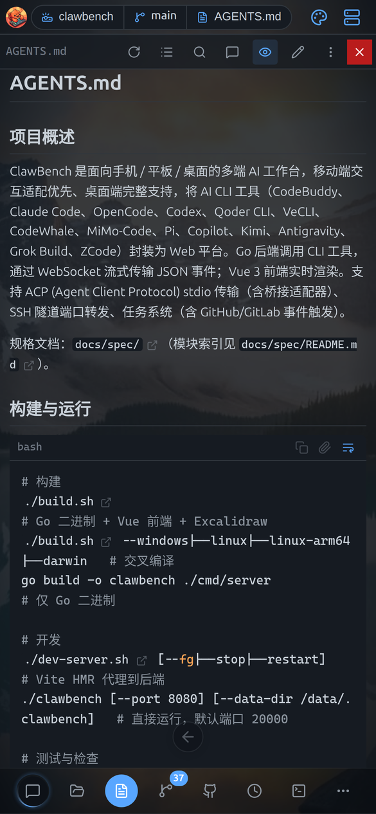

- 工具栏的**目录**按钮唤出 TOC 抽屉，点标题跳转

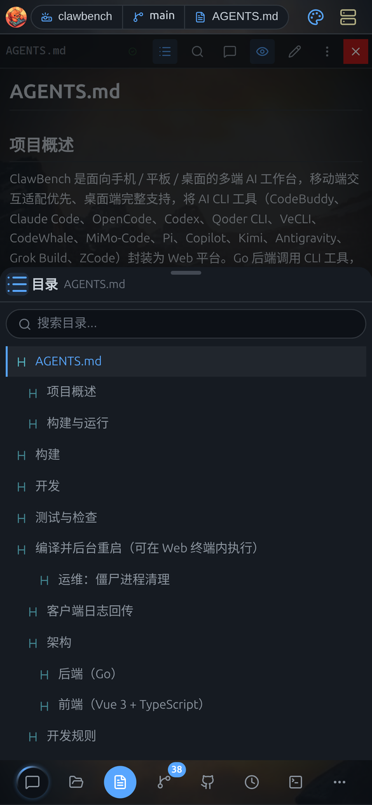

- 表格支持横向滚动查看宽表
- 公式（LaTeX）渲染为排版后的数学符号

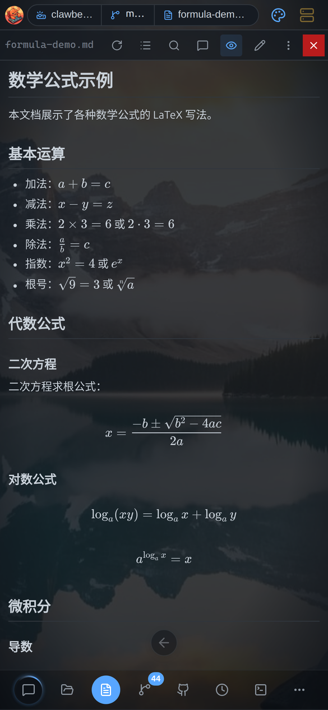

Mermaid 图表（时序图、甘特图、流程图、ER 图）会渲染为图形：

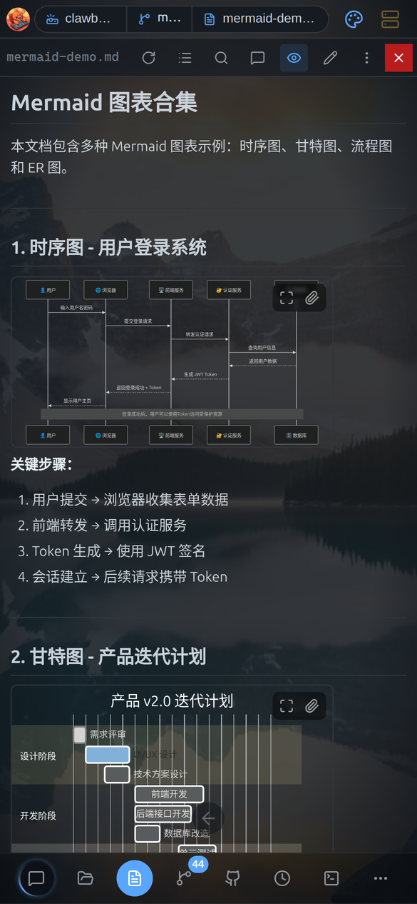

## 代码

代码文件用 CodeMirror 打开，能高亮、能补全、能直接改并保存。

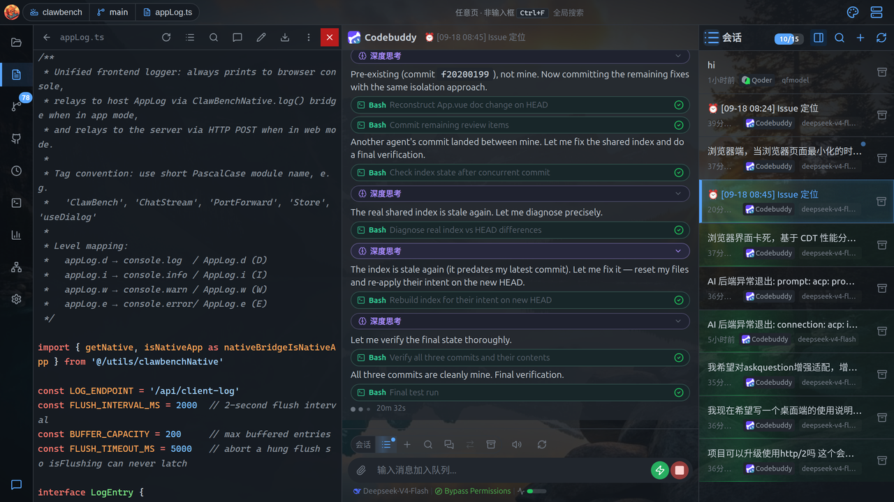

CodeMirror 编辑器，支持**浏览 / 编辑双模式**切换。特性：

- **语法高亮**：按文件扩展名自动选择语言
- **代码自动补全**：编辑模式下为 11 种语言（JS/TS/HTML/CSS/Python/SQL/Go/Less/Sass/Liquid/Markdown）提供语言感知补全
- **行号**：可开关
- **自动换行**：可开关
- **粘性滚动（sticky scroll）**：滚动时当前函数/类名吸顶
- **搜索**：`Mod+F` 打开搜索面板
- **符号提取**：基于 tree-sitter 提取函数/类列表
- **保存**：编辑态下 `Mod+S` 保存回原文件

**新建文件是「未命名缓冲」**（与 VS Code 的 untitled 标签一致）：点「新建文件」不会先弹文件名，而是直接打开一个空的未命名编辑器，你先写内容，**首次保存时**才询问文件名（校验空名/含路径分隔符，并查重以免静默覆盖已有文件）。未命名状态下标题显示「未命名」，所有依赖磁盘路径的操作（分享、下载、Git 历史等）隐藏；直接退出等同关闭未保存标签，会先确认。

**移动端**：

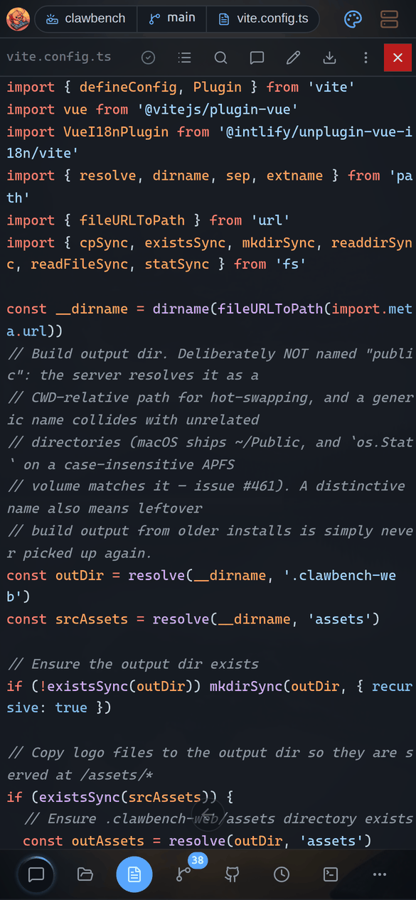

- 语法高亮、行号、自动换行、粘性滚动
- **代码自动补全**：编辑模式下为 11 种语言提供语言感知补全
- `Mod+F` 搜索
- 编辑态下 `Mod+S` 保存回原文件
- 基于 tree-sitter 的符号提取（函数/类列表）

## 图片与灯箱

图片按窗口大小显示，可在同目录图片间切换，也能全屏细看。

图片以适应窗口的方式预览。右上角显示**当前序号 / 总数**（如 `7 / 10`），可用左右箭头或键盘在**同目录图片**间切换。

点工具栏的**灯箱**按钮进入全屏查看：

灯箱模式下图片占满视口，适合细看大图。

**移动端**：图片适应窗口显示，右上角显示「当前序号 / 总数」，可左右滑动或点箭头在同目录图片间切换；**双指捏合缩放**。灯箱点工具栏灯箱按钮全屏查看。

## 音频

内联音频播放器，能播放、暂停、拖进度、调音量。

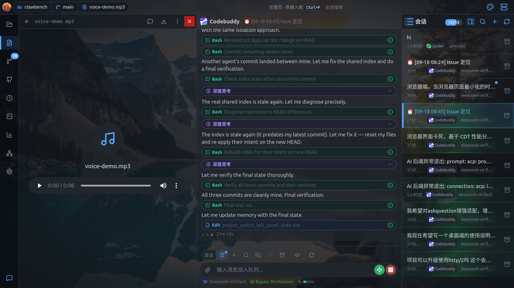

内联音频播放器，显示文件名、播放/暂停、进度条、当前时间与总时长、音量控制。

**移动端**：内联播放器，支持播放暂停、进度拖动、音量。

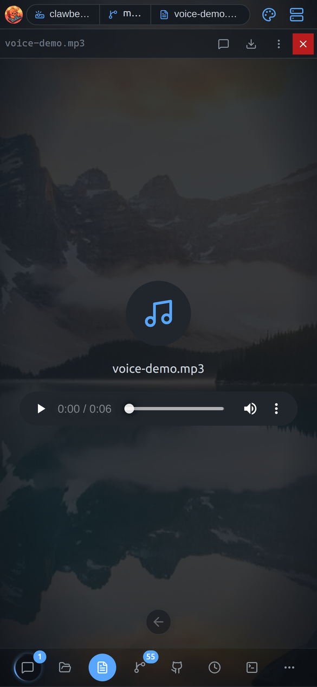

## 视频

内联视频播放器，支持播放控制与全屏。

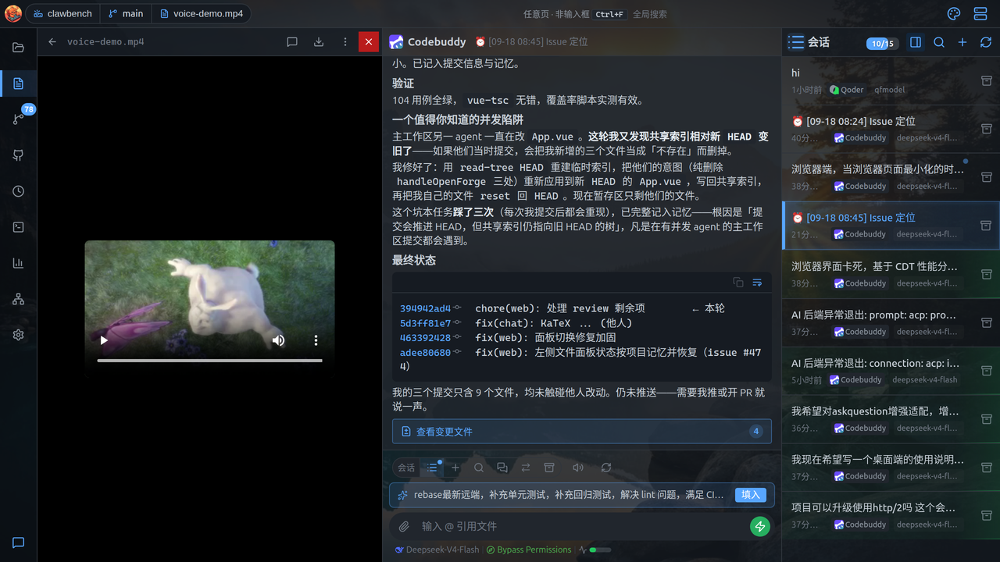

内联视频播放器，支持播放/暂停、进度拖动、音量、全屏。视频文件通过 `/api/fs/raw` 端点流式传输，不会整份加载进内存。

**移动端**：内联播放器，支持播放暂停、进度拖动、音量。

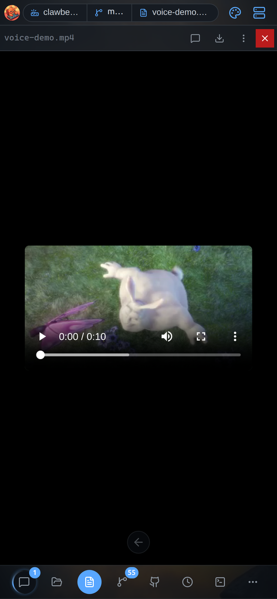

## PDF

PDF 分页渲染，可以滚动翻页、缩放、切换页码。

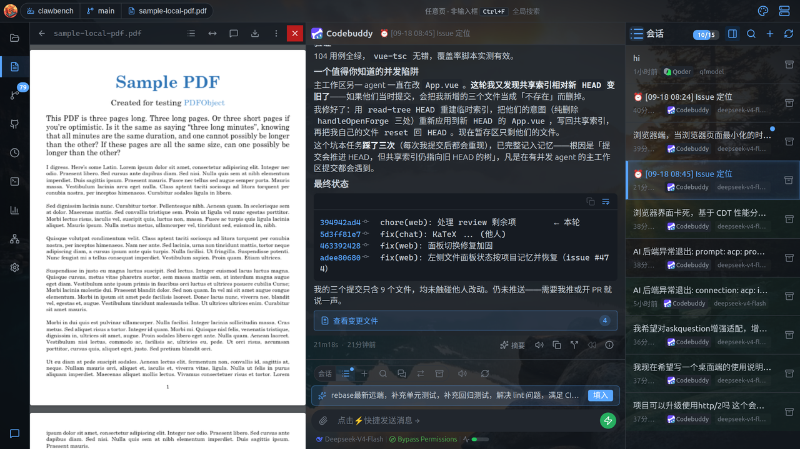

分页渲染，支持滚动翻页、适应宽度、放大缩小。工具栏可切换页码。

**移动端**：分页渲染，支持缩放与翻页，**双指捏合缩放**。

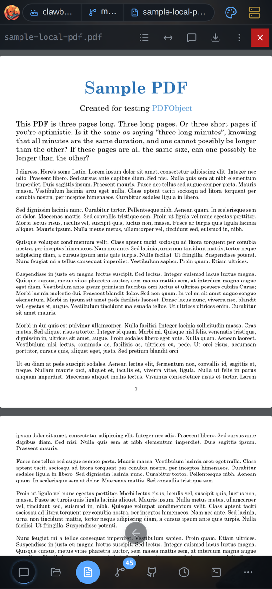

## Word 文档

把 `.docx` 渲染成保留标题、段落与基本排版的文档视图。

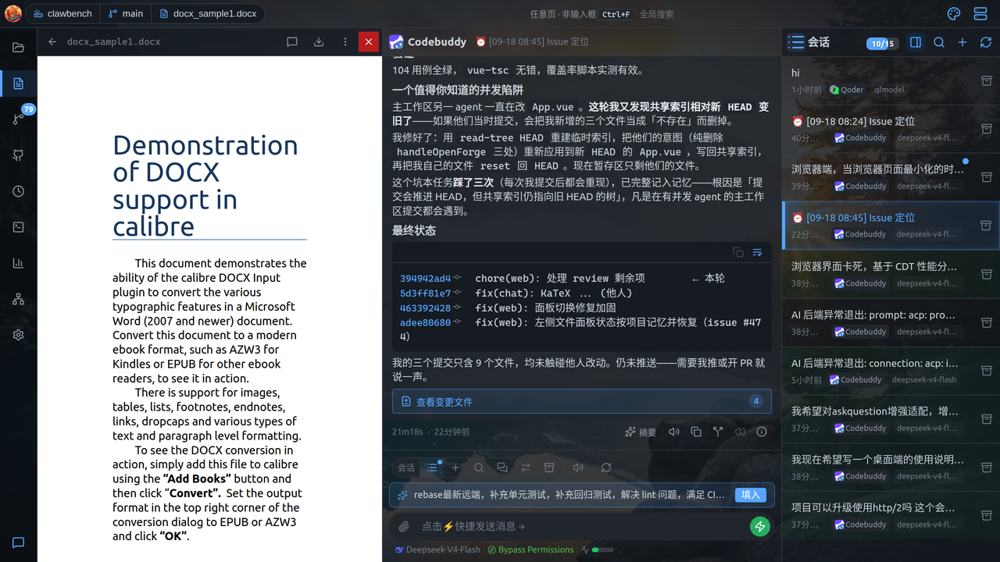

`.docx` 渲染为可读的文档视图，保留标题层级、段落与基本排版。

## Excel 表格

把 `.xlsx` 渲染成表格，支持多个 Sheet 切换。

`.xlsx` 渲染为表格，支持多 Sheet 切换（顶部标签）、单元格内容查看。

## PPT 幻灯片

把 `.pptx` 逐页渲染成幻灯片，可翻页浏览。

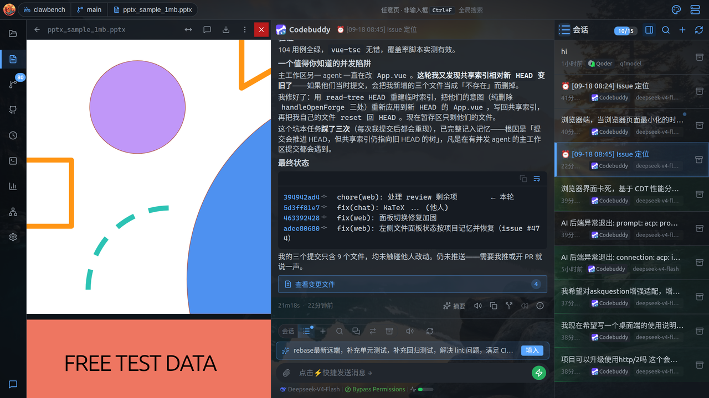

`.pptx` 逐页渲染幻灯片，保留形状、配色与文字排版。可翻页浏览。

**移动端**：支持**双指捏合缩放**。

## OpenAPI 文档

识别 OpenAPI 文件并渲染成 Swagger UI，可直接展开查看接口。

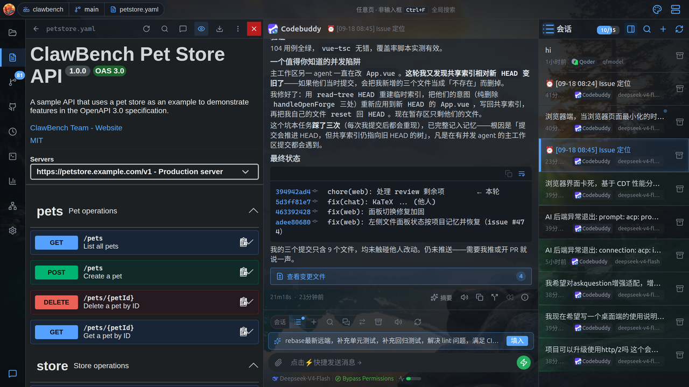

识别含 `openapi` 字段的 YAML/JSON 文件，渲染为 **Swagger UI**：显示 API 标题、Servers 下拉、按 tag 分组的端点列表，可展开查看参数与响应。

## Excalidraw 画布

用内嵌的画布编辑器打开 `.xdraw` 文件，可编辑并保存回原文件。

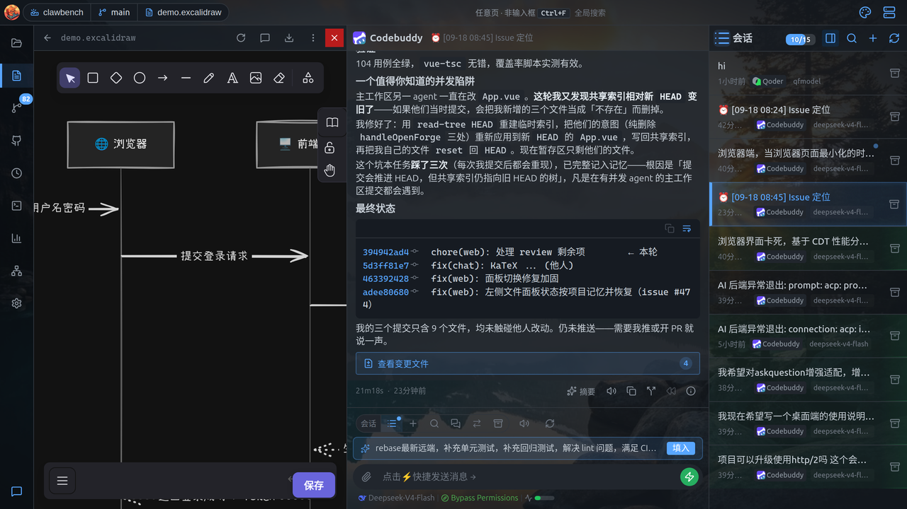

`.xdraw` 文件在内嵌的 Excalidraw 编辑器中打开（独立 React 构建，通过 iframe 加载），可直接编辑并保存回原文件。

`.xdraw` 是本应用推荐使用的短扩展名。从 Excalidraw 官网导出、或由其他工具生成的文件扩展名是 `.excalidraw`，同样可以直接打开——两者行为完全一致（同样识别为画布、同样可编辑保存），文件内容格式相同，改扩展名即可互换。不想打那么长的扩展名时用 `.xdraw` 就行。

## 查看器工具栏

查看器顶部那排按钮，随文件类型变化（返回、目录、编辑、下载等）。

工具栏按钮（随文件类型变化）：

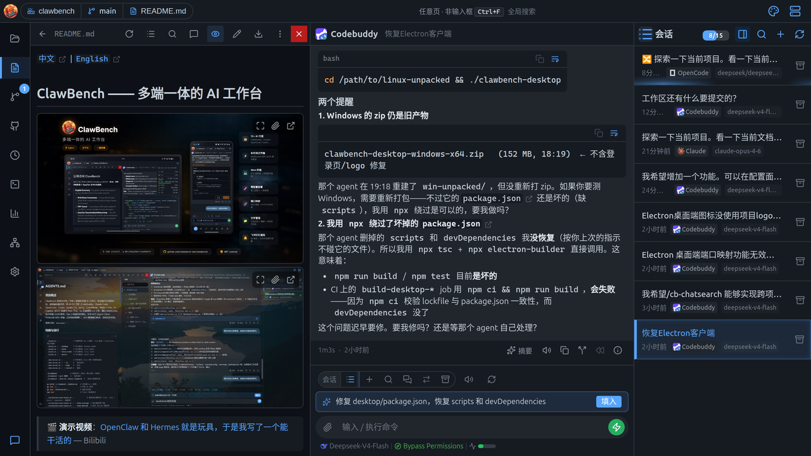

| 按钮 | 作用 |
|---|---|
| 返回 / 前进 | 在打开历史中导航 |
| 刷新 | 重新读取文件 |
| 目录 | 唤出 TOC 侧栏（Markdown） |
| 搜索 | 打开搜索面板 |
| 适应宽度 | 缩放适配 |
| 引用到聊天 | 把文件（或选中行范围）加入聊天上下文 |
| 灯箱 | 全屏查看（图片） |
| 渲染 / 源码 | 切换渲染视图与原始文本 |
| 编辑 | 进入编辑模式（代码） |
| 下载 | 下载文件 |
| 更多菜单 | 详情、打开目录、文件历史、分享链接、以文本打开、导出 HTML、设为背景、自动换行、行号、粘性滚动、删除 |

## 其他能力

代码链接预览、快速引用到聊天、差异高亮、设为壁纸等零散能力。

- **代码链接预览**：聊天里出现经过验证的 `文件路径` 或 `路径:行号` 时，点击弹出代码切片浮层，不必离开对话
- **快速预览到聊天**：预览窗格中的内容可一键引用到聊天：

  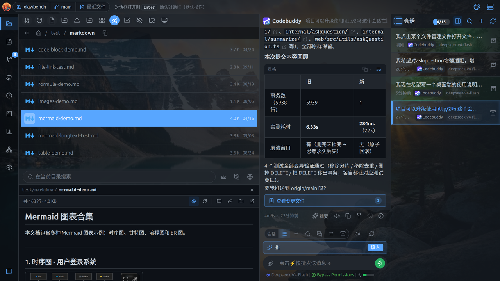

- **差异高亮与变更导航**：AI 修改文件后，查看器自动刷新并在**右缘以一条 3px 主题色细轨**标出变化的块/行（Markdown 块级、代码行级；鼠标悬停细轨会展开为提示小条）。预览区右上角出现一个**变更导航浮条**，显示「共 N 处」与 `当前/总数`，可用**上一条 / 下一条**在改动之间跳转、或用 **×** 清除标记——Markdown 与代码面共用同一套导航，切换文件时导航自动回到第一处。Markdown 里嵌套块（如列表项内部）的同一处改动会合并为一条标记，点击可一次看到该处全部 diff
- **设为背景**：把图片设为界面壁纸

## 下载与导出

把文件取回本地、导出成独立 HTML，或批量打包下载。

文件有四种取用方式，按场景选择：

| 方式 | 入口 | 适用 |
|---|---|---|
| **下载原文件** | 查看器工具栏的「下载」 | 取回单个原始文件 |
| **导出 HTML** | 更多菜单 → 导出 HTML | 把 Markdown 变成可离线分发的单文件网页 |
| **打包下载** | 多选模式 → 打包下载 | 批量取回多个文件/整个目录 |
| **分享链接** | 更多菜单 → 分享链接 | 不下载，直接给别人一个只读链接 |

下载与上传都会在界面顶部显示**产品内进度条**（累计字节，多文件时是整批的总体进度而非逐文件归零），浏览器、桌面端、Android 三端表现一致。下载完成或失败都有提示；若在系统保存对话框里取消，不会误报为失败。

**移动端**：

- **下载**：长按菜单或工具栏的下载按钮
- **导出 HTML**：把 Markdown / 代码导出为独立 HTML
- **分享链接**：生成只读公开链接（在查看器的更多菜单里），任何拿到链接的人无需登录即可查看
- **App 模式分享**：调用系统分享面板，把文件发给其他 App

### 更多菜单

查看器右上角那个 `⋮` 按钮，导出、分享、删除等操作都从这里进。

查看器右上角的**更多**按钮（`⋮`）集中了导出与分享入口：

菜单项：文件详情、打开目录、文件历史、**分享链接**、**导出 HTML**、删除。

**移动端**查看器右上角的「更多」菜单集中了下载、导出 HTML 与分享链接入口：

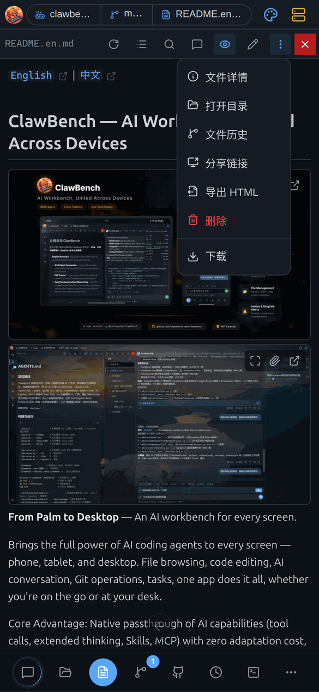

### 导出 HTML

把 Markdown 变成一个自带样式和图片的单文件网页，可以直接发给别人。

对 Markdown 文件选「导出 HTML」，会生成一个**自包含的单文件 HTML**（样式与图片内联），可直接发给别人或离线打开。

- 导出成功会提示生成的路径
- 若文档引用了无法内联的图片（如远程图片、超出大小限制），会**跳过并在提示里说明数量**，不会静默丢弃
- 导出失败会明确报错，不会产生半成品文件

### 打包下载

把选中的多个文件或整个目录压缩成一个包下载，目录结构保持不变。

在文件管理器点「多选」进入多选模式，选中多个文件（或整个目录）后点**打包下载**：

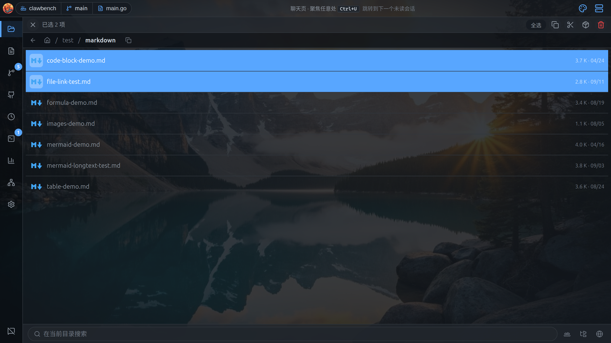

会把选中项打包成一个压缩包下载，目录结构保持不变。

> **提示**：`Shift + 点击` 可做范围选择，`Ctrl + 点击` 可增减单个选择，配合「全选」可快速圈定范围。

## 分享链接

生成只读链接发给别人，对方无需登录即可查看，并可在分享记录里统一管理。

把文件分享给别人时不必下载再转发——生成一个**只读链接**即可。

### 生成分享链接

给文件生成一个只读链接，对方打开就能看，不需要登录。

在查看器的**更多菜单**里选「分享链接」，打开分享弹窗：

弹窗显示文件名与完整路径，并说明规则。点底部的**生成链接**按钮创建链接：

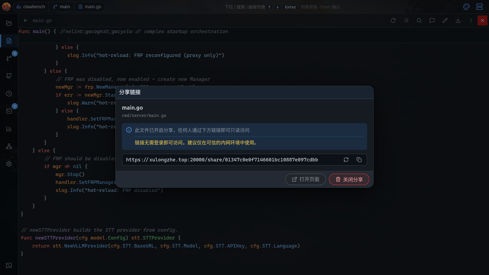

生成后弹窗变为「已开启分享」状态，出现**链接栏**，包含：

| 元素 | 作用 |
|---|---|
| 链接输入框 | 只读，点击自动全选，便于手动复制 |
| **复制**按钮 | 复制链接到剪贴板 |
| **重新生成**按钮 | 换一个新链接（**原链接立即失效**，需二次确认） |
| **打开页面** | 在新标签页打开分享页预览效果 |
| **关闭分享** | 撤销分享（**链接立即失效**，需二次确认） |

### 分享页面

拿到链接的人看到的样子：只读渲染 + 目录大纲 + 下载入口。

拿到链接的人在浏览器打开后，看到的是一个**只读页面**，无需登录：

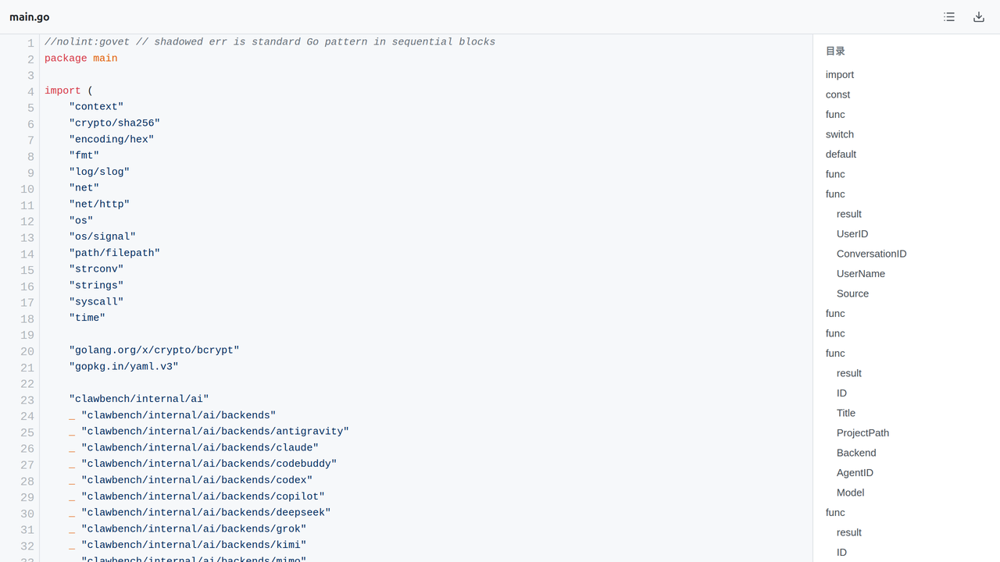

- 按文件类型渲染（代码带语法高亮与行号、Markdown 渲染为文档、图片直接显示等）
- 右侧有基于内容的**目录大纲**，点击可跳转
- 提供下载入口，方便对方取回原文件
- 页面是独立构建的轻量 SPA，不含编辑器与聊天等主应用功能

**Markdown 里的相对链接可点击**：分享的 Markdown 中形如 `[指南](./docs/guide.md)` 的相对链接，读者点击后会在**同一分享页内**切换到被引用的文件（顶部「返回」与浏览器后退都能回到原文档），无需登录、也不会跳出分享范围。范围有意收窄：**仅 Markdown 相对链接**（正文裸路径与行内 code 不算），**不支持目录链接**（分享端无目录列举能力，点击会提示「不可用」）；被引用文件缺失或越界时页面就地报错并保留「返回」，不会把读者困在死链上。

> **安全提示**：**链接即凭证**——任何拿到链接的人都能只读访问，无需登录。弹窗中也有同样的提醒。请仅在可信环境（如内网）中分享，不再需要时及时「关闭分享」。

> ⚠️ **文件分享 Token 安全模型**：链接中的 token = 访问凭证，任何人拿到链接即可只读访问对应文件，关闭分享前持续有效。敏感文件不要分享。

### 管理已分享文件

集中查看所有正在分享的文件，可以复制链接或随时取消分享。

文件管理器工具栏的**已分享文件**按钮打开分享记录抽屉：

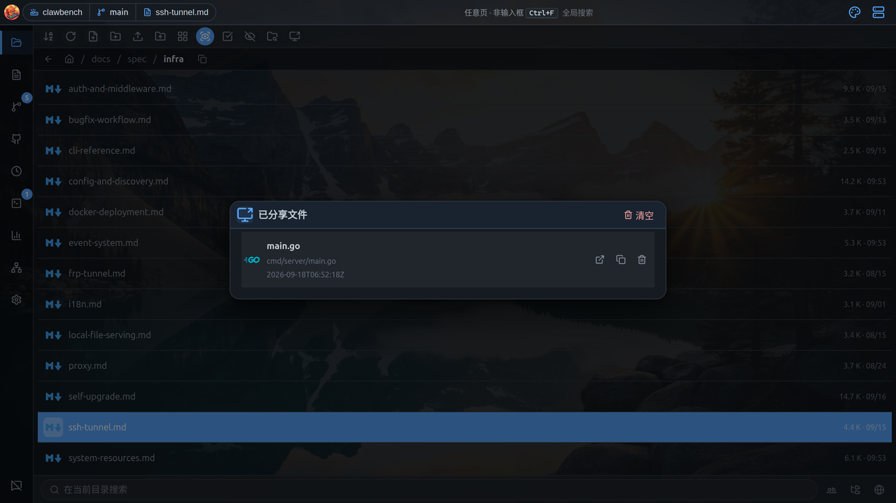

列出所有正在分享的文件，每项显示文件名、路径与创建时间，并提供：

| 操作 | 说明 |
|---|---|
| **打开外部链接** | 在新标签页打开分享页 |
| **复制链接** | 复制该文件的分享链接 |
| **取消分享** | 撤销这一条分享 |
| **清空**（顶部） | 一次性撤销全部分享 |

> **注意**：重新生成链接或关闭分享后，**旧链接立即失效**，已经拿到旧链接的人将无法再访问。
