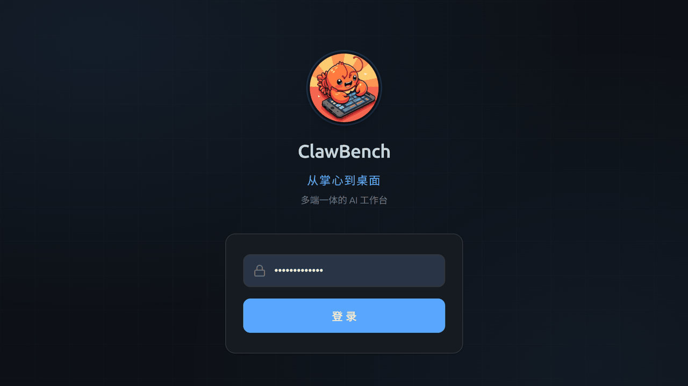
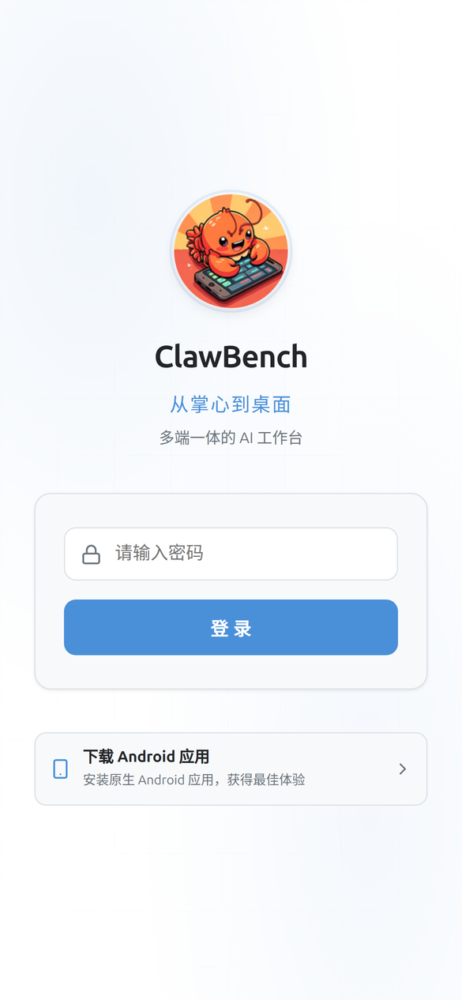
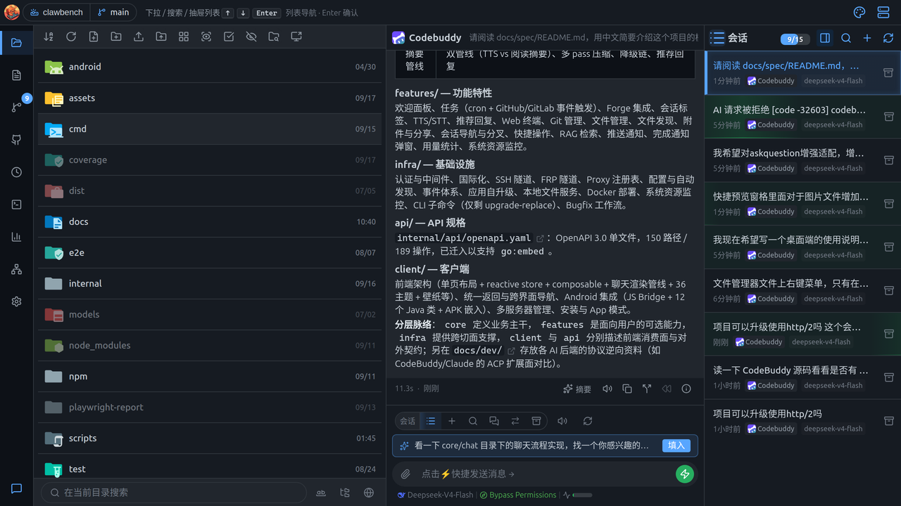
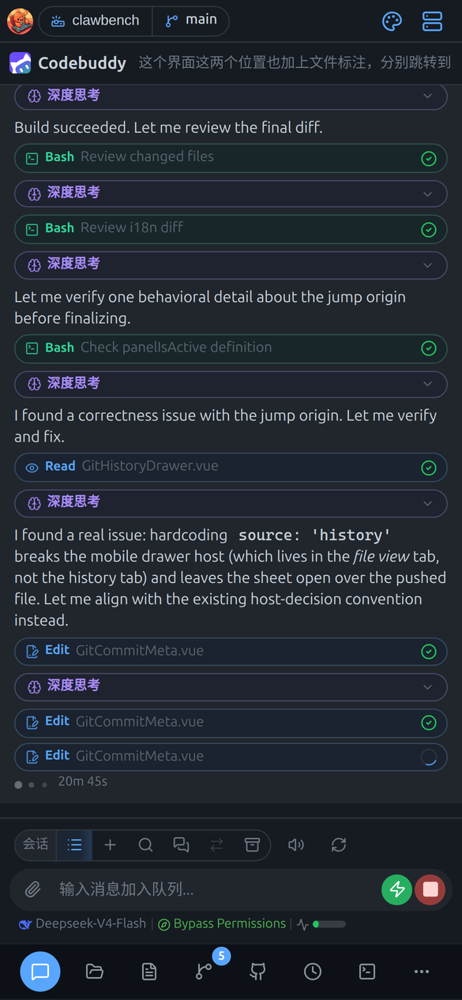
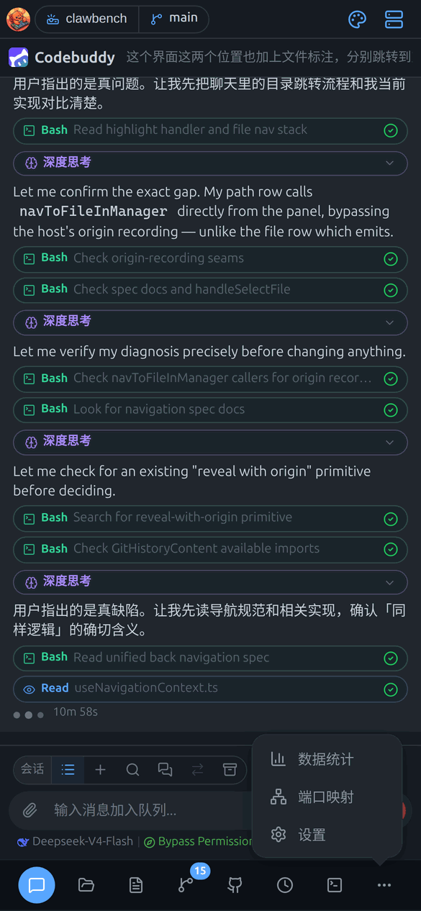
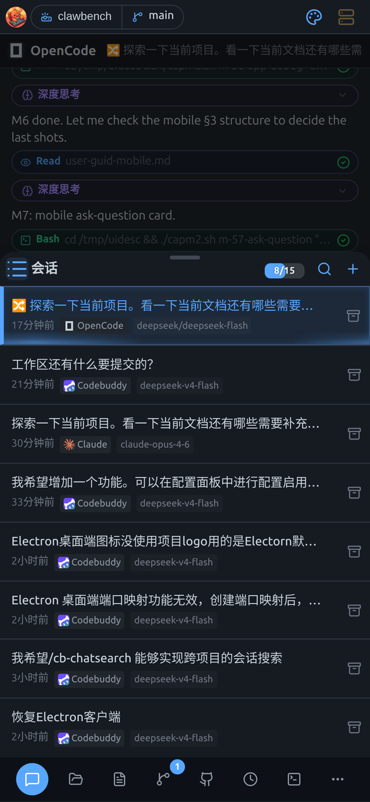
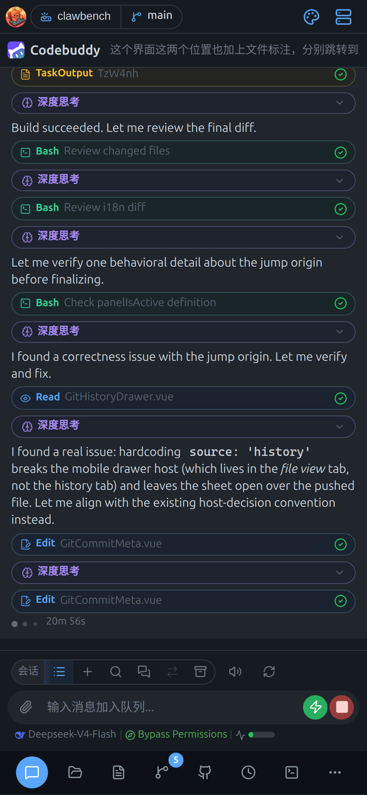
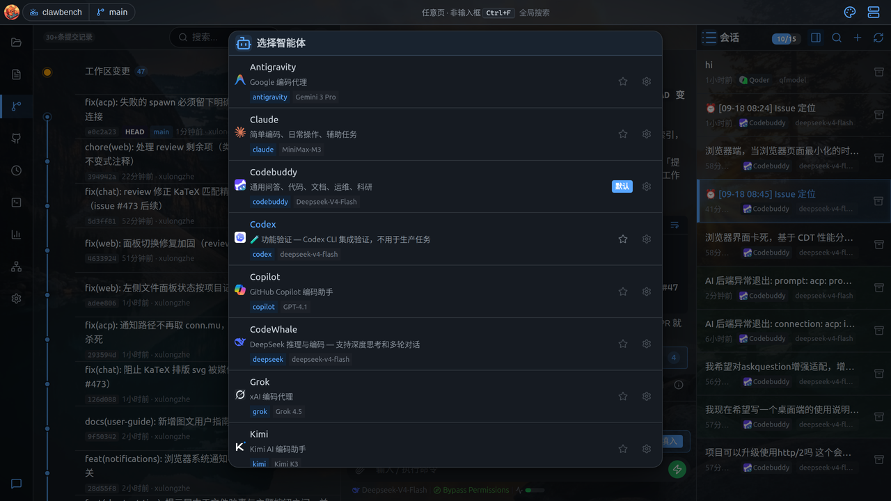
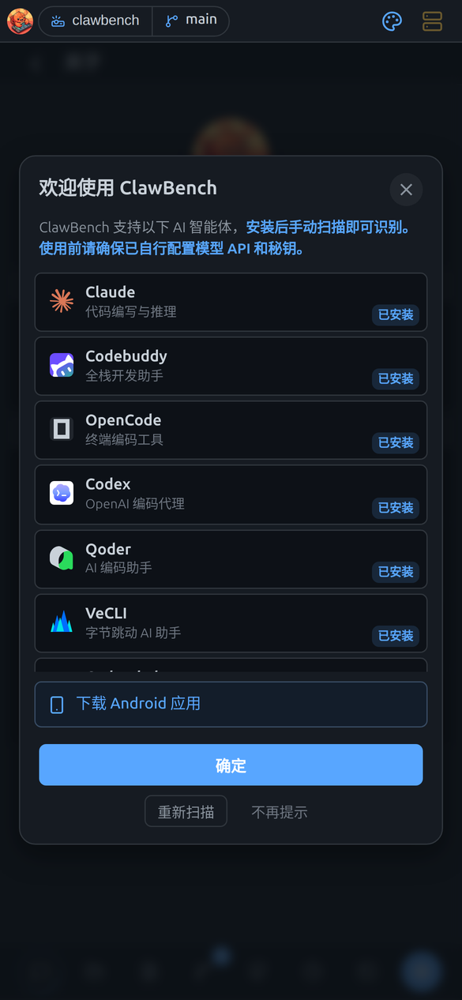

# 快速上手

> 本文同时适用于桌面端与移动端；两端差异处用 **桌面端** / **移动端** 标注。

从打开 ClawBench 到发出第一条消息：登录、选项目、认界面、开聊。

## 1. 登录

打开 ClawBench 的第一步：输入访问密码，验证身份后进入工作台。

在浏览器打开你的 ClawBench 地址（**桌面端**默认 `https://<主机>:20000`；**移动端**如 `https://your-server:20000`），输入访问密码即可。

页面构成：

- **品牌区**：Logo、产品名、标语「从掌心到桌面」、副标题「多端一体的 AI 工作台」
- **密码输入框**：服务端设置的访问密码
- **「登录」按钮**：提交后写入登录 Cookie
- **多服务器列表**（仅 Android App 模式且已保存 ≥2 个服务器时出现）：可在多个已保存的服务器之间切换，或删除某个服务器

密码在服务端配置文件 `~/.clawbench/config/config.yaml` 的 `password` 字段，由部署者设置。登录态通过 Cookie 保持；若你使用多个 ClawBench 实例，各实例登录态互相隔离，可同时登录。

登录态维持方式：

- **桌面端**：通过 Cookie 保持登录态。
- **移动端（网页模式）**：浏览器会记住登录状态（Cookie 有效期 7 天）。过期后任意请求返回 401，页面会自动跳回登录页重新认证，无需手动清理。
- **移动端（App 模式）**：首次连接服务器后凭据保存在本地，之后自动登录，不必每次输密码。

> **提示**：服务端默认使用 HTTPS。若浏览器提示证书不受信任（自签证书），首次访问时手动信任即可。

> **提示**：手机浏览器推荐用 **Chrome**。它可以把这个页面**安装到主屏幕**，之后从桌面图标打开就是全屏无地址栏的体验，接近原生 App。详见移动端指南的「PWA 安装与 APK 下载」。

## 2. 选择项目

项目就是服务器上的一个目录，切换项目等于切换整套工作环境（会话、任务、Git、文件都跟着变）。

ClawBench 的一切操作都围绕「项目」展开——项目就是服务器上的一个目录。**桌面端**点击顶栏的项目名称可切换或新增项目；**移动端**点顶栏左侧的项目名展开下拉。

- 每个项目独立维护自己的**会话列表、任务、Git 状态、文件树**。
- 切换项目时，当前项目的聊天输入草稿会被保留，切回来时自动恢复。
- 项目路径必须位于服务器可访问的文件系统内。不在列表里的目录可通过「打开目录」手动指定路径添加。
- 最近打开的项目会出现在项目下拉面板中，可单独移除。
- **移动端**：下拉中的「新建项目」输入服务器上的**绝对路径**把该目录加为项目；条目右侧的移除按钮**仅从列表移除，不动磁盘文件**。
- 切换项目后，会话列表、文件管理器、Git 历史都会跟着切到新项目。

## 3. 界面总览

**桌面端**为宽屏三栏布局；**移动端**为底部 Dock 单栏布局。

### 桌面端：三栏布局

桌面宽屏（视口宽度 ≥ 1024px）下，界面自动切换为**三栏布局**：

| 区域 | 作用 |
|---|---|
| **最左侧竖向图标栏**（Dock） | 切换左侧面板；最底部是「隐藏/显示聊天区域」开关 |
| **左侧内容区** | 当前选中的面板内容（默认是文件管理器） |
| **中间聊天区** | 与 AI 的对话；这是你花时间最多的地方 |
| **右侧会话侧栏** | 当前项目的会话列表（固定 280px 宽） |

Dock 的九个页签，从上到下：

| 图标位置 | 页签 | 作用 |
|---|---|---|
| 1 | **文件管理器** | 浏览/操作项目文件（默认打开） |
| 2 | **文件** | 文件查看器（双击文件后在此打开） |
| 3 | **项目历史** | Git 提交历史、分支、标签、工作树 |
| 4 | **议题与合并请求** | GitHub/GitLab 集成（Forge） |
| 5 | **任务** | 定时任务与事件任务 |
| 6 | **终端** | Web 终端 |
| 7 | **数据统计** | 用量统计、代码存量、代码增量 |
| 8 | **端口映射** | SSH 隧道端口转发 |
| 9 | **设置** | 全部配置项 |
| 底部 | **隐藏/显示聊天区域** | 把聊天区折叠，左栏占满宽度 |

**调整左右分栏宽度**：把鼠标移到左侧内容区与聊天区之间的分隔条上，光标变为左右箭头后拖动即可。比例会被记住。

> **提示**：Dock 页签的角标会提示待处理事项（如 Git 有未提交变更、Forge 有未读动态、任务有未读执行）。点击**已激活**的页签会折叠左栏（VS Code 行为），再点一次恢复。

窄屏（窗口宽度 < 1024px）下，三栏收成单栏，Dock 变成底部标签栏。

### 移动端：底部 Dock

手机屏幕窄，所有功能入口都收在底部这一条图标栏里，点图标切换功能。

窄屏下所有功能入口都在**底部 Dock**：

从左到右固定为：

| 位置 | 图标 | 作用 | 角标含义 |
|---|---|---|---|
| 1 | 会话 | AI 对话与会话列表 | 未读消息数 |
| 2 | 文件管理器 | 浏览、预览、编辑文件 | — |
| 3 | 文件 | 当前打开的查看器 | — |
| 4 | 项目历史 | Git 提交、分支、标签、工作树 | 工作区变更数 |
| 5+ | 溢出项 | 见下 | 各项各自计数 |
| 末尾 | 更多 | 溢出菜单（空间不足时出现） | 聚合剩余角标 |

溢出项按固定顺序排列：**议题与合并请求 → 任务 → 终端 → 数据统计 → 端口映射 → 设置**（设置恒定最后，作为「出口」）。

> **注意**：Dock 图标上的角标是**未读/待处理提示**。点开对应页签后角标会清零。

### 移动端：溢出菜单

手机屏幕窄，Dock 放不下全部页签时，多出来的会收进「更多」按钮：

点「更多」弹出菜单，选择要去的页签。当前激活的页签如果在溢出菜单里，按钮会高亮。

### 移动端：全屏面板与二级抽屉

这一点与桌面端差别很大，值得先说清：

- **主面板是占满全屏的**。点 Dock 上的页签，对应的面板会**铺满整个屏幕**（顶部标题栏 + 内容区 + 底部 Dock）。它不是从底部弹出的抽屉。
- **抽屉（BottomSheet）只用于二级内容**。比如会话搜索、附件选择、工具调用详情、目录 TOC、按键配置——这些从底部滑出，带一个拖拽手柄，**点顶部标题或下滑即可关闭**。

所以你的操作模式是：**Dock 切主功能 → 主面板里点按钮开抽屉**。

下例是会话列表从底部滑出的二级抽屉（顶部带拖拽手柄，点标题或下滑即可关闭）：

## 4. 发起第一次对话

从零开始：新建会话、选智能体、输入需求、看 AI 流式回复。

**桌面端**：

1. 点击会话侧栏顶部的 **「+」**（新建会话）；
2. 在弹窗中**选择智能体**；
3. 在底部输入框输入你的需求，按 `Enter` 发送（`Shift+Enter` 换行）。

**移动端**：进入「会话」页签，底部输入框输入需求，点发送：

- 输入框在**屏幕最底部**，紧贴 Dock 上方，单手可及
- 键盘弹出时输入框会自动上推，不会被键盘遮住
- 发送后 AI 的回复以流式方式逐字显示
- 聊天区顶部显示**当前智能体图标 + 会话标题**，点标题可重命名

> **提示**：还没有会话时，输入框上方会有「新建会话」入口，会先让你选智能体。

AI 会以流式方式回复，你可以实时看到它的思考过程与工具调用。

### 4.1 选择智能体

弹窗里挑用哪个 AI CLI 来干活，可以设为默认。

弹窗列出服务端已安装的全部 AI CLI。每个智能体卡片显示：图标、名称、一句话定位、标识名、默认模型。

- 带「**默认**」标记的是当前默认智能体，新建会话时优先选中它
- 卡片右侧按钮可**设为默认**或进入**配置页**
- 若列表为空，说明服务端未安装任何 CLI，需先在「设置 → 智能体」中重新扫描

**移动端**新建会话时会先弹出**智能体选择器**，选择用哪个 AI CLI：

首次打开时会先看到**欢迎界面**，自动扫描服务器上已安装的 AI 智能体：

### 4.2 切换项目

从顶栏项目下拉切换或新增项目，也能看到最近打开的文件。

点顶栏的项目名展开下拉，包含：

- **项目列表**：每个项目显示名称、路径与角标（会话数等）
- **最近文件**：当前项目最近打开的文件，点击直接打开
- **快捷操作**：任务页搜索、全局搜索等
