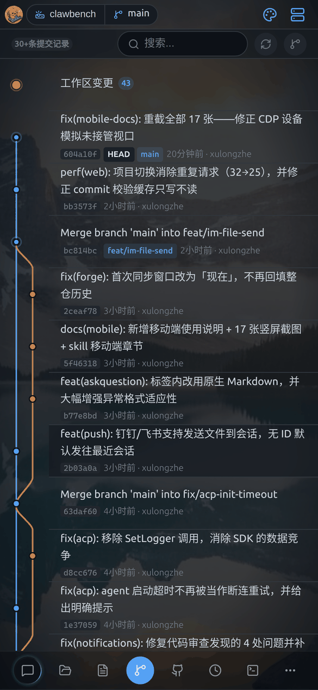
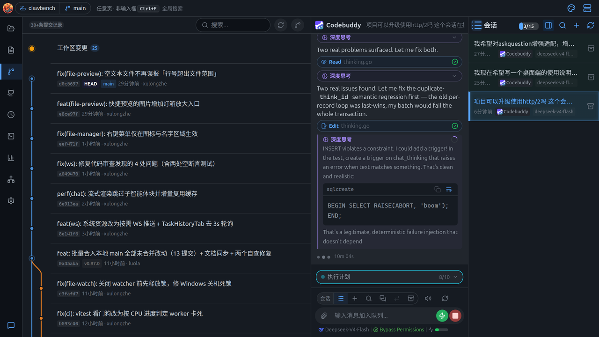
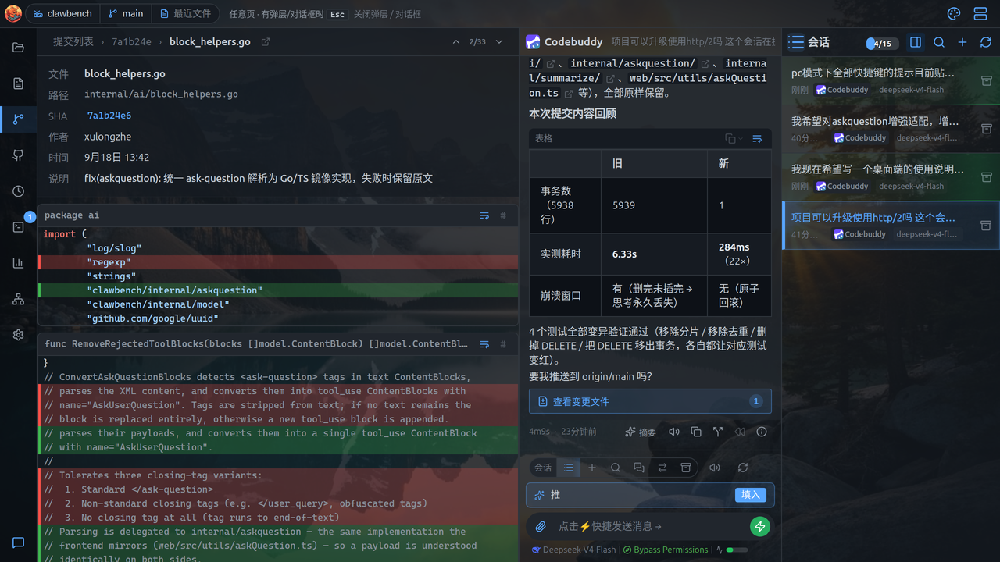
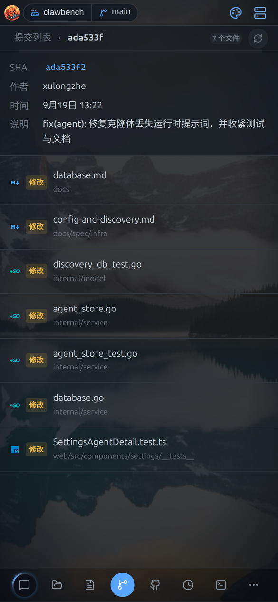
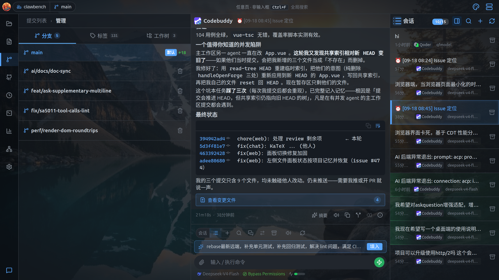
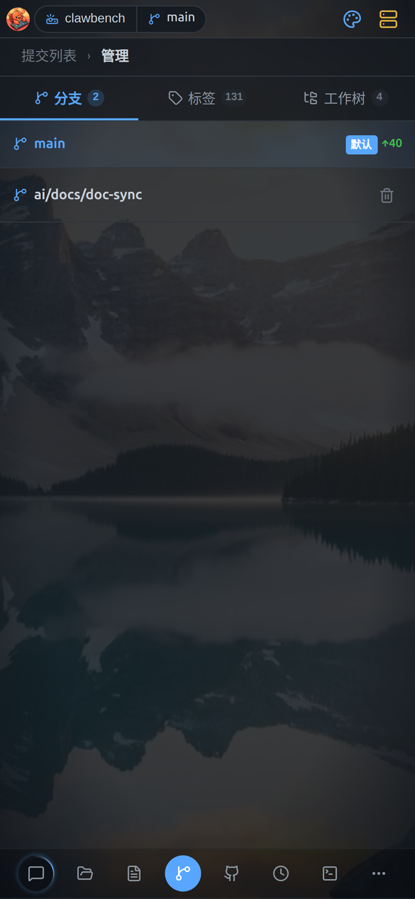
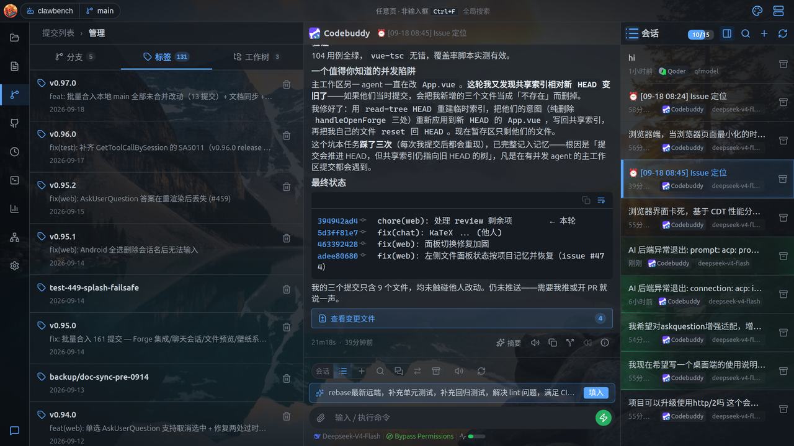
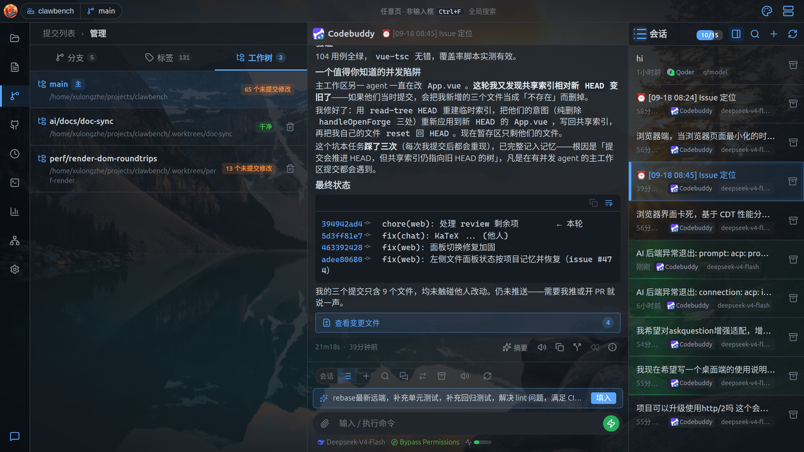
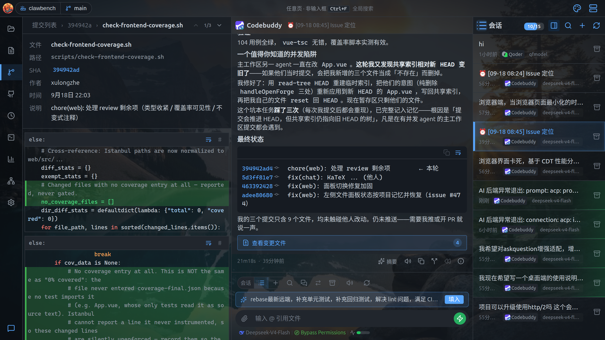
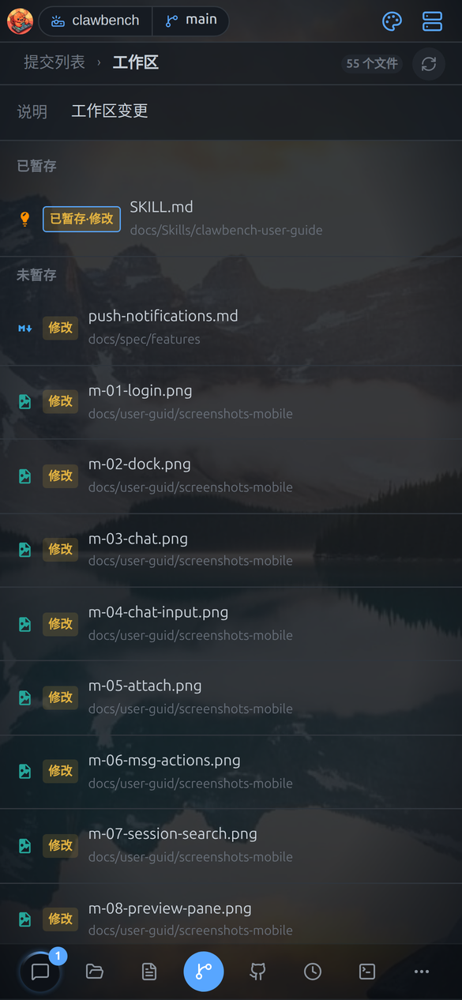

# Git 管理

查看当前项目的提交历史、分支、标签、工作树和未提交改动。

> 本文同时适用于桌面端与移动端；两端差异处用 **桌面端** / **移动端** 标注。

**桌面端**从左侧 Dock 的「项目历史」图标进入 Git 管理；**移动端**在「项目历史」页签中展示当前项目的 Git 状态。

## 提交历史

图形化的提交列表，可搜索，点开能看这次改了哪些文件。

**桌面端**：

- 带图形化的提交列表，显示分支、标签、作者与时间
- 顶部有**搜索框**可按提交信息过滤
- 右上角「刷新」与「管理」按钮
- 滚动到底自动加载更多
- 顶部的**工作区变更**入口列出已暂存 / 未暂存 / 未跟踪的文件（角标显示数量）

**顶栏的分支徽章**是快速入口：点顶栏的分支名弹出分支列表，直接点某一行即切换分支（有未提交改动会先确认），每行右侧的复制按钮可**单独复制分支名**（复制后按钮原地闪一下对勾，避免与「点击切换」混淆——贴到终端或分享给别人时不必先切过去再复制）。列表底部「更多分支」进入完整的管理页。

**移动端**：提交历史为提交列表，点开看 diff；左右滑动可收起 / 展开分支图。

### 提交详情

点任意提交进入详情页：

**桌面端**详情页显示：面包屑（提交列表 › 短 SHA › 文件名）、变更文件计数（如 `2/33 文件`）、文件路径、完整 SHA（点击复制）、作者、时间、提交说明，以及该文件的**代码 diff**（红绿标出增删行）。

提交详情页的**「文件」与「路径」两行可直接点击跳转**：点文件行打开该文件的完整查看器，点路径行在文件管理器中定位到父目录并高亮该文件；两行尾部也有同样的图标按钮便于发现。跳转后按返回会回到 Git 历史（与从聊天跳转文件共用同一套返回栈）。

**移动端**点提交查看详情，显示 SHA / 作者 / 时间 / 文件列表：

## 分支

查看、切换、删除分支，并显示每个分支领先 / 落后多少个提交。

**桌面端**点「管理」进入分支 / 标签 / 工作树管理页：

- 列出全部分支，当前分支高亮
- 显示每个分支的领先 / 落后提交数（`↑n ↓n`）
- 点分支行可切换分支；有未提交改动时会弹出 stash / 强制切换确认框
- 分支行右侧可删除分支

**移动端**「管理」为工具栏按钮，内含**分支 / 标签 / 工作树**三个标签页：

- 分支：查看、切换、删除

## 标签

列出所有 Git 标签，可以删除。

**桌面端**：

列出全部标签，显示标签名、附注信息与日期。可删除标签。

**移动端**：标签页签支持查看、删除。

## 工作树

列出所有 worktree 及其状态，可删除非主工作树。

**桌面端**：

列出所有 worktree，显示名称、路径与状态徽标（main / dirty / clean / locked / missing）。可删除非主工作树。

**移动端**：工作树页签支持查看、切换、作为项目打开。

## Diff

红绿标出增删行的差异视图，可在文件之间前后切换。

**桌面端**点任意文件打开 diff 抽屉：

- 红绿标出增删行
- 顶部有**上一文件 / 下一文件**导航与计数
- 支持行号定位、hunk 折叠
- 提交详情页可查看提交元信息（SHA 点击复制）

**移动端**：Diff 抽屉用红绿标出增删行，支持左右滑动查看长行。工作区变更按「已暂存 / 未暂存」分组，点文件看 diff：

