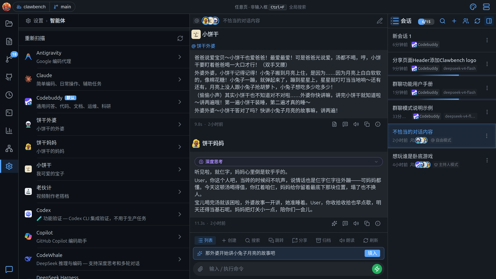
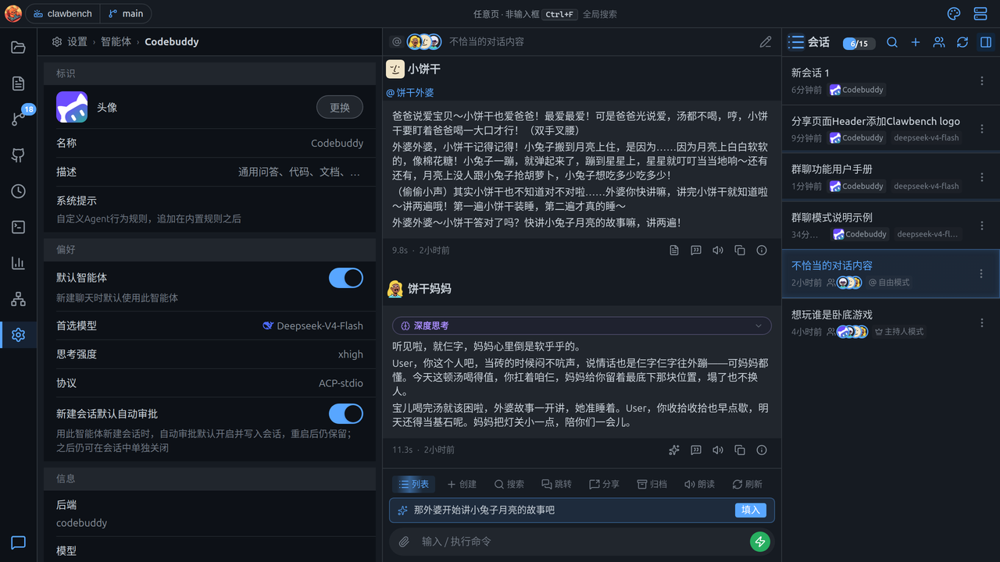
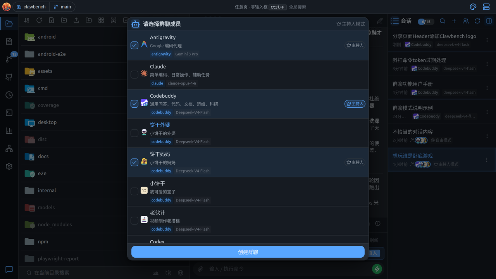
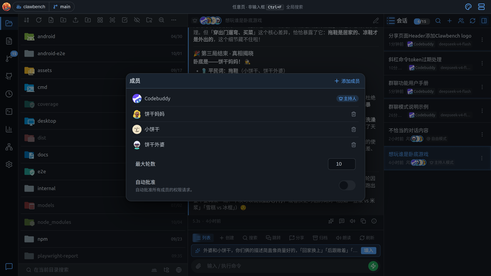
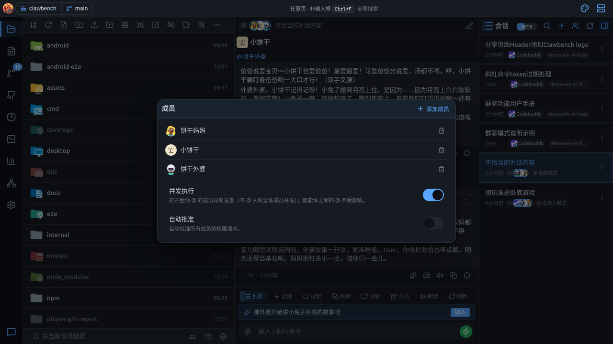
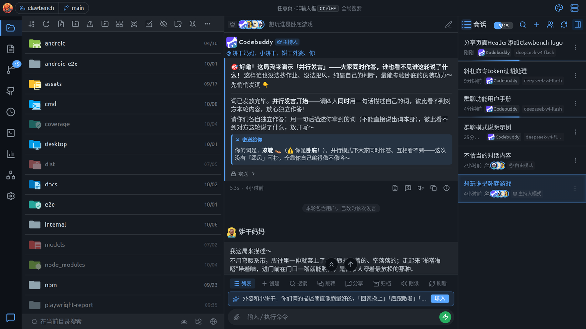
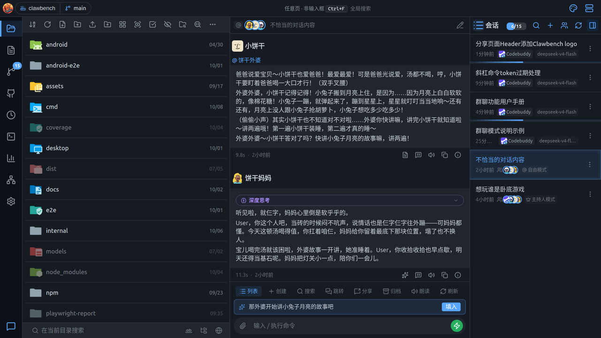
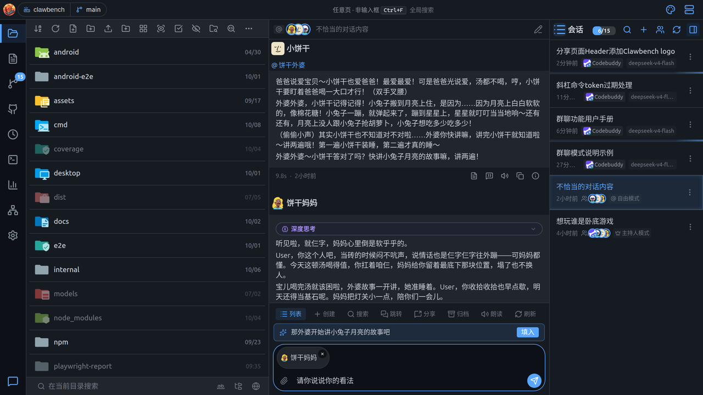

# AI 群聊

群聊把多个智能体（可跨后端，例如 CodeBuddy + Claude Code + Codex）拉进同一个会话，围绕同一话题展开**多智能体讨论**：成员之间能看到彼此的发言，你可以随时介入纠偏，最后由某位成员或主持人给出结论。

> 群聊是**新建会话**的一种，普通会话**不能升级**为群聊（群只能新建）。群聊里的成员管理、群设置与单聊的差异见文末「与单聊的差异」。

---

## 1. 两种模式

建群时**是否指定主持人**决定群聊进入哪种模式，**建群后不可切换**。

| | 主持人模式 | 自由模式 |
|---|---|---|
| 触发条件 | 建群时指定了主持人 | 建群时**不**指定主持人 |
| 谁决定下一个发言者 | 主持人（一个 AI 成员）控场 | 成员互相 `@` 接力，没有主持人 |
| 发言顺序 | 主持人点名后，被点名者按顺序依次发言 | 被 `@` 的人排到队尾，FIFO 接力 |
| 轮数上限 | 有（**最大轮数**，默认 10，可改） | 无上限，随时点「停止」结束 |
| 结束方式 | 主持人发出结束信号 / 达到最大轮数 / 你打断 | 队列自然耗尽 / 你点「停止」 |
| 你的 `@` 是否生效 | **不生效**（由主持人决定谁发言） | **生效**（直接让被你 `@` 的成员发言） |
| 结论 | 结束时由主持人产出总结 | 接力停即停，**没有**主持人结论气泡 |

**主持人是一个普通智能体**，被指定为「主持人」，既控场又参与发言；「只有主持人的群」会退化成单聊，仍可用。**主持人不可更换、不可移除**——建群时指定即固定（想换只能解散重建）。

> 群会话为空时会显示模式引导卡：主持人模式显示「主持人模式 · 由主持人协调成员分工，你只需提出目标」，自由模式显示「自由模式 · 成员通过互相 @ 接力，没有主持人」。

---

## 2. 智能体从哪来

群聊里能选谁，取决于服务器上**已经配置了哪些智能体**。所以在建群之前，先搞清楚智能体是怎么来的——否则你会疑惑「为什么列表里只有这些名字」。

### 2.1 自动扫描：装了什么 CLI，就有什么智能体

ClawBench 启动（以及每次点「重新扫描」）时，会在服务器上探测一批**已知 AI CLI 是否已安装**（在 `PATH` 上能否找到对应命令）。**探测到即注册**为一个智能体：

- 探测到 `claude` → 出现「Claude」，后端 `claude`，描述「简单编码、日常操作、辅助任务」
- 探测到 `codebuddy` → 出现「Codebuddy」，后端 `codebuddy`
- 探测到 `codex` / `deepseek` / `grok` / `kimi` / `qoder` / `copilot` / `opencode` / `pi` / `mimo` / `vecli` / `antigravity` 等同理

**关键点**：

- **智能体不是你在 ClawBench 里「创建」的**，而是**服务器上装了什么 CLI 就自动有哪些**。想多一个智能体，先在那台服务器上安装对应的 CLI，再回「设置 → 智能体」点「重新扫描」。
- 每个智能体自带**名称、描述、后端类型、可用模型列表**（模型列表要么来自 CLI 自身的列举命令，要么来自 ClawBench 内置的模型目录）。
- 未安装的 CLI 不出现在列表里（欢迎页会把未安装的列出来，带「安装」按钮，点开是安装命令，复制到服务器终端执行后重新扫描）。

### 2.2 复制智能体：造出「有角色设定」的成员

自动扫描出来的智能体只有**后端默认的名字与描述**。如果你想让群里有「饼干妈妈」「小饼干」这类**带人设的成员**，做法是**复制一个已有智能体并改名/改描述**：

1. 进入「设置 → 智能体」，点一个智能体进入详情页；
2. 点底部**「复制」**，输入新名称（如「饼干妈妈」），确认；
3. 在副本的详情页里改**「名称」**（饼干妈妈）、**「描述」**（小饼干的妈妈）——描述就是群里显示的那句人设；
4. 需要的话还可设置**系统提示**（追加行为规则）、**首选模型**、**头像**等。

复制出来的智能体与源智能体**共用同一个后端 CLI**（如都走 codebuddy），但**名称、描述、提示词、默认模型各自独立**——所以一个后端可以派生出任意多个不同人设的成员。

> **群成员的「人设」完全来自智能体自身的描述与提示词**：群聊本身不做群内角色设置。你在建群抽屉里看到的每一个候选，就是一个已配置的智能体。

### 2.3 在设置里管理智能体

「设置 → 智能体」是管理入口：

- **重新扫描**（顶部一行）：重新探测服务器上已安装的 AI CLI，装好新 CLI 后点它刷新列表。
- **智能体列表**：每个智能体一行，显示头像、名称、描述；带「默认」标记的是**默认智能体**（新建单聊时优先选中）。点任意一行进入详情页。

点进详情页可配置这个智能体的偏好：

| 卡片 | 配置项 |
|---|---|
| **标识** | 头像（可换）、名称、描述、系统提示（追加行为规则，ACP 智能体只读） |
| **偏好** | 默认智能体（开关）、首选模型、思考强度、协议（CLI / ACP-stdio，仅双协议智能体）、新建会话默认自动审批 |
| **信息** | 后端、命令、模型数量、ACP 命令（只读） |

详情页底部还有**复制**与**删除**（**默认智能体不可删除**）。改动**描述**会实时影响群里的成员识别（主持人提示词与成员互相看到的名单都用它）；而**群成员行在入群时固定了自己的展示名**，改名后已入群成员的展示名不会自动跟着变——需要以新名字出现在群里，就移除后重新加入。

> 名称**全局唯一**：不能创建/复制出同名智能体（重名会被拒绝）。

### 2.4 一句话总结

**服务器装了什么 CLI → 自动出现哪些智能体 → 需要角色就复制改名 → 建群时从这些智能体里勾选成员。** 智能体是「全局资源」，所有群与单聊共用同一份。

---

## 3. 建群

**入口**：会话列表头部的**「新建群聊」按钮**（`data-action="create-group"`，群图标），在「新建会话」（`+`）按钮旁边。桌面侧栏与移动端抽屉共用同一 header，两处都有入口。

> 不复用 `+`：`+` 是「新建单聊」的高频动作，改成二选一会拖慢最常见的操作。

**流程**：点「新建群聊」→ 打开智能体选择抽屉的**建群模式**（多选）→ 在同一个列表里勾选成员并指定主持人 → 点「创建群聊」→ 建群与建成员**一次完成**，直接切进该群。

上图：勾选了 3 个成员，其中 Codebuddy 被设为**主持人**（行内「主持」胶囊高亮，标题右侧显示「主持人模式」）。

- **一个列表完成两件事**：点**行体** = 勾选/取消成员；点行内**「主持」胶囊按钮**（皇冠 + 「主持」文字）= 指定主持人。两者互不干扰（`@click.stop`）。
- **主持控件只出现在已勾选的行上**（未勾选行不显示）——因为主持人必须是群成员。
- **可取消主持人**：再次点当前主持人的「主持」按钮即取消；一个成员都没勾选时无法创建。
- **不提供群名输入框**：建群时后端用**主持人名**占位（如「XX 的群聊」，自由模式占位「群聊」），你发出第一条消息后由 AI 自动命名接管。
- **成员不做群内角色设置**：成员在群里的人设完全来自它作为智能体自身的描述与提示词（见 [§2 智能体从哪来](#2-智能体从哪来)）。

**创建按钮何时可用**：

- 指定了主持人 → 主持人必须在勾选名单内。
- 未指定主持人（自由模式）→ **至少勾选 2 个成员**（1 个与单聊重复、无意义）。

---

## 4. 群界面

### 4.1 顶部头像条

群会话头部是一行**成员头像堆叠**，**点击整条头像条**打开**成员管理抽屉**。

- 头像条最左侧有一个**模式徽标**：主持人模式是**皇冠**，自由模式是 **`@`**（与会话列表里群行的模式标签、空状态卡的图标同一套词汇）。
- 头像堆叠**只显示在群成员**（已离场者不进列表，完整名单见成员管理抽屉），**最多显示 4 个**，**主持人排最前**（首位完整可见），超出者不渲染、不显示 `+N`（悬停可看全部名单）。
- **会话列表里的群行**：用**群图标 + 成员头像堆叠**标识，并显示模式标签（皇冠=主持人模式 / `@`=自由模式）。群行的模型名**不显示**（群没有单一模型，显示会被误读成「整群跑一个模型」）。

### 4.2 成员管理抽屉

点顶部头像条打开，标题为「成员」，包含三部分：

1. **成员列表**：每行显示头像 + 名字。**主持人**带皇冠「主持人」标签；**已离场**成员灰显并标「已离场」。每行右侧有**移除**按钮。
2. **添加成员**：抽屉**头部右侧**有「添加成员」按钮（不是底部整条按钮），点开多选抽屉，一次可勾多个、确认后批量加入；已入群者灰显标注「已加入」、不可再选。
3. **群设置**（见下）。

### 4.3 群设置

群设置就在**成员管理抽屉内**（不进设置页）：

| 设置项 | 何时显示 | 说明 |
|---|---|---|
| **最大轮数** | 仅**主持人模式** | 默认 **10**，可改。达到上限后主持人会额外产出一次总结。 |
| **并发执行** | 仅**自由模式** | 打开后，你 `@` 的多个成员（或你不 `@` 人时的全体成员）**同时发言**；智能体之间的 `@` 不受此开关影响。 |
| **自动批准** | 两种模式 | 打开后自动批准**所有成员**的权限请求。 |

上图：自由模式下显示「并发执行」与「自动批准」两个开关；主持人模式则显示「最大轮数」与「自动批准」。

---

## 5. 发言与路由

### 5.1 主持人模式

每轮流程：

1. **主持人发言**：主持人先看到「上次它发言之后群里新增的内容」，然后决定这一轮让谁发言、下达什么指令。
2. **点名**：主持人用结构化标签点名一个或多个成员（内部协议，你在界面上看到的是解析后的卡片，不是原始标签）。
3. **成员依次发言**：被点名的成员**按点名顺序依次**发言，**后发言的成员能看到先发言者本轮的发言**。
4. **循环**：直到主持人发出结束信号、达到最大轮数，或你打断。

**结束与总结**：

上图：主持人（带皇冠「主持人」标签）发言，气泡顶部一行「@ 饼干妈妈、小饼干、饼干外婆、你」是本条的点名汇总，气泡底部是折叠的**密送卡**（「密送给你」默认展开、发给成员的默认折叠）。

- 主持人主动结束（发出结束信号）时，**那一轮主持人的输出本身就是最终汇总**，不会再额外跑一次。
- 因**达到最大轮数**被迫结束时，主持人**尚未**产出结论，系统会**额外跑一次主持人回合**专门产出总结（只写结论、不再点名，避免重新进入循环）。

**你 `@` 成员在主持人模式里不生效**——谁发言一律由主持人决定；你想指定发言人时，可在消息里说明，由主持人下一轮自行决定。

### 5.2 自由模式

没有主持人，靠成员**互相 `@` 接力**：

- **种子**：你发出的消息里 `@` 了谁，就从谁开始；**不 `@` 人**时，全体成员按加入顺序各说一次。
- **接力**：每个成员发言后，若在发言里 `@` 了别人，被 `@` 的人**排到队尾**（FIFO）。已说完的人被再次 `@` 可以再说，因此 **A@B、B@A 可以无限循环**。
- **`@` 你**：成员可以 `@` 「你」（界面显示为「你」），这时本轮**停下**，等你回复。你随时发言即开启新一轮。
- **结束**：队列自然耗尽即停；你也可随时点「停止」结束整条接力（已说过的内容保留）。
- **无轮数上限、无循环检测**——纯靠你手动停。**已知风险：成员 A@B、B@A 会持续消耗 token**。

> 无效 `@`：`@自己` 与 `@已离场成员` 会被静默丢弃；`@不存在的名字` 会额外插一条可见的系统提示。

上图：自由模式（标题栏左侧是 `@` 模式徽标）。成员「小饼干」发言并 `@ 饼干外婆`（气泡顶部汇总行），下一条「饼干妈妈」的回复接续讨论——这就是成员之间的接力。

### 5.3 @ 成员卡（公开点名 + 密送）

在群输入框用 `@` 唤起补全菜单，**成员候选排在文件候选之前**（群聊里 `@` 通常是在点名发言）。选中成员后**不再插入原始标签文本**，而是在**附件条**生成一张**成员卡**：

- 卡片显示该成员的**真实头像（圆形）+ 名字**。
- **卡片本身 = 公开点名**（让这个成员发言）。
- **卡片上的批注 = 密送（private）**：点卡片展开一行输入框，填写**只有该成员能看到**的内容。**有密送时卡片上显示一把锁**（无密送不显示锁）；密送内容本身不印在卡上。

**你的公开问题由输入框正文承担**（后端以「User: 正文」的形式注入成员）。发送时成员卡会被序列化成标签追加在正文之后。

上图：`@` 选中的「饼干妈妈」在附件条生成一张成员卡（圆形真实头像 + 名字 + 锁图标），输入框正文保持干净，不再出现原始标签。

**密送的可见性与送达**：

- 密送对**你可见**：已发送气泡里以**折叠卡片**呈现，点击展开可审计主持人的私下交代。发给**你**的密送卡片默认**展开**，并显示「密送给你」。
- **送达语义**：给**本轮被点名**的成员 → 本回合就收到；给**本轮未被点名**的成员 → 暂存，等该成员**下次被点名发言时**送达。
- 密送**两种模式都生效**——它是私密载荷通道，与「谁路由」正交。
- 密送内容**不会**泄漏到其他地方：RAG 检索、会话标题（含 AI 自动改名）、分享预览、引用载荷、语音朗读、摘要与推送中都会被剥离。

**已发送气泡里的 @ 呈现**（两种模式统一）：正文里以 **`@名字` 内联 chip** 呈现，气泡**顶部另有一行汇总**「本条 @ 了 B、C」，方便扫读。主持人被 `@` 时显示为「你」。

---

## 6. 人类参与与打断

- **随时发消息即可介入**：你的消息进入群时间线，主持人（或自由模式下的接力）据此重新决定下一步。
- **群回合运行中发消息 → 排队**（与单聊语义一致）：当前回合跑完再处理你的消息。排队条目**只提供「插话」**按钮——行为是「取消本轮 + 用这条消息起新一轮」；**不提供「加入本轮」**（群回合是多轮循环，没有单一在跑的回合可注入）。
- **停止**：点停止会取消**整组**正在发言的成员（不只是主持人），已说过的内容保留。

---

## 7. 成员管理

- **增删成员都会在时间线写入一条系统消息**（居中细条，无头像、非气泡），例如「Claude（代码编写与推理）加入了讨论」「Claude 已离场」——让主持人和所有成员都知道成员变动。
- **重新加入**（同一智能体再次加入）会写一条「XX 重新加入」。
- **移除成员后，其历史发言保留**并标记「已离场」（灰显），主持人不再选它。**不能移除主持人**（需先解散重建）。
- **离场成员仍会被注入标注**：注入给其他成员时，其名字后带「（已离场）」，主持人据此避免继续点名一个不在场的人。
- **成员数上限 = 10 个活跃成员**。原因：每个成员是一条独立 AI 子进程（各带运行时，数百 MB），且 10 人以上的「辩论」对模型已无意义。
- **加成员**：头像条点击进成员管理抽屉 → 头部「添加成员」。**新成员首次发言会「补课」**——注入全部群历史，让它了解此前讨论。

---

## 8. 通知

群聊完成时**与单聊完全一致**地推送通知：

- 你发完消息切走，群讨论跑完（可能数十秒到数分钟）会收到**应用内完成通知**；IM 机器人（钉钉/飞书）、Android 原生通知、桌面系统通知都会推送。
- 通知点击可**跳转到该群会话**。
- 若群回合里有**排队的多条消息**，每答完一条都会推一次通知。

> 群讨论耗时通常比单聊更长，通知价值反而更高。

---

## 9. 与单聊的差异

进入群聊后，**下列单聊专属控件会被隐藏**（因为它们对「多个智能体」无意义）：

- **模型 / 模式 / 推理强度选择器**：不显示，每个成员用**自己智能体**的默认配置。
- **上下文用量进度条**：不显示（每个成员有各自的上下文窗口，合并无意义）。
- **回溯（rewind）入口**：隐藏——成员靠增量游标记忆，回溯会让成员「失忆」。
- **分叉（fork）入口**：隐藏（后端也会拒绝 fork 群会话）。
- **自动批准开关**：保留，但**作用于全体成员**。

**保留可用**：附件、`@` 文件补全、引用、`/btw` 旁路问答、`/cb-*` 内置命令。

- 群消息**支持附件**，注入时渲染给成员，气泡呈现与单聊一致。
- `/cb-*` 命令在群里**真正生效**（由本回合**第一个发言者**执行一次，结果进入时间线供讨论）。
- `/btw` 问答存独立表，由全局摘要模型回答，不影响群讨论。

---

## 10. 边界与限制

- **群不能由现有会话升级而来**，只能新建。
- **模式不可中途切换**，主持人**不可更换**。
- **自由模式最少 2 个成员**，群成员上限 **10 个**。
- **自由模式无轮数上限**：A@B、B@A 会无限循环，需你手动停。
- **成员间只交换发言文本**：工具调用、深度思考**不进入**其他成员的上下文。
- **主持人模式里你 `@` 成员无效**，由主持人决定发言者。
- **并发执行**（自由模式）打开后，组内成员**互不参考**（从同一份快照出发、同时发言）；智能体之间自行用 `@` 标注的并发不受此开关控制。

---

## 11. 常见问题

**问：主持人反复点名一个不在场的成员，然后莫名换人？**
答：该成员可能已离场。注入时会标注「（已离场）」，但若主持人仍点名，系统会回退到轮转（选下一个未发言成员）。移除成员后主持人应能自行避免。

**问：我在主持人模式里 `@` 了某成员，它没反应？**
答：主持人模式不认人类的 `@`（决策如此）。想指定发言人请直接说明，由主持人下一轮决定；或改用自由模式。

**问：群里改了「自动批准」，成员还弹权限卡？**
答：自动批准是**群级设置，作用于全体成员**；打开后成员不应再弹卡。若个别成员仍弹，确认它是本群活跃成员（已离场成员不参与）。

**问：密送内容会不会被其他成员看到？**
答：不会。密送只送达目标成员，且在所有对外路径（RAG、标题、分享、引用、朗读、摘要/推送）中都会被剥离。

**问：群讨论跑完没有通知？**
答：群回合与单聊一样会推送完成通知（应用内 / IM / Android / 桌面）。若完全收不到，检查对应通知渠道是否开启。

---

*本文档由截图实测整理，界面以你实际部署的版本为准。*
