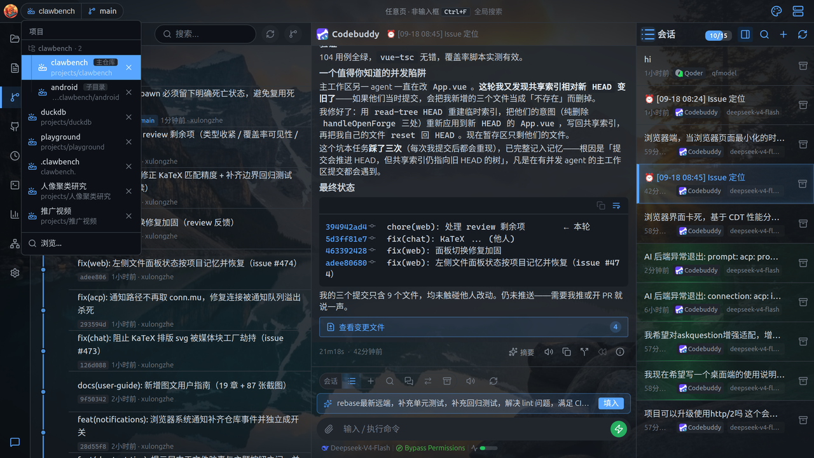
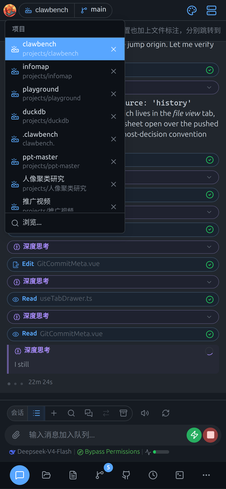

# 多项目与 Worktree

> 本文同时适用于桌面端与移动端；两端差异处用 **桌面端** / **移动端** 标注。

同时处理多个项目或分支：切项目，或把某个工作树当成独立项目打开。

## 1. 多项目概念

ClawBench 的一切操作（会话、文件、Git、任务）都绑定在某个**项目目录**上——项目就是服务器上的一个目录。切换项目等于切换整套工作环境。

- 每个项目独立维护自己的**会话列表、标签、任务、Git 状态、文件树**。
- 顶栏可随时切换项目，各项目的会话、任务、Git 状态完全独立。
- 切换项目时会保留聊天输入草稿，切回来时自动恢复。
- 项目路径必须位于服务器可访问的文件系统内。不在列表里的目录可通过「打开目录」手动指定路径添加。
- 最近打开的项目会出现在项目下拉面板中，可单独移除（仅从列表移除，不动磁盘文件）。
- **移动端**：切换项目不会丢失进行中的会话——它们在服务端继续运行。

## 2. 切换项目

**桌面端**：点顶栏的项目名展开下拉，包含：

- **项目列表**：每个项目显示名称、路径与角标（会话数等）
- **最近文件**：当前项目最近打开的文件，点击直接打开
- **快捷操作**：任务页搜索、全局搜索等

**移动端**：点顶栏左侧的项目名展开下拉：

- **最近项目**：列出你打开过的项目，点一下即切换
- **新建项目**：输入服务器上的绝对路径，把该目录加为项目
- **移除**：条目右侧的移除按钮（仅从列表移除，不动磁盘文件）

切换项目后，会话列表、文件管理器、Git 历史都会跟着切到新项目。

## 3. Worktree 作为独立项目

对需要隔离的开发工作，用 Git 面板的 **Worktree** 功能创建独立工作区，避免污染主目录。

在「项目历史 → 管理 → 工作树」里，可以把某个工作树**作为独立项目打开**。这意味着该 worktree 有自己独立的会话列表、标签、文件浏览位置，与主项目完全隔离。可以同时在多个 worktree 对应的项目间切换，并行处理不同分支上的任务。

## 4. Worktree 路径标注

在多 worktree 环境下，聊天中出现的其他 worktree 路径会被自动识别并标注（显示为蓝色可点击文字），点击可直接跳转到该 worktree 下的文件。标注优先级高于普通文件路径标注，避免 worktree 路径被误匹配为子路径。

## 5. 跨项目会话

**桌面端**：其他项目的会话会出现在会话列表的跨项目分组中，点击直接跳转（注意跳转后是在**那个项目**的上下文中对话）。
