# 会话管理

> 本文同时适用于桌面端与移动端；两端差异处用 **桌面端** / **移动端** 标注。

会话的增删改查：列表、搜索、标签、分叉回溯，以及把一段对话分享给别人。

## 会话列表与侧栏

列出当前项目的会话，并提供新建、搜索、刷新入口。列表按项目隔离——**每个项目有自己的会话集合**。

### 桌面端：会话侧栏

右侧固定那一列，列出当前项目的会话。

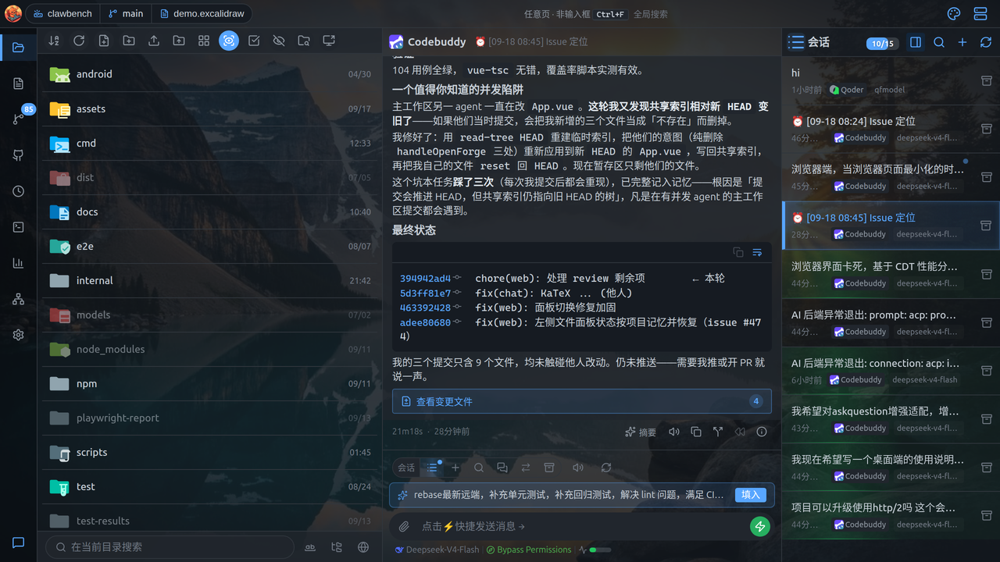

侧栏头部（从左到右）：

| 按钮 | 作用 |
|---|---|
| **取消固定** | 把侧栏从常驻改为抽屉模式 |
| **会话搜索** | 打开搜索抽屉 |
| **新建会话** | 新建（需先选智能体） |
| **刷新** | 重新拉取会话列表 |

侧栏顶部还有一条**会话计数进度条**，显示当前会话数 / 上限。

每个会话项显示：标题、相对时间、使用的智能体与模型、标签；有未读时显示角标，运行中显示竖线。

**会话项交互**：

- **单击**：切换会话
- **行尾「⋮」按钮**：打开菜单（置顶 / 取消置顶、重命名、设置标签、分享会话、归档、移除）
- **悬停**：出现归档按钮

**重命名**：聊天区标题栏右侧的铅笔按钮、或 `⋮` 菜单里的「重命名」都能打开重命名对话框。对话框里的**自动生成**按钮会把该会话的全部用户消息交给 AI 摘要模型，总结成一个候选标题回填输入框供你确认（改完再点确定）。该按钮**只在你配置过摘要模型（`ai_summary.*`）时才出现**；未配置、会话还没有用户消息、或模型调用失败都会给出明确提示，不会静默无反应。自动生成只读不写库——确认后仍走原有的重命名保存路径。

> **会话菜单只在「⋮」按钮上**：桌面端与移动端统一——行体不响应右键、也不响应长按。移动端长按会由浏览器合成系统选择菜单（这是系统划词菜单的来源），一旦给行绑右键就会连带把长按菜单带回来，还会压掉长按选词。菜单入口收敛到 `⋮` 一个手势，各端完全一致。

> **归档 vs 移除**：归档是**单向**的软隐藏；移除会把会话从数据库**物理删除**（消息、工具调用、摘要、标签关联、分享链接一并清除，用量台账保留）——会先取消正在运行的会话、清空其排队消息，运行中时确认框会额外提示。CLI 自己的磁盘转录文件保持原样，可从外部恢复区重新载入。

侧栏底部是**跨项目会话分组**，列出其他项目的会话，点击可直接跳转。**桌面端**侧栏顶部有一个「**本项目 / 其他项目**」页签切换（其他项目页签带数量角标），用来在两种视图间快速切换；当最后一个活跃会话消失时视图会自动切回本项目。

### 移动端：会话列表

「会话」页签内含会话列表与当前对话。

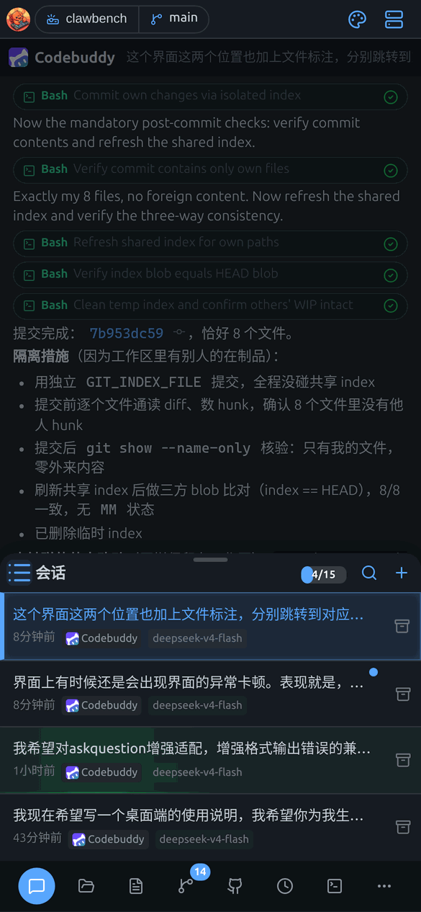

每条会话显示标题、智能体图标、运行状态、未读标记。点**行尾「⋮」按钮**弹出操作菜单：

- 置顶 / 取消置顶
- 重命名
- 设置标签
- 分享会话
- 归档
- **移除**（危险操作：物理删除会话）

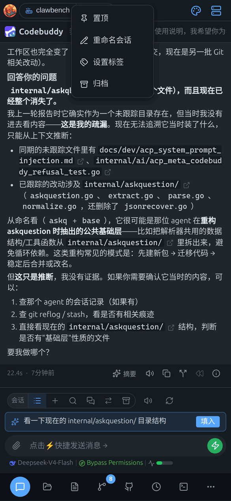

> **菜单入口是「⋮」按钮，不是长按**：手机长按会由系统合成划词菜单，与长按菜单冲突，因此会话行不响应长按——统一点行尾的「⋮」打开菜单（桌面端同样如此）。

> **注意**：归档是**单向**的，归档后不能从界面取消归档。
>
> **归档 vs 移除**：归档是软隐藏；移除会把会话从数据库**物理删除**——会先取消正在运行的会话、清空排队消息，运行中时确认框会额外提示。CLI 自己的磁盘转录文件保持原样，可从外部恢复区重新载入。

## 会话搜索

用关键词或语义搜索历史会话。

### 桌面端

点侧栏头部的搜索按钮打开搜索抽屉，带归档、排序、时间等筛选。

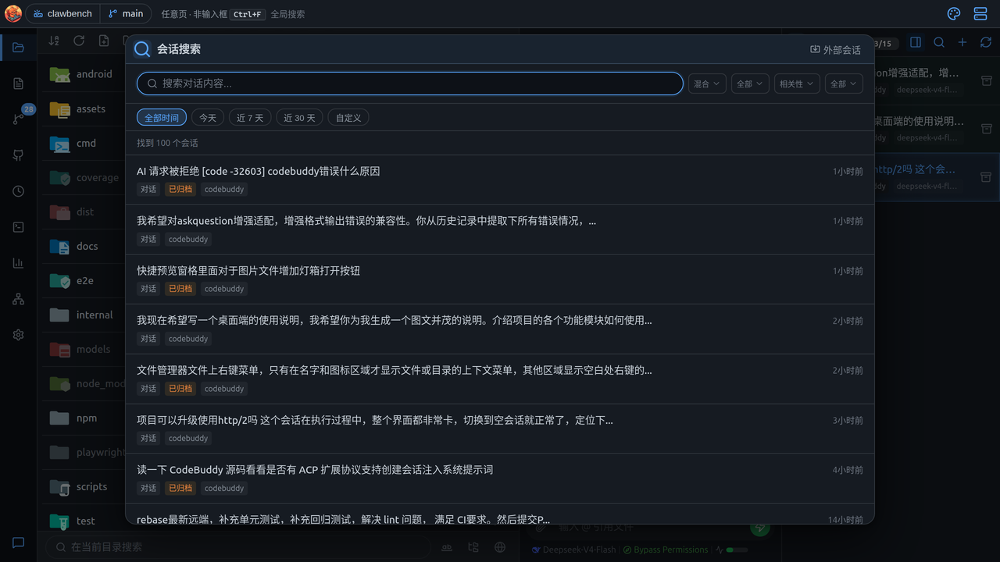

| 筛选项 | 可选值 |
|---|---|
| **搜索模式** | 混合 / 全文 |
| **归档状态** | 全部 / 未归档 / 已归档 |
| **排序** | 相关性 / 最新 / 最早 |
| **类型** | 全部 / 对话 / 任务 |
| **时间** | 全部 / 今天 / 近 7 天 / 近 30 天 / 自定义 |

结果项显示标题、摘要、类型标签、标签与时间。点击进入详情页，可继续对话或删除。

### 移动端

点输入栏的「搜索会话」按钮，从底部弹出搜索抽屉，直接跳到命中的那条消息。

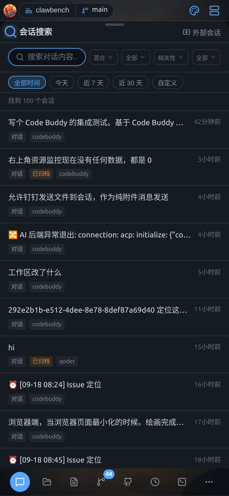

支持**混合检索**（关键词 + 语义向量），可按会话范围（当前项目 / 外部 / 全部）、匹配方式、时间范围筛选。结果里会高亮命中的片段，点击直接跳到对应消息。

搜索**同时按会话名称与消息内容**匹配：按名字命中的会话排在内容命中之前，并带「名称匹配」徽标、标题内命中片段高亮——你手动改过的标题也能这样找回。

> **推荐回复上下文数量**：在设置 → 聊天中可配置「推荐回复上下文条数」，该数值控制生成推荐回复时参考的最近消息轮数。值越大推荐内容越丰富，设为 0 则关闭推荐回复。

## 会话标签

给会话贴自定义分类标签，之后按标签筛选，方便归类。标签显示在会话条目的**最底部一行**，颜色按标签名哈希映射到统一调色板，因此同一标签在任何地方颜色都一致。

### 设置标签

在会话条目上**右键 → 设置标签**（**移动端**：长按菜单 → 设置标签），打开标签弹窗：

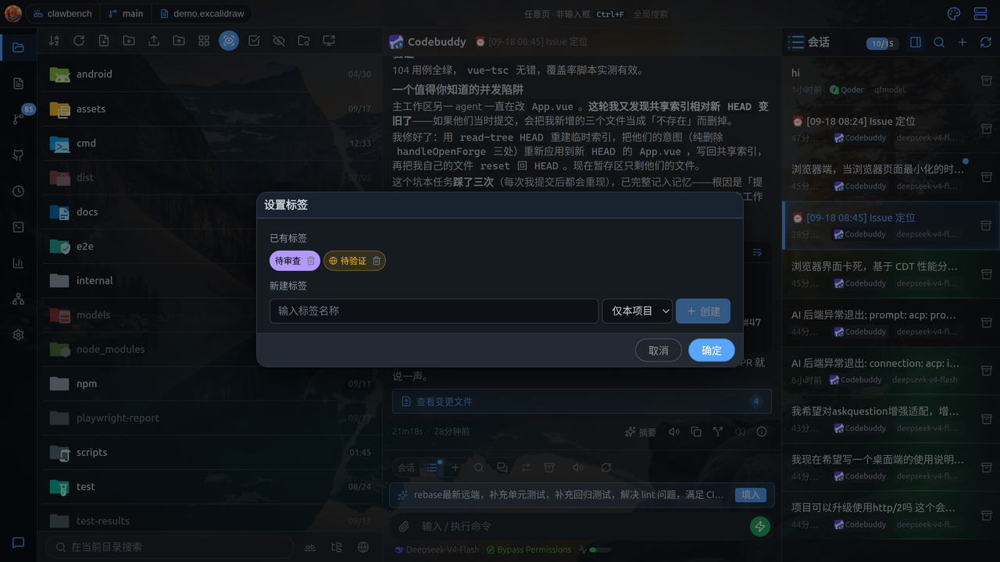

弹窗分两块：

**已有标签**：列出全部候选标签（全局标签 + 当前项目的标签）。点标签卡片即可**选中 / 取消**，支持多选。已选中的卡片有高亮边框。

**新建标签**：输入名称后点「+ 创建」。创建前需选择作用范围：

| 范围 | 含义 |
|---|---|
| **仅本项目** | 标签只在当前项目内可见、可用（默认） |
| **全局** | 标签在所有项目中都可见、可用 |

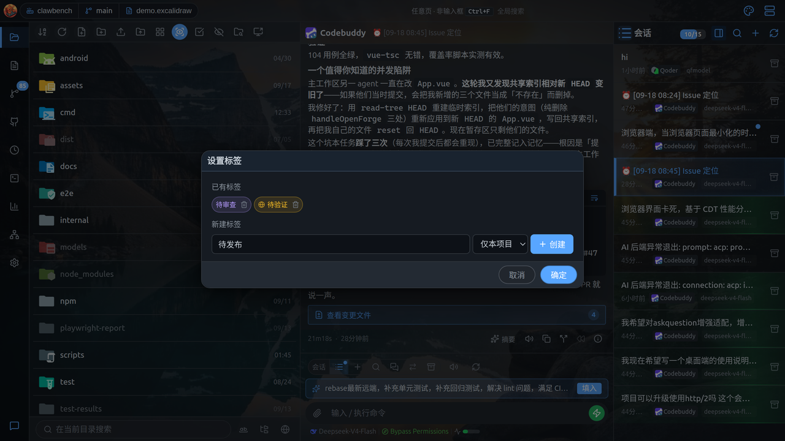

**桌面端**改完点底部**确定**保存，**取消**放弃。

标签名会自动去除首尾空白并转为小写，因此 `Bug` 与 `bug` 是同一个标签。

**移动端**弹窗形态：

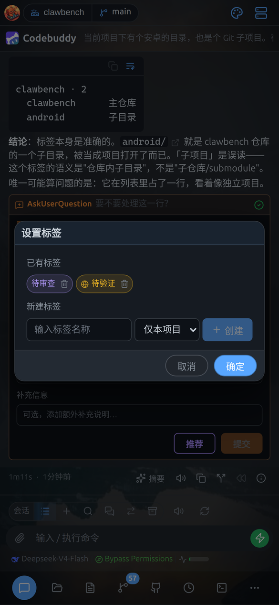

### 标签作用范围

说明「仅本项目」和「全局」两种标签的区别与适用场景。

| 范围 | 可见性 | 适用场景 |
|---|---|---|
| **项目内** | 仅当前项目 | 与某个项目强相关的分类，如「待发布」「重构中」 |
| **全局** | 所有项目 | 跨项目通用的分类，如「待验证」「重要」 |

**项目隔离**：不同项目可以有同名标签，互不影响。例如 A 项目的「bug」和 B 项目的「bug」是两个独立标签，各自维护自己的颜色与关联会话。

> **提示**：把标签从项目内改成全局**不会**自动发生——标签的范围只在创建时确定。给会话重新打标签时，已存在标签会保留原有范围。

> **项目标签 vs 全局标签**：项目标签只在本项目内可见，适用于仅属于该项目的分类；全局标签在所有项目中共享，适用于跨项目的通用分类（如「重要」「跟进中」）。两者可同时使用，互不干扰。

### 标签过滤栏

会话列表上方那一行标签按钮，点一下就只看这类会话。

只要当前项目里有**正在使用**的标签，会话列表上方就会出现一条横向的标签过滤栏：

- **只列出当前项目实际在用的标签**（避免出现点了必然为空的选项），并显示每个标签下的会话数
- **点击标签筛选**，再点一次取消筛选
- 筛选在服务端完成，因此分页加载的会话也能被正确筛出（不会出现「明明有匹配却要滚很久才出现」）
- 当前项目没有在用标签时，整条过滤栏隐藏
- 跨项目会话分组**不显示**标签行，也不参与标签筛选

### 删除标签

在标签弹窗中，把鼠标移到标签卡片上，点出现的**删除按钮**即可删除该标签本身（同时解除它与所有会话的关联）。

> **注意**：删除标签是按**范围**精确删除的。若同名标签同时存在「全局」和「项目内」两条，删除时只会删掉你所见的那个范围，不会误删另一个。

## 左右滑动切换会话

> **移动端**功能。

在对话区域**左右滑动**可快速切换上/下一个会话，滑动时屏幕中央显示会话位置指示器。

> **注意**：这个功能**默认关闭**，需要先在 **设置 → 聊天** 里打开「滑动切换会话」。开启后左滑=下一个、右滑=上一个（阈值 80px、500ms 内完成）。

## 分叉与回溯

从某条消息另起一个新方向，或退回某条消息重来。

- **分叉**：从某条消息创建对话分支，原会话不受影响。分叉会带上压缩后的上下文（预算可在设置中调整）。**移动端**：从某条消息开新会话，保留该消息之前的全部上下文，适合「换个方向再问」。
- **回溯（Rewind）**：把会话截断到某条消息处并重启 AI 会话，用于「走错路了重来」。回溯会同时清空计划面板。**移动端**：回到某条消息时的状态，之后的消息被丢弃，适合「刚才答得不对，重来」。
- **续接**：在已有会话基础上开新会话，标题会带时间戳前缀。

**分叉在会话列表中会折叠到锚点行下**：一个分叉会话不会作为独立条目平铺，而是收在它**分叉来源**那一行的下方，带缩进与树状连接线，可点锚点行的「**N 个分叉**」开关收起或展开（默认展开，方便你看到刚建的分叉）。**分叉的分叉**（第二代及以后）会额外显示「**第 N 代**」小徽标——缩进与树线只能表达层级，说不清它到底是第几代。跨项目分组里同样如此。

**移动端**：分叉与回溯都在消息操作条里，也支持从会话「⋮」菜单进入。

## 会话分享

> **桌面端**功能。

把一段对话生成公开只读链接，发给别人看——对方不需要登录，也不需要装 ClawBench。

### 生成分享

有两个入口，都打开同一个「分享会话」弹窗：

- 会话列表项上**右键 → 分享会话**
- 聊天输入栏上方的**分享**按钮（会话为空时不可点）

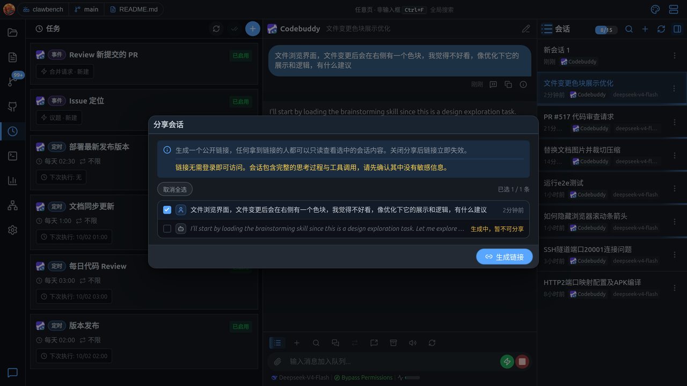

弹窗里：

| 元素 | 说明 |
|---|---|
| **说明与安全提示** | 顶部提示链接公开可读，以及「会话包含完整的思考过程与工具调用，请先确认没有敏感信息」 |
| **消息列表** | 逐条列出可勾选的消息，显示角色、摘要与时间 |
| **全选 / 取消全选** | 一键勾选，右侧显示「已选 N / M 条」 |
| **生成链接** | 至少选中一条才能点 |

**正在生成回复的消息不能分享**：列表里这类条目会显示「生成中，暂不可分享」并禁用勾选——半截的回复分享出去会误导读者。

**链接生成后**，弹窗顶部出现链接栏，右侧两个按钮分别是**复制**与**重新生成**：

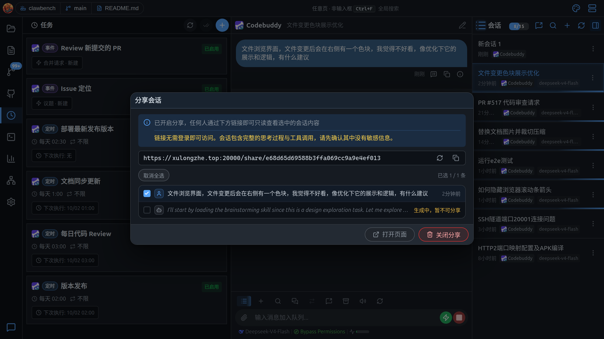

> **重新生成会让旧链接立即失效**，确认前会再问一次。底部按钮同时变为「打开页面」与「关闭分享」。

### 分享页

分享页（`/share/{token}`）是一个独立的只读页面，不需要登录：

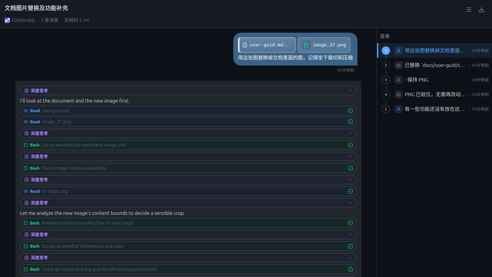

- 顶部是会话标题与副标题（智能体、消息数、总耗时）
- 右上角可切换**目录**（按消息生成的跳转目录）与**导出 JSON**
- 正文保留完整的思考过程、工具调用与附件引用，但**没有任何操作入口**（不能回复、不能改）

### 管理已分享会话

只要当前项目存在分享，会话侧栏头部就会出现「已分享会话」按钮，点开是管理抽屉：

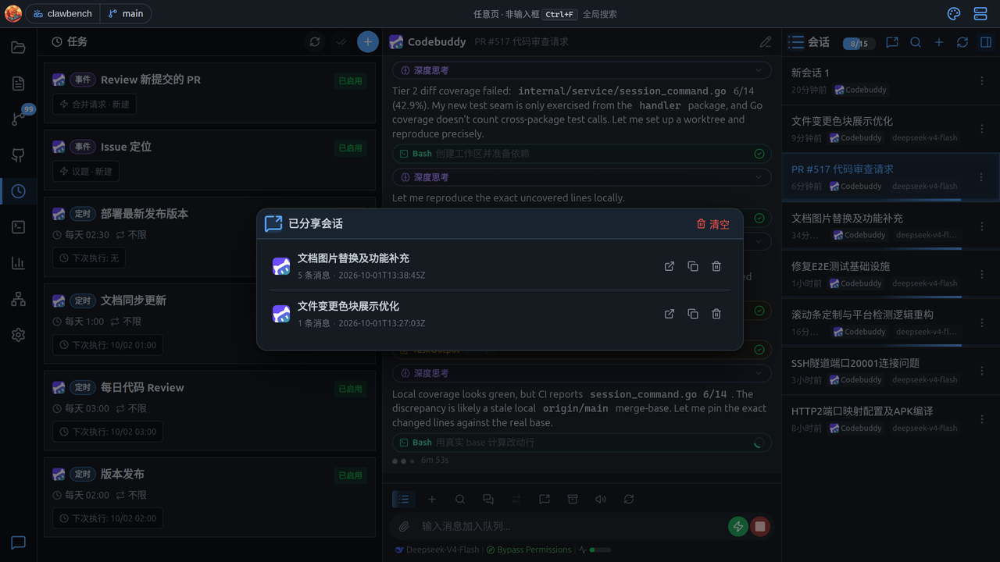

| 操作 | 说明 |
|---|---|
| **打开** | 在新标签页打开该分享链接 |
| **复制链接** | 复制公开链接 |
| **删除** | 撤销这一条分享，链接立即失效 |
| **清空** | 撤销本项目的全部分享 |

### 分享语义与安全

> **分享是快照，不是实时镜像**：链接里冻结的是**生成那一刻**的消息内容。之后你在会话里继续对话，分享页不会跟着变；要更新内容就重新生成一次链接。

> **归档不影响分享**：会话被归档后链接依然有效（因为内容是冻结的副本），仍可在「已分享会话」抽屉里撤销。

> **分享是公开的**：任何拿到链接的人都能只读访问，服务端不做登录校验，**token 本身就是凭证**。分享前请确认会话里没有密码、密钥或私人数据。
