# 设置

> 本文同时适用于桌面端与移动端；两端差异处用 **桌面端** / **移动端** 标注。

设置是所有配置项的入口，按分类排列。左侧 Dock 最后一个图标进入设置；**移动端**「设置」页签是分类首页，点任意分类进入子页。设置首页按两列列出 16 个分类，以下逐类说明。

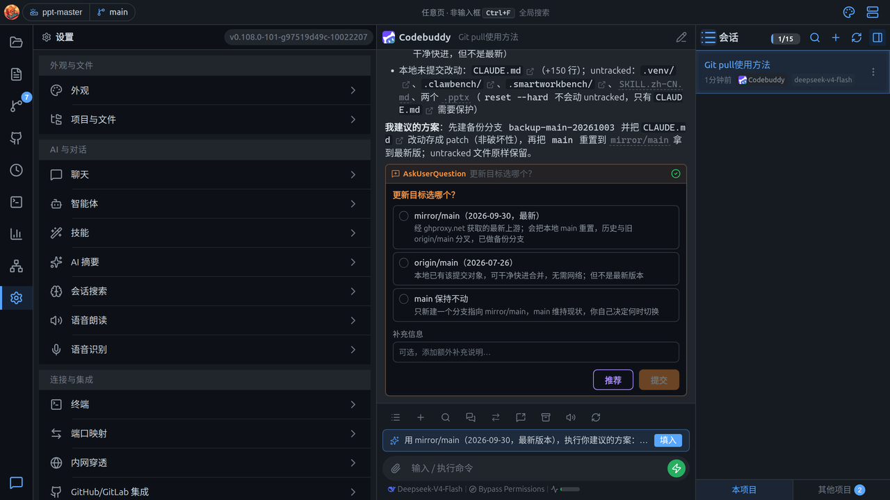

**移动端**设置分类首页：

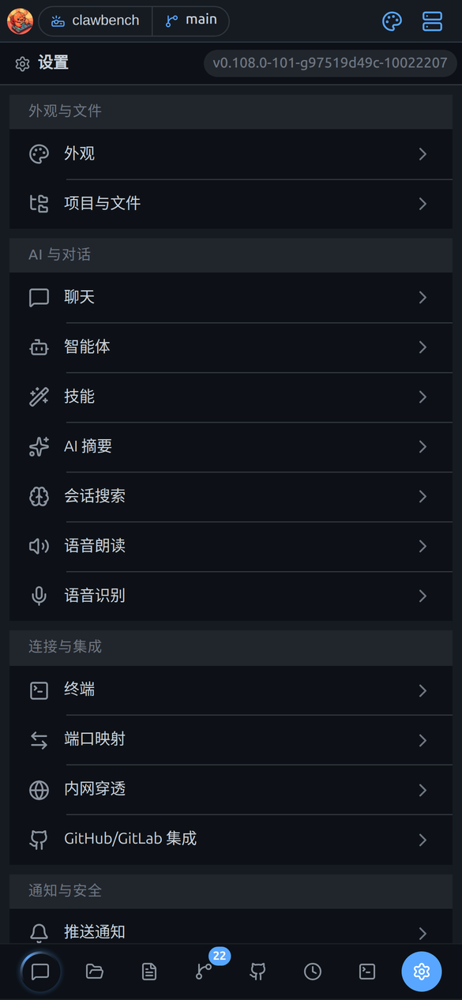

## 外观

主题、语言、字体、缩放、壁纸等看得见的东西。

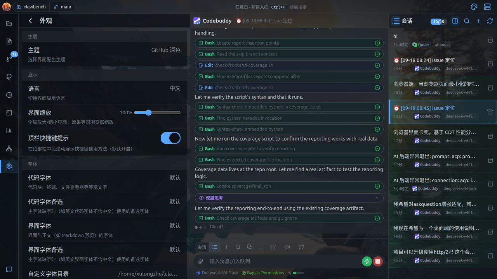

| 设置项 | 类型 | 说明 |
|---|---|---|
| **主题** | 下拉 | 36+ 种命名主题，可选「跟随系统」 |
| **语言** | 下拉 | 中文 / English |
| **自动适配** | 按钮 | 点一次，按当前屏幕分辨率算出合适的缩放并写入下方滑块（以 1080p 为基准，最高 200%；已由系统缩放过的屏幕不会二次放大）。只在点击时计算，不会自己变动。**移动端不提供此按钮**，手机/平板屏幕由系统按密度适配 |
| **界面缩放** | 滑块 | 80%–150%，效果等同浏览器缩放。显示当前实际生效的倍率；「自动适配」的结果也会写进这里，可随时微调 |
| **顶栏快捷键提示** | 开关 | 是否在顶栏显示快捷键跑马灯 |
| **代码字体** | 下拉 | 代码区字体 |
| **代码字体备选** | 下拉 | 主字体缺失时的回退 |
| **界面字体** | 下拉 | UI 字体 |
| **界面字体备选** | 下拉 | 主字体缺失时的回退 |
| **自定义字体目录** | 文本 | 服务器上存放字体文件的目录 |
| **壁纸 / 面板不透明度** | 专用组件 | 自定义背景图与面板透明度 |

自定义壁纸支持本地上传与 Bing 每日图两种来源，并可用高斯模糊虚化背景：

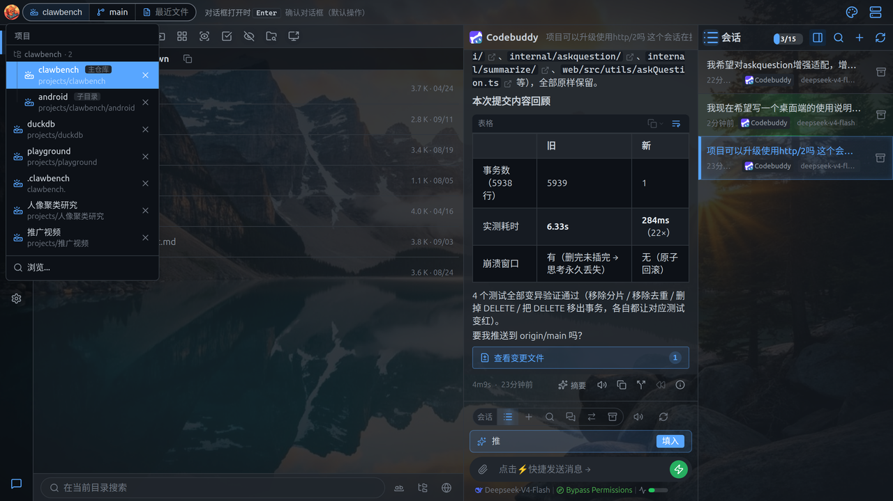

- **壁纸开关**：总开关
- **来源**：本地图片 / Bing 每日图 / 动态波浪
- **面板不透明度**：让背景半透明透出，范围可调（**每台设备各自保存**，与模糊/字体等一样属于本地显示偏好，不上传服务端——同一账号在不同设备上可以各调各的）
- **模糊强度**：对背景图做高斯模糊
- **设置为主题背景**：在文件查看器中右键图片即可快速设为壁纸

> **动态波浪**：不依赖任何图片文件的程序化动画背景，可调节播放速度（0.2×–2×，默认 1×）。适合没有合适壁纸图片、又想要一点动态效果时使用。

> **Bing 每日图**：选「Bing 每日图」后，壁纸每日自动更新为 Bing 首页当日图片。图片保存在 `{data-dir}/wallpaper/bing/` 目录，每次更新前会先删除旧图片。服务器需能访问 `www.bing.com` 才能获取当日图片。

## 项目与文件

项目列表长度、文件搜索上限、查看器默认行为、上传限制。**移动端**要点为默认项目路径、文件显示选项。

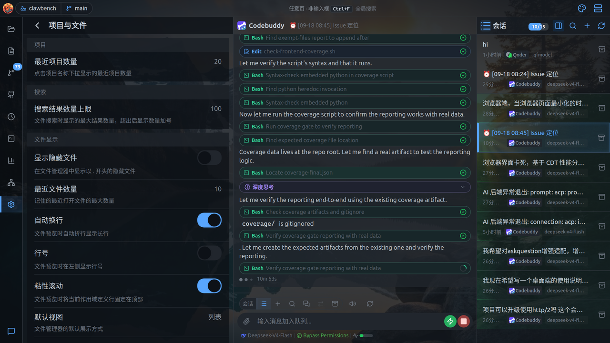

| 设置项 | 说明 |
|---|---|
| **最近项目数量** | 项目下拉里保留几个 |
| **搜索结果数量上限** | 文件搜索最多返回多少条（10–500） |
| **显示隐藏文件** | 文件管理器默认是否显示 |
| **最近文件数量** | 顶栏最近文件列表长度（1–50） |
| **自动换行** | 代码查看器默认换行 |
| **行号** | 代码查看器默认显示行号 |
| **粘性滚动** | 滚动时函数名吸顶 |
| **默认视图** | 列表 / 网格 |
| **排序字段 / 方向** | 默认排序方式 |
| **代码链接预览** | 是否启用点击路径弹出代码切片 |
| **文件预览模式** | 是否默认开启预览窗格 |
| **上传大小上限 / 文件数** | 上传限制 |

## 聊天

聊天相关行为：朗读、锁屏、加载条数、上下文预算、会话上限等。**移动端**要点为**滑动切换会话**开关（默认关）、发送行为、上下文预算。

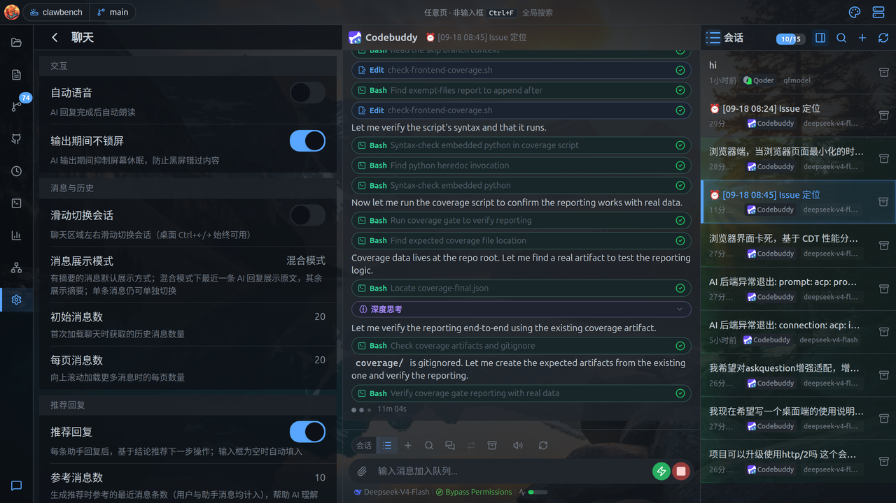

| 设置项 | 说明 |
|---|---|
| **自动朗读** | AI 回复完成后自动朗读 |
| **防止锁屏** | 执行期间阻止屏幕休眠 |
| **滑动切换会话** | 手势切换（**移动端**默认关，需手动开启） |
| **消息显示模式** | 混合 / 仅摘要 / 仅原文 |
| **初始消息数 / 分页大小** | 打开会话时加载多少条 |
| **系统提示间隔** | 每隔多少条消息在上下文开头重新注入系统提示（用于刷新 AI 对项目状态/指令的感知）。间隔太短会增加 token 消耗，太长则 AI 可能遗忘重要指令。设置为 0 则只在会话开始时注入一次。 |
| **分叉上下文预算** | 分叉时带多少 token 的上下文 |
| **推荐开启 / 上下文条数** | 推荐回复的开关与参考范围 |
| **跳转 AI 摘要模型** | 快捷入口，并显示摘要模型是否已配置；推荐回复、自动命名、语音摘要三处共用这一行 |
| **会话上限** | 项目内最多保留多少会话 |
| **归档保留开关 / 天数** | 自动清理过期归档会话 |
| **异常终止自动继续** | 会话因崩溃/无输出/后端报错意外中断时自动发「继续」，见 [AI 对话 § 异常终止自动继续](chat.md#异常终止自动继续) |
| **最大重试次数** | 自动续接的次数上限（-1 不限，0 不重试） |
| **AI 自动命名会话** | 会话首次命名时改由 AI 摘要用户消息生成标题（需先配置 AI 摘要模型；未配置或失败时用本地标题）。与重命名对话框里的「自动生成」共用同一实现 |

**移动端**补充说明：

- **消息显示模式**：混合（默认，同时展示摘要卡片与原始消息）/ 仅摘要（只显示 AI 摘要卡片）/ 仅原文（只显示原始消息，无摘要）
- **分叉上下文预算**：分叉时携带的历史上下文上限（token 数），值越小会话越轻量但上下文越少
- **推荐回复上下文条数**：生成推荐回复时参考的最近消息轮数，设为 0 则关闭推荐回复
- **归档保留**：归档是**单向操作**，归档后无法从界面取消归档，只能删除

> ⚠️ 归档为**单向操作**，归档后的会话无法从界面取消归档，只能删除。若需要保留会话内容，请勿归档。

## 智能体

扫描服务器上装了哪些 AI CLI，并配置它们的默认模型。**移动端**同为扫描/配置 AI CLI 与默认模型。

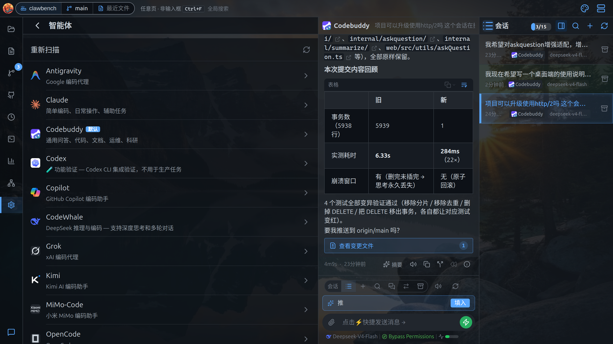

- **重新扫描**：重新探测服务器上已安装的 AI CLI
- 智能体列表：每个智能体可进入详情页，查看配置、复制、删除

点智能体进入详情页可配置默认模型等偏好：

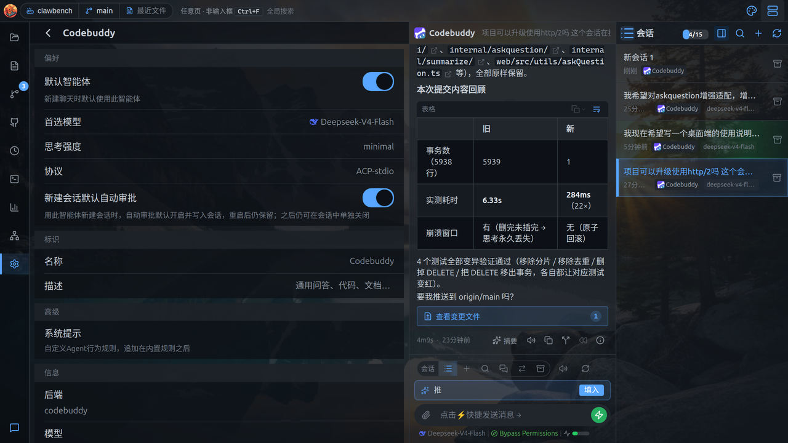

详情页按模型来源分组列出可选模型，选中后点保存。此处设置的默认模型会影响该智能体新建会话时的初始模型。

**技能扫描**：ClawBench 会把所有来源的技能（含 `SKILL.md` 的目录）汇总起来，让装在某个智能体下的技能也能被其他智能体用上。同名技能只保留优先级最高的一个，不会重复注入。这一页分两张卡：

- **跨智能体技能**：总开关（启用技能注入）、自定义技能目录（绝对路径，可加多个）、Git 技能仓库（clone/pull 后自动发现）。点「刷新」立即重新扫描并同步 Git 源
- **已发现的技能**：列出全部技能的来源、路径与状态；标「通用」的是跨工具共享目录（如 `.agents/skills`）。若技能的 `name` 与所在目录名不一致，会给出提示（仍会注入提示词，但不进斜杠命令菜单）。点路径可直接在文件管理器中定位

## 终端

终端的开关、主题、字号、超时、并发上限与缓冲行数。**移动端**要点为终端主题、字号、默认 shell。

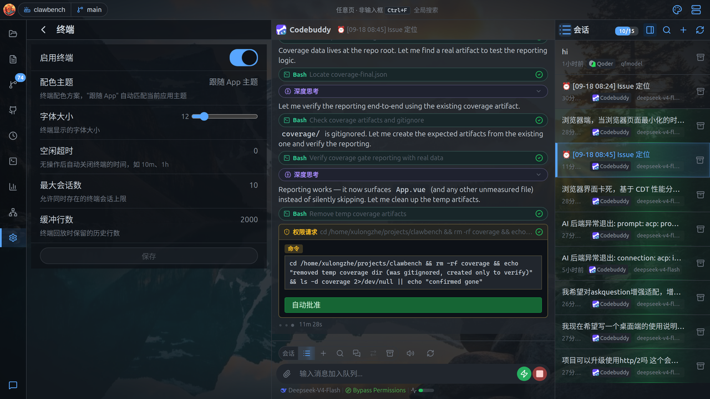

| 设置项 | 说明 |
|---|---|
| **启用终端** | 总开关 |
| **配色主题** | 终端默认主题 |
| **字号** | 10–24 |
| **空闲超时** | 多久无操作后回收会话 |
| **最大会话数** | 并发上限 |
| **缓冲行数** | 回放缓冲大小 |
| **选中即复制** | 默认开启。拖选/双击选词/三击选行后自动复制到剪贴板，无需再按键；开启后移动端的悬浮复制栏不再弹出 |

## 语音朗读

配置把文字读出来的 TTS 引擎、音色与缓存。**移动端**消息的「朗读」按钮用它。

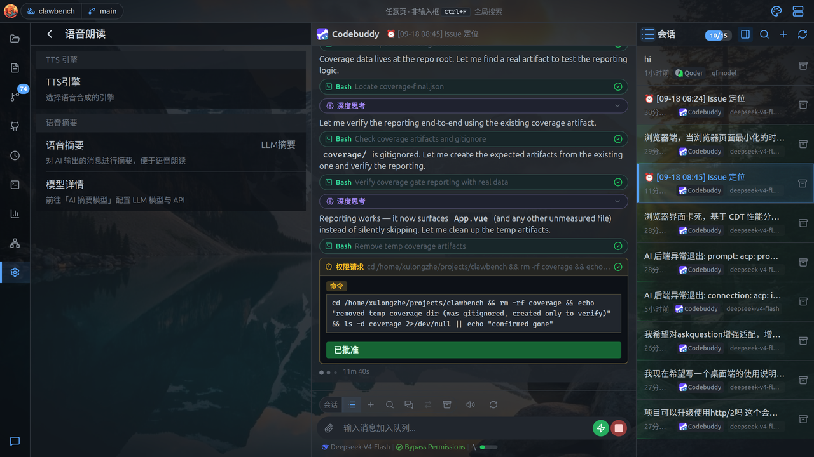

- **TTS 引擎入口**：进入引擎子页配置
- **朗读摘要后端**：simple / api

引擎子页可选 Edge / Piper / Kokoro / MOSS-TTS-Nano，并配置音色、语速、缓存上限；不同引擎有各自的模型路径等专属字段。

> **TTS 缓存策略**：已朗读过的内容会将音频缓存到本地磁盘，下次播放同一内容时直接读缓存，不消耗 TTS API 额度。缓存上限为 100 个文件，超出后按 LRU（最近最少使用）驱逐策略自动清理旧缓存。缓存目录为 `{data-dir}/tts-cache/`，可直接查看或手动清理。

## 语音识别

配置把语音转成文字的 STT 服务（语音输入用它）。**移动端**长按发送键的语音输入用它。

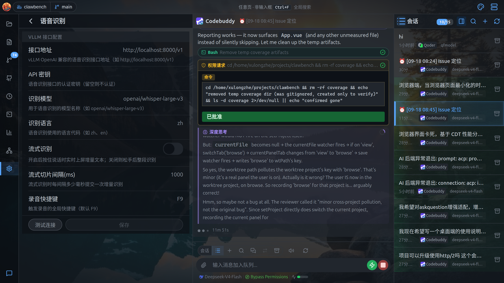

| 设置项 | 说明 |
|---|---|
| **服务地址** | vLLM Whisper 服务地址 |
| **API Key** | 访问密钥 |
| **识别模型** | 模型名 |
| **语言** | 识别语言 |
| **流式识别** | 流式识别（开启）在说话过程中实时返回文字，延迟低、体验流畅，适合日常使用；非流式（关闭）需等待说完再返回结果，延迟较高但服务端资源消耗更少。移动端语音输入强烈建议开启流式识别。 |
| **分片毫秒** | 流式分片大小（200–10000） |
| **快捷键** | 触发语音输入的按键 |

底部有「测试连通」按钮。

> **流式识别 vs 非流式**：开启流式识别时，录音过程中实时返回文字，延迟低、体验流畅；关闭时需说完再返回结果，延迟较高但服务端资源消耗更少。移动端语音输入强烈建议开启流式识别。

## AI 摘要

配置生成会话摘要和推荐回复所用的模型。**移动端**同为会话摘要与推荐回复的模型。

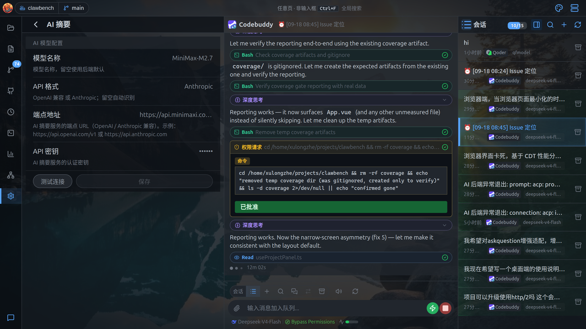

| 设置项 | 说明 |
|---|---|
| **模型名称** | 用于摘要的模型 |
| **API 格式** | auto / openai / anthropic |
| **Base URL** | 服务地址 |
| **API Key** | 访问密钥 |

底部有「测试连通」按钮。

## 会话搜索

配置 RAG 检索的分块、向量模型与索引重建。**移动端**同为 RAG 检索的嵌入模型与参数。

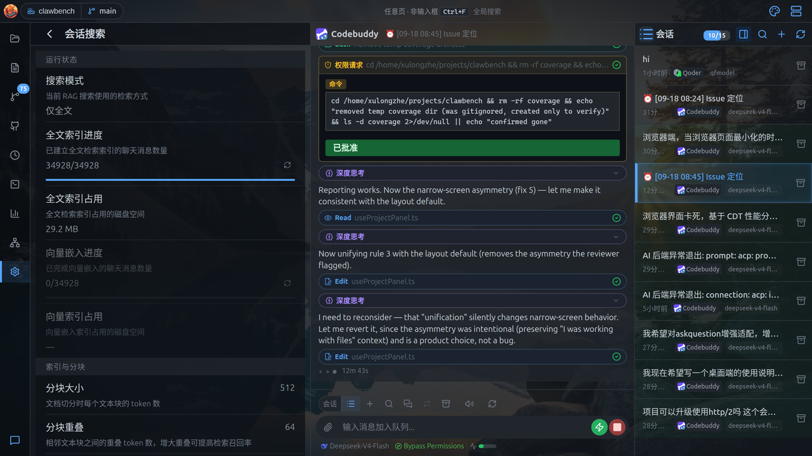

- **状态信息**：当前模式、索引进度、FTS 索引大小、向量化进度、向量索引大小、嵌入服务健康状态
- **索引参数**：分块大小、分块重叠、批次大小、保留天数、搜索条数上限
- **向量区**：向量开关、Base URL、模型、API Key、搜索池大小
- **底部重建按钮**：重建 FTS 索引 / 重建向量索引 / 全量重建

> 全量重建耗时较长（需重新分词），会在后台异步执行。

## 端口映射

把服务器上的端口转发到本地，方便直接访问。**移动端**通过 SSH 隧道与 frp 转发。

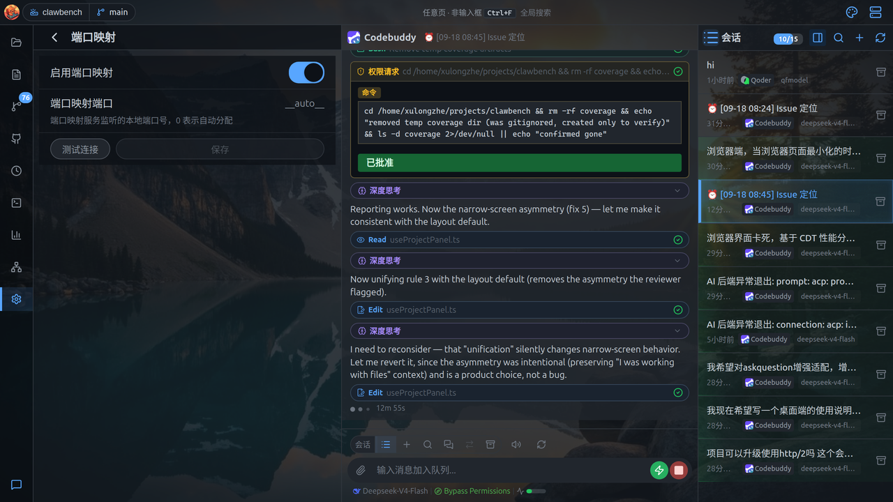

| 设置项 | 说明 |
|---|---|
| **启用端口映射** | 总开关 |
| **端口** | 映射端口（0 表示自动分配） |

左侧 Dock 的「端口映射」页签是它的操作界面：

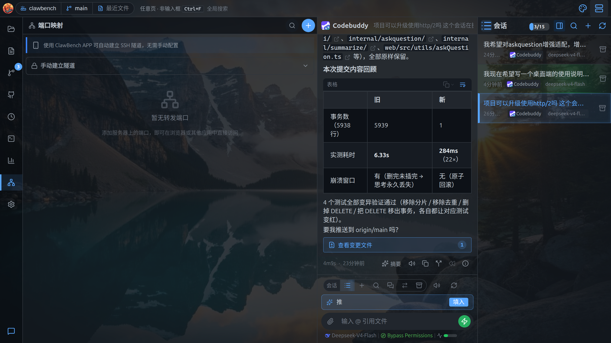

- **使用 ClawBench APP 可自动建立 SSH 隧道**：移动端会自动配置，无需手动
- **手动建立隧道**：桌面端在浏览器访问时，按提示手动建立
- **转发端口列表**：添加服务器上的端口后，即可在浏览器或其他应用中直接访问

每条映射带一个**方向**，列表中用徽章区分：

| 方向 | 含义 | 典型用途 |
|---|---|---|
| **正向**（↑，ssh -L） | 服务器端口 → 你本机 | 在本地浏览器访问服务器上的服务（最常见） |
| **反向**（↓，ssh -R） | 你本机端口 → 服务器 | 让**服务器上的进程**访问你本机运行的服务（如本地的模型、调试服务） |

新建映射时可选择方向，表单里「端口 / 主机」的含义随方向切换。反向映射只在服务器的 `127.0.0.1` 上监听（不会暴露到服务器所在网段），因此条目的操作按钮是**「复制服务器侧地址」**而非「打开」——那个地址只有服务器自己能访问。

> **反向映射的限制**：不能绑定 ClawBench 自身的 HTTP 端口与 SSH 端口；端口被占用时会在分配阶段自动改选，SSH 握手阶段不会改绑。

**移动端**端口映射页可把服务器端口转发到本地（App 模式支持自动建立 SSH 隧道）：

> **自动分配端口**：设为 0 表示自动分配，保存后系统会分配一个可用端口并显示在界面上；手动填入端口号则使用指定端口（需确保端口未被占用）。

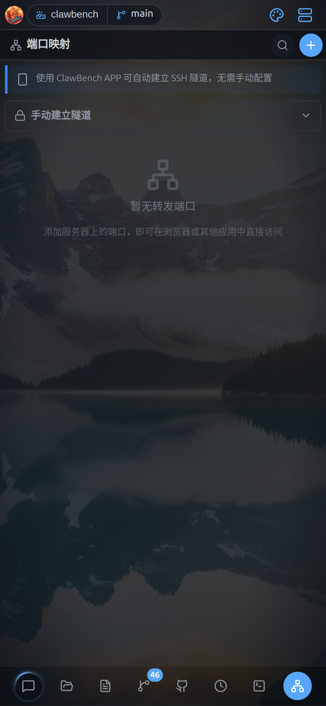

底部有「测试连通」按钮。

## 内网穿透

通过公网 FRP 服务把内网服务暴露出去。**移动端**同为 frp 穿透。

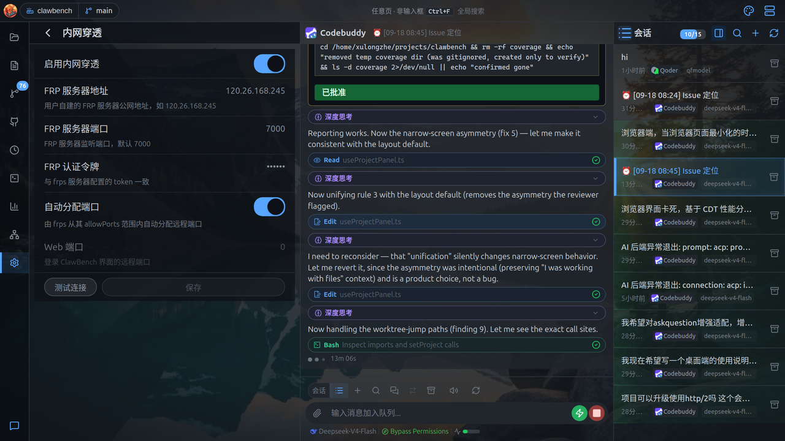

| 设置项 | 说明 |
|---|---|
| **启用** | 总开关 |
| **FRP 服务器地址 / 端口** | 公网 FRP 服务 |
| **FRP 认证令牌** | 访问密钥 |
| **自动分配端口** | 开关；关闭后需手填远程端口与 SSH 远程端口 |

底部有「测试连通」按钮。

## GitHub/GitLab 集成

保存各仓库平台的访问令牌，并控制哪些事件要通知。**移动端**同为绑定仓库、令牌。

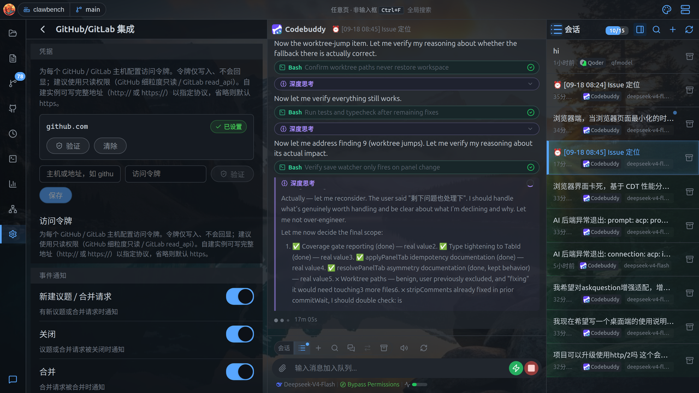

- **凭据区**：按 host 分别保存访问令牌，可验证 / 清除 / 添加
- **通知开关**：新建议题、关闭、合并、重新打开、评论、流水线完成
- **跳过 TLS 校验**：自建实例用自签证书时开启
- **暂停事件任务**：临时停止所有事件触发的任务

## 推送通知

决定完成、审批、仓库动态等提醒通过哪些渠道发给你。**移动端**含应用内通知、系统通知、IM 推送，以及 App 专有开关。

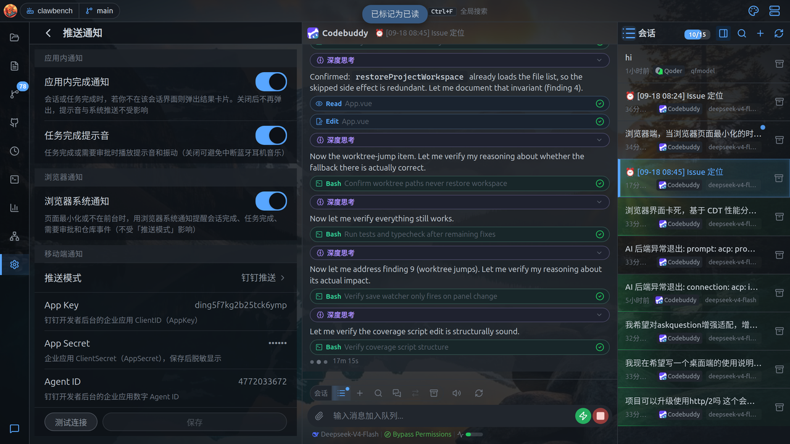

| 设置项 | 说明 |
|---|---|
| **应用内完成通知** | 会话/任务完成时弹出卡片 |
| **任务完成提示音** | 通知音效（关掉可避免蓝牙耳机中断） |
| **浏览器系统通知** | 窗口最小化或不在前台时，用操作系统通知提醒会话完成、任务完成、需要审批和仓库事件。浏览器与 App 模式都可用；桌面端走原生通知最可靠 |
| **悬浮状态窗** | App 模式专属 |
| **实时更新** | App 模式专属 |
| **推送方式** | 原生 / 钉钉 / 飞书 / 关闭；钉钉与飞书各自有 app_key、app_secret 等字段 |

底部有「测试连通」按钮。

> **「推送方式」与「浏览器系统通知」互不影响。** 「推送方式」选的是**手机与 IM** 通道（原生推送 / 钉钉 / 飞书），设成「关闭」只表示不再往手机和 IM 发消息；只要「浏览器系统通知」开着，网页端最小化时仍会弹系统通知。反过来，关掉「浏览器系统通知」也不影响手机推送。若想彻底静音，两处都要关。

App 模式下，**设置 → 推送通知**里会多出一组「桌面与系统」卡片，这是浏览器模式没有的：

## 安全

配置 HTTPS 证书与修改访问密码。**移动端**同为访问密码、会话有效期。

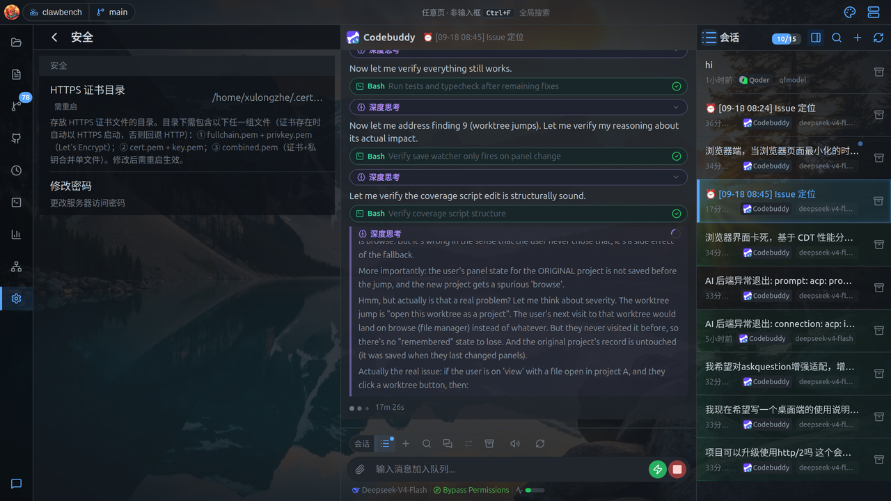

| 设置项 | 说明 |
|---|---|
| **HTTPS 证书目录** | TLS 证书路径（修改后需重启） |
| **修改密码** | 打开改密弹窗 |

> **文件分享 Token 安全模型**：分享链接中的 token 即为访问凭证——任何人拿到链接即可只读访问对应文件，无需额外认证，且链接在关闭分享前持续有效。敏感文件请勿生成分享链接，或生成后尽快手动关闭分享。

## 调试

打开日志回传排查问题，以及查看 WebSocket 投递统计。**移动端**含日志捕获、重配服务器（App 专有）。

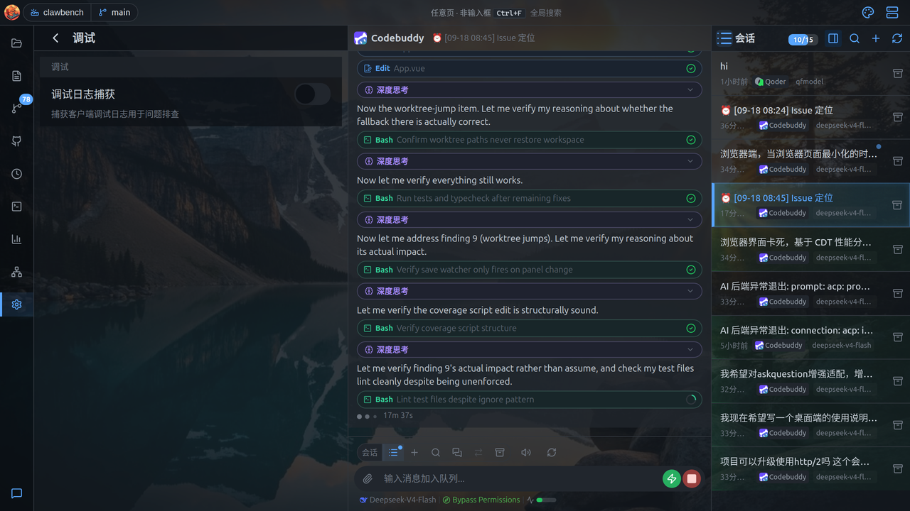

| 设置项 | 说明 |
|---|---|
| **调试日志捕获** | 把前端与 App 日志回传到服务器（默认关闭） |
| **重新配置服务器** | App 模式专属 |

开启日志捕获后，日志写入 `{data-dir}/logs/client.log`，可用 `tail -f` 查看。

> **WS 投递统计**：调试页底部显示 WebSocket 投递统计（`GET /api/ws/delivery-stats`），记录按原因的投递丢弃计数（网络慢/缓冲区满/客户端离线等）。如发现投递丢弃数持续增长，说明 WebSocket 通道存在瓶颈，可据此判断是否网络问题或服务端积压。

## 关于

版本信息、PWA/APK 入口、重启服务端与检查更新。**移动端**为版本信息、更新检查。

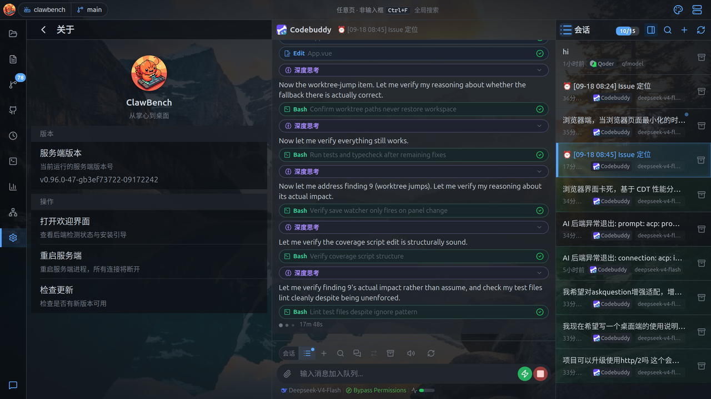

| 设置项 | 说明 |
|---|---|
| **服务端版本 / 应用版本** | 当前版本号 |
| **官网** | 在系统浏览器打开项目主页 |
| **问题反馈** | 前往 GitHub 提交问题或建议 |
| **添加到主屏** | PWA 安装 |
| **下载安卓应用** | 下载 APK |
| **显示欢迎页** | 重新打开首次访问的欢迎面板 |
| **重启服务端** | 重启 ClawBench 进程 |
| **检查更新** | 检查新版本 |

**移动端**「下载 Android 应用」入口在 **设置 → 关于 → 下载 Android 应用**（仅 Android UA 可见）：

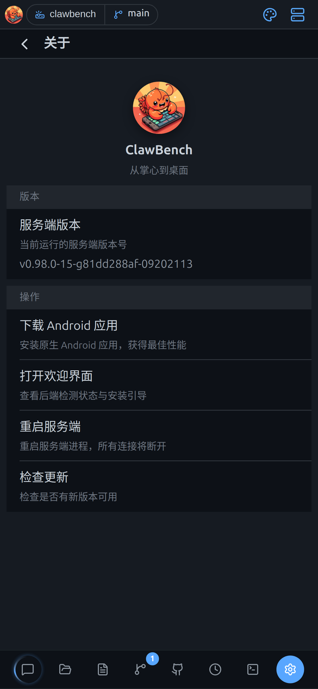
