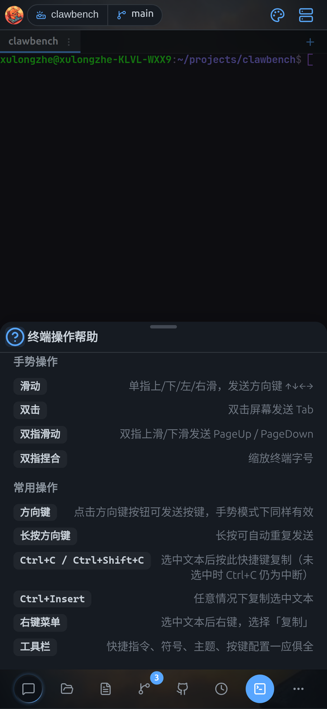

# 快捷键与手势速查

> 本文同时适用于桌面端与移动端；两端差异处用 **桌面端** / **移动端** 标注。

一张表汇总键盘快捷键与触屏手势，按聊天、文件管理器、查看器、应用分组。

## 桌面端键盘快捷键

### 聊天

| 快捷键 | 作用 |
|---|---|
| `Enter` | 发送消息 |
| `Shift+Enter` | 输入框内换行 |
| `Ctrl+↑` / `Ctrl+↓` | 在用户消息之间跳转 |
| `Esc` | 关闭当前弹窗 / 抽屉 / 菜单 |

### 文件管理器

| 快捷键 | 作用 |
|---|---|
| `Ctrl+C` / `Ctrl+X` / `Ctrl+V` | 复制 / 剪切 / 粘贴 |
| `Delete` | 删除选中项 |
| `Ctrl+A` | 全选 |
| `Enter` | 打开选中项 |
| `Alt+↑` | 返回上级目录 |
| `F2` | 重命名 |
| `Ctrl+R` / `F5` | 刷新 |
| `Ctrl+Shift+H` | 切换隐藏文件 |
| `Ctrl+Shift+M` | 切换多选模式 |
| `Shift+点击` | 范围选择 |

### 代码查看器

`Mod+F` 打开搜索面板，`Mod+S` 保存（编辑态）。

### 终端

| 快捷键 | 作用 |
|---|---|
| `Ctrl+C` | 未选中文本时中断当前进程；有选中文本时为复制（macOS 上 `Cmd+C` 才是复制，`Ctrl+C` 始终中断） |
| `Ctrl+Shift+C` / `Ctrl+Insert` | 复制选中文本，不依赖选区状态判断 |
| 选中文本 | 默认自动复制到剪贴板（「选中即复制」，可在设置 → 终端关闭） |
| 右键 | 有选中文本时唤出菜单选「复制」 |
| `Ctrl+Wheel` | 调整终端字号（macOS 用 `Cmd+滚轮`） |
| `Ctrl+D` / `Ctrl+L` / `Ctrl+Z` | 退出 EOF / 清屏 / 挂起当前程序 |

### 桌面端应用级快捷键（Electron 壳）

| 快捷键 | 作用 |
|---|---|
| `F5` | 普通刷新：重新加载页面（保留 HTTP 缓存） |
| `Ctrl+Shift+R`（macOS `Cmd+Shift+R`） | 强制刷新：清空缓存与存储后重载页面 |
| `F12` / `Ctrl+Shift+I`（macOS `Cmd+Option+I`） | 打开 / 关闭开发者工具 |
| `Ctrl+滚轮`（macOS `Cmd+滚轮`） | 缩放整个界面 |
| `Ctrl+=` / `Ctrl+-` | 放大 / 缩小界面 |
| `Ctrl+0` | 界面恢复 100% |

界面缩放使用 Electron 的原生缩放（等同浏览器缩放），缩放比例按站点自动记忆。光标位于终端、PDF 预览、PPT 预览区域内时，`Ctrl+滚轮` 缩放的是该内容本身而不是整个界面（终端调字号、预览调缩放）。

`F5` 在页面内已有用途时会优先让给页面，不会被刷新抢走：终端里按 `F5` 是把它发给正在运行的程序（vim / tmux 用来翻页），文件管理器聚焦时按 `F5` 是刷新文件列表。只有在其他位置按下时才会刷新整个页面。

强制刷新（`Ctrl+Shift+R`）会一并清除 Cookie 与本地存储，因此会重新登录；在 ClawBench 默认的 localhost 部署下会自动登回。

顶栏的快捷键提示跑马灯点击可打开完整快捷键弹窗。

## 移动端手势

移动端的手势分布在不同模块，这里汇总：

| 手势 | 位置 | 作用 |
|---|---|---|
| **从右缘向左滑** | 全局 | 返回上一层（20px 内起滑、≥50px、400ms 内完成） |
| **长按 0.45 秒** | 文件条目 / 文件管理器空白区 | 弹出上下文菜单 |
| **点行尾「⋮」** | 会话条目 | 打开会话菜单（会话行不响应长按） |
| **长按 0.5 秒** | 输入栏发送按钮 | 语音输入 |
| **左右滑动** | 对话区 | 切换上/下一个会话（**需先在设置开启**） |
| **左右滑动** | 输入框（未聚焦时） | 浏览历史输入 |
| **点一次 → 再点一次** | 文件管理器（**开启预览模式时**） | 第一次预览、第二次进入 |
| **单指滑动** | 终端 | 发送方向键 |
| **长按方向键** | 终端 | 连续发送 |
| **双击** | 终端 | 发送 `Tab` |
| **双指捏合** | 终端 / 图片 / PDF / PPT | 缩放（终端调字号） |
| **双指上下滑** | 终端 | `PageUp` / `PageDown` |
| **从右缘向左滑**（手势返回） | 全局 | 返回上一层（20px 内起滑、≥50px、400ms 内完成）；等同 Android 系统返回键 |
| **左右滑动** | Git 提交列表 | 收起 / 展开分支图 |

> **提示**：这些手势都有对应的**按钮或菜单**作为替代，不习惯手势也能正常使用。

## 终端手势

用滑动、长按、双击、捏合等手势替代键盘来操作终端。

**移动端**终端支持丰富的手势操作（`useTerminalGestures.ts`）：

| 手势 | 作用 |
|---|---|
| 单指滑动 | 发送方向键（上/下/左/右） |
| 长按方向键 | 连续重复发送（500ms 后每 150ms 一次） |
| 双击 | 发送 `Tab`（用于补全） |
| 双指捏合 | 调整字号 |
| 双指上下滑 | `PageUp` / `PageDown` |

终端内置手势帮助（点终端工具栏的帮助按钮查看）：

> **终端快捷指令 vs 聊天快捷发送**：终端快捷指令存的是 shell 命令（写入 PTY），聊天快捷发送存的是 Prompt（发给 AI）。两者分开存储，互不影响，可同时使用。

> **提示**：在 Android App 里，还可以用**音量键**当方向键。

**桌面端**终端的工具栏「终端模式」按钮可循环切换浏览 / 手势 / 选择三种手势模式；**移动端**窄屏终端另有**虚拟按键栏**（桌面端没有），提供 `Esc`、`Tab`、方向键 `↑↓←→`、`Ctrl` 等常用键。
