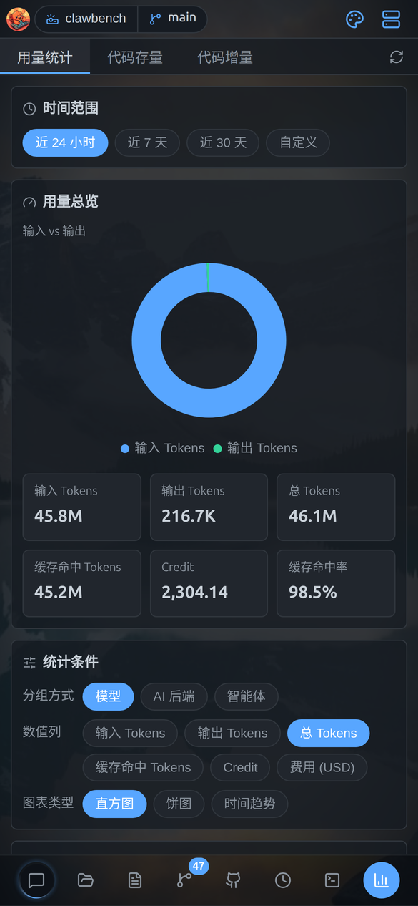
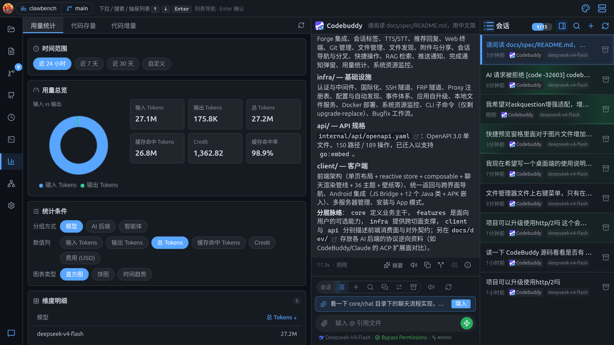
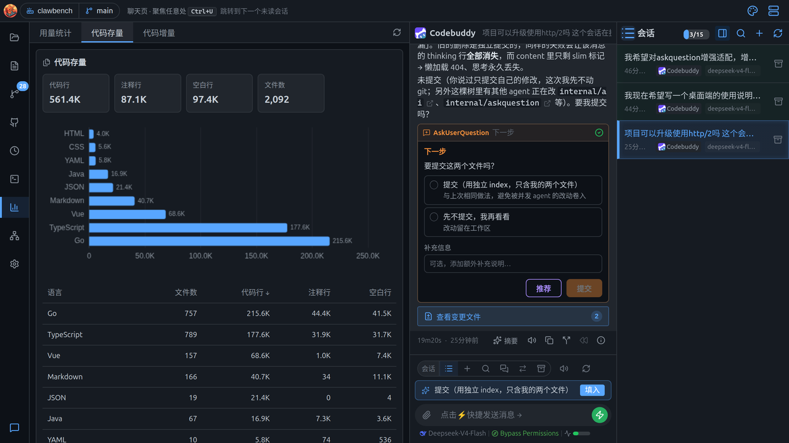
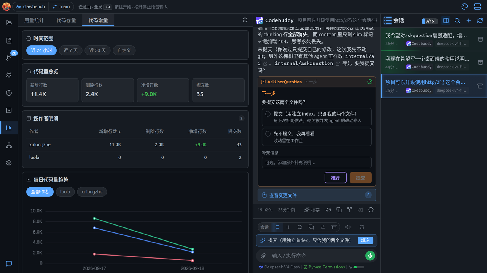
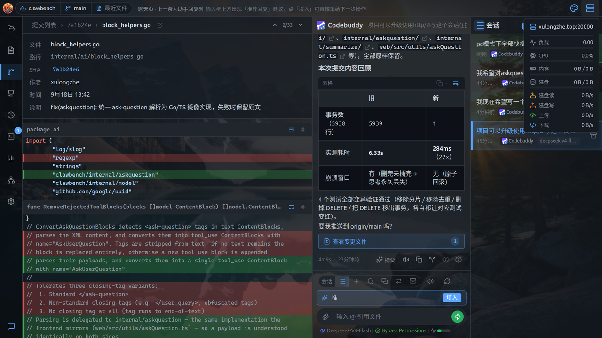

# 数据统计

看用量、代码量、系统资源的数字面板。

> 本文同时适用于桌面端与移动端；两端差异处用 **桌面端** / **移动端** 标注。

**桌面端**从左侧 Dock 的「数据统计」图标进入统计页，含三个子页签；**移动端**在「数据统计」页签中提供用量统计、代码存量、代码增量与系统资源。

## 用量统计

按时间、模型、后端统计 token 消耗与请求次数。

- **时间范围**：近 24 小时 / 近 7 天 / 近 30 天 / 自定义（选起止日期）
- **用量总览环形图**：输入 vs 输出的占比，可下钻
- **指标卡**：输入 Tokens、输出 Tokens、总 Tokens、缓存命中 Tokens、Credit、**成本（USD）**、缓存命中率
- **统计条件**：分组方式（模型 / AI 后端 / 智能体）、数值列（多选）、图表类型（直方图 / 饼图 / 时间趋势）
- **维度明细表**：按所选维度列出各项数值，点表头可排序

> 用量数据是独立台账，不会因为删除会话而丢失。

> **成本（USD）**：按各模型/后端的定价折算的美元成本，与 Credit 是两个不同的计费口径，可同时勾选对比。

## 代码存量

按语言统计项目里一共有多少行代码。

项目代码量快照，按语言分类统计代码行数。**以柱状图 + 可排序表格**展示：柱状图按语言对比代码量，表格列出每种语言的文件数、代码行、注释行、空行，点表头排序。排除规则 = 内置规则 ∩ 项目 `.gitignore`。

> 首次计算耗时较长（需要扫描全项目），会显示「加载中」。

## 代码增量

统计一段时间内每个人新增、删除了多少行代码。

指定时间窗内按作者统计新增 / 删除 / 净增行数与提交数。支持作者筛选。

- **逐日趋势图**：按天展示新增 / 删除的走势
- **作者筛选**：以**多选标签**的形式列出各作者，不选=全部作者合计，勾选若干位=只看他们的并集；表格可按任意列排序

## 系统资源监控

实时查看服务器 CPU、内存、磁盘、网络的占用情况。

**桌面端**点顶栏右侧的资源指示图标展开实时面板，显示：

| 指标 | 说明 |
|---|---|
| **CPU** | 实时占用率 |
| **内存** | 已用 / 总量 |
| **磁盘** | 已用 / 总量 |
| **磁盘读写** | 每秒读 / 写字节数 |
| **上传 / 下载** | 每秒网络流量 |
| **负载** | 系统 load average |

面板顶部显示当前主机标识（host:port）。数据按需推送——面板关闭时不采集，不占用资源；WebSocket 断线时会显示连接状态。刚打开时指标可能短暂显示 0，等一个采样周期即可。

**移动端**系统资源提供服务器 CPU、内存、磁盘、网络实时监控。
