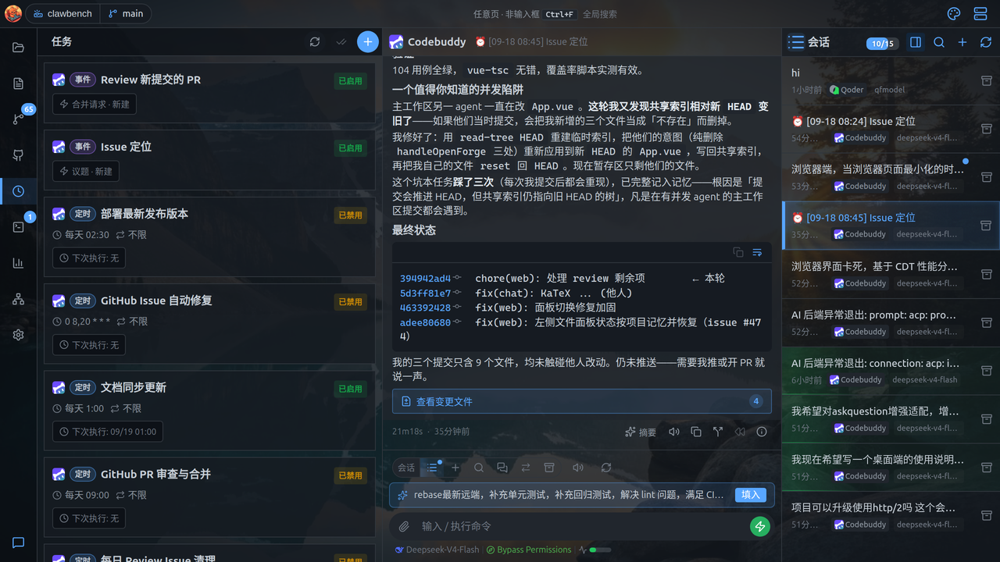
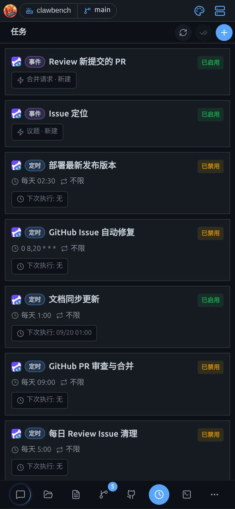
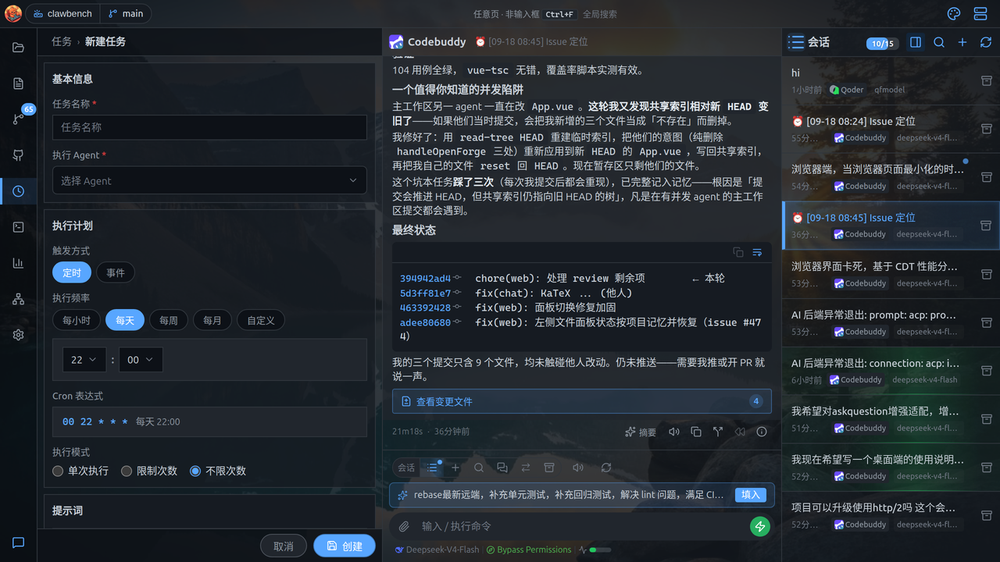
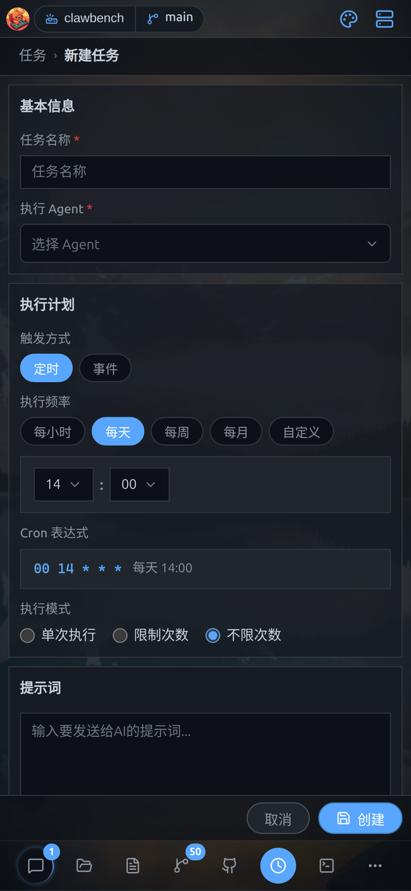
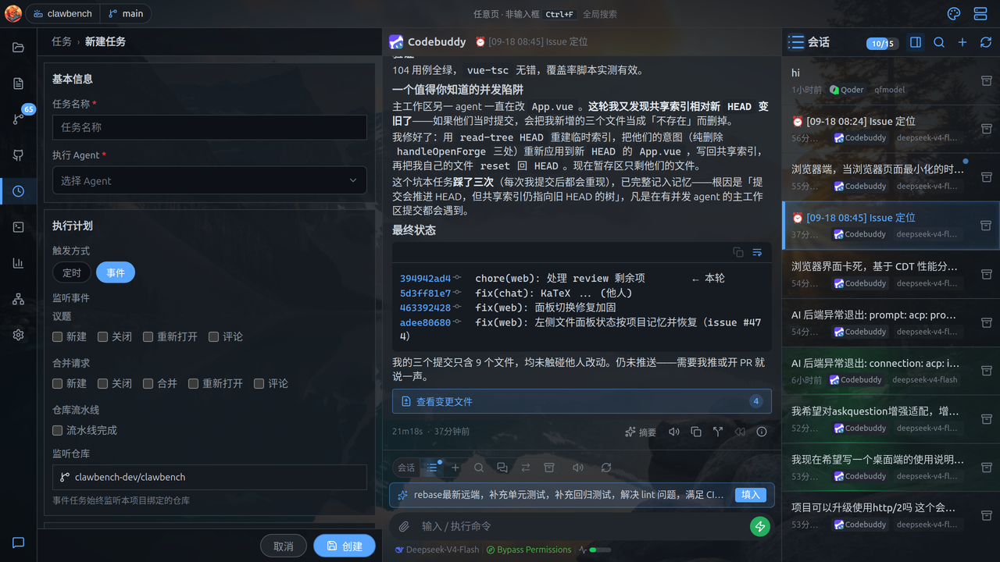
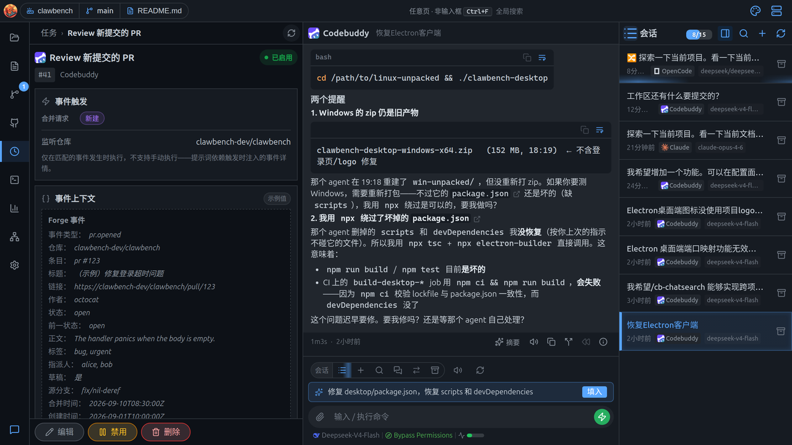
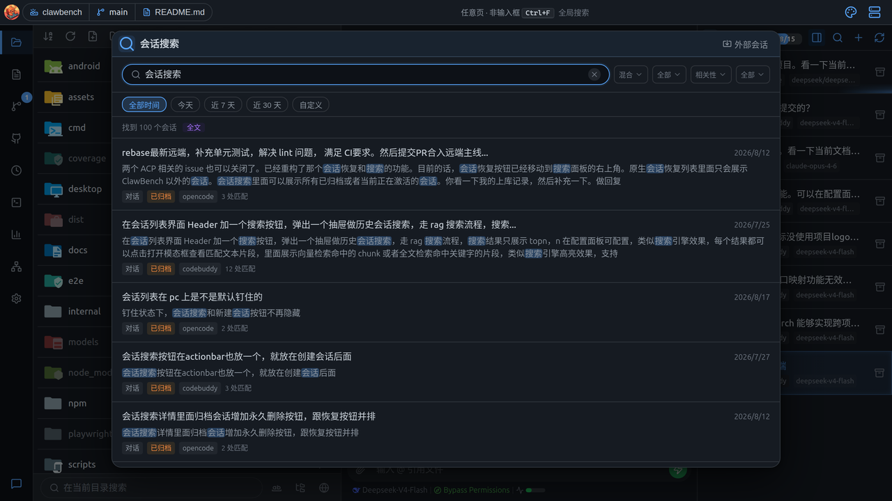
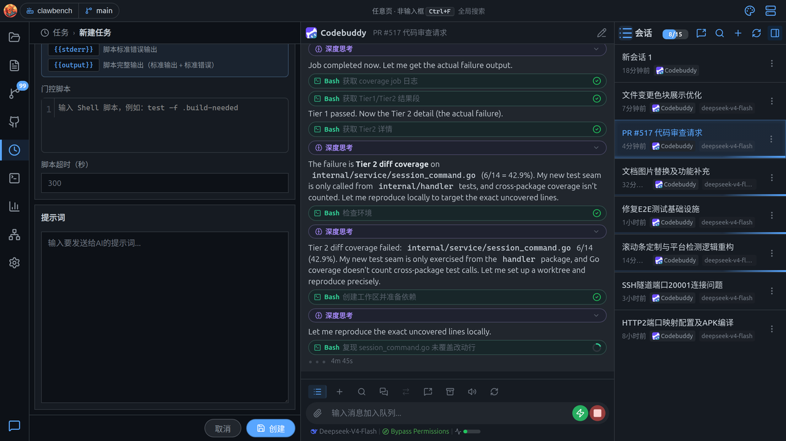

# 任务

让 AI 按时间或事件自动干活：定时执行，或仓库有新动态时自动跑。

> 本文同时适用于桌面端与移动端；两端差异处用 **桌面端** / **移动端** 标注。

**桌面端**从左侧 Dock 的任务图标进入任务列表；**移动端**在「任务」页签中管理定时任务与事件任务。

## 任务列表

列出所有任务，以及它们的触发方式、下次执行时间和状态。

每个任务项显示：

- **触发类型徽标**：定时 / 事件
- **任务名**、运行中指示点、未读标记
- **cron 表达式或订阅事件**
- **下次执行时间**
- **状态标签**：已启用 / 已禁用

顶部按钮：**刷新**、**全部标记已读**、**新建任务**。

> **也可以直接在对话里让 AI 建任务**：首次点「新建任务」会先弹一个提示框，展示内置命令 `/cb-task` 及示例，可一键复制。把这句话发给任意 AI 会话，AI 就会替你把任务建好——比逐项填表单快，也适合「帮我每天整理日报」这类用自然语言描述的需求。提示框里的「不再提示」只记入本地、下次点「新建任务」直接进入表单。

**移动端**任务列表显示各任务的执行状态、下次执行时间、未读执行结果：

任务完成后会有通知（应用内卡片 / 系统通知 / IM 推送，取决于设置）。

## 定时任务

新建任务的表单，配置名称、智能体、频率、提示词等。

点「新建任务」进入创建表单：

| 字段 | 说明 |
|---|---|
| **任务名称** | 便于识别的名字 |
| **执行 Agent** | 用哪个智能体执行 |
| **触发方式** | 定时 / 事件（按钮组切换） |
| **执行频率** | 每小时 / 每天 / 每周 / 每月 / 自定义 |
| **时间** | 按频率选择小时/分钟/星期几 |
| **Cron 表达式** | 选「自定义」时直接填 |
| **重复模式** | 不限次数 / 限制次数（填最大运行次数） |
| **门控脚本** | 可选，见「门控脚本」一节；仅定时任务有 |
| **提示词** | 每次执行时发给 AI 的指令 |

底部为「取消」与「创建」。

**移动端**新建任务设置任务名称、执行智能体、提示词、触发方式；**定时**支持 cron 表达式或可视化频率选择：

## 事件任务

让任务监听仓库事件（议题、合并请求、流水线），事件一到就自动触发。

**桌面端**触发方式选「事件」后，表单切换为事件配置：

可勾选的监听事件（按类型分组）：

| 分组 | 事件 |
|---|---|
| **议题** | 新建、关闭、重新打开、评论 |
| **合并请求** | 新建、关闭、合并、重新打开、评论 |
| **流水线** | 流水线完成 |

下方显示**监听仓库**（只读，来自项目绑定）。未绑定项目时会显示警告。

**移动端**事件任务绑定 GitHub/GitLab 仓库事件（issue、PR、流水线等）。

### 事件变量

事件触发时，AI 的提示词中可使用以下变量，系统会自动替换为实际值：

| 变量 | 说明 | 适用事件 |
|---|---|---|
| `{{TITLE}}` | Issue/PR 的标题 | issue.* / pr.* |
| `{{NUMBER}}` | Issue/PR 编号 | issue.* / pr.* |
| `{{URL}}` | Issue/PR 的完整 URL | issue.* / pr.* |
| `{{BODY}}` | Issue/PR 正文（纯文本，截断至前 2000 字符） | issue.* / pr.* |
| `{{AUTHOR}}` | 操作者的用户名 | 全部 |
| `{{ACTION}}` | 触发的动作名称（如 `opened`、`merged`） | 全部 |
| `{{REPO}}` | 仓库全名（如 `owner/repo`） | 全部 |
| `{{PIPELINE_STATUS}}` | 流水线状态（success/failed/running） | pipeline_done |
| `{{PIPELINE_BRANCH}}` | 触发流水线的分支名 | pipeline_done |
| `{{PIPELINE_URL}}` | 流水线页面 URL | pipeline_done |

示例提示词：「新 Issue「{{TITLE}}」已打开，请查看 {{URL}} 并给出分析。」

> **AI 自身事件抑制**：当 AI 在对话中执行了某个操作（如在 GitHub 上评论了 Issue），该操作产生的事件**不会再次触发**任务执行，以避免 AI 动作 → 事件触发 → AI 再次响应 → 死循环。抑制基于事件来源判断（AI 自身操作的发起方与当前 Agent 一致时跳过）。

## 执行详情

看某个任务的历史执行记录、输出与耗时，并能编辑、暂停、删除。

**桌面端**点任务项进入详情页：

- **概览卡**：状态、任务 ID（点击复制）、提示词（可折叠）
- **定时卡 / 事件卡**：cron 或订阅事件、下次运行时间、事件上下文预览
- **执行历史**：每次执行的记录，含触发类型（手动/自动）、状态徽标、耗时、摘要；运行中的可取消，历史项可删除。配了门控脚本的任务，脚本阶段会显示为「准备中（脚本）」并可中止；脚本未通过则记一条「已跳过」——它没有 AI 输出，因此不显示「继续对话」
- **底部操作栏**：编辑、手动运行、暂停、恢复、删除

每个执行记录独立计数未读，点进具体执行才标记已读。

**移动端**执行详情查看历史执行的输出、耗时、状态。

## Forge 集成（GitHub / GitLab）

把 GitHub/GitLab 的议题、PR、流水线搬进界面看，并驱动事件任务。

**桌面端**从左侧 Dock 的「议题与合并请求」图标进入 Forge 面板。

面板顶部有**仓库徽标**（点击可改绑定 / 打开仓库 / 解绑）、**全部标记已读**、**刷新**。

四个页签：

| 页签 | 内容 |
|---|---|
| **动态** | 聚合未读 / 已读 / 全部条目，后台轮询感知变化 |
| **议题** | Issue 列表，支持状态筛选（开启/已关闭/全部）与「我的」筛选（分配给我/我提的/待我 review） |
| **合并** | PR / MR 列表，筛选同上 |
| **流水线** | CI 流水线列表，显示状态、分支、提交、事件类型 |

点任意条目进入详情：正文、状态徽标、关联 CI、评论区（可加载更多）。PR 详情可展开关联的流水线。

**流水线详情**显示本次运行的分支、提交、事件类型与状态，以及**作业（job）明细表**——逐个列出每个作业的名称、阶段、状态与耗时，失败作业还会显示失败原因（GitLab 的 `failureReason`），方便直接定位是哪一步挂的。动态页签的条目带事件计数角标；列表里的条目可**拖拽进聊天区**作为引用。

**仓库绑定**：优先从项目 git remote 自动识别并绑定（官方 host 自动绑定，自建实例需确认 host），也可手动填 URL；绑定关系随项目走。自建实例同时支持 http 与 https——host 仍是身份键，同一实例两种协议访问到的仍是同一个仓库。

**变化感知与未读**：后台轮询仓库变化，页签显示未读徽标；六类事件（新开 / 关闭 / 合并 / 重开 / 评论 / CI 完成）可分别开关通知。未读按**条目**计数——同一 issue 的三条评论算一条未读，可单条标记已读，也可整仓库一键清除。

**动态页签**：聚合所有条目并可在未读 / 已读 / 全部之间切换（默认未读），带行级已读标记与「有新评论」这类事件原因文案。

**事件触发任务**：任务可选「触发方式：事件」，订阅 `issue.opened`、`pr.merged`、`pipeline_done` 等事件；事件到达自动唤起 AI 任务，prompt 前置只读的事件上下文（仓库、编号、标题、链接、作者、评论正文等按事件类型条件注入），执行记录可深链回原始 issue/PR。

**引用到对话**：详情页 header 的引用按钮把 issue/PR 作为 URL 附件带入聊天（chip 显示 `owner/repo#123`），可再划取文本补充；正文也支持双击复制与划取引用。

**凭据与安全**：token 按 `(平台, host)` 隔离存储（自建 GitLab 各自独立），配置接口只回传存在性、不回传明文；自建实例可开启「跳过 TLS 校验」支持自签名证书（默认关，有安全风险）。内网 / 自建 host 服务端不拦截，改在绑定弹窗里提示。

> **提示**：GitHub API 有速率限制。若提示 `API rate limit exceeded`，稍后再试或换用 token。

## 会话搜索（RAG）

建好索引后，用自然语言搜索历史会话和项目文档。

在设置中启用「会话搜索」后，项目文档会被分块、向量化并建立索引，之后可用自然语言搜索历史会话与文档内容。

会话搜索抽屉支持关键词 / 语义 / 混合三种检索方式，以及归档、排序、时间范围等筛选：

## 门控脚本

定时任务在叫醒 AI **之前**先跑一段 shell 脚本，只有脚本通过才执行——用来省掉「没活可干」的空转。

有些定时任务大多数时候无事可做：比如「有构建标记文件时才更新文档」。不加门控的话，AI 每次到点都会被叫起来、看一眼、发现没事又结束——白烧 token。

**门控脚本**（gating script）就是为此设计的：在智能体执行前先跑一段 shell 脚本，**退出码为 0 才触发智能体**，否则本次直接跳过。

在新建/编辑任务的表单里打开「**启用门控脚本**」开关（仅定时任务有，事件任务不显示）：

| 元素 | 说明 |
|---|---|
| **开关** | 关闭时任务完全不携带脚本；编辑已有任务时，若原本有脚本则开关默认打开，不会静默丢失 |
| **说明面板** | 列出门控语义与可用的模板变量 |
| **脚本编辑框** | Shell 脚本正文，带语法高亮 |
| **脚本超时（秒）** | 留空使用默认 300 秒；填 0 同样表示使用默认值 |

**判定规则**：

| 脚本结果 | 结果 |
|---|---|
| 退出码 **0** | 门控打开，本次照常执行智能体 |
| 退出码**非 0** | 门控关闭，跳过本次执行 |
| **超时** | 视为未通过，跳过本次执行 |

被跳过的那次执行会在执行历史里显示状态「已跳过」，并附上说明「门控脚本未通过（退出码非 0 或超时），本次未执行智能体」。

> **脚本阶段可以中止**：脚本以任务的项目路径为工作目录、在 AI 之前运行。这段时间任务列表**不会**显示为「运行中」（脚本是前置条件，不是一次 AI 执行，也不发「任务已启动」通知），但脚本会出现在执行历史里（标注「准备中（脚本）」）并且**可以取消**。

**在提示词里引用脚本结果**：脚本的输出可以带进给 AI 的提示词，用以下模板变量：

| 变量 | 含义 |
|---|---|
| `{{code}}` | 脚本退出码 |
| `{{stdout}}` | 脚本标准输出 |
| `{{stderr}}` | 脚本标准错误输出 |
| `{{output}}` | 脚本完整输出（标准输出 + 标准错误） |

> **脚本输出是数据，不是控制信号**：脚本往 stdout/stderr 打印什么都不影响门控判断，唯一决定「跑不跑 AI」的是**退出码**。所以脚本里打印诊断信息是安全的。

> **脚本在服务器上执行**，权限与运行 ClawBench 的用户一致。示例：`test -f .build-needed`（标记文件存在才继续）。
